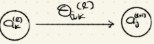
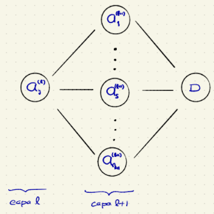

-   Recuérdese que en un problema de clasificación binaria, la devianza con regulación ridge es

    $$
    D = \frac{-2}{n} \sum_{i=1} ^n \bigg[y_i \log(p_1(x_i)) + (1-y_i)\log(p_i(x_i))\bigg] + \underbrace{\lambda \sum_{l=2} ^L\sum_{k=1} ^{n_{l-1}}\sum_{j=1} ^{n_l} (\theta_{j,k}^{(l)})^2}_{\text{Penalización ridge}}
    $$

-   Para minimizar esta devianza se tienen que obtener las [derivadas con respecto a $\theta_{j,k}^{(l)}$]{.ul} (**son un montón de derivadas**) El vector de todas estas derivadas se conoce como gradiente.

-   **Observación.** Para la función de activación $h(x) = \frac{1}{1+e^{-x}}$ se tiene que

    $$
    1-h(x) = \frac{e^{-x}}{1+e^{-x}}\\
    h'(x) = \frac{e^{-x}}{(1+e^{-x})^2} = \frac{e^{-x}}{1+e^{-x}} \cdot \frac{1}{1+e^{-x}} = [1-h(x)]h(x)\\
    \rightarrow h'(x)  = h(x) [1-h(x)]
    $$

-   Se considerará el problemma de minimización de la devianza [sin penalización.]{.ul}

-   Primero se calcularán las derivadas parciales para un solo caso de entrenamiento $(x, y)$

    $$
    D = -y\log(p_1(x)) + (1-p)\log(1-p_1(x))
    $$

    y después se suma sobre toda la muestra de entrenamiento.

-   Entonces, lo que se quiere es calcular $\boxed{\frac{\partial}{\partial \theta_{j,k}^{(l)}}D}$

    Según lo anterior,

    $$
    a_j^{(l+1)} = h( z_j^{(l+1)} ), \text{ donde } z^{(l+1)} := \Theta^{(l)}a^{(l)}\\
    \text{i.e. }z_j^{(l+1)} = \sum_{k=0}^{n_l} \theta_{j,k}^{(l)} a^{(l)}
    $$

    Obsérvese que según la regla de la cadena

    $$
    \frac{\partial}{\partial \theta_{j,k}^{(l)}}D = \sum_{t=1}^{n_l}\frac{\partial}{\partial a_{t}^{(l)}}D \cdot \frac{\partial}{\partial \theta_{j,k}^{(l)}} a_t^{(l+1)}
    $$

    sin embargo $\theta_{j,k}^{(l)}$ solo aparece en la red en el segmento {width="404"}

-   Entonces, $\frac{\partial}{\partial \theta_{j,k}^{(l)}} a_t^{(l+1)} = 0, t\neq j$ (pues $a_t^{l+1}$ no depende de $\theta_{j,k}^{(l)}$)

-   De aquí que, para cualesquiera $j \in \{ 1, 2, ..., n_{l+1}\},k\in \{0, 1, ..., n_l\}$ se tiene que

    -   $$
        \frac{\partial}{\partial \theta_{j,k}^{(l)}}D = 
        \frac{\partial}{\partial a_{j}^{(l+1)}}D 
        \cdot 
        \frac{\partial}{\partial \theta_{j,k}^{(l)}} a_j^{(l+1)} 
        \space \space \space \space \space \space \space \space \space \space \space \space \space \space \space \space 
        \dotso (\heartsuit)
        $$

        -   Primero obtengamos $\frac{\partial}{\partial \theta_{j,k}^{(l)}} a_j^{(l+1)}$:

            $$
            a_j^{(l+)} = h(z_j^{(l+)}) = h\bigg(  \sum_{k=0}^{n_l} \theta_{j,k}^{(l)} a^{(l)} \bigg)
            $$

            donde las $a_k^{(l)}$ [no]{.ul} depende de $\theta_{j,k}^{(l)}$

            De aquí que

            ```{=tex}
            \begin{align*}

            \frac{\partial}{\partial \theta_{j,k}^{(l)}} a_j^{(l+1)} &= h'(z_j^{(l+)}) \cdot \frac{\partial}{\partial \theta_{j,k}^{(l)}} z_j^{(l+1)} = h'(z_j^{(l+1)}) \cdot a_k^{(l)}\space \space \space \space \space \space \space \space \space 
            \dotso (1)\\
            \text{Sustituyendo en } (\heartsuit)\\

            \frac{\partial}{\partial \theta_{j,k}^{(l)}}  D &= \frac{\partial}{\partial a_{j}^{(l+1)}}D 
            \cdot 
            \frac{\partial}{\partial \theta_{j,k}^{(l)}} a_j^{(l+1)} \\
            & = \underbrace{\frac{\partial}{\partial a_{j}^{(l+1)}}D  \cdot  h'(z_j^{(l+1)})}_{c_j^{(l+1)}} \cdot a_k^{(l)} \\
            &= c_j^{(l+1)} \cdot a_k^{(l)}
            \end{align*}
            ```
            Es decir,

            $$
            \frac{\partial}{\partial \theta_{j,k}^{(l)}}  D =  c_j^{(l+1)} \cdot a_k^{(l)} \space \space \space \space ...(\bigstar)
            $$

        -   Ahora se estudiará $\frac{\partial}{\partial a_{j}^{(l+1)}}D$ para $j \in \{1, .., n_l\}$

        -   De nuevo, usando la regla de la cadena

            $$
            \frac{\partial}{\partial a_{j}^{(l+1)}}D = \sum_{s=1}^{n_{l+1}}  \frac{\partial}{\partial a_{s}^{(l+1)}}D \cdot   \frac{\partial}{\partial a_{j}^{(l)}}  a_{s}^{(l+1)} \space \space \space \space \space \space ...(\blacklozenge)
            $$

            {width="421"}

        -   **Pero**

            ```{=tex}
            \begin{align*}

            \frac{\partial}{\partial a_{j}^{(l)}} a_{s}^{(l+1)} &=  \frac{\partial}{\partial a_{j}^{(l)}} h(z_{s}^{(l+1)}) \\
            & = \frac{\partial}{\partial a_{j}^{(l)}} h \bigg(\sum_{k=0}^{n_l} \theta_{j,k}^{(l)} a^{(l)}\bigg) \\
            & = h'(z_{s}^{(l+1)}) \theta_{s,j}^{(l)}\\
            \text{Sustituyendo en } (\blacklozenge)\\
            \frac{\partial}{\partial a_{j}^{(l)}}D
            &= \sum_{s = 1}^{n_l} \frac{\partial}{\partial a_{s}^{(l+1)}}D \cdot h'(z_s^{(l+1)}) \theta_{s,j}^{(l)} \\
            & = \sum_{s = 1}^{n_l} c_{s,j}^{(l+1)} \cdot \theta_{s,j}^{(l)} \\
            \Rightarrow \underbrace{\frac{\partial}{\partial a_{j}^{(l)}} D \cdot h'(z_j^{(l)})}_{c_j^{(l)}} 
            &= \bigg[\sum_{s = 1}^{n_l} c_{s,j}^{(l+1)} \cdot \theta_{s,j}^{(l)} \bigg] \cdot h'(z_j^{(l)}) \\
            \Rightarrow c_j^{(l)} &= \bigg[\sum_{s = 1}^{n_l} c_{s,j}^{(l+1)} \cdot \theta_{s,j}^{(l)} \bigg] \cdot h'(z_j^{(l)}) \space \space \space \space ...(\clubsuit)\\
            j\in\{1, 2, ..., n_l\}, \\
            l\in\{2, ..., L-1\}
            \end{align*}
            ```

        -   **Observación.** La expresión $(\clubsuit)$ es una fórmula recursiva que se puede usar en $(\bigstar)$

        -   Nótese que, para este caso de clasificación \begin{align*}

            c_1 ^{(L)} &= \frac{\partial}{\partial a_{1}^{(L)}} D \cdot h'(z_1^{(L)}) = \frac{\partial}{\partial p_{1}} D \cdot h'(z_1^{(L)}) , \text{ pues } p_1 = a_1^{(L)} = h(z_1^{(L)})\\
            &= \bigg[ -\frac{\partial}{\partial p_{1}} \big(y\log(p_1) + (1-y) log(p_1)\big) \bigg] h'(z_1^{(L)}) \\
            &=-\bigg[ \frac{y}{p_1} - \frac{1-y}{1-p_1} \bigg]h'(z_1^{(L)})\\
            &=\frac{1-y}{1-p_1}\bigg[ 1 - \frac{y(1-p_1)}{(1-y)p_1}\bigg]h'(z_1^{(L)})\\
            &=\frac{1-y}{1-p_1}\bigg[ 1 - \frac{y(1-p_1)}{(1-y)p_1}\bigg]h(z_1^{(L)})[1-h(z_1^{(L)})]\\
            &=\frac{1-y}{1-p_1}\bigg[ 1 - \frac{y(1-p_1)}{(1-y)p_1}\bigg]p_1(1-p_1)\\
            &= (1-y) \bigg[ 1 - \frac{y(1-p_1)}{(1-y)p_1} \bigg]p_1 = (1-y) \bigg[ p_1 - \frac{y(1-p_1)}{1-y} \bigg]\\
            & =(1-y)p_1 - y(1-p_1) = p_1 - yp_1 -y + yp_1 =p_1-y

            \end{align*}

            Y se puede usar $(\clubsuit)$ recursivamente para obtener $c_j^{(l)}$ y $(\bigstar)$
