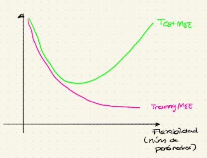

## Resampling methods

-   Los métodos de resampling son técnicas estadísticas que se usan para evaluar el performance de un método de aprendizaje estadístico dado.

-   Estos implican seleccionar muestras respectivamente de los datos de entrenamiento ("resampling") y reajustar el modelo en cuestión en cada muestra.

### Cross-validation

-   La cross-validation (CV) es una técnica que se puede usar para estimar el error de prueba haciendo buen uso de los datos de entrenamiento.

-   Esta técnica tiene varias versiones, en cada una se extrae un subconjunto de las observaciones originales y se aplica el método de aprendizaje estadístico a las observaciones que se sacaron y se evalúa su desempeño.

    1.  Validación out-of-sample.
    2.  Leave-one-out cross validation.
    3.  K-fold cross-validation.

## Validation out-of-sample

-   Es conceptualmente el método más simple de cross validation.

-   Consiste en una separación aleatoria de las observaciones disponibles en 2 partes de [tamaño comparable.]{.ul}

    1.  Conjunto de entrenamiento.
    2.  Conjunto de validación.

    -   El modelo se ajusta en el conjunto de entrenamiento y se usa el modelo ajustado para hacer predicciones de las respuestas para las observaciones en el conjunto de validación.

    -   El MSE sobre el conjunto de validación es un estimado del error de prueba.

### Desventajas

-   Aunque es simple de llevar a cabo, la validación out-of-sample tiene al menos 2 desventajas:

    1.  Depende mucho de cómo se construyen los conjuntos de entrenamiento y prueba. Dependiendo de la construcción de estos 2 conjuntos, el estimado del error de prueba puede ser muy diferente considerablemente.
    2.  Solo un sobconjunto de las observaciones en el data-set original se usa para ajustar el modelo (los datos de entrenamiento). Con menos observaciones usadas para entrenar el método de aprendizaje estadístico, el error de validación tiende a sobre-estimar la tasa de error de prueba para el modelo ajustado en el data-set completo.

## Leave-one-out cross-validation

-   El leave-one-out cross-validation (Loocv) es un refinamiento del método del conjunto de validación.

-   En vez de separar aleatoriamente a las observaciones en 2 partes, el Loocv define repetidamente al conjunto de entrenamiento como un sub-conjunto que contiene todas excepto una de las observaciones disponibles y el "conjunto" de validación es la observación restante, i.e.

    -   Conjunto de entrenamiento: $n-1$ observaciones.

    -   Conjunto de validación: 1 observación.

-   De manera más específica, el Loocv empieza usando $(x_1, y_1)$ como conjunto de validación a las observaciones restantes $\{(x_2, y_2), ..., (x_n, y_n)\}$ como el conjunto de entrenamiento en el que se ajustará el método de aprendizaje estadístico. Se obtiene una predicción $\hat{y}_{(1)}$ usando el valor de $x_1$ y

    $$
    \text{MSE}_1 := (y_1 - \hat{y}_{(1)})^2 
    $$

    es un estimado del error de prueba.

-   El procedimiento se repite con $(x_i, y_i)$ como conjunto de validación y $\{(x_j, y_j)\}_{i \neq j}$ como conjunto de entrenamiento, y se obtiene un estimado del error de prueba MSE$_i$

-   [**Definición:**]{.ul} Basándose en MSE$_1$, MSE$_2$, ..., MSE$_n$, el estimado Loocv del error de prueba cs

    $$
    CV_{(n)} : = \frac{1}{n} \sum_{i=1}^n (y_i - \hat{y}_{(i)})^2
    $$

### Desventajas

-   Una desventaja potencial de Loocv es que su cálculo puede ser computacionalmente demandante pues requiere entrenar $n$ modelos.

-   Para modelos de regresión lineal, ajustados usando un mínimos cuadrados ordinarios, se puede usar la siguiente fórmula

    $$
    CV_{(n)} = \frac{1}{n} \sum_{i=1}^n \bigg(\frac{y_i - \hat{y}_i}{1-h_{ii}}\bigg)^2
    $$

    donde $\hat{y}_i$ es el i-ésimo valor ajustado en el data-set completo y $h_{ii}$ es el i-ésimo leverage.

-   [Sin embargo]{.ul}, dicha fórmula [no aplica]{.ul} en otros contextos, además del regresión.

-   Loocv es un método general que se puede aplicar a casi cualquier procedimiento de aprendizaje estadístico.

### Ventajas

-   Loocv tiene mucho menos sesgo. En Loocv se aplica repetidamente el método de aprendizaje estadístico a conjuntos de entrenamiento que consisten de $n-1$ observaciones (casi tantas como hay en el data set completo).

-   Loocv tiende a dar una tasa de error de prueba que tiene un mucho menor sesgo en comparación con el método de conjunto de out-of-sample.

-   Mientras que en el método out-of-sample las tasas de error de validación dependen únicamente de las observaciones que están en el conjunto de entrenamiento, en Loocv [no]{.ul} se deoende de esta composición.

    -   La división entrenamiento/validación no carga aleatoriedad y el estimado Loocv del error de prueba no muestra variabilidad.

## K-fold cross-validation

-   El k-fold cross-validation es un método intermedio entre el out-of-sample y el Loocv.

-   En éte método se divide a las observaciones en $k$ "folds" (pliegues/secciones) de tamaño comparable.

-   Un fold se ocupa como conujnto de validación y los otros folds sirven como conjunto de entrenamiento.

-   Este procedimiento se repite para cada fold y se obtienen $k$ estimados del error prueba MSE$_1$, MSE$_2$, ..., MSE$_k$

-   El estimado $k$-fold del error de prueba es

    $$
    CV_{(k)} = \frac{1}{k} \sum_{i=1}^k \text{MSE}_i
    $$

    -   Loocv es un caso especial de $k$-fold cross-validatioon con $k=n$

    -   Las elecciones comunes de $k$ en la práctica son $k = 5, k = 10$

### Ventajas

1.  Si $k<n$, un mérito obvio del $k$-fold cross-validation comparado con Loocv es que $k$-fold CV es computacionalmente no demandante, pues se ajustan $k$ modelos en vez de $n$.

## Sesgo y varianza

-   Mientras más observaciones de entrenamiento, menos sesgo

    $$
    \text{SESGO: Loocv} < \text{k-fold} < \text{out-of-sample}
    $$

-   Sin embargo, para la varianza ocurre al revés

    $$
    \text{VARIANZA: out-of-sample} < \text{k-fold} < \text{Loocv}
    $$

    -   Hablando vagamente, loocv tiene la varianza más alta pues

        $$
        CV_{(n)} = \frac{1}{n} \sum_{i=1}^n \text{MSE}_i
        $$

        es un promedio de $n$ cantidades altamente correlacionadas (pues básicamente corresponde a las mismas observaciones).

## Training MSE v.s. Testo MSE

{width="565"}

$$
\text{Training MSE} = \frac{1}{n} \sum_{i=1}^{n} (y_i - \hat{f}(x_i))
$$

Un modelo con training MSE bajo, no necesariamente tiene un testMSE bajo.

El "mejor" modelo es aquel que minimiza el test MSE.

## Trade-off sesgo -varianza

$$
\underbrace{\mathbb{E}\bigg[ (y_0 - \hat{f}(x_0))^2 \bigg]}_{\text{test MSE esperado} \\ \text{es }x_n} = Var(\hat{f}(x_0)) + \bigg[ \text{Sesgo}(\hat{f}(x_0))  \bigg]^2 + \underbrace{Var(\epsilon_i)}_{\text{Error irreducible}}
$$

Hay que hablar largo y tendido de este tema...
