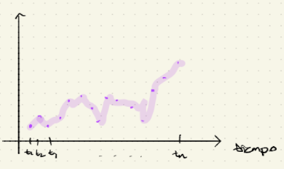
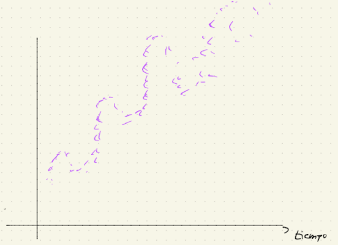
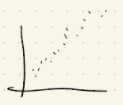

## Algunas definiciones

-   Las expresiones de "datos en series de tiempo" ó "series de tiempo" se refieren a conjuntos de observaciones tomadas en forma secuencial a través del tiempo.

    {width="552"}

    En este caso de puntos que observamos de manera secuencial, usaremos la notación $\{x_t\}_{t\in\mathbb{N}^+}$ si las observaciones están equiespaciadas a lo largo del tiempo.

    **Ejemplo:**

    $$
    x_1:\text{ observación de hoy} \\
    x_2:\text{ observación de mañana}\\
    x_3:\text{ observación de pasado mañana}
    $$

no siempre las series las observaciones de manera equiespaciadas

**Ejemplo:**

$\{x_{t_j}\}_{j \in \mathbb{N}}$ si las observaciones [no]{.ul} están igualmente espaciadas. Observaciones de:

$$
x_{t_1}: 16 \text{ abril } 2021 \\ 
x_{t_2}: 19 \text{ abril } 2021 \\
x_{t_3}: 10 \text{ mayo } 2021 \\
x_{t_4}: 15 \text{ mayo } 2021
$$

El caso más popular es el [equiespaciado]{.ul}

-   Uno de los objetivos del análisis de series de tiempo es estudiar la estructura de dependencia de la serie de tiempo.

De manera más formal

-   Estructura distribucional, i.e. la función de distribución conjunta de la serie $F_{x_{t_1}, x_{t_2}, ..., x_{t_n}}$ decimos que el análisis es de primer orden,

-   **Estructura observacional**, i.e. la asociación de correlación entre las observaciones de la serie, decimos que el análisis es de 2° orden.

**Definición.** Un proceso de serie de tiempo, es un proceso estocástico, i.e. es una colección de variables aleatorias $\{x_t\}_{t\in T}$ en el mismo espacio de probabilidad $(\Omega, \mathcal{F}, \mathbb{P})$.

Se dice que la serie es **a tiempo discreto** si $T \subset \mathbb{Z}$

Se dice que la serie es a **tiempo continuo** si $T \sim \mathbb{R}, T = [0, \infty), T = [a, b]$

-   Para $\omega \in \Omega$ fijo, la aplicación $t \mapsto X_t(\omega)$ es ima trayectoria ó una realización del proceso.

**Definición.** Se dice que un proceso estocástico $\{x_t\}_{t\in T}$ es completamente estacionario o fuertemente estacionario si $\forall t_1, ..., t_n \in T, \forall t \in \mathbb{R}$ tal que $t_1 +t,t_2 +t, ..., t_n +t \in T$.

$$
F_{X_{t_1}, X_{t_2}, ..., X_{t_n}} (a_1, a_2, ..., a_n) = F_{X_{t_1 + t}, X_{t_2+ t}, ..., X_{t_n+ t}} (a_1, a_2, ..., a_n)  
$$

i.e. el vector $(X_{t_1}, X_{t_2}, ..., X_{t_n})$ tiene la misma función de distribución que el vector $(X_{t_1 + t}, X_{t_2+ t}, ..., X_{t_n+ t})$

-   En general, pedir que un proceso sea fuertemente estacionario es bastante ambicioso y en la práctica resulta bastante complicado de verifican. Dada esta condición excesiva, surge el concepto de estacionariedad débil.

**Definición.** Se dice que un proceso $\{X_t\}_{t \in T}$ es débilmente estacionario (ó estacionario de segundo orden) si $\forall n \in \mathbb{N_+}, \forall t_1, t_2, ..., t_n \in T, \forall t \in \mathbb{R}$ tal que $t_1+t, t_2+t, ..., t_n+t \in T$. Todos los momentos de orden 1 y 2 del vector $(X_{t_1}, X_{t_2}, ..., X_{t_n})$ son iguales a los correspondientes momentos de orden 1 y 2 del vector $(X_{t_1 + t}, X_{t_2+ t}, ..., X_{t_n+ t})$ es decir

$$
\mathbb{E}\bigg[ X_{t_1}^{r_1} X_{t_2}^{r_2} ... X_{t_n}^{r_n}\bigg] = \mathbb{E}\bigg[ X_{t_1+t}^{r_1} X_{t_2+t}^{r_2} ... X_{t_n+t}^{r_n}\bigg] 
$$

con $r_1, ..., r_n \in \mathbb{N}$ tal que $r_1+r_2 +...+ r_n \leq 2$.

Condiciones a verificar para estacionariedad débil

$$
r_j = 1, r_i = 0 \\
r_i = 1, r_j = 1 \\
r_i = 2, r_j = 0 
$$

Esto se reduce a

$$
\mathbb{E}(X_{t_j}) = \mathbb{E}(X_{t_j + t}) \\
\mathbb{E}(X_{t_i} X_{t_j}) = \mathbb{E}(X_{t_i + t} X_{t_j + t}) \\
\mathbb{E}(X_{t_j} ^2) = \mathbb{E}(X_{t_j + t}^2) 
$$

Es se reduce a verificar

$$
Cov(X_\tau, X_s) = Cov(X_{\tau+t}, X_{s+t})
$$

-   Todo ruido blanco es débilmente estacionario.

-   Pero no todo proceso débilmente estacionario es ruido blanco.

El análisis tradicional de series de tiempo descompone a la serie observada de la siguiente manera.

$$
X_t = \underbrace{m_t}_{\text{componente}\\\text{de tendencia}} + \underbrace{S_t}_{\text{componente}\\ \text{estacional} \\ \text{(seasonality)}} + \underbrace{Y_t}_{\text{componente}\\\text{aleatoria}}
$$

{width="581"}

Los objetivos al hacer análisis de series de tiempo son

1.  Estimar $m_t, S_t$

2.  Estimar $Y_t$

    -   Encontrar un modelo adecuado para este de entre un catálogo de modelos.

        -   Estimar parámetros.

3.  Hacer predicciones.

## Ruido blanco

$y_t \rightarrow$ Las $Y_t'^s$ son independientes e identicamente distribuidas (generalmente Gaussianas)

### Estacionariedad débil

Se dice que una serie de tiempo $\{y_t\}$ es débilmente estacionaria ó estacionaria de segundo orden si:

-   $\mathbb{E}(y_t)$ no depende de $t$

-   $Cov(y_t, y_s)$ depende de $s$ y $t$ sólo a través del lapso de tiempo $|t-s|$

    -   Como consecuencia, $Var(y_t)$ [no]{.ul} depende de $t$

### Autocorrelación con lag $k$

$$
\rho_k = Corr(y_t, y_{t-k}) = \frac{Cov(y_t, y_{t-k})}{\sqrt{Var(y_t)Var(y_{t-k})}} = \frac{Cov(y_t, y_{t-k})}{\sigma_y^2}
$$

**Libros**

-   Brockwell & Davis. Intro to time series

-   Tibshiarani et. al. Intro to Statistical Learning.

-   Frees. Regression Techniques for actuarial applications.

### Autocorrelación muestral con lag $k$

$$
r_k := \frac{\displaystyle\sum_{t = k+1}^\tau (y_{t} - \bar{y})(y_{t-k} - \bar{y})}{\displaystyle\sum_{t =1}^\tau(y_{t} - \bar{y})^2}
$$

donde

$$
\bar{y} = \frac{1}{\tau}\sum_{t = 1}^\tau y_t\\
\\
\\
y_1 \space \space \space \space \space y_2 \space \space \space \space \space ... \space \space \space \space \space y_{\tau-k} \\
\updownarrow \space \space \space \space \space \space \space \updownarrow \space \space \space \space \space ... \space \space \space \space \space \space \space \updownarrow \\
y_{k+1} \space \space \space \space \space y_{k+2} \space \space \space \space \space ... \space \space \space \space \space y_{\tau} 
$$

### Pronóstico en ruido blanco (Gaussiano)

Sean $y_1, ..., y_T$ observaciones

-   $\hat{y}_{T+l} = \bar{y} =\displaystyle \frac{1}{T} \sum_{t = 1}^T y_t$

-   Error de pronóstico

    $$
    y_{T+l} - \underbrace{\bar{y}}_{\hat{y}_{T+l}} \sim N(0 , \sigma^2(1+\frac{1}{T}))
    $$

    Intervalo forecast ó intervalos de predicción

    $$
    \bar{y} \pm \underbrace{t_{T-1, \frac{\alpha}{2}}}_{\text{upper-cuantile}} \sqrt{S_y ^2 \bigg(1+ \frac{1}{T}\bigg)}
    $$

    Si T es grande, al $95\%$

    $$
    \bar{y} \pm 1.96\sqrt{S_y^2} = \bar{y} \pm 1.96S_y
    $$

## Caminata aleatoria

$$
y_t = y_0 + \sum_{i=1} ^t c_i, \{c_i\} \text{ es un ruido blanco}
$$

**Afirmaciones**

-   $\mathbb{E}(y_t) = y_0 + t\cdot \mu_c$

-   $Var(y_t) = t\cdot \sigma^2_c$

-   $Cov(y_t, y_s) = min\{s, t\}\cdot\sigma^2$

-   La caminata aleatoria [no]{.ul} es estacionaria.

*Demostración: tú puedes* 👏🏻

### Pronóstico en caminata aleatoria

-   $y_{T+l} = y_T + \displaystyle\sum_{t = T+1}^{T+l} c_k$

-   $\hat{y}_{T+l} = y_T + l\bar{c}$ (el pronóstico crece linealmente)

    $$
    y_{T+l} -  \hat{y}_{T+l} = \sum_{t = T+1}^{T+l} c_t - l\bar{c}
    $$

    -   Error estándar del error pronóstico

        $$
        \sqrt{\hat{Var}(y_{T+l} - \hat{y}_{T+l})} \approx \sqrt{\hat{Var}\bigg(  \sum_{t = T+1}^{T+l}c_t \bigg)} = \sqrt{S_c^2 \cdot l}
        $$

    -   Error estándar exacto del error de pronóstico

        $$
        \sqrt{Var(y_{T+l} - \hat{y}_{T+l})} = S_c \sqrt{l\bigg(1+\frac{l}{T}\bigg)}
        $$

    -   Intervalo de predicción al $95\%$

        $$
        \hat{y}_{T+l} \pm 1.96 \sqrt{\hat{Var}(y_{T+l} - \hat{y}_{T+l})} \\
        \text{i.e. } y_T + l\bar{c} \pm 1.96 \sqrt{S_c^2 \cdot l}
        $$

    -   Un pqueño aspecto computacional

        -   Si se da el ruido aleatorio (no la caminata aleatoria)

            -   $\hat{y}_{T+l} = y_t + l\bar{c}$

            -   $y_T + l\bar{c} \pm 1.96\sqrt{S_c^2 \cdot l}$ i.e. se calcula $\bar{c}$ y $S_c^2$ muestrales (del ruido blanco)

        -   Si se dan los puntos de la caminata aleatoria

            -   $c_t = y_t - y_{t-1}$ de aquí se parte

            -   $\bar{c} = \frac{1}{T}(c_1 + c_2 + ... + C_T) = \frac{y_T - y_0}{T}$

### Identificación de una caminata aleatoria

1.  $\mathbb{E}(y_t) = y_0 + t\cdot\mu_c$ esto implica una tendencia una lineal en el tiempo.

    $Var(y_t) = t \cdot \sigma_c ^2$ la varianza es creciente con respecto al tiempo.

2.  Si $\{y_t\}$ es caminata aleatoria

    $$
    c_t = y_t - y_{t-1}
    $$ debiese ser un ruido blanco y entonces debería tener correlaciones cercanas a 0 (no significativamente distintas de 0).

3.  La desviación estándar de la serie original $\{y_t\}$ debiése ser sustiancialmente **mayor** que la serie de diferencias $c_t = y_t - y_{t-1}$

    $$
    Var(y_t) = t \cdot \sigma_c^2 \\
    Var(c_t) = \sigma_c^2
    $$

## Filtros

-   Un filtro es un procedimiento para reducir un proceso de serie de tiempo a un ruido blanco.

    -   serie de tiempo $\rightsquigarrow$ ruido blanco

-   Diferenciar, $y_t-y_{t-1}$ es un ejemplo de filtro en caminatas aleatorias.

## Transformación logarítmica

Sea $\{y_t\}$ tal que $\boxed{\mathbb{E}(y_t) = \mu_t}$ y $\boxed{\sqrt{Var(y_t)} = \mu_t \cdot \sigma}$, donde $\mu_t$ es uina función determinista de $t$ (generalmente creciente).

-   $\log(y_t) = \log(\mu_t) + \log\bigg(1+ \frac{y_t - \mu_t}{\mu_t}\bigg)$

-   $\log(y_t) \approx \log(\mu_t) + \frac{y_t - \mu_t}{\mu_t}$

    $$
    \log(1+x) \approx x
    $$

-   $\mathbb{E}[\log(y_t)] \approx \log(\mu_t)$

-   $Var[\log(y_t)] \approx \sigma^2$ i.e. $\log(y_t)$ tiene varianza aproximadamente constante.

Se puede diferenciar postriormente para remover el nivel de variación media (i.e. ver qué onda con $\log(\mu_t)$)

## Tendencia lineal v.s. caminata aleatoria

-   Ambos manejan no-estacionariedad modelo de tendencia lineal

    $$
    y_t = \underbrace{\beta_0 + \beta_1 t}_{\text{determinista}} + \underbrace{\epsilon_t}_{\text{aleatorio}}
    $$

    

    Modelo de caminata aleatoria

    $$
    y_t = \underbrace{y_0 + \mu_c t}_{\text{determinista}} + \underbrace{u_t}_{\text{aleatorio}} \\
    \{\epsilon_t\} \rightarrow \text{ ruido blanco con media } 0\\
    u_t = \sum_{j=1}^t \epsilon_j \\
    c_t = \mu_c + \epsilon_t
    $$

## Prueba de Dickey-Fuller

$$
\underbrace{y_t - y_{t-1}}_{y} = \underbrace{\overbrace{(\phi - 1)}^{x_1} y_{t-1} }_{\text{caminata} \\ \text{aleatoria}} + \underbrace{\beta_0 + \beta_1 \overbrace{t}^{x_2}}_{\text{tendencia} \\ \text{lineal}} + \epsilon_t
$$

-   Si $\phi = 1$ y $\beta_1 = 0$ entonces

    $$
    y_t = \underbrace{y_{t-1} + \beta_0 + \epsilon_t}_{\text{caminata aleatoria}}
    $$

-   Si $\phi < 1$ y $\beta_1 = 0$ entonces

    $$
    y_t = \underbrace{\phi y_{t-1} + \beta_0 + \epsilon_t}_{\text{modelo } AR(1)}
    $$

-   Si $\phi = 0$ entonces

    $$
    y_t = \underbrace{\beta_0 + \beta_1 t + \epsilon_t}_{\text{modelo de tendencia lineal}}
    $$

Se contrastan las hipótesis

$$
\underbrace{ \underbrace{H_0: \phi = 1}_{\text{caminata} \\ \text{aleatoria}} \space \space \space \space \space \space\space \space \space \text{v.s.} \space \space \space \space \space \space \space \space \space \underbrace{H_a : \phi < 1}_{\text{tendencia} \\ \text{lineal}}}_{\text{Prueba de raíz unitaria}}
$$

Dickey-Fuller supone que los errores $\epsilon_t'^s$ están serialmente no-correlacionados.

### Versión aumentada de Dickey-Fuller

-   Funciona aún cuando la condición de no-correlación serial está dada, se tiene que

$$
\underbrace{y_t - y_{t-1}}_{y} = (\phi-1)\underbrace{y_{t-1}}_{y} + \beta_0 + \beta_1\underbrace{t}_{x_2} + \sum_{j=1}^p\phi_j\underbrace{(y_{t-j} - y_{t-j-1})}_{x_j+\epsilon_t}
$$

## Modelos estacionales

-   Muestran comportamiento periódico visible (determinista ó estocástica).

### Modelos de efectos estacionales fijos

-   La componente estacional $S_t$ es determinista.

    -   Funciones estacionales binarias

        $$
        z = 
        \begin{cases}
        1, \text{ si el evento estacional ocurre}\\
        0, \text{ c.o.c.} 
        \end{cases} \\
        y_t = \underbrace{\beta_0 + \beta_1t + \beta_2t^2}_{\text{tendencia} \\ \text{cuadrática}} + \underbrace{\beta_3z_t}_{\text{estado} \\\text{estacional}} + \underbrace{\epsilon_t}_{\text{error} \\ \text{aleatorio}}
        $$

        que es un modelo de regresión lineal múltiple con variables explicativas $t, t^2, z$.

    -   Funciones $\boxed{\text{trigonométricas}}$

        $$
        g(t) = a \cdot \sin(2\pi ft + b )
        $$

        -   $a$: amplitud

        -   $b$: phase-shift

        -   $f$: frecuencia

        -   $\frac{1}{f}$: periodo

        -   Los ánulos se miden en radianes.

    -   En general, para una base estacional, SB, la función

        $$
        g(t) = a \cdot \sin(2\pi ft + b ), \underbrace{f = \frac{1}{SB}}_{\text{conocido}}
        $$

        proporciona una función trigonométrica que se repite a sí misma cada SB unidades de tiempo.

    -   Prefiere escribirse $g(\cdot)$ como

        $$
        \boxed{g(t) = \beta_1 \sin(2\pi ft) + \beta_2 \cos(2\pi f t)}
        $$

        donde $\beta_1 = a \cdot \cos(b), \beta_2 = a \sin(b)$ y se estiman $\beta_1, \beta_2$ por mínimos cuadrados, tratando a $\sin(2\pi ft)$ y $\cos(2 \pi ft)$ como variables explicativas.

        $$
        \boxed{ 
        \begin{align*} 
        y_t &= \beta_0 + S_t + \epsilon_t \\
        &= \beta_0 + \sum_{j=1}^m \bigg[ \beta_{1j} \sin(2\pi fjt) + \beta_{2j} \cos(2\pi f j t) \bigg] + \epsilon_t
        \end{align*}} \\
        \text{donde } fj = \frac{j}{SB}
        $$

        Este modelo tiene $2m$ variables explicativas:

        $$
        \sin(2\pi f j t) \text{ y } \cos(2 \pi f j t), j = 1, ..., m
        $$

    -   

## Suavizamiento (smoothing)

-   Consiste en crear una serie de tiempo que sea más suave que la serie de tiempo observada en el sentido de que es menos vulnerable a cambios abruptos en los valores de la serie.

-   Se estudiará

    1.  Promedios móviles
    2.  Suavizamiento exponencial

### Promedios móviles (moving average)

-   Promedio móvil de [longitud k]{.ul} al tiempo $t$

    $$
    \hat{S}_t = \frac{1}{k} \underbrace{(y_t + y_{t-1} + ... + y_{t-k+1})}_{k \text{ sumandos}}
    $$

    -   Mientras más grande sea el valor de $k$, más suaves serán los promedios. (*Mientras más chivas* 🐐 *estás promediando, más se van a acercar a una constante)*

    -   Los promedios móviles sirven como los valores ajustados para la serie original.

-   Pronóstico: $\hat{y}_{T+1} = \hat{S}_T$

    -   $\hat{y}_{T+2} = \hat{S}_{T+1} \space \rightarrow$ pero $y_{T+1}$ se reemplaza por $\hat{S}_T$

    -   Se aplica esta idea inductivamente.

***¿Cómo sabemos que*** $k$ ***utilizar?***

### Suavizamiento exponencial simple

$$
\hat{S}_t = \frac{1}{(1-\omega)^{-1}} \bigg[ y_t + \omega y_{t-1} + \omega^2 y_{t-2} + ... + \omega^{t-1} y_1 + \omega^ty_0\bigg]
$$

-   $t\in \{0,1,...\}$

-   $\omega \in (0,1)$ se tiene que seleccionar

El peso asignado a $y_{t-i}$ es $(1-\omega)\omega^i$

**¿Por qué escogiste los ponderadores así?** $(1-\omega)\omega^i$

$$
\sum_{i=0}^\infty (1-\omega)\omega^i = (1-\omega)\sum_{i=0}^\infty \omega^i = (1-\omega) \bigg[\frac{1}{1-\omega} \bigg] = 1
$$

Tú puedes demostrar que $\hat{S}_t = \hat{S}_{t-1} + (1-\omega)(y_t - \hat{S}_{t-1})=(1-\omega)y_t + \omega \hat{S}_{t-1}$

-   Mientras más alto sea $\omega$, menor será el efecto de $y_t$ en $\hat{S}_t$ y más pronunciada será la cantidad de suavizamiento.

-   $\omega$ bajo $\rightarrow$ mayor efecto de $y_t$

-   $\omega$: parámetro de suavizamiento

    $$
    \boxed{SS(\:=\sum_{t=1}^T (y_t - \hat{S}_{t-1})^2omega)}
    $$

    depende de $\omega$ a partir de los estimados exponencialmente suavizados.

-   Se elige $\omega^*$ se tal forma que $SS(\omega^*)$ sea mínimo.

-   [Pronóstico]{.ul}: $\hat{y}_{T+1} = \hat{S}_T$

    \$\$ \hat{y}*{T+2} =* \hat{S}{T+1} = (1-\omega)y\_{T+1} + \omega \\hat{S}\_T = (1-\omega) \hat{S}\_T + \omega \\hat{S}\_T = \hat{S}\_T \\

    \boxed{\hat{y}_{T+l} = \hat{S}_T \text{ que no depende de } l}

    \$\$

## Modelo AR de primer orden (AR(1))

Conocido como modelo Auto regresivo de orden 1.

-   $\underbrace{y_t}_{\text{respuesta}} = \underbrace{\beta_0 + \beta_1 y_{t-1}}_{\text{explicativas}} + \underbrace{\epsilon_t}_{\text{error}}$

    $\beta_0, \beta_1$ son parámetros desconocidos y $\{\epsilon_t\}$ es un proceso de ruido blanco con media 0.

-   Típicamente se supone que $\epsilon_{t+k}$ y $y_t$ son [independientes]{.ul} para cualesquiera $t, k > 0$.

-   El modelo $AR(1)$ es una [generalización]{.ul} de un proceso de [ruido blanco]{.ul} haciendo $\beta_1 = 0$

    $$
    y_t = \beta_0 + \epsilon_t
    $$

-   El modelo $AR(1)$ es una generalización de una [caminata aleatoria]{.ul} haciendo $\beta_1 = 1$

    $$
    y_t - y_{t-1} = \beta_0 + \epsilon_t
    $$

-   Para que el modelo $AR(1)$ sea estacionario, una condición suficiente es que $\boxed{|\beta_1|<1}$, pero $\beta_0$ puede ser cualquier real.

-   Una parametrización más popular del modelo $AR(1)$ (que no se usa en Frees) es

    $$
    y_t = \mu + \phi(y_{t-1} - \mu) + \epsilon_t
    $$

### Propiedades del modelo AR(1) estacionario

Para un modelo AR(1), $y_t = \beta_0 + \beta_1y_{t-1} + \epsilon_t$

**Demuestra que:**

-   $\mathbb{E}(y_t) = \beta_0 + \beta_1 \mathbb{E}(y_{t-1}) + \mathbb{E}(\epsilon_{t}) = \frac{\beta_0}{1-\beta_1}$

-   $Var(y_t) = \beta_1^2Var(y_{t-1}) + Var(\epsilon_{t}) = \frac{\sigma^2_{\epsilon}}{1-\beta^2_1}$

#### Función de autocorrelación

Para $k = 1, 2, ...$

-   $Cov(y_t, y_{t-k}) = \beta_1^kVar(y_t)$

    $$
    \boxed{Corr(y_t, y_{t-k}) = \beta_1^k =: \rho_k}
    $$

-   Como se está suponiendo que $|\beta_1|<1$, la magnitud de las autocorrelaciones decrece exponencialmente con el lag $k$, i.e.

    $$
    \boxed{
    \text{La aplicación}\\
    k\mapsto \rho_k =\beta_1^k \\
    \text{decrece exponencialmente}
    }
    $$

-   Si $\beta_1 > 0$, las autocorrelaciones son positivas pero se encogen con el lag. Para $\beta \approx 1$, la curva de autocorrelación parece relativamente suave.

-   Si $\beta_1 < 0$, las autocorrelaciones alternan de positivo a negativo con magnitudes que decrecen exponencialmente.

### Estimación de parámetros en AR(1)

-   Se estudiará el método de [mínimos cuadrados condicionales]{.ul} para estimar los 2 parámetros $\beta_0$ y $\beta_1$ del modelo AR(1), basándose en la serie de tiempo observada $\{y_1, y_2, ..., y_T\}$.

-   Para el modelo AR(1), $y_t = \beta_0 + \beta_1 y_{t-1} + \epsilon_t$, se minimiza la suma de cuadrados condicional

    $$
    \sum_{t=2}^T(y_t - \mathbb{E}(y_t | y_{t-1}))^2 = \sum_{t = 2}^T\bigg[y_t - (\beta_0 + \beta_1y_{t-1})\bigg]^2
    $$

    como sólo se observa $y_1, ..., y_T$, la suma empieza en $t=2$, no en $t-1$.

-   Se puede ver al modelo AR(1) como un modelo SLR

    $$
    \begin{equation}
    \left(
    \begin{matrix}
    y_2 \\
    y_3 \\
    \vdots \\
    y_T 
    \end{matrix}
    \right)
    =
    \left(
    \begin{matrix}
    1 & y_1 \\
    1 & y_2 \\
    \vdots & \vdots \\
    1 & y_{T-1}
    \end{matrix}
    \right)
    \left(
    \begin{matrix}
    \beta_0  \\
    \beta_1
    \end{matrix}
    \right)
    +
    \left(
    \begin{matrix}
    \epsilon_2 \\
    \epsilon_3 \\
    \vdots \\
    \epsilon_T
    \end{matrix}
    \right)
    \end{equation} \\
    \\
    \mathbb{Y} = \mathbb{X} \beta + \epsilon
    $$

Aplicando la fórmula para $\beta_1$ en el modelo SLR

$$
\boxed{
\hat{\beta}_1 = \frac{\displaystyle \sum_{t=2}^T (y_{t-1} - \bar{y}_{1,T-1})(y_t - \bar{y}_{2,T})}{\displaystyle \sum_{t=2}^T (y_{t-1} - \bar{y}_{1,T-1})^2}
}
$$

donde $\bar{y}_{1, T-1} = \frac{1}{T-1} \displaystyle \sum_{t=1}^{T-1} y_{t}, \bar{y}_{2, T-1} = \frac{1}{T-1} \displaystyle \sum_{t=2}^{T} y_{t}$ y también $\boxed{\hat{\beta}_0 = \bar{y}_{2, T} - \hat{\beta}_1 \bar{y}_{1, T-1}}$

-   La expresión para $\hat{\beta}_1$ es muy parecida a la autocorrelación de lag 1.

-   De hecho, para $T$ grande

    \$\$ \bar{y}*{1, T-1}* \approx \\bar{y}{2, T} \approx \\bar{y} = \frac{1}{T} \sum\_{t =1}\^Ty_t\\

    ```{=tex}
    \hat{\beta_1} 
    \approx 
    \frac{\displaystyle \sum_{t=2}^T(y_{t-1} -\bar{y})(y_{t} -\bar{y})}{\displaystyle \sum_{t=2}^T(y_{t-1} -\bar{y})^2} 
    \approx 
    \frac{\displaystyle \sum_{t=2}^T(y_{t-1} -\bar{y})(y_{t} -\bar{y})}{\displaystyle \sum_{t=1}^T(y_{t} -\bar{y})^2}
    ```
    = r_1 \$\$

Entonces se tienen las siguientes aproximaciones

$$
\hat{\beta}_1 \approx r_1 \space \space \space \text{ y } \space \space \space \hat{\beta}_0 = \bar{y}(1-r_1)
$$

Si se pide que se calule el LSE (estimador por mínimos cuadrados) de $\beta_1$ se usa

$$
\hat{\beta}_1 = \frac{\displaystyle \sum_{t=2}^T(y_{t-1} -\bar{y})(y_{t} -\bar{y})}{\displaystyle \sum_{t=2}^T(y_{t-1} -\bar{y})^2}
$$

no usar $\hat{\beta}_1 = r_1$, a menos que se pida directamente.

### Residuales

$$
\boxed{
e_t := y_t - (\hat{\beta}_0 + \hat{\beta}_1 y_{t-1})
}
$$

1.  **Verificación de diagnóstico.** Si el modelo AR(1) ajustado es adecuado, los residuales se deben parecer a un verdadero ruido blanco $\{ \epsilon_k\}$ que son i.i.d. y por lo tanto sin estructura de correlación.

    **OJO:** El residual $e_1$ [no]{.ul} está disponible, sólo se tienen $T-1$ observaciones de los residuales.

2.  **Estimación de la varianza del ruido blanco.** Los residuales se usan para estimar la varianza del ruido blanco $\sigma_{\epsilon}^2$

    i.  A diferencia del marco de regresión lineal, el promedio de los residuales [no]{.ul} es 0.

    ii. El MSE para la varianza del ruido blanco es

        $$
        \boxed{
        S^2 = \frac{1}{T-3} \sum_{t = 2}^T (e_t - \bar{e})^2
        }
        $$

### Predicción en el modelo AR(1)

-   Se hará pronóstico en el modelo AR(1)

    $$
    y_t = \beta_0 + \beta_1 y_{t-1} + \epsilon_t
    $$

    donde los parámetros $\beta_0$ y $\beta_1$ se suponen conocidos ó eficientemente estimados y por lo tanto con errores despreciables, y la historia de la serie es $\{y_1, ..., y_T\}$

-   Para predicción puntual se estudian dos formas

    -   Recursiva.

    -   Explícita.
