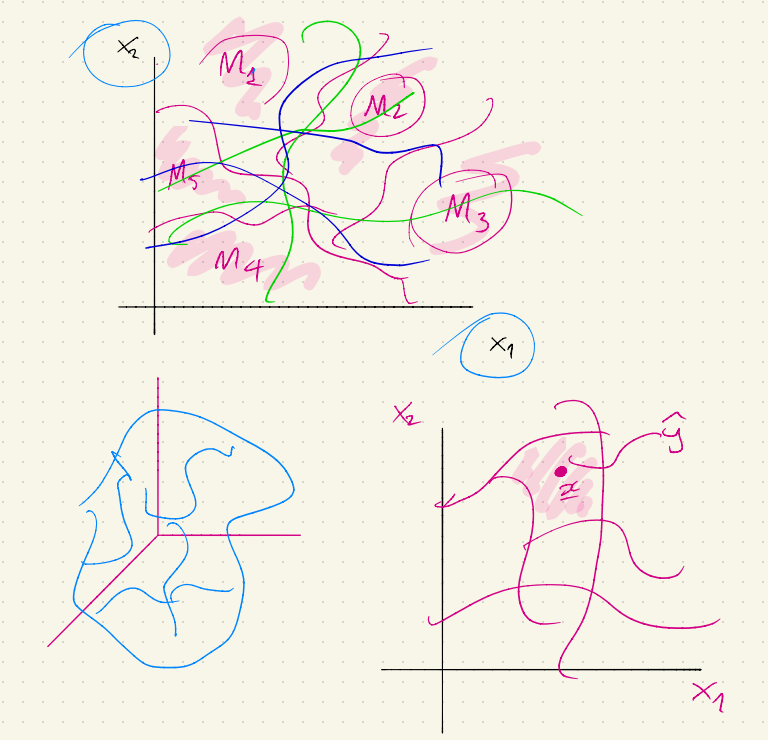
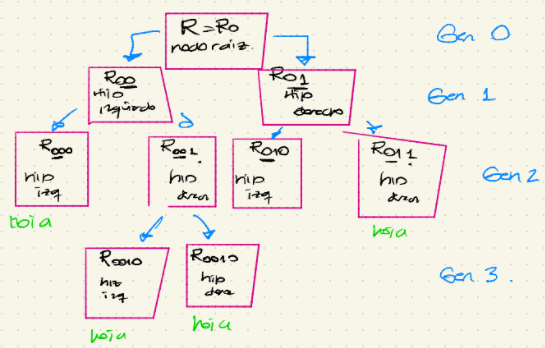
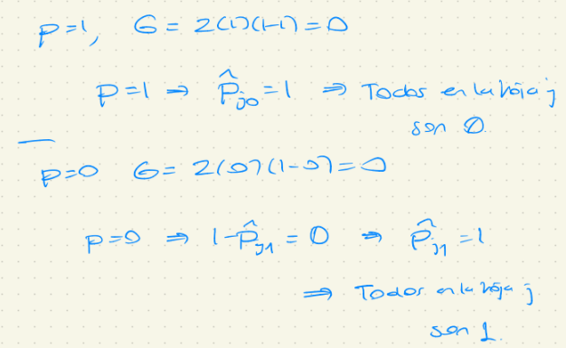

## ¿Qué es un árbol de decisión?

-   Hay una variable aleatoria respuesta que se predecirá utilizando un conjunto de variables explicativas (no aleatorias) que se conocen como variables explicativas. **Es decir que es un modelo de aprendizaje supervisado.**

-   La idea de un árbol de decisión es agrupar los datos en subregiones, en los que la variabilidad en cada subregión sea relativamente baja.

-   Las subregiones se determinan usando las variables explicativas de las observaciones.

-   Una vez que "se decide" la subregión a la que pertenece una observación, una predicción será más "exacta" ya que la "variabilidad" en esta subregión es "pequeña".

### ¿Cómo se determinan las subregiones?

-   Un árbol de decisión segmenta al espacio predictor en diferentes regiones utilizando **splits** binarios consecutivos. Se puede usar un modelo de predicción diferente en cada una de las subregiones

    

-   Se hará distinción entre:

    -   Árboles de regresión: Respuesta continua

    -   Árboles de clasificación: Respuesta categórica.

-   En **árboles de regresión**, la calidad de las predicciones se puede evaluar midiendo la distancia entra la respuesta predecida y la respuesta observada. $y-\hat{y}$

-   En **árboles de clasificación**, la exactitud/calidad de las predicciones se puede determinar usando el ***misclasification error*** (la proporción de observaciones mal clasificadas). El objetivo es **clasificar bien** tantas observaciones como sea posible.

-   Se supondrá que hay $p$ variables explicativas $X_1, X_2, ..., X_p$ que se usarán para predecir una variable respuesta unidimensional $Y$.

-   Sea $\textbf{R}$ el **espacio predictor**. El vector $(X_1, ..., X_p)$ toma valores en el espacio predictor, i.e. $(x_1, ..., x_p) \in \textbf{R}$

## La función de regresión

-   La variable respuesta $Y$ es una variable aleatoria y se supone que se cumple la siguiente ecuación $$Y = f(\underline{X}) +\epsilon$$ Donde $f(\underline{X}) = \beta_0 + \beta_1 X_1 + ... + \beta_p X_p$

-   La función de regresión $f$ determina el "efecto" (ojo: da la de causalidad) de las variables explicaticas en la variable respuesta $Y$.

    -   El término de error $\epsilon$ es una variable aleatoria con media cero, que determina las fluctuaciones de la respuesta.

Considérese un data set con variables explicativas y respuesta. **La idea es explicar cómo se utilizan los árboles de decisión para estimar la función** $f$. Dicha estimación se denotará por $\hat{f}$.

-   Dado $\underline{x}\in\textbf{R}$, se estimará la respuesta $\hat{y}$ utilizando la función $\hat{f}$, i.e. $$ \hat{y} = \hat{f}(\underline{x})$$

-   La pregunta principal a resolver ¿Cupal debería ser la respuesta predecida para una nueva observación? Esta pregunta se resuelve en dos pasos:

    -   ¿A qué subregión pertenece la observación de prueba?

    -   ¿Cuál es la respuesta predecida en esta región?

## Detalles de la construcción

-   Cuando se construye un árbol de decisión (ya sea de clasificación o de regresión) hay 3 detalles a considerar:

    -   [Regla de splitting óptimo.]{.ul} ¿Cómo dividir cada subregión en nuevas subregiones?

    -   [Regla de paro:]{.ul} ¿Cuándo se debe parar la división de una sibregión?

    -   [Modelo de predicción:]{.ul} ¿Cuál debe ser la respuesta predecida en cada subregión?

-   Un árbol de decisión es una herramienta que proporciona un plan paso a paso de cómo particionar al espacio predictor completo en subregiones a través de splits binarios consecutivos.

-   **Observación:** Existen algorítmos de splitting más complicados además del binario.

### Splits binarios

-   Se empezará dividiendo al espacio predictor completo en 2 subregiones. Se llamará a $R$ como [nodo raíz]{.ul}

    -   Entonces se dividirá al nodo raíz en 2 nuevos nodos. Estos 2 nodos deben ser dos subconjuntos disjuntos del nodo raíz.

    -   Sean $R_{00}$ y $R_{01}$ los nuevos subconjuntos que conforman al nodo raíz, i.e. $$R = R_{00} \cup R_{01}, R_{00} \cap R_{01} = \emptyset$$

    -   Sea $\xi_0 := (R_{00}, R_{01})$. Se dice que $\xi_0$ es un [split bianrio]{.ul} de $R$

-   **Notación:** El primer dígito en la notación $R_{00}$ (i.e. "0") denota la "generación" del nodo y el segundo dígito ("0" ó "1") indica si el correspondiente subespacio es hijo izquierdo ($R_{00}$) ó hijo derecho ($R_{01}$) del nodo madre.

    El espacio predictor $\textbf{R}$ es la generación 0 y los dos nuevos espacios son la generación 1.

-   El siguiente paso es **dividir** a ambos subconjuntos $R_{00}$ y $R_{01}$ y así sucesivamente [PERO]{.ul} algunos nodos hijos no se dividen.

    

-   Supóngase que se tiene un nodo $R_t$ en el árbol de decisión y que dicho nodo es de la generación k, ie $t \in \{0, 1\}^{k+1}$ (i.e. una sucesión de $0'^s$ y $1'^s$).

    Por ejemplo, si la generación es $k=4$, $t$ puede ser 00101, ó 00100, ó ...

-   Se puede separar/dividir este nodo en hijo izquierdo $R_{t0}$ y en hijo derecho $R_{t1}$, usando el split binario $\xi_t = (R_{t0}, R_{t1})$, donde:

    -   $R_t = R_{t0} \cup R_{t1}$

    -   $R_{t0} \cap R_{t1} = \emptyset$

-   **Notación:** $\mathbb{T} = \{t : R_t \text{ es un nodo del árbol de decisón}\}$

-   ¿Cuándo se detiene el splitting? Una regla de paro (stoping rule) determina si un noo dado se divide o no.

### Reglas de paro

-   El objetivo es generar subregiones del espacio predictor completo tal que la variabilidad entre las respuestas en cada subregión sea suficientemente pequeña para crear predicciones "extrañas".

    -   [Ejemplo]{.ul}: "Parar si el crecimiento en la variabilidad no es suficientemente significativa".

    -   [Ejemplo]{.ul}: "Parar si alguno de los nodos hijos (o el mismo padre) tiene pocos elementos".

### Hojas de un árbol de decisión

-   Cuando se aplica una regla de paro, se obtiene un conjunto de notos finales (nodos sin hijos).

    Se llama a estos [nodos finales hojas]{.ul}. Los otros nodos se conocen como [nodos internos]{.ul}.

-   Se define al conjunto $\tau$ de la siguiente forma:

    El nodo $R_t$ es hoja si y sólo si $t \in \tau$

-   $\tau$ contiene todos los índices $t$ tales que $R_t$ es una hoja. Claramente $\tau \in \mathbb{T}$

-   Para hacer crecer un árbol de decisión, se aplica una sucesión finita de splits binarios. Por lo tanto $\tau$ contiene un número finito de hojas.

    Se supondrá que $|\tau| = m$. Para simplificar la notación, se denotarán a las hojas por: $R_1, ..., R_m$

### Splits binarios estandarizados

-   Considérese un nodo $R_t$ de la generación $k$

    -   Hay muchas maneras de dividir a este espacio en 2 nodos hijos nuevos (de la generación $k+1$)

    -   El objetivo es buscar la "mejor" división de un nodo dado. Pero dividir un conjunto en dos nuevos subconjuntos se puede volver muy complicado (El problema de optimización puede requerir muchos recursos y no será factible)

-   Se buscará el mejor split en la clase de los splits binarios estandarizados (computacionalmente factible y relativamente eficiente).

### Splits binarios estandarizados

-   **Definición:** Un split binario estandarizado $\xi_t$ de $R_t$ divide a solo una dimensión predictora $l \in \{1, ..., p\}$ ($l$ fija) en dos partes

    {width="371"}

-   Considérese el nodo $R_t$ en un árbol de decisión que se dividirá en 2 nuevos nodos hijos usando un split binario estandarizado.

    -   Supóngase que la variable [$x_l$ es cuantitativa]{.ul} *(donde* $l$ es la dimensión con la que se decidió hacer el split)

        Entonces el split binario estandarizado del conjunto $R_t$ divide al espacio en 2 partes usando la constante $c \in \mathbb{R}$. $$(x_1, ...,. x_p) \in R_{t0} \iff x_l \leq c$$

    $$(x_1, ...,. x_p) \in R_{t1} \iff x_l > c$$

    -   Supóngase que la variable [$x_l$ es categórica]{.ul}. En este caso, $x_l = c$ se interpreta como "$x_l$ pertenece a la clase $c$". Un split binario estandarizado para una variable categórica $x_l$ se define de la siguiente forma: $$(x_1, ...,. x_p) \in R_{t0} \iff x_l \in C$$ donde $C$ es un subconjunto de todas las posibles categorías que $x_l$ puede tomar.

        **Ejemplo**

        $$x_l \in \{\text{"mexicano", "estadounidence", "canadiense"}\}$$ $$C = \{\text{"mexicano", "canadiense"}\}$$

        Te manda al nodo derecho si eres mexicano o canadiense.

{width="564"}

$$ R_1 \cup R_2 \cup ... \cup R_m =  R $$ $$ R_1 \cap R_2 \cap ... \cap R_m =  \emptyset $$

$$
y = f(x) = \sum_{i=1}^{m} \lambda_i 1_{(\underline{x} \in R_i)} = \begin{cases}
 \lambda_1 &\text{ si } \underline{x} \in R_1\\         
 \lambda_2 &\text{  si  } \underline{x} \in R_2\\
...\\
\lambda_m &\text{ si } \underline{x} \in R_m        
\end{cases}
$$

## Predicciones

-   Supóngase que se tienen $p$ variables explicativas $X_1, X_2, ..., X_p$ y un árbol de decisión que particiona al espacio predictor en hojas $R_1, R_2, ..., R_m$

    -   Considérese un vector $\underline{x} \in R$. La respuesta $y = f(x)$ se determina de la siguiente forma $$f(x) = \sum_{i=1}^{m} \lambda_i 1_{(\underline{x} \in R_i)}$$

        donde se predice la respuesta usando una constante diferente $\lambda_i$ en cada hoja $R_i$, es decir, $\lambda_i$ predice a $y$, en la hoja $R_i$

### Banda de split para árboles de regresión

-   Supóngase que las variables respuesta y explicativas son cuantitativas.

-   Hay $p$ variables explicativas $x_1, x_2, ..., x_p$ y se tiene que decidir cuál de éstas usar para dividir el espacio predictor.

-   Además, una vez que se decidió que variable explicativa usar para dividir el espacio, se tiene que decidir dónde dividir ésta variable, es decir, encontrar el punto de corte $c$

-   Por lo tanto, seleccionar un split óptimo se reduce a determinar la variable explicativa $x_l$ y una constante $c$

    $$ R_{t0}  = \{\underline{x} \in R_t : x_l \leq c\}$$

    $$ R_{t1}  = \{\underline{x} \in R_t : x_l > c\}$$

    Además supóngase que el valor predecido dentro de la región $R_{t0}$ es $\lambda_0$ y dentro de la región $R_{t1}$ es $\lambda_1$

    $$
    f(x)= \begin{cases}
     \lambda_1 &\text{ si } \underline{x} \in R_{t0}\\         
     \lambda_2 &\text{  si  } \underline{x} \in R_{t1}
    \end{cases}
    $$

### Definición Suma de cuadrados

$$
SS(l,c;\lambda_0, \lambda_1) = \sum_{\underline{x}_i \in R_{t0}} (y_i - \lambda_0)^2 + \sum_{\underline{x}_i \in R_{t1}} (y_i - \lambda_1)^2 
$$

### Split óptimo

-   El mejor split se define como el split que minimiza la suma de los cuadrados. Por lo tanto, se busca resolver el siguiente problema de minimización

    $$ 
    \min_{l,c} \bigg\{ \min_{\lambda_0} \sum_{\underline{x}_i \in R_{t0}} (y_i - \lambda_0)^2 + \min_{\lambda_1} \sum_{\underline{x}_i \in R_{t1}} (y_i - \lambda_1)^2 \bigg\}
    $$

    -   Los dos problemas de optimización "internos" se resuelven fácilmente:

        $$
        \hat{\lambda_0} = \frac{1}{n_{t0}} \sum_{\underline{x}_i \in R_{t0}} y_i  = \frac{1}{|R_{t0}|} \sum_{\underline{x}_i \in R_{t0}} y_i  
        $$

        $$
        \hat{\lambda_0} = \frac{1}{n_{t0}} \sum_{\underline{x}_i \in R_{t0}} y_i  = \frac{1}{|R_{t0}|} \sum_{\underline{x}_i \in R_{t0}} y_i  
        $$

-   Supóngase que una observación $\underline{x} \in R_{t0}$ ¿Cuál debería ser la predicción de $\hat{y}$? $\hat{y} := \hat{\lambda_0}$

-   **En general la minimización exterior se hace numéricamente.**

-   Considérese un nodo $R_t$ que tiene $n$ elementos. Sean $y_1, ..., y_n$ las respuestas y $\underline{x}_1, ..., \underline{x}_n$ las correspondientes variables explicativa.

    La suma de los cuadrados, de este nodo, se define como:

    $$
    SS(y) := \sum_{i=1}^n (y_i - \bar{y})^2
    $$

-   Supóngase que se separa a este nodo en un hijo izquierdo y derecho minimizando la suma de cuadrados. La correspondiente suma de cuadrados se denota por $SS(\hat{\lambda_0}, \hat{\lambda_1})$

    Entonces

    $$SS(\hat{\lambda_0}, \hat{\lambda_1}) \leq SS(\bar{y})$$

    Es decir, $SS(\hat{\lambda_0}, \hat{\lambda_1})$ está acotado por arriba por $SS(\bar{y})$

## Árboles de clasificación

-   Se tiene un problema de clasificación, cada variable $y_i$ denota cierta clase

    -   Supóngase que hay $K$ [clases]{.ul} y que están etiquetadas por los números $1, 2, ..., K$

-   Considérese un árbol de decisión con $m$ hojas, denotadas por $R_1, R_2, ..., R_m$

    -   $n_j$: número de observaciones que caen en la hoja $R_j$

    -   $n = n_1 + n_2 + ... + n_m$

-   Se debe predecir a qué clase pertenece un vector predictor $\underline{x}_i$,

    ¿Quién debe ser $f(\underline{x}_i)$ si sabemos que $\underline{x}_i \in R_i$?

-   Un árbol de clasificación es [adecuado]{.ul}, si es capaz de asignar la clase correcta a la mayoría de las observaciones.

-   En cada hoja del árbol, se tiene que decidir qué clase asignar

    **La predicción en cierta hoja corresponde a la clase que más se repite.**

-   Esta metodología se reduce a minimizar la [tasa]{.ul} de [misclassification]{.ul}, i.e. minimizar la probabilidad de que una observación seleccionada aleatoriamente de esta hoja esté mal clasificada.

-   La mejor situación ocurre cuando todas las observaciones de una hoja pertenecen a la misma clase (no hay duda cuando se asigna la predicción en esta hoja y todas las observaciones en esta hoja están correctamente clasificadas.)

-   **nodo puro:** nodo en el que todas las observaciones pertenecen a la misma clase.

-   Supóngase que se construyó un árbol de clasificación con m hojas.

    **La mejor situación ocurre cuando todas las m hojas del árbol son nodos puros (se puede clasificar a todas las observaciones de entrenamiento correctamente, usando las m hojas)**

-   Cuando se construye un árbol de clasificación, se separa cada nodo en 2 nodos hijos. Se buscan splits que generen nodos hijos que sean "tan puros como sea posible".

-   Se necesita cuantificar el [grado de impureza de]{.ul} un nodo.

-   $P_j$ cuantifica el grado de impureza del nodo de la hoja $R_j$

-   Si la hoja $R_l$ es pura, entonces $P_l = 0$

-   Mientras más grande sea $P_j$, "más impura" será la hoja $R_j$

-   $P_j$ grande $\rightarrow$ $R_j$ muy impura

-   Se define la frecuencia de la clase $k$ en la hoja $j$ denotada por $\hat{P}_{jk}$ donde $j$ representa la hoja y $k$ representa la clase como $$\hat{P}_{jk} = \frac{1}{n_j}\sum_{\underline{x}_i \in R_j}1_{(y_i = k)} $$

-   $\hat{P}_{jk}$ se puede interpretar como la probabilidad empírica de que una observación caiga en la clase $k$, dado que la observación pertenece a la hoja $R_j$.

-   Se considerarán 3 medidas de impureza de un nodo:

    -   Misclassification error

    -   índice de Gini

    -   Entropía cruzada

-   **Definición.** Se define el misclassification error de una hoja $R_j$ como

    $$
    E_j := 1- \max_{k}\{\hat{P}_{jk}\}
    $$

    **Observación:**

    $$
    E_j = 0 \iff 1=\max_{k}\{\hat{P}_{jk}\} \iff \max\{\hat{P}_{j1}, \hat{P}_{j2}, ...,\hat{P}_{jk}\} \rightarrow \exists l \text{  tal que } 
    $$ $$
    \hat{P}_{jl} = 1 \text{ lo cual implica que los elementos de la hoja }j\text{ son de la clase } l
    $$

-   $E_j = 0 \rightarrow$ Todos los $y_i'^{s}$ en la hoja $R_j$ son de una clase $l$, i.e. la hoja es pura.

-   Una hoja $R_j$ que es pura, tiene un misclassification error $E_j = 0$

-   Mientras más grande sea $E_j$, más alta será la impureza de $R_j$

    $$
    E_j \uparrow \space \rightarrow \space \text{Pureza de }R_j \downarrow
    $$

-   Mientras más alto sea el grado de impureza, más difícil será predecir la clase correctamente en esa hoja particular.

### Misclassification error para el caso bidimensional

-   Para el nodo $R_j$ de un árbol de clasificación, supóngase que hay 2 clases para respuesta: 0 ó 1.

    $$
    \hat{P} := \hat{P}_{j0}, \space 1-\hat{P} = \hat{P}_{j1} \\
    E = 1-\max\{p, 1-p\}
    $$

    La aplicación $p \mapsto E$ no es diferenciable y tiene un máximo en $p = \frac{1}{2}$

    {width="581"}

-   **Definición.** Se define el índice de Gini de la hoja $R_j$ como

    $$
    G_j := \sum_{l = 1}^{k}\hat{P}_{jl}(1-\hat{P}_{jl})
    $$

-   **Definición.** Se define la cross-entropy de la hoja $R_j$ como

    $$
    D_j := -\sum_{l = 1}^{k}\hat{P}_{jl}\log(\hat{P}_{jl})
    $$

    Para un nodo $R_j$ de un árbol de clasificación, supóngase que hay 2 clases para la respuesta (0 ó 1).

    $$\hat{P}:=\hat{P}_{j0} \space 1-\hat{P}=\hat{P}_{j1}\\ G = 2p(1-p) = 2p-2p^2$$

-   La aplicación $p \mapsto G$ sí es diferenciable y tiene un máximo en $p = \frac{1}{2}$

-   **Observación:**

    

    -   Si $p=1$, entonces $G = 0$ y todas las observaciones pertenecen a la clase 0

    -   Si $p=0$, entonces $G = 1$ y todas las observaciones pertenecen a la clase 1

        $$
        D = -[p\log(p) + (1-p)\log(1-p)] \space \text{cross entropy}
        $$

    -   La aplicación $p \mapsto D$ sí es diferenciable y tiene un máximo en $p = \frac{1}{2}$

        *Demostración:*

        $$
        D´(p) = -[\log(p)-\log(1-p)] \rightarrow D´(p) = 0 \iff p = \frac{1}{2} \\
        D´´(p) = -\bigg[\frac{1}{p}+\frac{1}{1-p}\bigg] \rightarrow D´´(\frac{1}{2}) = -4 < 0_{._\Box}
        $$

    Tanto en el índice de Gini y el cross-entropy, la impureza se maximiza en $p=\frac{1}{2}$ y entonces la mitad de las hojas pertenecen a la clase 1 y la otra mitad a la clase 0.
