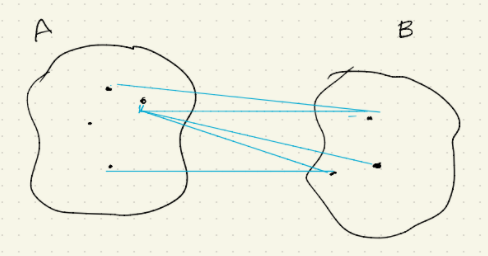

## Definiciones generales

-   Un método de clustering se utiliza para agrupar un data-set heterogéneo en [subgrupos homogéneos]{.ul} que se conocen como [clusters]{.ul}. Estrategia [no]{.ul} supervisada, es decir, no hay variable respuesta $y$.

-   **Revisaremos**

    -   Clustering por [k-medias]{.ul}

    -   Cluestering [jerárquico]{.ul}

-   Se considera

    -   Si se conoce a priori el npumero de sibgrupos, se usa k-medias.

    -   Si no se conoce a priori el número de subgrupos, se usa clustering jerárquico.

-   Un [cluster]{.ul} es un grupo de observaciones que son ["muy similares"]{.ul} y tienen varias características en común.

    -   Entonces se quiere [cuantificar]{.ul} la noción de ["muy similar"]{.ul}

-   La cercanía de las observaciones está determinada por una [distancia.]{.ul}

    -   En principio, la distancia Euclidiana

    -   Pero pueden haber otras metricas

# Clustering por k medias

-   Se quiere agrupar al data-set como $\textbf{k}$ clústers disjuntos.

-   Los datos iniciales son $n$ y están **enumerados** de 1 a $n$.

    -   Las etiquetas de las observaciones se guardan en $C = \{1,2,...,n\}$

-   Con clustering por k-medias se quiere determinar clústers $C_1, C_2, ..., C_k$

-   Las etiquetas en $C_i$ son observaciones que pertenecen al clúster $i$.

-   Cada observación será asignada [a un y sólo un]{.ul} clúster.

    -   $C = C_1 \cup C_2 \cup ... \cup C_k$

    -   Si $i \neq j$, entonces $C_i \cap C_j = \emptyset$

-   Con clustering por k-medias, se quiere encontrar clústers $C_1,C_2,...,C_k$ talqes que la [variación dentro de cada clúster]{.ul} será lo [más pequeña posible.]{.ul}

-   Mientras más [pequeña]{.ul} sea la [variación]{.ul} within-cluster, mejor serpa el método de clustering. 😊

-   La variación dentro de un clúster se mide usando una fucnión $W(\cdot)$

    -   $W(C_j)$: Variación entre las observaciones en el clúster $j$.

-   La variación total está dada por

    $$
    \text{Variación total } = \sum_{j = 1}^{k} W(C_j)
    $$

-   El clustering por k-medias determinan qué clústers $C_1, ..., C_k$ minimizan la variación total

    $$
    \min_{C_1, ..., C_k}\sum_{j=1}^{k}W(C_j)
    $$

-   Una forma común de definir $W(\cdot)$ es como la distancia Euclidiana entre las observaciones.

-   Supóngase que las observaciones $\underline{x}_i, \underline{x}_{i'}$ están en el k-ésimo clúster

    -   Esto significa que $i, i' \in C_k$

        $$
        \text{Distancia al cuadrado entre } i \text{ y } i' \\
        =\sum_{j=1}^{p}(x_{ij} - x_{i'j})^2
        $$

-   $W(C_k)$: Distancia al cuadrado promedio entre las observaciones en el clúster $k$

    $$
    W(C_k) = \frac{1}{|C_k|}\sum_{i,i' \in C_k} \sum_{j=1}^{p}(x_{ij} - x_{i'j})^2
    $$

-   Los clústers $C_1, ..., C_k$ se obtienen de tal forma que

    $$
    \min_{C_1, ..., C_k}\bigg\{ \sum_{k=1}^K \frac{1}{|C_k|}\sum_{i,i' \in C_k} \sum_{j=1}^{p}(x_{ij} - x_{i'j})^2 \bigg\}
    $$

## Algorítmo: clústering por k-medias

1.  Paso preliminar, asignar aleatoriamente cada observación a un clúster.

2.  [Iteración.]{.ul} Repetir los siguientes pasos hasta que la asignación del clúster no cambie entre 2 pasos consecutivos:

    (a) Determinar el centroide $\bar{x}_k$ para cada clúster $C_k$ para cada $k = 1, 2, ..., K$

    $$
    \bar{x}_k := (\bar{x}_{k1}, \bar{x}_{k2},...,\bar{x}_{kp})
    $$

    (el promedio en el clúster por cada variable), donde:

    $$
    \bar{x}_{kj} = \frac{1}{|C_k|}\sum_{i \in C_k} x_{ij}, \space \space j =1,2, ...,p
    $$

    (b) Asignar a cada observación al clúster del centroide más cercano. De hecho, una observación $\underline{x}_i$ pertenece al clúster $k$.

    $$
    \sum_{j=1}^p(x_{ij}-\bar{x}_{k'j})^2 \leq \sum_{j=1}^p(x_{ij}-\bar{x}_{k'j}) \text{  para cada clúster } k'
    $$

-   El algorítmo minimiza la distancia de las observaciones a los centroides. Sin embargo, el problema de optimización establece minimizar la distancia entre las observaciones que pertenecen al mismo clúster. La siguiente expresión relaciona ambos problemas

    $$
    \frac{1}{|C_k|}\sum_{i,i'\in C_k} \sum_{j=1}^{p}(x_{ij}-x_{i´j})^2 = 2\sum_{i \in C_k} \sum_{j=1}^{p}(x_{ij}-x_{i´j})^2
    $$

# Clústering jerárquico

-   El método de clustering jerárquico [no]{.ul} requiere que se especifíque el número de clústers al inicio.

-   El clústering jerárquico utiliza un dendograma

    {width="520"}

-   La construcción del dendograma es la siguiente:

    -   Se tiene un conjunto de observaciones $\underline{x}_1,\underline{x}_2,...,\underline{x}_n$ cada una de dimensión p.

    -   El dendograma se construye de abajo hacia arriba. Hasta abajo se ponen todas las observaciones de manera separada; esto indica que cada observación es su propio clúster, i.e. se tienen $n$ clústers.

        -   Después se "fusionan" dos clústers en uno. Así, en el segundo nivel del dendograma se tienen $n-1$ clústers: $n-2$ con un elemento y 1 con dos observaciones.

        -   El siguiente paso es crear un tercer nivel fusionando de nuevo 2 clústers.

        -   Se continúa con este proceso hasta el nivel superior en el que todas las observaciones perteneces a un clúster.

    -   Hay muchas formas de hacer estas "fusiones" de dos clústers en uno en cada nivel.

    -   En cada paso de la construcción del dendograma se debe determinar la disimilaridad (dissimilarity)

    -   Existen diferentes medidas de disimilaridad.

    -   [Linkage:]{.ul} Disimilaridad entre 2 grupos de observaciones.

    -   Hay 4 tipos de linkage populares:

        -   Completo

        -   Individual (single)

        -   Promedio (average)

        -   Centroide

    -   **Linkage completo.** Calcula la disimilaridad entre cada punto del clúster $A$ y cada punto del clúster $B$. El linkage completo entre $A$ y $B$ es la distancia [máxima]{.ul}. *Para calcular este, se hacen* $|A|\cdot|B|$ distancias y se toma la máxima.

    -   **Linkage individual.** Calcula la disimilaridad entre cada punto del clúster $A$ y cada punto del clúster $B$. El linkage individual entre $A$ y $B$ es la distancia [mínima]{.ul}.

        -   [Observación.]{.ul} Este linkage lleva a clústers "colgantes" (trailing clústers), clústers en los que un punto a la vez se fusionan con un single clúster.

            

    -   **Linkage promedio.** Calcula la disimilaridad entre cada punto del clúster $A$ y cada punto del clúster $B$. El linage promedio entre $A$ y $B$ es el [promedio de estas distancias.]{.ul}

    -   **Linkage centroide.** Calcula el centroide de cada clúster y usa la disimilaridad entre los centroides.

        -   [Observación.]{.ul} Bajo este método se tiene la desventaja de que pueden ocurrir "inversores" (la disimilaridad de la fusión "futura" es menor que la disimilaridad de una fusión "pasada", involucrando los mismos puntos).

    -   Una vez que se contruyó un dendograma, se puede determinar los clústers dibujando una recta horizontal en el dendograma.

        -   recta arriba $\rightarrow$ pocos clústers.

        -   recta abajo $\rightarrow$ muchos clústers.

-   [Within-cluster-variation]{.ul}

    $$
    W(C_k):=\sum_{i \in C_k} \sum_{j=1}^{p}(x_{ij}- \bar{x}_{kj})^2\\
    W_k := \sum_{k=1}^KW(C_k)
    $$

    -   $W_k$ debe ser pequeña

    -   $k \mapsto W_k$ es decreciente

    -   쯀ncrementa el número de clústers? 游땩

-   Between-cluster-variation

    $$
    b_k = \sum_{k=1}^K|C_k|\sum_{j=1}^{p}(\bar{x}_{kj}-\bar{x}_{j})^2\\
    \text{"La suma de las distancias entre los centroides"}
    $$

    -   $b_k$ debe ser grande

    -   $k \mapsto b_k$ es creciente

    -   쯀ncrementa el número de clústers? 游땩

-   Índice CH

    $$
    CH_k:=\frac{\frac{b_k}{k-1}}{\frac{W_k}{n-k}}
    $$

    -   Donde $n$ es el número total de observaciones en el data-set.

    -   El valor óptimo para $k$ es aquel que maximiza $CH_k$
