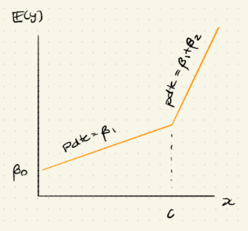

-   El MLR proporciona mayor flexibilidad para describir la relación entre la respuesta y las variables explicativas.

-   El reto ahora es cómo representar diversos predictores (variables explicativas / covariables) de manera adecuada. (este "problema" no se presentaba en SLR)

## Tipos de variables explicativas

-   numéricas

-   categóricas

-   La manera más sencilla de representar en un modelo de regresión a una variable numérica es asignar un coeficiente de regresión a esta variable, i.e.

    $$
    y = \beta_0 + \beta_1x + \text{ términos que no involucran a } x + \epsilon
    $$

En esta especificación, en una unidad de incremento en $x$ se espera un incremento en $y$ de $\beta_1$ unidades.

$$
y = \beta_0 + \beta_1(x+1) + \text{ términos que no involucran a } x + \epsilon
$$

-   Sin embargo, hay situaciones en las que la relación entre $x$ y $y$ [no]{.ul} parece ser lineal. Entonces, podría ser deseable "expedir" la función de regresión con potencias de $x$, llevando a una especificación que se conoce como regresión polinomial.

    $$
    y = \beta_0 + \beta_1x + \beta_2x^2 + ... + \beta_mx^m + \text{ términos que no involucran a } x + \epsilon
    $$

    Para algún $m \in \mathbb{N}_+$

-   En el modelo de regresión polinomialm no hay linealidad en $x$ sino en los primeros parámetros $\beta_j'^s$, por eso se considera un modelo lineal.

-   Una pregunta que surge naturalmente es cómo determinar el grado del polinomio, i.e. cómo determinar $m$. Lo estudiaremos más adelante mediante algunos métodos de selección de modelos.

### ¿Qué pasa con variables categóricas?

-   Hay que representarlas de manera cuantitativa, una manera de hacer esto es la siguiente

    -   Para una variable categórica con $r$ niveles i.e. con $r$ categorías ($r\geq 2$)m se necesita introducir $r-1$ variables indicadoras: $x_1, x_2, ..., x_{r-1}$ donde a cada una se le asigna un coeficiente de regresión (por separado), donde

        $$
        x_i = \begin{cases}
        1, \text{si la categoría es } i,\\
        0, \text{ c.o.c.}
        \end{cases}
        $$

    -   Ejemplo:

        $$
        x_{\text{cat}} \in \{\text{perro, caballo, gato}\}\\

        x_1 = \begin{cases}
        1, \text{si } x_{\text{cat}} \text{ es perro},\\
        0, \text{ c.o.c.}
        \end{cases}\\

        x_2 = \begin{cases}
        1, \text{si } x_{\text{cat}} \text{ es caballo},\\
        0, \text{ c.o.c.}
        \end{cases}
        $$

+---------------------------------+--------+--------+--------+---------+
| Nivel de la variable categórica | $$     | $$     | $$     | $$      |
|                                 | x_1    | x_2    | ...    | x_{r-1} |
|                                 | $$     | $$     | $$     | $$      |
+:===============================:+:======:+:======:+:======:+:=======:+
| $$                              | **1**  | 0      | $$     | 0       |
| 1                               |        |        | ...    |         |
| $$                              |        |        | $$     |         |
+---------------------------------+--------+--------+--------+---------+
| $$2$$                           | 0      | **1**  | $$     | 0       |
|                                 |        |        | ...    |         |
|                                 |        |        | $$     |         |
+---------------------------------+--------+--------+--------+---------+
| $$                              |        |        |        |         |
| ...                             |        |        |        |         |
| $$                              |        |        |        |         |
+---------------------------------+--------+--------+--------+---------+
| $$                              | 0      | 0      | $$     | **1**   |
| r-1                             |        |        | ...    |         |
| $$                              |        |        | $$     |         |
+---------------------------------+--------+--------+--------+---------+
| $$                              | 0      | 0      | $$     | 0       |
| r                               |        |        | ...    |         |
| $$                              |        |        | $$     |         |
+---------------------------------+--------+--------+--------+---------+

: El último renglón se conoce como **nivel base**

-   **Ejmplo:**

-   Si $x = \begin{cases} 1, \text{ para fumadores}\\ 0, \text{ para no fumadores} \end{cases}$ Si el estatus de consumo de tabaco es la única variable explicativa, la ecuación del modelo de regresión es:

    $$
    \mathbb{E}(y) = \beta_0 +\beta_1x = \begin{cases} 
    \beta_0 +\beta_1, \text{ para fumadores}\\
    \beta_0, \text{ para no fumadores} \end{cases}
    $$

-   **Observación:** [no]{.ul} es necesario **definir** una variable indicadora $x' = \begin{cases} 1, \text{ para fumadores}\\ 0, \text{ para no fumadores} \end{cases}$ para indicar a los no-fumadores. Si se definiera dicha variable que $x+x'=1$. Dicha relación lineal perfecta entre $x$ y $x'$ desestabilizará el proceso de estimación, esto se conoce como [colinealidad]{.ul} y se estudiará más adelante.

-   El nivel que se excluye en la descomposición en variables indicadoras se comoce como [nivel baseline]{.ul} ó [nivel de referencia.]{.ul}

-   Se se escoge a "no-fumador" como baseline, el coeficiente $\beta_0$ se puede interpretar como el valor de $\mathbb{E}(y)$ cuando la observación es "no-fumador" y $\beta_1$ captura la diferencia promedio en $\mathbb{E}(y)$ entre un fumador y un no-fumador.

-   Esta codificación del estatus de fumador [no]{.ul} es la única. Se puede asignar a "fumador" como un nivel baseline ó utilizar una codificación $-1/1$. Bajo diferentes codificaciones sus estimaciones parametrales y sus interpretaciones difierirán, aunque las [**predicciones serán las mismas.**]{.ul}

    -   Si el nivel baseline es "fumadores" $x' = \begin{cases} 0, \text{ para fumadores}\\ 1, \text{ para no fumadores} \end{cases}$ , la ecuación del modelo se convierte en:

        $$
        \mathbb{E}(y) = \alpha_0 + \alpha_1x = \begin{cases} \alpha_0, \text{ para fumadores}\\ \alpha_0 +\alpha_1, \text{ para no fumadores} \end{cases}
        $$

        En este caso, $\alpha_0$ es el valor esperado de la respuesta para fumadores y $\alpha_1$ representa el [incremento]{.ul} en $\mathbb{E}(y)$ para un no fumador, [**comparado con un fumador.**]{.ul}

    -   Para relacionar la estimación de parámetros en ambas codificaciones se usa el hecho de que $x' = 1-x$, entonces

        $$
        \mathbb{E}(y) = \alpha_0 + \alpha_1x' = \alpha_0 + \alpha_1(1-x)\\
        =\underbrace{(\alpha_0 + \alpha_1)}_{\beta_0} + \underbrace{(-\alpha_1)}_{\beta_1} x
        $$

        De aquí que $\hat{\beta_0} = \hat{\alpha_0} + \hat{\alpha_1}$ y $\hat{\beta_1} = -\hat{\alpha_1}$

    -   Sin importar si la codificación es $0/1$ ó $1/0$, las predicciones son las mismas:

        $$
        \bar{y} = \underbrace{\hat{\beta_0} + \hat{\beta_1} \cdot 1}_{\text{valor ajustado}\\ \text{bajo codificación 1/0}} = (\hat{\alpha}_0 + \hat{\alpha_1}) -  \hat{\alpha_1} = \hat{\alpha}_0 = \underbrace{\hat{\alpha_0} + \hat{\alpha_1} \cdot 0}_{\text{valor ajustado}\\ \text{bajo codificación 0/1}} \\
        \bar{y} = \underbrace{\hat{\beta_0} + \hat{\beta_1} \cdot 0}_{\text{valor ajustado}\\ \text{bajo codificación 1/0}}= \hat{\beta}_0 = \hat{\alpha}_0 + \hat{\alpha_1}  = \underbrace{\hat{\alpha_0} + \hat{\alpha_1} \cdot 1}_{\text{valor ajustado}\\ \text{bajo codificación 0/1}}\\
        \therefore \text{Las preicciones son las mismas}
        $$

-   Si se usa la codificación 1/-1 (en vez de 1/0 ó 0/1) entonces

    $$
    x^n = \begin{cases} 1 \text{ para fumadores,}\\ -1 \text{ para no fumadores}\\ \end{cases}
    $$

-   La ecuación del modelo se convierte en

    $$
    \mathbb{E}(y) = \gamma_0 + \gamma_1x'' = \begin{cases} \gamma_0 + \gamma_1 \text{ para fumadores,} \\ \gamma_0 - \gamma_1 \text{ para no fumadores}\end{cases}
    $$

-   Esta codificación 1/-1 tiene la "ventaja" de hacer al intercepto $\gamma_0$ el "promedio global" de $y$ para todos los individuos ognorando el efecto de fumado/no-fumador. Además $\gamma_1$ es la cantidad que los fumadores tienen adicional al promedio y $\gamma_1$ también es la cantidad que los no-fumadores tienen faltante al promedio.

-   Desde el punto de vista computacional, es conveniente seleccionar al nivel más común (la de mayor frecuencia) como el nivel baseline.

    -   Esto se debe a que se tendrá muvhos $0'^s$ en la matríz de diseño y será más fácil calcular $(\mathbb{X}^T\mathbb{X})^{-1}$

# Interacción

-   Hasta el momento, sólo se han considerado modelos en los que la relación entre la respuesta y la variable explicativas es aditiva.

    $$
    \mathbb{E}(y) = \beta_0 + \beta_1 x_1 + \beta_2 x_2
    $$

-   Sin embargo, también podemos hacer una especificación de la forma.

    $$
    \mathbb{E}(y) = \beta_0 + \beta_1 x_1 + \beta_2 x_2 +\beta_3 x_3
    $$

    -   Aquí $x_3 := x_1 x_2$ se conoce como variable de interacción y se le trata como una variable explicativa adicional con un coeficiente de regresión por separado $\beta_3$

    -   Obsérvese que, incrementar una unidad en x_1

        $$
        \beta_0 + \beta_1(x_1+1) + \beta_2x_2 +\beta_3(x_1+1)x_2\\
        = \beta_0 + \beta_1x_1+\beta_1 + \beta_2x_2 +\beta_3x_1+\beta_3x_2\\
        =\beta_0 + \beta_1x_1 + \beta_2x_2 +\beta_3x_1+(\beta_3x_2 +\beta_1)
        $$

    -   Equivalentemente

        $$
        \frac{d}{dx_1}\mathbb{E}(y) = \frac{d}{dx_1} (\beta_0 + \beta_1 x_1 + \beta_2 x_2 +\beta_3 x_1x_2) = \beta_1 +\beta_3x_2
        $$

    -   Es decir, el incremento es una unidad en $x_1$ incrementará a $\mathbb{E}(y)$ en $\beta_1 +\beta_3x_2$ (que depende de $x_2$)

    -   Por lo tanto, el impacto de cada $x$ varía con en valor tomado por la otra variable explicativa y se dice que $x_1$ y $x_2$ interactúan entre sí para afectar $\mathbb{E}(y)$.

# Interacción entre las variables explicativas continuas y categóricas

-   La interacción entre una variable categórica y una continua tiene una interpretación geométrica muy importante, que no se puede dar sólo con variables continuas.

-   Considérese un modelo MLR con una variable explicativa [continua]{.ul} $x_1$, una variable [binaria]{.ul} $x_2$ y una $x_1 x_2$. La ecuación del modelo es:

    $$
    \mathbb{E}(y) = \beta_0 + \beta_1x_1+\beta_2x_2+\beta_3x_1x_2\\
    = \begin{cases} 
    \beta_0 +\beta_1x_1, \text{ si }x_2 = 0\\
    (\beta_0 + \beta_2) + (\beta_1 + \beta_3)x_1, \text{ si }x_2 = 1
    \end{cases}
    $$

-   Se puede ver a éste como dos modelos SLR por separado: una para $x_2=0$ y otro para $x_2=1$.

-   Obsérvese que ambos modelos tienen diferentes interceptos y diferentes pendientes.

-   {width="516"}

-   ¿Qué pasa si $\beta_3 = 0$? Es decir, si no hay interacción. La ecuación de modelo se convierte en:

-   

    -   Para el grupo baeline (i.e. $x_2 = 0$). El incremento en una unidad es $x_1$ incremento a $\mathbb{E}(y)$ a $\beta_1$

    -   Para el grupo $x_2 = 1$. El incremento es una unidad en $x_1$ incrementa a $\mathbb{E}(y)$ en $\beta_1 + \beta_3$

-   Si $\beta_3 \neq 0$, el efecto de $x_1$ sobre $y$ difiere de acuerdo a si $x_2 = 0$ ó $x_2 = 1$ ... una manifestación de la interacción.

-   Si $\beta_3 = 0$, la interacción desaparece y simplemente se están ajustando 2 rectas paralelas (con diferentes interceptos) a los datos.

-   En $\mathbb{E}(y) = \beta_0 + \beta_1x_1 +\beta_2x_2 + \beta_3x_1x_2$ es poco común que

    $$
    \underbrace{\beta_3 \neq 0}_{\text{evidenciado por una estadística grande ó un p-value pequeño.}} \text{ y } \underbrace{\beta_1 = \beta_2 = 0}_{\text{con la comesp prueba estadística}}
    $$

-   Es decir, el efecto puede ser real pero el de $x_1$ y $x_2$ se insignificante. En este caso se apela a lo que se conoce como "principio jerárquico" y se incluye no sólo $\beta_3$ sino también $\beta_1$ y $\beta_2$ para facilitar la interpretación.

# Modelos de regresión lineal picewise

-   En ciertas aplicaciones puede ser deseable que la variable respuesta muestre cambios abiertos en el comportamiento sobre diferentes intervalos de la variable explicativa (que se conoce como "rompimiento estructural").

-   En el caso en el que una variable explicativa es categórica ya se explicó (un quiebre por cada nievel). Esto también se puede estudiar como una variable explicativa continua.

## Modelo 1.

-   Considérese un modelo de variable explicativa $x$.

-   Sea $z = 1_{\{x\geq c\}}$ para algún $c \in \mathbb{R}$.

-   Considérese la función de regresión:

    $$
    \mathbb{E}(y) = \beta_0 + \beta_1x + \beta_2 z(x-c)\\
    = \beta_0 + \beta_1x + \beta_2 (x-c)_+ \text{ donde } u_+ := \max\{u ,0\}\\
    =\begin{cases} 
    \beta_0 + \beta_1x \text{ si } x<c, \\
    (\beta_0 -\beta_2c) + (\beta_1 +\beta_2)x \text{ si } x\geq c
    \end{cases}
    $$

-   La pendiente de la función de regresión cambia abruptamente de $\beta_1$ a $\beta_1+\beta_2$ en $x=c$

-   Dicho modelo se puede ver como un modelo MLR con dos variables explicativas $x$ y $(x-c)_+$ y la inferencia se lleva a cabo como se hace normalmente.

-   Con este modelo se obtiene una sola función de regresión formada por 2 rectas conectadas continuamente en $x = c$ (que se conoce como kink [torcedura]). Por esta razón, a este modelo se le conoce como [modelo de regresión lineal pice wise.]{.ul}

-   {width="401"}

## Modelo 2

-   La función de regresión en un modelo de regresión lineal picewise no necesita ser continua.

-   Una función de regresión con saltos resultará de "interactuar" una variable explicativa continua $x$ con la variable dummy $z = 1_{\{x > c\}}$

-   La función de regresión es:

    $$
    \mathbb{E}(y) = \beta_0 + \beta_1x + \beta_2 z + \beta_3zx\\
    =\begin{cases} 
    \beta_0 + \beta_1x \text{ si }z = 0 \iff x<c, \\
    (\beta_0 +\beta_2c) + (\beta_1 +\beta_3)x \text{ si } z =1 \iff x\geq c
    \end{cases}
    $$

-   Que consiste en dos líneas rectas que generalmente no se conectan, divididas en $x = c$.

-   {width="418"}
