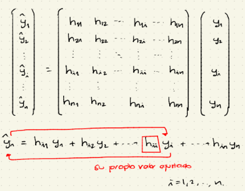
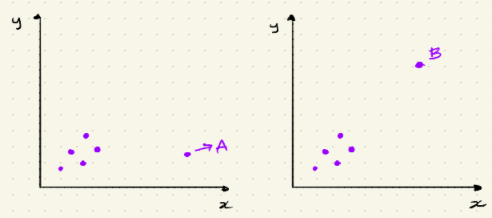

-   Raw-residual: $e_i = y_i - \hat{y}_i$ idealmente, éste aproxima a $\epsilon_i$ (no observable). Refleja la cantidad de variación que está aún presente aún en el conocimiento de las variables explicativas.

-   Si el modelo se ajusta adecuadamente, los residuales deben ser structure-less.

-   Si $|e_i|$ es "grande" [no]{.ul} hay un buen ajuste de modelo

    $$
    |e_i|\text{ grande } \rightarrow \text{Mal ajuste del modelo}\\
    \text{¿Qué tan grandes?}
    $$

-   Para todo $i \in \{1, ..., n\}$

    $$
    Var(\epsilon_i) = \sigma ^ 2\\
    Var(e_i) = \sigma ^ 2(1-h_{ii})
    $$

    -   Se puede ver esto de forma matricial

        $$
        e = y -\hat{y} = y - \mathbb{X}\hat{\beta} = y - \underbrace{[\mathbb{X}(\mathbb{X}^T\mathbb{X})^{-1}\mathbb{X}^T]}_{\mathbb{H}}y\\
        = y - \mathbb{H}y\\
        =\underbrace{(I-\mathbb{H})}_{\text{simétrica e idempotente}}y
        $$

-   $\mathbb{H} = \mathbb{X}(\mathbb{X}^T\mathbb{X})^{-1}\mathbb{X}^T \rightarrow$ [matriz sombrero.]{.ul}

-   $Var(e) = (I - \mathbb{H})\sigma ^2 I (I-\mathbb{H})^T = \sigma^2(I-\mathbb{H})(I-\mathbb{H})^T$

-   $Var(e_i) = \sigma^2(1-\underbrace{h_{ii}}_{\text{leverage}}) \rightarrow$ Leverage grande $\Rightarrow$ Varianza baja.

-   A $h_{ii}$ se le conoce como leverage para la observación $i$.

-   Como $\sigma^2$ es desconocido, se puede estimar a partir del MSE $\sigma^2$

    $$
    \hat{Var}(e_i) = S^2(1-h_{ii}), i = 1, 2, ..., n
    $$

## Residuales estandarizados y studentizados

-   Los raw-residuals [no]{.ul} son comparables entre sí y [no]{.ul} es fácil interpretarlos directamente.

-   [Residuales estandarizados]{.ul}

    $$
    e^{st}_{i} := \frac{e_i}{\sqrt{S^2(1-h_{ii})}}
    $$

    -   Si el modelo de regresión es correcto, los $e^{st}_{i}´^s$ tienen aproximadamente la misma varianza (esto los hace comparables) y aproximadamente tienen distribución normal/gaussiana estándar.

        $$
        e^{st}_{i} \dot{\backsim} N(0,1)
        $$

-   [Residuales studendizados]{.ul}

    $$
    e^{stud}_{i} := \frac{e_i}{\sqrt{S_{(i)}^2(1-h_{ii})}}
    $$

    donde $S_{(i)}^2$ es el MSE del modelo de regresión con la i-ésima observación excluida

    $$
    e^{stud}_{i} \backsim t_{n-(k+1)} \text{ (exacto)}
    $$

-   El uso de $S^2_{(i)}$ quita el efecto de la i-ésima observación; de esta forma la i-ésima observación afecta al numerador de $e_i^{stud}$ [no]{.ul} su denominador.

## Identificación de outliers

-   $\hat{y}_i$ es extremo si

    $$
    |e^{st}_i| = 
    \begin{cases}
    \geq2, \text{ Frees}\\
    \geq 3, \text{ James estad} 
    \end{cases}
    $$

-   ¿Qué hacer con outliers?

    -   

        (i) Borrarlo

    -   

        (ii) Conservarlo pero comentarlo

    -   

        (iii) Hacer el modelo con y sin el outlier

## Detección de relaciones no-lineales omitidas

-   Si el modelo de regresión se especificó adecuadamente, los residuales no deben mostrar patrones regulares.

-   Se puede graficar $e$ (vertical) v.s. algún predictor $x_j$

    -   Si hay patrón sistemático es indicacción de que se requiere usar información adicional para mejorar el modelo.

-   **Ejemplo**

    En un SLR $y = \beta_0 + \beta_1x + \epsilon$ la gráfica $e$ v.s. $x$ muestra forma de $U$ sugiere que los residuales son cuadráticos en $x$. Es decir

    $$y -\beta_0 - \beta_1 \thickapprox e \thickapprox \underbrace{\gamma_0 + \gamma_1 x +\gamma_2x^2}_{\text{patrón cuadrático}} \\
    \Rightarrow y \thickapprox (\beta_0 + \gamma_0) + (\beta_1+\gamma_1)x + \gamma_2x^2\\
    \text{que es un modelo de regresión cuadrático}$$

## Puntos de influencia

-   **Definición.** Se dice que una observación muestral es un punto de influencia si su exclusión del análisis de regresión lleva a conclusiones diferentes a aquellas a las que se llegó en su presencia.

-   Se estudiarán 2 métodos para evaluar la influencia de cada observación sobre los resultados del modelo global.

    -   

        (i) Leverage

    -   

        (ii) Distancia de Cook

-   El vector de LSE's es $\hat{\beta} = (\mathbb{X}^T\mathbb{X})^{-1} \mathbb{X}\mathbb{Y}$

    $$
    \hat{\mathbb{Y}} = \mathbb{X}\hat{\mathbb{\beta}} =\mathbb{X}[(\mathbb{X}^T\mathbb{X})^{-1}\mathbb{X}^T\mathbb{Y}] = \mathbb{H}\mathbb{Y}\\
    \mathbb{H} = \mathbb{X}(\mathbb{X}^T\mathbb{X})^{-1}\mathbb{X}^T \rightarrow \text{ matríz sombrero}\\
    \hat{\mathbb{Y}} = \mathbb{H}\mathbb{Y} \text{ "Se multiplica a } \mathbb{Y} \text{ por } \mathbb{H} \text{ para llegar a } \hat{\mathbb{Y}}
    $$

    {width="525"}

### Leverage

-   $h_{ii}$ : Leverage de la i-ésima observación. Representa el "leverage" (pero ó ponderación) que el i-ésimo valor respuesta ejerce sobre su propio valor ajustado.

    -   Mientras más grande es $h_{ii}$, mayor es la influencia que $y_i$ ejerce sobre $\hat{y}_i$.

    -   $Var(e_i) = \sigma^2(1-h_{ii})$. Mientras más grande sea $h_{ii}$, m{as pequeño será el valor de $Var(e_i)$ y $\hat{y}_i$ tenderá a ser $y_i$

    -   Si $h_{ii} = 1$, $\hat{y}_i$ estará forzado a ser $y_i$

-   $h_{ii}$ se obtiene de $\mathbb{H} = \mathbb{X}(\mathbb{X}^T\mathbb{X})^{-1}\mathbb{X}^T$ i.e. sólo usa a las variables explicativas, [no]{.ul} a las variables respuesta.

    -   El leverage es una medida de la influencia de una observación sobre el modelo solamente en términos de sus variables explicativas.

-   Se puede demostrar que

    $$
    h_{ii} \in \bigg[\frac{1}{n}, 1\bigg]\\
    \sum_{i = 1}^{n} h_{ii} = k+1 \text{, } k \text{ es el número de variables explicativas.}\\
    \\
    \text{El laverage promedio es } \bar{h} = \frac{k+1}{n}
    $$

-   Regla de dedo de Frees

    Una observación tiene un leverage alto si

    $$
    h_{ii} > 3\bar{h} = \frac{3(k+1)}{n}\\
    \text{Laverage para SLR : } y = \beta_0 + \beta_1 x + \epsilon\\
    h_{ii} = \frac{1}{n} + \frac{(x_i - \bar{x})^2}{S_{xx}}\\
    \text{"miestras más lejos esté } x_i \text{ de } \bar{x} \text{,  más grande será el leverage } h_{ii} \text{"}
    $$

-   Tanto para SLR y MLR, el leverage es una medida de lejanía (remoteness) de una observación de las observaciones restantes, en el espacio de las variables explicativas.

-   El leverage es un reflejo de la influencia de la observación, pues proporciona una "posible razón" para que una observación sea de influencia: ésta involucra variables anómalas de las variables explicativas (está "lejana" del resto de las variables explicativas).

#### **Importante**

Una observación con leverage alto [no]{.ul} necesariamente es de influencia.

"Un punto de leverage alto puee o no ser de influencia"

{width="535"}

-   Los puntos A y B tienen leverage alto pues están lejos del resto de las observaciones

-   Pero sólo el punto A es de influencia pues las rectas de regresión con el punto A y sin el punto A, serán muy diferentes.

### Distancia de Cook

Una sugerencia para que un punto sea de influencia es que no sólo sea outstanding en los valores de $x$ si no también en los de $y$.

La distancia de cook es una medida que combina ambas dimensiones.

Una manera directa de evaluar la influencia de las observaciones individuales es estudiar los cambios en la varibale respuesta ajustada si se elimina dicha observación.

Supóngase que se elimina la i-ésima observación y se ajusta un modelo de regresión con las $n-1$ observaciones restantes.

$$
\hat{y}_{j(i)}: \text{ valor ajustado de } \hat{y} \text{ calculado en ausencia de la observación } i
$$

-   Mientras más grande sea $\hat{y}_j - \hat{y}_{j(i)}$, más influencial será la observación $i$

#### Distancia de cook

$$
D_i = \displaystyle \frac{\sum_{j=1}^n (\hat{y}_j - \hat{y}_{j(i)})^2}{(k+1)S^2}
$$

Donde $S^2$ es el MSE calculado con el data-set completo

-   $D_i \dot{\backsim}F$ (que sirve para probar valores grandes o pequeños de $D_i$)

-   Frees sugiere que $D_i > \frac{1}{n}$ significa que la observación $i$ es de influencia.

-   La definición de la distancia de cook requiere que se ajuste una regresión en $(n+1)$ data-sets:

    -   1 en el data-set completo (para obtener $S^2$)

    -   $n$ para cada uno de lo data-sets que excluye a la observación $i$, para calcular los $\hat{y}_{j(i)}'^s$.

-   Hay una fórmula algebraicamente equivalente pero computacionalmente más eficiente.

    $$
    D_i = \frac{1}{k+1}(e_i^{st})^2\frac{h_{ii}}{1-h_{ii}}
    $$ solo requiere realizar una regresión sobre todos los datos.

-   En esta expresión es evidente el impacto de la respuesta $y_i$ (a través de $e_{i}^{st}$) y de las covariables $x$ (a través de $h_{ii}$).

-   Para que la distancia de Cook sea grande tiene que ocurrir tanto que $e_{i}^{st}$ sea grande, así como $h_{ii}$, i.e. la observación es outstanding con respecto a los valores de $x$ y los valores de $y$.
