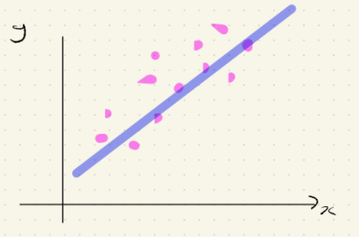
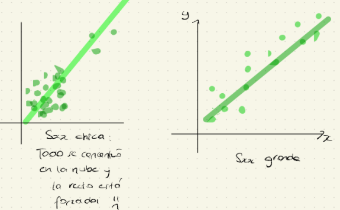
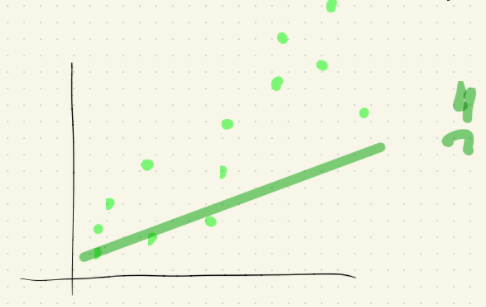

# Modelos lineales

Es una técnica supervisada. La respuesta será $y$ mientras que las variables explicativas, predictivas o covariables se denotarán por $x_1, x_2, ..., x_p$. La familia de los modelos lineales es muy versátil.

## Regresión clásica

$$
y = \beta_0 + \beta_1 x_1 + ... + \beta_p x_p
$$

Hay una relación lineal entre $y$ y $x_1, x_2, ..., x_p$

## Modelos lineales generalizados

$$
g(y) = \beta_0 + \beta_1 x_1 + ... + \beta_p x_p
$$

Donde $g$ es una función.

Ejemplos por excelencia de este tipo de rtegresión:

-   Regresión logística.

-   Regresión Poisson.

## Modelos generalizados aditivos (GAM's)

$$
y = \beta_0 + \beta_1 g(x_1) +\beta_2 g(x_2) + ... + \beta_p g(x_p)
$$

En general nos interesan al menos 5 cosas (independientemente del modelo lineal a trabajar).

1.  ¿Cómo se estiman las $\beta ' ^s$?

2.  ¿Algunas propiedades que tienen los estimadores $\hat{\beta}'^s$?

    -   Insesgado

    -   Varianza

    -   Intervalo de confianza

3.  Predicción $\hat{y}_i$

4.  Bondad de ajuste, es decir ¿$y_i \approx \hat{y_i}$?

5.  ¿Cuáles de entre $x_1, ..., x_p$ son importantes para determinar la relación con $y$? Selección de variables o feature engineering.

# Regresión Lineal Simple

## Suposiciones del modelo

El modelo SLR (Simple Linear Regression) se basa en algunas suposiciones:

$$
y_i = \beta_0 + \beta_1x_i + \epsilon_i,\\ i = 1,...,n\text{ es decir, el número de observaciones es }n
$$

$y_i'^s$ son realizaciones de variables aleatorias. Los valores $x_i$ son no-aleatorios.

Las cantidades $\epsilon_1, ..., \epsilon_n$ representan errores aleatorios que son independientes entre sí y además:

-   $\mathbb{E}(\epsilon_i) = 0, i = 1,...,n$

-   $Var(\epsilon_i) = \sigma^2$ Conocida como **Hipótesis de homocedasticidad.**

Bajo estos supuestos se tiene que

-   $\mathbb{E}(y_i) = \beta_0 + \beta_1x_i$

-   $Var(y_i) = Var(\beta_0 + \beta_1x_i + \epsilon_i) = Var(\epsilon_i)  = \sigma^2$

Cosas que ya deberíamos saber:

[Estimación de $\beta_0$ y $\beta_1$ por mínimos cuadrados.]{.ul}

$$
SS(\beta_0, \beta_1) := \sum_{i=1}^n[\underbrace{y_i}_{\text{observado}} - \underbrace{(\beta_0 + \beta_1x_i)}_{\text{Supuesto}}]^2
$$

-   Se seleccionan $\beta_0, \beta_1$ de tal forma que se minimice $SS(\beta_0, \beta_1)$ (lo cual es un problema clásico de optimización).

$$
\hat{\beta}_1 = \frac{\displaystyle \sum_{i=1}^n(x_i - \bar{x})(y_i - \bar{y})}{\displaystyle \sum_{i=1}^n(x_i - \bar{x})^2} = \frac{S_{xy}}{S_{xx}}
$$

$$
\hat{\beta}_0 = \bar{y} - \hat{\beta_1}\bar{x}
$$

donde

$$
S_{xy} = \displaystyle \sum_{i=1}^n(x_i - \bar{x})(y_i - \bar{y}) = \displaystyle \sum_{i=1}^n x_iy_i - n\bar{x}\bar{y}\\
S_{xx} = \displaystyle \sum_{i=1}^n(x_i - \bar{x})^2 = \displaystyle \sum_{i=1}^n x_i^2 - n\bar{x}^2
$$

Una propiedad interesante de estos estimadores es la siguiente

$$
\hat{\beta}_1 = r_{xy}\frac{S_y}{S_x}
$$

donde

$$
S_y := \displaystyle \sqrt{\frac{1}{n-1} \sum_{i=1}^{n}(y_i-\bar{y})^2 }\\
S_x := \displaystyle \sqrt{\frac{1}{n-1} \sum_{i=1}^{n}(x_i-\bar{x})^2 }\\
\text{Coeficiente de correlación muestral entre }x \text{ y } y:\\
r_{xy} = \frac{S_{xy}}{\sqrt{S_{xx} S_{yy}}}
$$

Este resultado "justifica" el caso de la correlación como medida de asociación lineal y el dibujo que nos encanta ❤️

{width="503"}

Ya con estos $\hat{\beta}_0$ y $\hat{\beta}_1$ en la mano, podemos definir $\hat{y}_i = \hat{\beta}_0 + \hat{\beta}_1 x_i$ como el ajustado y también los residuales como

$$
\hat{\epsilon}_i = e_i := y_i - \hat{y}_i
$$

**Importante**

$$
\text{Residuales} \neq \text{Errores aleatorio}\\
\underbrace{e_i}_{\text{Calculables, reales}}
\space \space \space \space \space \space\space\space\space
 \underbrace{\epsilon_i}_{\text{Variables aleatorias}\\\text{no observables}}
$$

En los cursos se demuestra que

-   $\displaystyle \sum_{i=1}^n e_i = 0$

-   $\displaystyle \sum_{i=1}^n x_ie_i = 0$

Para hacer inferencia, tenemos que hacer algunas suposiciones, la más común es $\epsilon_i \sim N(0, \sigma^2)$ y además que $\epsilon_1, \epsilon_2, ..., \epsilon_n$ son i.i.d's.

Esta suposición nos lleva a que

$$
y_i \sim N(\beta_0 + \beta_1x_i, \sigma^2)
$$que es algo fuerte de suponer.

Tenemos que "evaluar" qué tan bueno es el modelo, es decir, si incorporar a la variable $x$ para explicar $y$ es valioso. Entonces

$$
\underbrace{\displaystyle \sum_{i=1}^n (y_i - \hat{y}_i)^2}_{\text{Modelo de}\\ \text{regresión}} < \underbrace{\displaystyle \sum_{i=1}^n (y_i - \bar{y}_i)^2}_{\text{Modelo naive}\\ \text{iid}}
$$

Una descomposición popular es:

$$
y_i - \bar{y} = y_i - \hat{y}_i + \hat{y}_i - \bar{y} \\
$$

$$
\Rightarrow \text{ (Se demuestra)} \\
$$

$$
\underbrace{ \displaystyle \sum_{i=1}^n (y_i - \bar{y})^2}_{\text{TSS}} = \underbrace{ \displaystyle \sum_{i=1}^n (y_i - \hat{y}_i)^2}_{\text{RSS ó}\\
\text{Error S}} + \underbrace{ \displaystyle \sum_{i=1}^n (\hat{y}_i - \bar{y})^2}_{\text{Reg SS}}
$$

### TSS: Total SS

-   $\displaystyle \sum_{i=1}^n (y_i - \bar{y})^2 = (n-1) S_y^2$

-   Variación de la respuesta con respecto a su media muestral $\bar{y}$

-   Cantidad de variabilidad inherte en las respuestas antes de realizar la regresión.

### Residual SS ó Error SS

$$
RSS = \displaystyle \sum_{i=1}^n (y_i - \hat{y})^2 
$$

-   Variación de la respuesta con respecto a la rexta de regresión

    -   Mide la bondad de ajuste de LSR. Mientras más bajo, mejor $\downarrow$ 😄

    -   Mide la cantidad de variabilidad de la respuesta que [no]{.ul} es explicada aún despu+es de introducir $x$

### RegSS: Regression SS

-   $RegSS = \displaystyle \sum_{i=1}^n(\hat{y}_i - \bar{y})^2$

    -   Variación explicada por el modelo SLR i.e. el conocimiento de $x$ v.s. el deconocimiento de $x$.

    -   Mide qué tan efectivo es el modelo SLR en explicar la variación en $y$. (Incorporar $x$ v.s. [no]{.ul} incorporar $x$).

-   Trivialmente $RSS < TSS$

-   Como $TSS$ permanece fijo, mientras más grande sea $RegSS$, más pequeño será $RSS$

    $$
    RegSS \text{ grande & } RSS \text{ pequeño } \rightarrow \text{ fue buena idea introducir }x 
    $$

    Lo anterior motiva la definición de $R^2$ a.k.a. **coeficiente de determinación**

    $$
    R^2 := \frac{RegSS}{TSS} = 1- \frac{RSS}{TSS}
    $$

    Se requiere que $R^2$ sea lo más cercano posible a 1.

-   Mientras más grande sea el valor de $R^2$, más efectiva será la recta de regresión en reducir la varianza de $y$.

En SLR hay relaciones entre $\hat{\beta}_1$ y $RSS$

-   $RegSS = \hat{\beta}_1^2 S_{xx}$

-   $RSS = S_{yy} - \hat{\beta}_1^2S_{xx}$

Como $S_{xx}$ no cambia, entonces si $\hat{\beta}_1$ es grande, sucede que $RegSS$ es grande y por tanto fue buena idea introducir $x$.

También se puede demostrar que en SLR

$$
R^2 = \underbrace{r_{xy}^2}_{\text{Cuadrado del}\\ \text{coeficiente de}\\ \text{Correlación} \\ \text{muestral}} = \bigg(\frac{S_{xx}}{\sqrt{S_{xx}\cdot S_{yy}}}\bigg)^2
$$

Otra cantidad popular en el análisis de regresión es

$$
\boxed{MSE := \frac{RSS}{n-2} = \frac{\displaystyle \sum_{i=1}^ne_i^2}{n-2} =: S^2} 
$$

Además $S^2$ es un estimador insesgado de $\sigma^2$, es decir $\mathbb{E}(S^2) = \sigma^2$

Para probar formalmente si $RegSS = \displaystyle \sum_{i = 1} ^n ( \hat{y}_i - \bar{y})^2$ es suficientemente grande, se lleva a cabo

### La prueba F

$$
\underbrace{H_0: \beta_1 = 0}_{\text{agregar } x \text{ no} \\ \text{redujo la variabilidad} \\ \text{de }y} \space \space \space \space \space \space \space H_a: \beta_1 \neq 0
$$

Estadística de prueba $F := \frac{RegSS/1}{Rss/(n-2)}$

Sea $F_{1, n-2, \alpha} \in \mathbb{R}$ tal que $\mathbb{P}(F_{1,n-2}> \underbrace{F_{1, n-2, \alpha}}_{\text{upper cuantil}}) = \alpha$

#### Regla de decisión

-   Si $\underbrace{F}_{\text{estadística}\\ \text{de prueba}} > F_{1, n-2, \alpha}$ entonces se rechaza $H_0$

-   O bien a través del $p-value$

    $$
    \text{Si } \mathbb{P}(F_{1,n-2} > F) < \alpha, \text{ entonces se rechaza } H_0
    $$

    -   Mientras más pequeño sea el $p-value$, se tendrá evidencia más fuerte para rechazar $H_0$

Una relación "bonita" entre $F$ y $R$ (en SLR)

$$
F = \frac{RegSS/1}{Rss/(n-2)} = (n-2)\frac{R^2}{1-R^2} = (n-2)\frac{r_{xy}^2}{1-r_{xy}^2}\\
\text{Obs: la aplicación } R^2 \mapsto F = (n-2)\frac{R^2}{1-R^2} \text{ es creciente.}
$$

## Propiedades de $\hat{\beta_0}$ y $\hat{\beta_1}$

-   Si $\epsilon \sim N(0, \sigma^2)$, entonces $\hat{\beta_0}$ y $\hat{\beta_1}$ tienen también distribución Gaussiana:

    $$
    \mathbb{E}(\hat{\beta_0}) = \beta_0\\
    \mathbb{E}(\hat{\beta_1}) = \beta_1\\
    \text{Es decir que son estimadortes insesgados}\\
    Var(\hat{\beta_0}) = \sigma^2 \bigg(\frac{1}{n} + \frac{\bar{x}^2}{S_{xx}}\bigg) \\
    Var(\hat{\beta_1}) = \frac{\sigma^2}{S_{xx}}\\
    Cov(\hat{\beta_0}, \hat{\beta_1}) = \frac{-\bar{x}\sigma^2}{S_{xx}}
    $$

-   Las desviaciones estándar estimadas de $\hat{\beta_0}$ y $\hat{\beta_1}$ se denotan como $SE(\hat{\beta_0})$ y $SE(\hat{\beta_1})$, respectivamente y se conocen como errores estándar.

    -   Son medidas de la confiabilidad ó precaución de los LSE´s

    -   De donde

        $$
        SE(\hat{\beta_0}) = \sqrt{S^2 \bigg(\frac{1}{n} + \frac{\bar{x}^2}{S_{xx}}\bigg)} \\
        SE(\hat{\beta_1}) = \sqrt{\frac{S^2}{S_{xx}}}
        $$

        1.  $S^2 \mapsto SE(\hat{\beta}_0^2)$ es creciente.

        2.  $S^2 \mapsto SE(\hat{\beta}_1^2)$ es creciente.

        3.  $S_{xx} \mapsto SE(\hat{\beta}_0^2)$ es decreciente.

        4.  $S_{xx} \mapsto SE(\hat{\beta}_1^2)$ es decreciente.

            Recordemos que $S_{xx} = \displaystyle \sum_{i=1}^n(x_i-\bar{x})^2$

    -   Lo anterior graficamente se puede ver así

        

    -   Los errores estándar serán pequeños si las observaciones muestran gran tendencia a estar cerca de la recta de regresión [y]{.ul} si los valores observados de la variable explicativa (i.e. $x$) están más "dispersos" a lo largo del eje $x$ (es decir, $S_{xx}$ grande).

    -   Puede suceder que exista más dispersión pero eso no es garantía de un "buen ajuste".

        

### Intervalos de confianza para $\beta_j$

A partir de los errores estándar ya definidos, se puede demostrar que los intervalos del $(1-\alpha)\%$ de confianza para $\beta_j$ es:

$$
\hat{\beta}_j \pm \underbrace{t_{n-2, \frac{\alpha}{2}}}_{\text{upper cuantil}\\ \text{al nivel } \frac{\alpha}{2} \text{ de una} \\ \text{distribución } t_{(n-2)}} \cdot SE(\hat{\beta}_j), \space \space \space \space \space i = 0,1
$$

En general se pueden plantear hipótesis de la siguiente manera:

1.  $H_0: \beta_j = d$ v.s. $H_1: \beta_j \neq d$
2.  $H_0: \beta_j = d$ v.s. $H_1: \beta_j > d$
3.  $H_0: \beta_j = d$ v.s. $H_1: \beta_j < d$

Donde $d \in \mathbb{R}$ especificado por el usuario.

Para este tipo de contraste usábamos la **prueba** $t$.

$$
t(\hat{\beta}_j) = \frac{\hat{\beta}_j - d}{SE(\hat{\beta}_j)}, \space \space \space \space  \space \space j = 0,1 
$$
