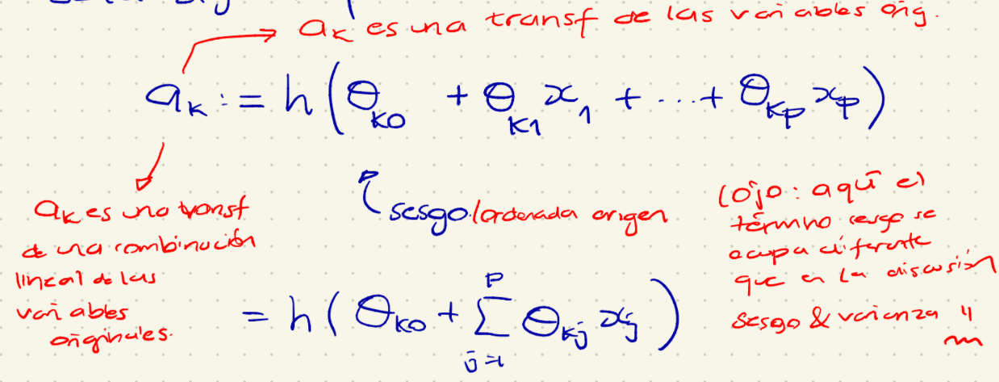
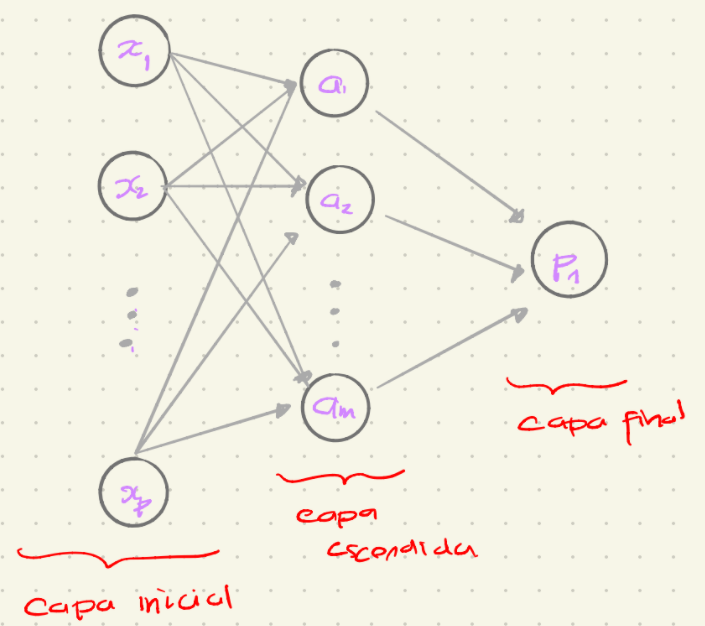
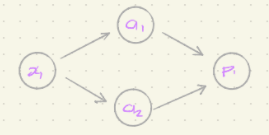
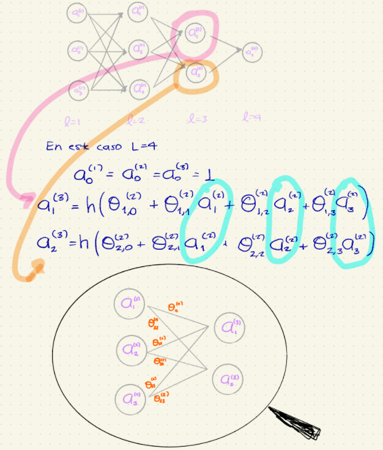

-   Considérese un problema de clasificación binaria $G=0$ ó $G=1$, a partir de las covariables $x_1,...,x_p$

-   Cuando se estudió regresión polinomial e interacciones, básicamente se consideró una [transformación de las variables originales existentes]{.ul}. Con esta idea en mente, se pueden construir [$m$ nuevas entradas]{.ul} de la siguiente forma:

    {width="650"}

    para $k = 1, 2, ..., m$. Donde $h(\cdot)$ una función adecuada (que se especificará más adelante) y por supuesto $\theta_{k0}, \theta_{k1}, ..., \theta_{kp}$ son parámetros que eventualmente se tendrán que estimar.

-   Ahora se modelará la probabilidad de clase 1 a partir de regresión logística pero en ves de usar las variables originales $x_1, ..., x_p$, se usan estas variables derivadas $a_1, ..., a_m$

    $$
    P_1(\underline{x}) = logit(\beta_0 + \beta_0 a_1 + ... + \beta_ma_m) \\
    \text{Donde a } a_1, ..., a_m \text{ se conocen como nuevas variables o variables derivadas.}
    $$

    Se puede representar esto mediante un grafo dirigido

    {width="580"}

-   La función $h(\cdot)$ debe ser [no-lineal]{.ul}; ya que si fuera lineal, en realidad no se estaría transformando (pues combinaciones lineales de combinaciones lineales son combinaciones lineales 😆).

-   Se puede demostrar que si se definen suficientes entradas derivadas (i.e. $m$ es suficientemente grande) entonces la función $P_1(\underline{x})$ puede aproximar cualquier función continua.

-   La función $h(\cdot)$ se conoce como [**función de activación.**]{.ul}

-   Algunos ejemplos de funciones de activación son;

    -   Tangente hiperbólica: $h(x) = \frac{e^{x}-e^{-x}}{e^{x}+e^{-x}}$

    -   ReLU (Rectified Linear Unit). $h(x) = \max\{0, x\}$

    -   Sigmoide: $h(x) = \frac{1}{1+e^{-x}} = \frac{e^{x}}{e^{x}+1}$

    -   Leaky ReLU: $h(x) = \max\{\frac{x}{10}, x\}$

    -   Step (heavyside) $h(x) = 1^x_{[0, \infty)} = \begin{cases} 1, \text{ si } x\geq 0, \\ 0, \text{ si } x < 0\end{cases}$

**Tareita:** Revisar el artpiculo Cybento, G(1989). "Approximations by superpositions of sigmoidal functions". Mathematics of control, Signals and Systems 303-314. **Reporte:**

-   Este procedimiento se basa en el [Teorema de Aproximación Universal]{.ul}, que en su versión simple, establece que cualquier función se puede aproximar mediante superposición de funciones tipo sigmoide.

-   **Ejemplo:**

    Considérese una arquitectura muy sencilla

    {width="414"}

Es decir, sólo se tiene una variable explicativa $x_1$ y se derivarán 2 nuevas variables $a_1, a_2$. Entonces, se hace una regresión logística para predecir $G = 1$ o $G = 0$

$$
p_1(x ; a_1, a_2) = logit(\beta_0 + \beta_1a_1 + \beta_2a_2)
$$

Donde

$$
a_1(x) := h(\beta_{10} + \beta_{11}x_1)\\
a_2(x) := h(\beta_{20} + \beta_{21}x_1) 
$$

con $h(\cdot)$ preestablecida. Para este ejemplo, supóngase que $h(x) = \frac{1}{1+ e^{-x}}$

**Observación:** En esta especificación, hay 7 parámetros, que eventualmente tendrán que estimar: $\beta_0, \beta_1, \beta_2, \beta_{10}, \beta_{11}, \beta_{20}, \beta_{21}$ ¿Cómo estimar estos $\beta'^s$?

-   Como se está con un problema de clasificación, se estimarán estos parámetros [minimizando la devianza]{.ul} ó devianza regularizada

    El problema de optimización se escribe fácil, pero no es sencillo de resolver.

    -   ¿Existe solución?

    -   Si existe, ¿es única?

    -   ¿Cómo encuentro la solución?

        -   ¿Analíticamente?

        -   ¿Numéricamente?

## Feeed forward

-   Se generalizará esta idea de aproximar la respuesta para definir la arquitectura básica de una red neuronal.

-   A las variables originales se les conoce como [capa de entrada]{.ul} de la red.

-   A la variable de salida se le conoce como [capa de salida.]{.ul}

-   A las capas inmediatas se les conoce como [capas ocultas.]{.ul}

-   Cuando hay todas las conexiones de una capa a la otra se dice que la red es [competamente conexa.]{.ul}

-   Como se vio en el ejemplo, para hacer los cálculos en la red se empezará con la primera capa haciendo combinaciones lineales (operación suma) y posteriormente se aplica la función $h(\cdot)$ (función de activación).

    -   Una vez que se calculó la segunda capa, se calcula la 3era de la misma forma:

        -   Combinaciones lineales (operación suma).

        -   Aplicación de $h$ (función de activación).

-   **Notación:**

    -   $L$ número total de capas

        -   1 capa de entrada

        -   1 capa de salida

        -   $L-2$ capas ocultas

    -   $x = (x_1, ..., x_p)$, variables originales.

    -   $n_l$: número de unidades (neuronas / nodos) de la capa $l$ , $l = 1, ..., L$

    -   $a_j^{(l)}$: valor que toma la unidad $j$ de la capa $l, j = 0,1, ..., n_l, l = 1, 2, ..., L$

    -   Para cualquier $l \in \{1, 2, ..., L \}, a_0^{(l)} \equiv 1$ i.e. **es** el coeficiente de sesgo/"ordenada al origen".

    -   $a_j^{(l)} \equiv x_j$ (valores de la primera capa)

    -   $\theta_{i,k}^{(l)}$: Ponderación/coeficiente dela entrada $a_k^{(l-1)}$ en la entrada $a_i^{(l)}$

**Ejemplo**

{width="584"}

-   Para calcular los valores de salida de una red a partir de ponderaciones y datos de entrada, se usa el algoritmo [feed-forward]{.ul}

    -   Para la primera capa, se escriben las variables de entrada

        $$
        a_j^{(1)} := x_j, j=1,2,...,n_1, (n_1 = p)
        $$

    -   Para la segunda capa (ó la primera capa oculta)

        $$
        a_{j}^{(2)} = h\bigg( \theta_{_{j,0}}^{^{(1)}} + \theta_{_{j,1}}^{^{(1)}}a_1^{(1)} + ... + \theta_{_{j,n_1}}^{^{(1)}}a_{n_1}^{(1)} \bigg) =h\bigg( \theta_{_{j,0}}^{^{(1)}} + \sum_{k=1}^{n_1}\theta_{_{j,k}}^{^{(1)}}a_{k}^{(1)} \bigg)\\ j = 1,2,...,n_2
        $$

    -   Para la $l$-ésima capa

        $$
        a_{j}^{(l)} = h\bigg( \theta_{_{j,0}}^{^{(l-1)}} + \theta_{_{j,1}}^{^{(l-1)}}a_1^{(l-1)} + ... + \theta_{_{j,n_2}}^{^{(l-1)}}a_{n_2}^{(l-1)} \bigg) =h\bigg( \theta_{_{j,0}}^{^{(l-1)}} + \sum_{k=1}^{n_2}\theta_{_{j,k}}^{^{(l-1)}}a_{k}^{(l-1)} \bigg)\\ j = 1,2,...,n_l
        $$

    -   Para la capa final ó capa de salida (suponiendo un problema de clasificación binaria)

        $$
        p_1 = h\bigg( \theta_{_{1,0}}^{^{(L-1)}} + \sum_{k=1}^{n_{L-1}}\theta_{_{j,k}}^{^{(L-1)}}a_{k}^{(L-1)} \bigg)
        $$

        Cada capa se caracteriza por el conjunto de parámetros

        $$
        \Theta^{(l)} \in m^{(\mathbb{R})}_{ n_l\times n_{l-1}}
        $$ i.e. $\Theta^{(l)}$ es una matriz de $n_l \times n_{l-1}$

-   La red completa se caracteriza por:

    1.  El número de capas
    2.  El número de nodos de cada capa
    3.  Las matrices de ponderaciones/coeficientes en cada capa $\Theta^{(1)}, \Theta^{(2)}, ..., \Theta^{(L-1)}$

    **Ojo:** También se podría variar la función de activación en cada capa.

**Notación:** $a^{(l)} := (a_0^{(l)}, a_1^{(l)}, ..., a_{n_l}^{(l)})$ i.e. el vector de unidades de la capa $l$.

Entonces el algoritmo feed-forward en notación matricial es:

-   Capa 1: $a^{(1)} = x \in \mathbb{R}^p, i.e., n_1 = p$

-   Capa: 2: $a^{(2)} = h(\underbrace{\Theta^{(1)}}_{n_2 \times p} \underbrace{a^{(1)}}_{p\times1}) \in \mathbb{R}^{n_2}$

    -   **¡Ojo!:** Abuso de notación. $h$ se aplica componente a componente sobre los vectores correspondientes.

-   Capa $l$ (capa oculta)

    $$
    a^{(l)} = h(\underbrace{\Theta^{(1)}}_{n_l \times n_{l-1}} \space \space \space \underbrace{a^{(1)}}_{n_{l-1}\times1}) \in \mathbb{R}^{n_l}
    $$

-   Capa de salida:

    -   Para un problema de clasificación binaria

        $$
        a^{(L)} = p_1 = logit(\Theta^{(L-1)} a^{(L-1)})
        $$

    -   Para un problema de regresión

        $$
        a^{(L)} = \Theta^{(L-1)} a^{(L-1)}
        $$
