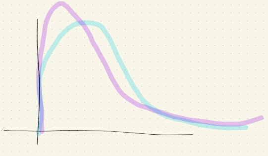
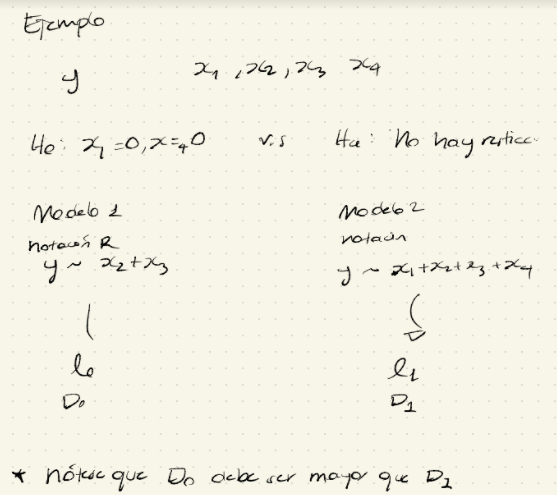

¿Por qué escoger la función link de esta forma? ¿Cómo la encontramos en general?

$$
\boxed{g(\mu) = \underline{x}^T\beta}
$$

**Hipótesis de la función link canónica**

$g(\mu) = \theta$ donde $\theta$ proviene de la parametrización como miembro de la familia exponencial. Lo anterior implica:

$$
g(\mu) = \theta \underbrace{\Rightarrow}_{\mu = b'(\theta) \\ \text{en familia} \\ \text{LED}} g(b'(\theta)) = \theta\\
\Rightarrow b'(\theta) = g^{-1}(\theta) \Rightarrow g(\theta) = (b'(\theta))^{-1}, \text{ donde -1 es de la función inversa.}
$$

Para obtener la función link canónica vemos, se debe cumplir que

$$
\boxed{g(\theta) = \bigg(b'(\theta)\bigg)^{-1}}
$$

**Ejemplos:**

1.  Si $Y \sim Poisson(\lambda)$, es decir, $f_Y(y) = \frac{e^{-\lambda}\lambda^y}{y!} 1_{\{0, 1, ...\}}^{(y)}$ ¿Y pertenece a la familia exponencial lineal? Sí

$$
\begin{align*}
\frac{e^{-\lambda}\lambda^y}{y!}  &= \exp\{-\lambda + y\log(\lambda) - \log(y!)\} = \exp\{y\theta - e^{\theta} - \log(y!)\} \\
&\text{Donde } \\
&\theta = \log(\lambda) \\
&b(\theta) = e^\theta\\
&\phi = 1 \\
&S(y, \phi) = -\log(y!) \\
\mathbb{E}(Y) &= b'(\theta) = e^\theta = e^{\log(\lambda)} = \lambda \text{ (como ya esperábamos}) \\
Var(Y) &= \phi\cdot b'(\theta)
\end{align*}
$$

En este caso, la función link canónica es

$$
b(\theta)  = e^\theta, b'(\theta) = e^\theta \\
\Rightarrow g(\theta) = \bigg(b'(\theta)\bigg)^{-1} = \log(\theta)
$$

2.  Si $Y \sim Bnlli(p)$, es ddecir $f(y) = p^y(1-p)^{1-y}$ ¿Pertenece a la familia exponencial lineal? Sí

    $$
    \begin{align*}
    f(y) &= p^y(1-p)^{1-y} = e^{y\log(p) + (1-y)\log(1-p)}\\
    &= \exp\bigg\{ y\big[\log(p) - \log(1-p)\big] + \log(1-p)\bigg\} \\
    &= \exp\bigg\{  y\log\bigg( \frac{p}{1-p}\bigg) + \log(1-p) \bigg\} \\
    &= \exp\bigg\{  \frac{y\theta-\log(1+ e^\theta)}{1} + 0 \bigg\} \\
    \text{De donde } \\
    \theta &= \log(\frac{p}{1-p}) \iff p = \frac{e^\theta}{ 1 + e^\theta} \\
    \Rightarrow \log(1-p) &= \log\bigg( 1- \frac{e^\theta}{ 1 + e^\theta} \bigg) = \log\bigg(\frac{1}{ 1 + e^\theta} \bigg) = -\log(1+e^\theta) \\
    b(\theta) &= \log(1+ e^\theta) \rightarrow b'(\theta) = \frac{e^\theta}{1+e^\theta}\\
    \therefore g(\theta) &= \bigg(b'(\theta)\bigg)^{-1} = \log\bigg(\frac{\theta}{1-\theta}\bigg)
    \end{align*}
    $$

### Gamma e Inversa Gaussiana

Cuando $Y$ se distribuye Gamma o Inversa Gaussiana, es decir, que su resultado es positivo "continuo" con un sesgo (ó ligero sesgo) hacia la derecha, tenemos lo siguiente:

#### Gamma

$$
b(\theta) = -\log(\theta) \\
b'(\theta) = -\frac{1}{\theta} \\
g(\mu) = -\frac{1}{\mu}
$$

#### Inversa Gaussiana

$$
b'(\theta) = (-2\theta)^{\frac{-1}{2}} \\
g(\mu) = \frac{-1}{2 \mu^2} \propto \frac{1}{\mu^2}
$$

{width="543"}

### Prueba de devianza

La prueba de hipótesis más popular para este caso es:

$$
H_0: \underbrace{\beta_1 = \beta_2 = ...= \beta_r = 0}_{\text{un subconjunto de variables}\\ \text{"explicativas" no tiene uso}} \space \space \space \space \space \space \space \space \space v.s. \space \space \space \space \space \space \space \space \space H_a: \text{No hay restricciones sobre los }\beta'^s 
$$

#### La estadística de prueba es:

$$
LST := 2(l_1 - l_0)
$$

Donde $l_1, l_0$ son las verosimilitudes bajo la hipótesis alternativa y nula, respectivamente.

-   Mientras más grande sea LRT (Likehood Ratio Test), más evidencia se tendrá en contra de $H_0$ (en favor de $H_a$)

-   Nótese que

    $$
    \begin{align*}
    LRT &= 2 (l_1- l_0) = 2(l_1 - l_{SAT} - l_0 + l_{SAT}) \\
    &= \underbrace{2(l_{SAT} - l_0)}_{\text{Devianza del} \\ \text{modelo en la} \\ \text{hipótesis nula}} - \underbrace{2(l_{SAT} - l_1)}_{\text{Devianza del} \\ \text{modelo en la} \\ \text{hipótesis alternativa}} \\
    &= D_0 - D_1
    \end{align*}
    $$

    A esta prueba se le conoce como **Prueba de diferencias de devianza** ó **Prueba de devianza.**

#### Región de rechazo

Bajo $H_0, LRT \sim \chi^2_{(r)}$. Se rechaza $H_0$ si $LRT_{obs} > \underbrace{\chi^2_{r, \alpha}}_{\text{upper cuantil} \\ \text{al nivel } \alpha}$

{width="589"}

Debe ser $D_0$ mayor a $D_1$ pues la estadística de prueba debe ser positiva, pues el modelo bajo $H_0$ es más restringido, por lo tanto, se aleja más del modelo saturado que bajo $H_a$.
