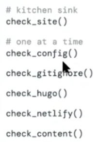

[Video 1](https://rstudio.com/resources/webinars/sharing-on-short-notice-how-to-get-your-materials-online-with-r-markdown/?s=09)

Requisitos:

-   Tener RStudio.
-   Tener material para compartir, el material es tipo académico y se trabajará con + archivos RMarkdown.
-   Tener ordenado el material de clase, compartir el material y llevar un curso reproducible son algunas de las ventajas al crear un sitio online que alberga tu material de clase.

## OPCIÓN 1. Un solo Rmd

**Pasos:**

1.  Crear un proyecto de R.

2.  Abrir el archivo RMarkdown en el proyecto.

3.  Usar Knit para obtener del RMarkdown un HTML. Que tenga el nombre "index"

4.  Guardar el proyecto, el RMarkdown y el HTML en una carpeta.

5.  Abrir [Netlify](https://app.netlify.com/drop)

6.  Arrastrar la carpeta en

    

La ventaja de esto es la facilidad en que se suben los archivos y se obtiene el link casi instantáneamente. El problema es que no es suficiente un link para UN archivo RMarkdown. Este es el [Resultado](http://unruffled-goldwasser-a5e326.netlify.app/).

## OPCIÓN 2. Varios Rmd

Para hacer una pagina un poco más elaborada simplemente se crea un proyecto de R donde se hagan las adecuaciones en los archivos de extensión yml que son style.yml, ahí se pueden agregar los RMarkdowns necesarios para poder realizar la página.

La desventaja es que se puede tener desorganización en la página porque no existe la opción de hacer subfolders. Pero sí aumenta el número de archivos en RMarkdown que se instalan.

**Pasos:**

1.  Crear un proyecto de R que tenga una extensión mywebsite_RMarkdown.

2.  Meter en la carpeta del proyecto los archivos Markdown deseados.

3.  Cargar con ctrl + shift + B la página.

4.  Modificar el archivo style.yml como en el ejemplo que hice.

    {width="472"}

5.  Hacer un drag and drop en Netlify así como en la opción 1 **peeero**  de la carpeta que se llama "\_site".

**Sin Distill:** <https://tutorialesmg.netlify.app/> 

**Página con distill:** <https://reverent-elion-c8f759.netlify.app/tutorial-de-git-y-github>

## OPCIÓN 3. Distill

Usar la paquetería **distill.**

1.  Instalar la paquetería "install.package("distill")" y luego cargarla "library(distill)"

2.  Modificar la **Opción 2** de la siguiente manera.

```{=html}
<!-- -->
```
1.  En el archivo rmd "index" se debe hacer:

    

```{=html}
<!-- -->
```
2.  En el archivo site.yml se hace lo siguiente:

    

**Página:** <https://dreamy-beaver-cd6aad.netlify.app/>

Si queremos que el sitio parezca un conjunto de posts en lista en vez de una barra de navegación hay que hacer lo siguiente:

1.  Crear un proyecto en RStudio con la siguiente característica:

    

2.  Usar la función "distill::create_post("Nombre del post que aparecerá en el blog")" para crear un archivo rmd que se quiera asociar a la página principal.

3.  **OJO:** debes hacer knit de todos los posts que vayas creando porque de otra manera no se construirá la página.

4.  Una vez que tengas los posts creados y la edición del blog distill, solo será necesario oprimir Build website como sigue:

    

5.  Para saber más sobre la personalización del Blog vemos la página: <https://rstudio.github.io/distill/>, <https://pkgs.rstudio.com/distill/> 

**Página:** <https://agitated-shannon-55ca93.netlify.app/> 

**Página tipo blog:** <https://distill-blogs.netlify.app/> 

## OPCIÓN 4. Bookdown

Usar "bookdown" que sirve para hacer libros en internet.

Ir a RStudio y crear un nuevo proyecto de R con la característica de RBookdow.

**Pasos:**

1.  Instalar "bookdown"

2.  Crear el proyecto anterior.

3.  Crear posts y numerarlos ó en el archivo \_bookdown.yml poner lo siguiente:

    

    donde rmd_files: permitirá que los archivos en el libro aparezcan en ese orden. 

**Resultado** (que se escribe por default al hacer el proyecto): <https://miprimerlibro.netlify.app/>

## OPCIÓN 5. Blogdown

El paquete "blogdown" usa el generador HUGO

**Pasos:**

1.  Instalar la paquetería "blogdown".

2.  Crear un proyecto en la sección:

    

3.  Vayamos descubriendo lo que sirve en este tipo de archivos.

4.  Este link contiene más información al respecto: <https://github.com/rstudio-education/sharing-short-notice>

5.  Con el comando: blogdown::new_post("Nuevo post", ext='.Rmd') creamos un nuevo post para la página.

**Resultado:** <https://pagina-con-hugo.netlify.app/>

Para más información, consulta <https://pkgs.rstudio.com/blogdown/> 

**Video 2:**

<https://www.youtube.com/watch?v=9DLBbQthhVQ> 

<https://alison.rbind.io/talk/2020-larug/?s=09>

### **Distill Personalización:**

### Themes.

**Pasos:**

1.  Crear un nuevo proyecto con Distill Website.

2.  Usar la función "create_theme(name = "larug")" 

3.  Checar la [documentación](https://rstudio.github.io/distill/?panelset=theme.css-snippet) para cambiar las fuentes en el archivo .css.

4.  Agregarlo en el archivo \_site.yml


5.  EXPLORAR

### **Blogdown Personalización:**

Un poco más completo que Distill pero menos sencillo por tanta cosa que hacer para los .css

**Pasos.**

1.  Checar los [temas de hugo](https://themes.gohugo.io/) para descargar alguno que te guste.

2.  En el minuto 45 del video dos se hablan de opciones para modificar la página del blogdown con HUGO en el archivo de .RProfile.

    

3.  También podemos usar las funciones de Check 



<https://merodemo.netlify.app/> ese tema me gusta

<https://themes.gohugo.io//theme/min_night/> y este también

<https://themes.gohugo.io/theme/hugo-theme-dimension/> este también

<https://themes.gohugo.io/theme/hugo-coder/> y este

\
\

\

\
