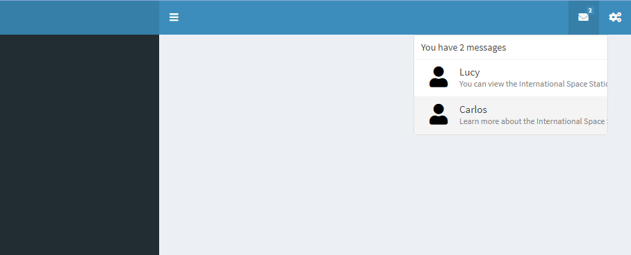
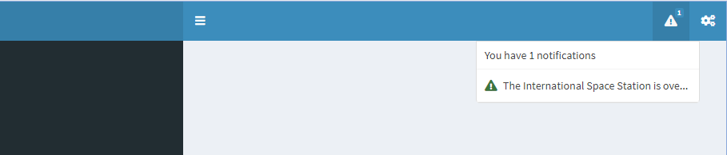
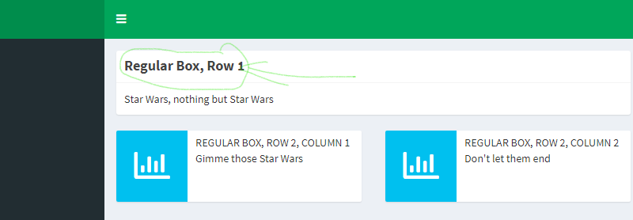

```{r, warning=FALSE, collapse=TRUE, message=FALSE}
#Paquetes a usar
library(shinydashboard)
library(shinydashboardPlus)
library("leaflet")

#Condiciones generales del Rmd
knitr::opts_chunk$set(eval = FALSE)
```

# 1. Estructura de ShinyDashboard

Es una página un poco más elaborada que shiny porque te permite tener múltiples accesos dado el panel de menú que se inserta del lado izquierdo.

Las partes que componen al Dashboard son dos: la interfás de usuario (ui) y el servidor (server).

La interfás de usuario (lo que el usuarioo puede ver y "tocar") se compone de tres cosas principalmente:

-   [Header](#head)

-   [Sidebar](#sidebar)

-   [Body](#body)

Cada una de las cuales se estudiarán en este documento.

Primero veamos en forma general cómo se compone un dashboard de Shiny:

```{r, eval = FALSE}
# El ui necesita ahora tres elementos principales
 header <- shinydashboard::dashboardHeader()
 sidebar <- shinydashboard::dashboardSidebar()
 body <- shinydashboard::dashboardBody()

#Generamos la interfás de usuario con esos elementos
ui <- shinydashboard::dashboardPage(skin = "green", header, sidebar, body)

#Creamos el servidor como siempre
server <- function(input, output){}

#Creamos la aplicación de shiny
shiny::shinyApp(ui, server)
```


## Header {#head}

En este apartado podemos poner diferentes cosas como el título de la app, pero además podemos añadir otras funcionalidades como:

### Messages

Para que el usuario del dashboard haga una recomendación sobre las cosas que puedes consultar para aclarar los conocimientos que aprenderás. El siguiente código solo contiene lo que debe de modificarse en el `header` para que aparezca de lado izquierdo los mensajes *que desees*.

```{r, eval=FALSE}
header <- dashboardHeader(
  #Con esta fucnión agregamos al menú un tipo de cosa en el header
  dropdownMenu(
    #Con este parámetro especificamos el tipo de cosa
    type = "messages",
    #Estta función permíte agregar los mensajes corresponientes
    messageItem(
      #Quién escribe el mensaje
        from = "Lucy",
      #Cuáles es el mensjae (o recomendación)
        message = "You can view the International Space Station!",
      #En dónde puedes encontrar la información necesaria.
        href = "https://spotthestation.nasa.gov/sightings/"
        ),
    #Como este mensaje aparece después, entonces aparecerá en segundo lugar.
    messageItem(
        from = "Carlos",
        message = "Learn more about the International Space Station", 
        href = "https://spotthestation.nasa.gov/faq.cfm"
        )
    )
)
```



### Notifications

Las notifiaciones tienen diversas fucnionalidades para poder añadir las cosas a la app.

Análogo a lo que sucede en mensajes, se puede hacer un tipo de COSA pero para notificar algo, por ejemplo:

```{r}
header <- dashboardHeader(
  dropdownMenu(
    type = "notifications",
    notificationItem(
      #La diferencia está en que el parámetro donde se
      #escribe la notificación, se llama "text" y no "mesage"
      text = "The International Space Station is overhead!"
      )
  )
)
```



### Bar of progress

Te dice cuál es el progreso de lo que va del curso.

Para finalizar (el entendimiento de las posibilidades para el header). veamos el siguiente código que nos devuelve una barra de progreso y un texto.

```{r}
header <- dashboardHeader(
  dropdownMenu(
    type = "tasks",
#Recuerda que es importante cambiar la función del Item a realizar según el
#tipo de cosa en el encabezado.
    taskItem(
    #El texto que indica sobre qué se mide el progreso.
    text = "Mission Learn Shiny Dashboard",
    #El valor del progreso (qué porcentaje se ha avanzado en esa cosa.)
    value = 10
    )
  )
)
```


### Las tres juntas (MNT)

```{r}
header <- dashboardHeader(
#Para los mensajes:
  dropdownMenu(
    type = "messages",
    messageItem(
        from = "Lucy",
        message = "You can view the International Space Station!",
        href = "https://spotthestation.nasa.gov/sightings/"
        ),
    messageItem(
        from = "Carlos",
        message = "Learn more about the International Space Station", 
        href = "https://spotthestation.nasa.gov/faq.cfm"
        )
  ),
  
#Para la notificación:
 dropdownMenu(
       type = "notifications",
       notificationItem(
       text = "The International Space Station is overhead!"
       )
  ),

#Para el task:
  dropdownMenu(
      type = "tasks",
      taskItem(
      text = "Mission Learn Shiny Dashboard",
      value = 10
      )
  )
)
```


### Comentarios: optimizar las líneas de código.

Posiblemente quieras agregar muchos mensjaes, notificaciones, o barras de progreso, tienes una lista predefinida con los mensjaes que quieres mostrar, pero hacerlo en el header como quedamos es mucho problema.

¿Qué pasaría si podemos meter una lista y se generen sin mucho lío de escritura los mensajes? El siguiente código es una forma conveniente donde podemos agregar mensajes al encabezado sin escribirlos todos.

```{r}
#Como el manejo de información lo tiene que hacer el servidor 
# (y no el ui donde se ecuentra el header), lo modificamos para tener un 
# menú de avances sin tanto problema:

server <- function(input, output) {
  #Creamos una salida que se llame "task_menu" haciendo referencia a que el
  #menú que obtendremos será de pustos tasks (barras de progreso).
 
  output$task_menu <- renderMenu({ # <- Nos sirve para que se nos devuelva
                                   # una salida renderizada tipo Menú
                                   # el cual se crea a continuación.
    
  #Para lo anterior creamos una lista que nos permita tener los mensajes
  #ordentados. Esta lista se llamará "tasks"
                
            #La función apply agarra una lista y le aplica una función
            # a cada uno de sus objetos.
    
  tasks <- apply(task_data, 1, # <- "task_data" es la lista a la que  
                 function(row) { # se le aplicará la función acá definida
                 taskItem(text = row[["text"]],
                          value = row[["value"]])
                } #Que de manera práctica genera todos los items de la lista
            )
  
  #Con lo anterior facilmente hacemos una lista de "tasks" y las ponemos
  #(como siempre) en el dropdownMenu. 
  dropdownMenu(type = "tasks", .list = tasks)
  })
}

#En vez de hacer todo en el header, podemos simplemente mandar a llamar al menú y ponerlo en nuestro encabezado.

header <- dashboardHeader(dropdownMenuOutput("task_menu"))
```

## Sidebar (and) Body {#sidebar}

En la barra de al lado (Sidebar) podemos añadir distintas cosas que seccionen mejor la información (por si queremos una app un poco más robusta que solo Shiny). Como para cada click que demos en esta barra, aparecerán resultados en el Body, es necesario notar que debe haber algo que los relacione.

Podemos construir la Sidebar, pero hay un parámetro que los une para indicar que por cada click que demos en el nombre dentro de la Sidebar, habrá un resultado (conjunto de resultados) distinto(s).

En el body además de poner las cosas que vimos en shiny (como las pestañas), se pueden ir poniendo "más subbodys". Tantos como pestañas se encuentren en la Sidebar.

### Sintáxis Sidebar

```{r}
#Modificamos la fucnión "dashboardSidebar"
sidebar <- dashboardSidebar(
#Pues añadimos un menú de opciones
  sidebarMenu(
#Con diferentes items
    menuItem(
    #Que tienen el texto que aparecerá en la barra
      text = "Dashboard",
    #Y el identificador (Para conectar con el body)
      tabName = "dashboard"
    ),
    menuItem(
      text = "Inputs",
      tabName = "inputs"
    )
  )
)
```


### Sintáxis Body {#body}

```{r}
body <- dashboardBody(
#Creamos la conexión con la Sidebar
  tabItems(
  #Conectamos con el menú que tiene un identificador llamado "dashboard"
    tabItem("dashboard"),
  #Conectamos el body con "inputs"
    tabItem("inputs")
  )
)

#NOTA: aun no hemos puesto nada en el cuero (del ítem correspondiente), simplemente hicimos la conexión.
```

Ahora sí añadiremos un poco de más contenido al body. esto se hace dentro de los tabItems correspondientes, en este caso sólo añadiremos al item dashboard, contenido (que a su vez tendrá dos submenus).

```{r}
body <- dashboardBody(
  tabItems(
    tabItem(
      tabName = "dashboard",
    #Con esta función "tabBox" podemos crear el contenido del body en el 
    #item que se llama "dashboard".
      tabBox(
      #Al contenido le ponemos un título
        title = "International Space Station Fun Facts",
      #Con páneles (el primer argumento es el nombre del panel)
        tabPanel("Fun Fact 1", "Content for the first tab"),
      #que tienen por segundo argumento el contenido, ES DECIR,
      #LO REALMENTE IMPORTANTE EN UNA APP
        tabPanel("Fun Fact 2", "Content for the second tab")
      )
    ),
    #Esta otra tab aún NO TIENE CONTENIDO
    tabItem(tabName = "inputs")
  )
)
```

Ya que tenemos el **body** conectado con la **sidebar, podemos tener una app que se vea así:**


# 2. Conexiones entre ui and server.

Recordemos que dentro de una shiny app, necesitamos la interfás de usuario y el servidor que se conectan mediante los inputs, outputs y render functions.

Cada función de `___Input` o `___Output` va dentro del **ui** mientras que cada función de `render___` va dentro del **server** y sirve para definir (renderizadamente) los objetos creados que aparecerán en la **ui.** Es por ello que para cada render, le corresponde un tipo de Output.

{width="199"}

{width="375"}

{width="263"}

{width="334"}

{width="387"}

{width="240"}

Se puede leer información **(pero no entendí eso qué o qué)**

Para poder hacer botones renderizados que les des click y se aumente la cuenta.

```{r}

# En la barra de menú ponemos un botón para tocar.
sidebar <- dashboardSidebar(
              actionButton("click", "Update click box") # <- es una entrada
           ) 

# El servidor resibirá el valor del click y generaremos 
# la salida "Click Box"
server <-
  function(input, output) {
    output$click_box <-
      renderValueBox({
        valueBox(value = input$click, 
                 subtitle = "Click Box")
      })
  }

# La salida se mostrará en el cuerpo de nuestro dashboard
body <- dashboardBody(valueBoxOutput("click_box"))

```


# 3. Personalización del dashboard

## Acomodo del body por Bootstrap

Para los shiny dashboord se usa un tipo de "programación" bootstrap que consiste en ordenar la información por columnas o renglones. El número de columas permitido (dentro del body) es 12 así mismo para el número de renglones. En ese sentido, es importante saber cómo se puede hacer una sintáxis de código para acomodarlo en nuestro dashboard.

### Por renglones

Podemos hacer que en el body del dashboard, existan diversas filas que contengas información.

```{r}
#Dentro del body de la shiny dashboard
body <- dashboardBody(

#Creamos un renglón
  fluidRow(
  # Qué contenga una "caja"
    box(
      # que abarque las 12 columans posibles
      width = 12,
      #Y que lleve un cierto título
      title = "Regular Box, Row 1",
      "Star Wars"
      )
  ),
  
  #Adempas creamos otro renglón
  fluidRow(
    #Con otra caja
    box(
      #que igual ocupe las 12 columnas 
      width = 12,
      title = "Regular Box, Row 2",
      "Nothing but Star Wars"
      )
  )
)
```


### Por columnas

```{r}
body <- dashboardBody(
  fluidRow(
#Aquí no es necesario poner dos "fluidRow" dado que ya sabemos que existe
#una sola columna para todas las filas
      #Especificamos el ancho de la columna (que consta de 6 columanas)
      column(width = 6,
      infoBox(
        #La caja del contenido no tiene un ancho especídico porque ese ya 
        #se había especificado anteirormente. 
        width = NULL,
        title = "Regular Box, Column 1",
        subtitle = "Gimme those Star Wars"
      )
    ),
# Esta es la otra columna
    column(width = 6,
      infoBox(
      width = NULL,
      title = "Regular Box, Column 2",
      subtitle = "Don't let them end"
      )
    )
  )
)

```


### Por renglones y columnas

```{r}
body <- dashboardBody(
  fluidRow(
# Un relón "entero"
  box(
    width = 12,
    title = "Regular Box, Row 1",
    "Star Wars, nothing but Star Wars"
    )
  ),

#Otro renglón que se divide
  fluidRow(
  #Esta es la primera columna de ese rebglón
  column(width = 6,
    infoBox(
      width = NULL,
      title = "Regular Box, Row 2, Column 1",
      subtitle = "Gimme those Star Wars"
      )
    ),
  #Esta es la segunda columna de ese rebglón
  column(width = 6,
    infoBox(
      width = NULL,
      title = "Regular Box, Row 2, Column 2",
      subtitle = "Don't let them end"
      )
    )
  )
)
```


## Cambiar colores, fondo, estilos de letra

### Colores

Para cabiar colores solo es necesario usar la función `skin` dentro de la función `dashboardPage()` *donde se ponen el header, sidebar y output.*

Los colores disponibles son:

-   blue *(por defecto)*

-   black

-   purple

-   green

-   red

-   yellow

```{r}

ui <- dashboardPage(
#Este es el parámetro que cambia el color
  skin = "purple",
  header = dashboardHeader(),
  sidebar = dashboardSidebar(),
  body = body)

```


### CSS. Íconos.

Podemos además de cambiar el color, la letra, el fodo, añadir muchas cosas que harán ver nuestra imagen increible.

La manera formal es sabiendo un poco sobre esta sintáxis que es "todo un mundo". Sin embargo, aquí veremos cómo podemos hacer ciertas cosas con este estilo de formato añadido a la shiny dashboard.

```{r}
body <- dashboardBody(
#Iniciamos la escritura en CSS
      tags$head( # <- cambiamos el título
        tags$style( # <- con un estilo de HTML 
            HTML('  
           h3 {
                font-weight: bold;
              }
            ') #Para que la letra (en el título) sea "negrita"
        )
    ),
  fluidRow(
    box(
      width = 12,
      title = "Regular Box, Row 1",
      "Star Wars, nothing but Star Wars"
    )
  ),
  fluidRow(
    column(width = 6,
      infoBox(
        width = NULL,
        title = "Regular Box, Row 2, Column 1",
        subtitle = "Gimme those Star Wars"
    )
   ),
    column(width = 6,
      infoBox(
        width = NULL,
        title = "Regular Box, Row 2, Column 2",
        subtitle = "Don't let them end"
    )
  )
 )
)
```



Para poner íconos primero puedes [conocer los que hay](https://fontawesome.com/icons?d=gallery&p=2) para posteriormente utilizarlos donde creas conveniente, por ejemplo en el `header` o algún otro lugar.

```{r}

header <- dashboardHeader(
  dropdownMenu(
    type = "notifications",
    notificationItem(
      text = "The International Space Station is overhead!",
#Aquí simplemente añadimos el ícono de "nave espacial" en la notificación
      icon = icon("rocket")
    )
  )
)

```


Podemos también cambiar el color de las cajas que creamos dentro de nuestro dashboard. Esto se hace a través de los destintos estados `status` que corresponden a lo siguiente:


Veamos el ejemplo siguiente:

```{r}
body <- dashboardBody(
  tags$head(
    tags$style(
      HTML('
      h3 {
        font-weight: bold;
      }
      ')
    )
  ),
  fluidRow(
    box(
      width = 12,
      title = "Regular Box, Row 1",
      "Star Wars, nothing but Star Wars",
#Aquí hacemos que la primer caja sea roja.
      status = "danger"
    )
  ),
  fluidRow(
    column(width = 6,
      infoBox(
        width = NULL,
        title = "Regular Box, Row 2, Column 1",
        subtitle = "Gimme those Star Wars",
#Podemos añadir al título una estrella
        icon = icon("star")
    )
   ),
    column(width = 6,
      infoBox(
        width = NULL,
        title = "Regular Box, Row 2, Column 2",
        subtitle = "Don't let them end",
#O incluso puedes pintar el fondo de la caja.
        color = "yellow"
    )
  )
 )
)
```


# 4. Ejemplo

```{r}
max_vel <- sort(nasa_fireball$vel)[159]
max_impact_e <- sort(nasa_fireball$impact_e)[500]
max_energy <- sort(nasa_fireball$energy)[500]

n_us <- sum(
  ifelse(
    nasa_fireball$lat < 64.9 & nasa_fireball$lat > 19.5
      & nasa_fireball$lon < -68.0 & nasa_fireball$lon > -161.8,
        1, 0),
  na.rm = TRUE)


server <- function(input, output) {
  output$plot <- renderLeaflet({
    leaflet() %>%
      addTiles() %>%  
      addCircleMarkers(
        lng = nasa_fireball$lon,
        lat = nasa_fireball$lat, 
        radius = log(nasa_fireball$impact_e), 
        label = nasa_fireball$date, 
        weight = 2)
    })
}

body <- dashboardBody(
 fluidRow(
    valueBox(
      value = max_energy, 
      subtitle = "Maximum total radiated energy (Joules)", 
      icon = icon("lightbulb-o")
    ),
    valueBox(
      value = max_impact_e, 
      subtitle = "Maximum impact energy (kilotons of TNT)",
      icon = icon("star")
    ),
    valueBox(
      value = max_vel,
      subtitle = "Maximum pre-impact velocity", 
      icon = icon("fire")
    )
  ),
  fluidRow(
    leafletOutput("plot")
  )
)


ui <- dashboardPage(
  skin = "red",
  header = dashboardHeader(),
  sidebar = dashboardSidebar(),
  body = body
)

shinyApp(ui, server)
```

[Aquí hay más ejemplos](https://rstudio.github.io/shinydashboard/examples.html)

# Uno Hecho por mí...

```{r mi_primer_dashboard}

header <- shinydashboard::dashboardHeader(
  dropdownMenu(
    type = "messages",
    messageItem(
        from = "Carliux",
        message = "Este dashboard fue creado para ti, disfrútalo",
        icon = icon("accusoft")
        ),
    messageItem(
        from = "Yane",
        message = "Podrías conocer más acerca de nuestro trabajo en nuestra página", 
        href = "https://tutorialesmg.netlify.app/",
        icon = icon("award")
        ),
    messageItem(
        from = "Lalo",
        message = "Colabora con nosotros para hacer más material", 
        href = "https://github.com/yanelyluna/Sitios-en-R-sobre-Git",
        icon = icon("github")
        )
  ),
dropdownMenu(
       type = "notifications",
       notificationItem(
       text = "El dashboard aún está en desarrollo",
       icon = icon("car-battery")
       ),
       notificationItem(
       text = "Ten gusto por usar estas aplicaciones de R",
       icon = icon("cookie-bite")
       )
  ),


  dropdownMenu(
      type = "tasks",
      taskItem(
      text = "Elegir un tema para hacer un dashboar en shiny",
      value = 50
      ),
      taskItem(
      text = "Ver videos sobre esta herramienta",
      value = 78
      ),
      taskItem(
      text = "Dar click para explorar este dashboard",
      value = 100,
      href = "https://rstudio.github.io/shinydashboard/examples.html"
      )
  )
)


sidebar <- shinydashboard::dashboardSidebar(
  sidebarMenu(
    menuItem(
      text = "Acercamiento de listas",
      tabName = "a_listas"
    ),
    menuItem(
      text = "Dos cuadritos",
      tabName = "d_cuadritos"
    ),
    menuItem(
      text = "Mejor haz una mezcla",
      tabName = "mezcla"
    )
  )
)


body <- shinydashboard::dashboardBody(
    tabItems(
    tabItem(
      
      tabName = "a_listas",
      tabBox(
        title = "Este ejemplo contiene listas.",
        tabPanel("Añade las que quieras",
                 fluidRow(
                    box(
                      width = 12,
                      title = "Una caja larga",
                      "Todo lo que puedes hacer en Shiny Dashboards"
                      )
                  ),
                 
                  fluidRow(
                    box(
                      width = 12,
                      title = "Otra caja larga",
                      "Te sirve para entender el funcionamiento"
                    )
                  )
                ),
        tabPanel("Si quieres pon varios colores",
                fluidRow(
                    box(
                      width = 12,
                      title = "Esta otra caja...",
                      "Está más padre porque tiene colorcitos y además íconos",
                      status = "danger",
                      icon = icon("charging-station")
                      )
                  ),
                 
                  fluidRow(
                    box(
                      width = 12,
                      title = "Igual esta está padre",
                      "Se ve el diseño, todo muy interesante",
                      icon = icon("copy"),
                      color = "orange",
                      status = "danger"
                    )
                  ) 
                )
      )
    ),


    tabItem(
      tabName = "d_cuadritos",
      tabBox(
        title = "Cuadros aquí hay ejemplos",
        
        tabPanel("Cuadritos básicos",
          fluidRow(
            column(width = 6,
                    infoBox(
                      width = NULL,
                      title = "Esta es un bello cuadrito",
                      subtitle = "La verdad creo que esto no es muy útil",
                      color = "orange",
                      icon = icon("cut")
                    )
                  ),
            column(width = 6,
                    infoBox(
                      width = NULL,
                      title = "Segundo cuadrito",
                      subtitle = "Ya me cansé de tratar de usar todos los clicks",
                      color = "green",
                      icon = icon("edit")
                    )
                  )
            ) 
          ),
        tabPanel("Bellos cuadros",
                 fluidRow(
            column(width = 6,
                    infoBox(
                      width = NULL,
                      title = "Mi trecer cuadrito en el Dashboard",
                      subtitle = "Se me acaban las ideas",
                      color = "yellow",
                      icon = icon("fire")
                    )
                  ),
            column(width = 6,
                    infoBox(
                      width = NULL,
                      title = "Último cuadrito de verdad",
                      subtitle = "Esto sí que está muy talachudo, si vieras el código...",
                      ,
                      color = "purple",
                      icon = icon("frog")
                    )
                  )
            ) 
          )
      )
    ),
    tabItem(
      tabName = "mezcla",
        fluidRow(
            box(
              width = 12,
              title = "Este renglonazo",
              "Te quedaste con el ojo triangular, ¿no?",
              status = "danger"
              )
            ),
          
            fluidRow(
            column(width = 6,
              infoBox(
                width = NULL,
                title = "Chance y...",
                subtitle = "No te gustan tan largos",
                color = "olive",
                icon = icon("hiking")
                )
              ),
            column(width = 6,
              infoBox(
                width = NULL,
                title = "Me prefieres a mí",
                subtitle = "Un poco más compacto",
                color = "black",
                icon = icon("file-alt")
                )
              )
            )

      )
    )
  )


server <- function(input, output){
    
}


ui <- shinydashboard::dashboardPage(
                skin = "red", 
                header, 
                sidebar, 
                body
)


shiny::shinyApp(ui, server)
```
