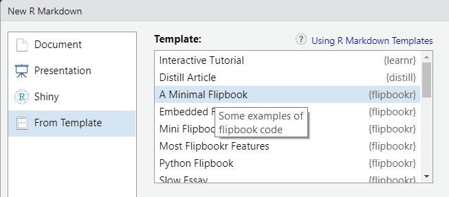
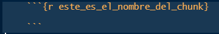
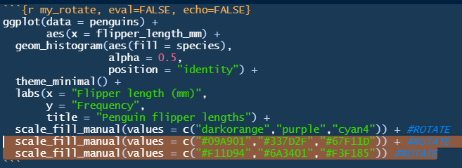

<div style="text-align: justify">

<div/>

```{r, include = FALSE}
library(xaringan)
```

**Objetivo:** crear una presentación en RStudio con código a través del paquete `xaringan`, definir y crear un flipbook.

# ¿Qué es Xaringan?

El nombre viene de un animé pero aquí nos referimos al paquete de R que permite realizar presentaciones con sintáxis de RMarkdown. Las ventajas son heredadas por RMarkdown, es decir, que existe la posibilidad de ver código, hacer divérsos análisis automatizados y no hacer siempre copy-paste de los gráficos que se elaboran en RStudio.

## Crear una presentación en Xaringan

1.  Instalar la libraría xaringan `install.package("xaringan")` y cargar la librería `library(xaringan)`.

2.  Crear un proyecto de R para que las imágenes y demás archivos se queden en la carpeta que se crea en automático en la creación del proyecto.

3.  Dentro del proyecto crear un archivo de RMarkdown y cambiar el encabezado YAML:

<div>

<p style="text-align:center;">

{width="450px"}

</p>

</div>

La diferencia con este encabezado y el de un Rmd es el output, mientras que en Rmd el `output` es `html_document` o `pdf_document`, para compartir una presentación de xaringan es necesario usar `xaringan::moon_reader` lo que implica una forma particular de presentación.

Notemos que existen algunas especificaciones extra como el estilo de la presentación que se pones en el parámetro `css`. ára poder identificar los diferentes estilos posibles en las presentaciones de sharingan usamos el siguiente comando:

```{r}
names(xaringan:::list_css())
```

En general el parámetro `css` describe las características de personalización de la presentació.

Por otro lado

      `nature:`
          `higlightStyle: github`
          `highlighLine: true`
          `countIncrementalSlides: true`

hace referencia a la forma en que queremos que aparezcan las líneas de código dentro de la presentación. Por ejemplo, `highlighLine: true` implica que se hará un subrayado para los códigos que aparezcan en la presentación. Mientras que `countIncrementalSlides: true` permitirá que las diapositivas se enumeren.

4.  Cargar las librerías a ocupar en un chunk de R.

5.  Escribir tres guiones medios **---** cada que se requiera una nueva diapositiva. Al inicio de cada diapositiva debe existir un título el cual se pone como la [sintáxis de Rmd](https://dreamy-beaver-cd6aad.netlify.app/r-markdown#Editar_texto).

**NOTA:** si deseas ver las modifiaciones que haces de tu presentación en el momento de que haces los cambios en el código utiliza en consola el comando: `xaringan::inf_mr()`

## Personalizar la presentación

-   En cada diapositica es posible hacer que esta tenga imágenes, lo cual se logra con sintáxis de Rmd o de HTML. Aquí pongo el ejemplo de HTML.

        <div>
        <p style = 'text-align:center;'>
        {width='250px'}
        </p>
        </div>

En este caso la imagen se llama xaringan_yaml y tiene extensión png. Esta imagen debe ser previamente guardada en la carpeta del RProject donde se está trabajando, de esta manera no será necesario escribir el `path` del directorio.

-   Si se desea dividir una diapositiva en dos columnas se usa la sintáxis siguiente:

        .pull-left[
        Hola, este es el lado izquierdo
        ]

        .pull-right[
        Hola, este es el lado derechairo
        ]

Donde el contenido de la izquierda irá entre los corchetes así como el de la derecha.

-   Para hacer referencias a páginas o insertar código con sus múltiples opciones de aparición en la presentación, basta con usar la [sintáxis de Rmd](https://dreamy-beaver-cd6aad.netlify.app/r-markdown).

Para más información sobre la personalización de Xaringan consulta [Xaringan Presentations](https://bookdown.org/yihui/rmarkdown/xaringan.html)

# Flipbookr

### ¿Qué es un *Flipbook*?

Los flipbooks presentan el código paso a paso y en paralelo con la salida. Es una forma de ver resultados de manera incremental.

**Ejemplo**

<div>

<p style="text-align:center;">

{width="450px"}

</p>

</div>

En general un flipbook permite tener la visualización de manera secuencial o progresiva lo cual permite tener un mejor entendimiento de lo que sucede paso a paso.

En particular, se puede hacer una presentación con Xaringan que contengan a su vez los flipbooks. [Evangeline Reynols](https://evangelinereynolds.netlify.app/post/introducing-flipbookr/) describe que *La idea de los flipbooks es ofrecer a los "lectores" conocimientos sobre el comportamiento de funciones específicas en el contexto de un proyecto más amplio. El "lector" puede aislar funciones desconocidas y alternar entre estados de salida antes y después de que se use una función, viendo cómo esa función afecta el resultado.*

## Ventajas del uso de flipbooks

1.  Permite digerir el proceso de manipulación de datos y construcción de gráficos. ¡Como en forma de película!
2.  Se puede obtener información de tramos cortos para generar análisis similares pero con otra información.
3.  Observar cambios del código a través del movimiento en vez de la lectura exaustiva de código.

## Utilidad de flipbooks.

Algunas formas en las que se practica la creación de flipbooks son:

-   Negociación de datos.
-   Visualización de datos con ggplot2.
-   Análisis Estadístico.

# Xaringan y Flipbookr

Para poder crear un Flipbook en R que se reproduzca en Xaringan:

1.  Instalar la plataforma de presentación de diapositivas Xaringan install.packages("xaringan")
2.  Instalar flipbookr - `remotes::install_github("EvaMaeRey/flipbookr")`
3.  Reiniciar R.
4.  Crea un Rmd y elige la opción `From Template -> A Minimal Flipbook`

<div>

<p style="text-align:center;">

{width="450px"}

</p>

</div>

5.  Use esta plantilla para comenzar o reemplácela con sus propias requerimientos.

Dentro del documento podremos notar un encabezado igual al de una presentación de Xaringan por lo cual sí se puede adaptar al diseño o estilo que requieras.

Por otro lado una de las cosas interesantes en el documento es la función `chunk_reveal` que permite obtener la forma de flipbook a partir de un chunk de código. Es decir que esta función toma el código de un fragmento de código referenciado y devuelve una secuencia de código parcial a una serie de fragmentos de código separados por saltos de diapositiva. Al compilar, obtendrá un recorrido del código paso a paso.

## Parámetros de `chunk_reveal()`:

-   `chunk_name`: una cadena de caracteres que hace referencia al nombre del fragmento del chunk de código.

    {width="9.5cm" height="1.5cm"}

-   `break_type`: permite dar opciones de vizualización del flipbook, es decir que indica qué linea del código del chunk se revelará y en qué momento. Las posibles entradas son:

    -   "auto": por defecto, el parámetro toma esta opción. La forma en que aparecerá el código del flipbook dependerá de los paréntesis o pipes (%\>%) que aparezcan en ese orden.

    -   "user": aquí puedes decidir qué parte del código aparecerá en qué momento. La forma en que la función detecta cuándo quieres que se detenga (en leer el código) será con un **\#BREAK** que le pongas dentro del chunk de código.

        

    -   "non_seq": análogo a la opción "user" solo que esta vez se ejecutará todo el código **excepto** aquel que tenga \#BREAK2, \#BREAK3, ..., las lineas de código que tengan esas características, se mostrarán (así como sus resultados) en el orden de su número asociado, es decir, primero se ejecutará \#BREAK2, luego BREAK3, ...

        

    -   "rotate": permite que se cambien las opciones de alguna parte del código (por ejemplo el color de una gráfica).

        

    -   "n": la n es sustituida por un número natural (1, 2, 3, ...) el cual indica las veces que se desea ejecutar ese chunk de código. Se usa cuando se tienen muestras "aleatorias" que cambian en cada ejecución para mostrar los posibles resultados distintos.

    -   "replace": En vez de dar otros colores como *posibilidades (como en rotate),* esta opción permite remplazar alguna parte del código (y a la vez, claro, cambiar los resultados que dependen de esa parte del código).

-   `display_style`: es el parámetro que permite distinguir qué se desea ver en el flipbook creado. Las opciones de este parámetro son:

    -   "output": se ve solo el resultado en el flipbook

    -   "code": se ve solo el código en el flipbook

    -   "output_lag": se ve el resultado del código pero con UN RETRASO

    -   "output_target": se ve solo el resultado final del código en el flipbook

    -   "output_start": se ve solo lo primero del código

    -   "md": se puede usar para mostrar caracteres

        Es evidente que de manera aislada, no siempre servirá ver el código, el resultado, letras, etc. Por lo cual este parámetro puede tener una entrada como vector que combine hasta tres opciones de las anteriores.

        Por ejemplo: `display_style = "c("output_lag", "code", "output")"` permitirá que se vea en el flipbook: el resultado del código con el atraso de una linea, el código y además el resultado que le corresponde.

        Jugar con las combinaciones de este vector es lo recomendado para que veas la forma en que se obtienen los resultados de tu flipbook. 🤪

-   `left_assign`: un valor lógico. El valor predeterminado es FALSE, si es VERDADERO entonces el objeto asignado al código aparecerá al final del chunk de código durante todo el flipbook.

-   `title`: una cadena de caracteres que puede contener un título para los marcos del flipbook; esto puede incluir información de encabezado "\#\# Mi título".

-   `widths`: un vector numérico que contiene anchos relativos para los paneles. Este parámetro se relaciona íntimamente con `display_style` ya que dependiendo del número de columans que aparezcan en el flipbook, es el número de entradas que tendrá este vector.

    Por ejemplo: Si `display_style = "c("output_lag", "code", "output")"`, entonces `widths = c(20, 30, 10)` donde 20 será el ancho para el "output_lag"; 30 será el ancho para "code" (para que se vea el código) y 10 será el ancho destinado al resultado. En general es arbitraria la forma en que se destina el ancho a cada panel.

El valor que regresa la función solo se puede ver implementado en el "tejimiento" de la presnetación o después de hacer el "knit".

La función puede vere así:

    chunk_reveal(
    chunk_name = "pinguinos",
    break_type = "non_sequence", 
    display_type = c("code", "output", "output_target"),
    title =  "### Deseamos un flipbook con nuestra secuencia propia que además nos diga a dónde vamos a llegar",
    widths = c(20, 20, 10),
    font_size_code = "110%"
    )

6.  Compile su documento - "Knit" en RStudio

Para poder ver en acción los diferentes parámetros de la función que hace flipbooks, además de otras cosas extra, te invito a ver en esta página: Ejemplos -\> Flipbookr

Conoce más en la página de Eva sobre [flipbookr](https://evamaerey.github.io/flipbooks/about)
