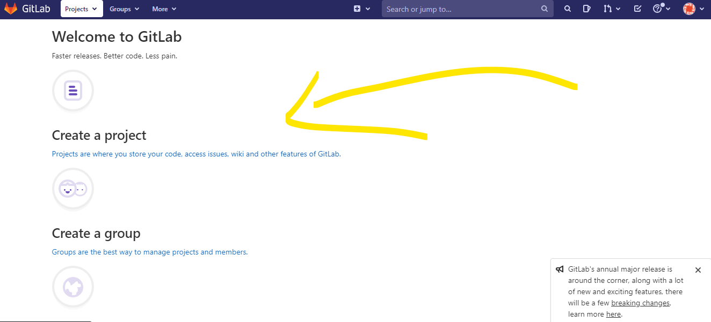
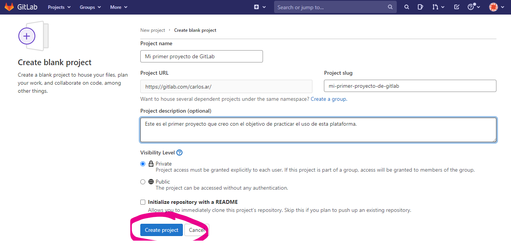
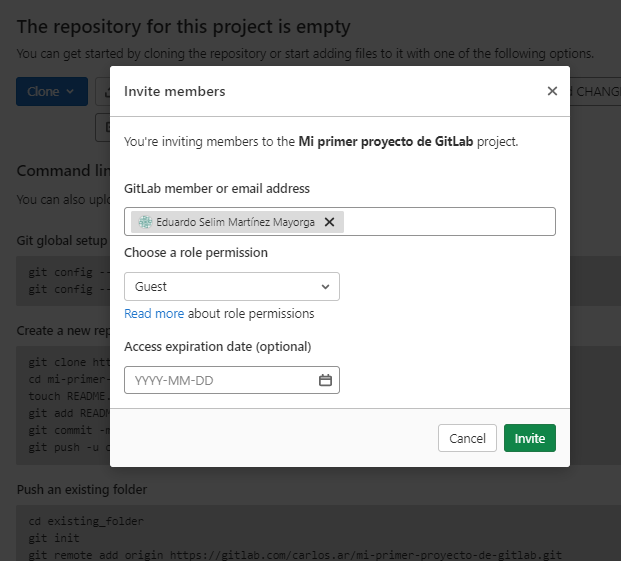
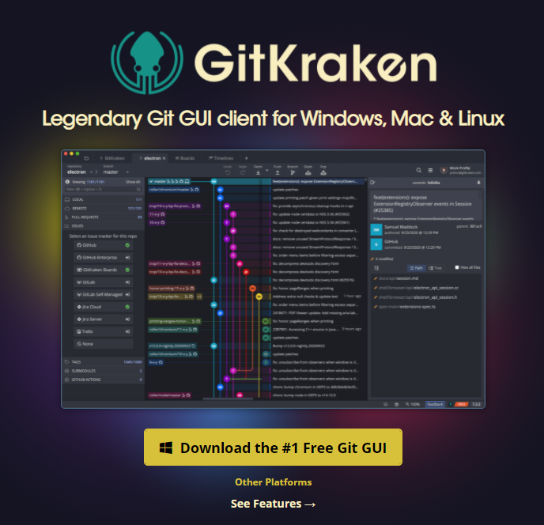
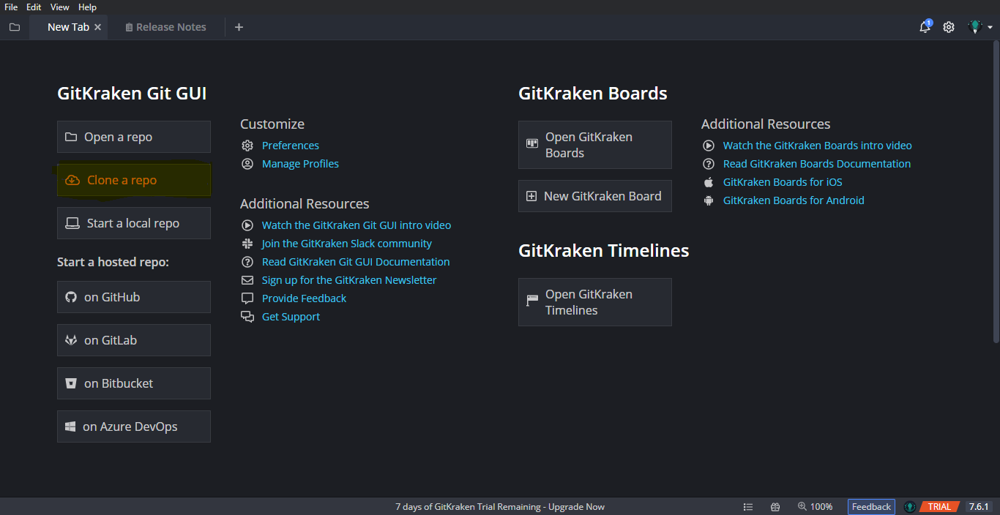
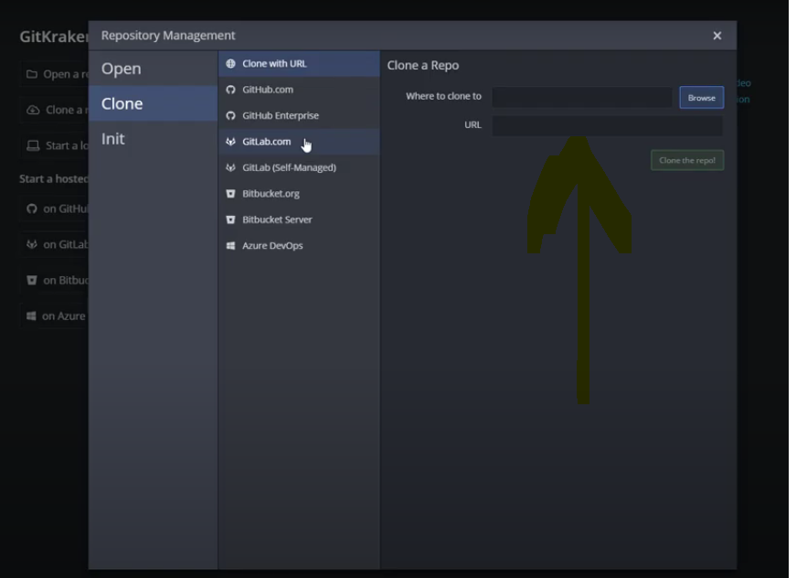
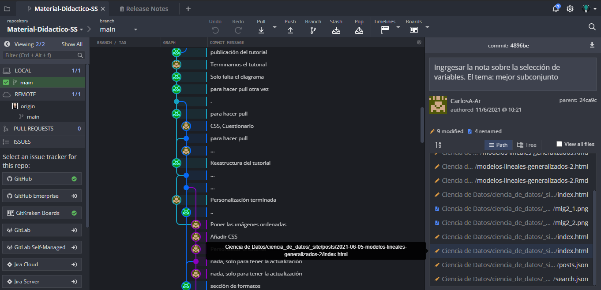

# GitLab

## ¿Qué es?

Es una plataforma de internet que tiene la finalidad de trabajar junto con [Git](https://tutorialesmg.netlify.app/tutorial-de-git-y-github#%C2%BFQu%C3%A9_es_Git_y_para_qu%C3%A9_aprenderlo) para tener el control de archivos (preferentemente de código) con el objetivo de modificarlos y regresar a alguna versión previa de dicho código.

La ventaja de esta plataforma sobre Drive, por ejemplo, es que además de almacenar archivos de forma remota, tiene el "historial de cambio" de los mismos.

Otra ventaja es que pueden varias personas tener acceso a los archivos y modificar el código. Lo anterior permite que muchas personas puedan, de forma remota y asincrónica, trabajar en un código.

La forma en que se trabaja lo anterior se entiende mejor con lo siguiente:

1.  Creas un proyecto en GitLab.
2.  Invitas a personas a colaborar o trabajar en el proyecto previamente creado.
3.  Subes archivos de código al proyecto. (De tu computadora local *(que no necesita de internet)* a la red/internet).
4.  Las personas descargan el proyecto en su computadora. (De la red, bajan la carpeta de los archivos *(el proyecto)* en su máquina local).
5.  Los miembros del equipo de trabajo hacen cambios en la carpeta (crear archivos, modificar archivos, borrar archivos) desde su computadora.
6.  Los miembros suben los cambios al proyecto en la red (actualizan el proyecto que se encuentra en GitLab).
7.  Los miembros del equipo actualizan su carpeta local (la que no necesita de internet), "bajando" las actualizaciones del proyecto en GitLab.

Los pasos 5, 6 y 7 son los que más se repetirán dado que en un proyecto se tiene que trabajar paulatinamiente y que todos los menbros estén "lo más actualizados posibles" en términos de los cambios en un mismo archivo.

Si lo has notado, es como GoogleDrive porque aquí, varias personas pueden subir y bajar archivos. No es igual porque tiene el control de Git, es decir, no solo se suben archivos, sino que se actualizan los archivos que ya están en GitLab y viceversa. Además no se actualizan inmediatamente. Para que haya control y no se actualice en desorden, hay que solicitar permisos para ver si se añade o no una actualización.

La lista anterior sobre el funcionamiento y utilidad general en GitLab, se puede ver en comandos. Es decir que los pasos mencionados en la lista, se logran con los siguientes comandos en la [terminal de GitBash](https://tutorialesmg.netlify.app/tutorial-de-git-y-github#Conceptos_b%C3%A1sicos):

1.  (Visto más adelante)

2.  (Visto más adelante)

3.  (Vsito más adelante)

4.  `git clone link-del-proyecto`

5.  Para que esos cambios sean considerados en el control de Git, se usan los comandos

    i.  `git add .` : permite decir a Git "añade los cambios de todos estos archivos"

    ii. `git commit -m"Esta leyecnda dice los cambios que hice" -m"Y esta otra solo es para darle detalle de esos cambios de ser necesario"` : es como decir a Git "Confirmo que quiero que este cambio lo consideres como parte de tu historial".

6.  `git push origin master` sirve para "empujar" los archivos actualizados en el proyecto que se encuentra en internet (en GitLab).

7.  `git pull` sirve para "jalar" los archivos que se encuentran en el proyecto de internet (en GitLab).

El párrafo concerniente a la "fusión" de las diferentes versiones de un mismo archivo, implica conocimiento de las ramas y el merge. Este tema puedes consultarlo [en este link](https://tutorialesmg.netlify.app/tutorial-de-git-y-github#Trabajo_Colaborativo), no es exclusivo de GitLab.

## ¿Cómo se usa?

1.  [Crea una cuenta](https://gitlab.com/users/sign_in?__cf_chl_jschl_tk__=597a77c313c397163136f33290763db3c9a6416c-1623445163-0-Aas0XwUWR2E-vcoW7sqobio1ppaiBj_YuLcTCtvKd0l-JPUrFxHgF4TJQfyeMYl3miC2rWcC7p03__FNwdmqxkoQI8s4EjvR6ZgJL_IKo56LqSiDs0O0g2VoI4QbH5Wx9WmqSc4GaiKMvKxgEW0pwkjUFI6k_tciWmDVWO82iozNl0UiNvAFsU2qoBPkJEPl0t70mvnptuByZPVzVKBzL_J4cPSXV0xCJWMBLj0izG890Aam67Lio_3ZLg1l_yiWncZV7oazkk-9v4yGJpc13y9CJOE8IaBvjMd0k43z8uz203uSXNm0pJJNKnUlrxHXW-kFLucdCmmfyRWvR-67ax9JrrcE44cD18d80Wl3gK8qoy5X3lFjm05SL3HcXeTqTpwN41DzOO7QgqDxQWl85sbX4NBdz10iieZC4DJtDJLn_sSgQ08lKtTtaTSjUs0zdT9B9iSdlakFJcD-43jbX5NuSKhBOzN-8cVrKtCa9hz7) en GitLab.

2.  Crear un proyecto.

    {width="438"}

    {width="465"}

3.  Existe la posibilidad de invitar a colaborar en tus proyectos o otros usuarios de GitLab para un trabajo asincrónico y a distancia (que es lo que la mayoría queremos hacer en tiempos de pandemia 😅).

La forma de cambiar el nombre de esta rama es en la terminal de gitBash con el comando `git branch -M nombre_de_la_rama` donde "nombre_de_la_rama" puede ser main ó master. En el caso de GitLab, usar master.

# GitKraken

## ¿Qué es?

GitKraken es una herramienta que permite gestionar algún repositorio de git, ya sea de GitHub, Git Lab o Git de tu PC. Gestionar, entre otras cosas, se refiere a resolver conflictos del merge y las funciones usuales de git (crear ramas secundarias, add, commit, ...). Un plus con respecto a GitHub y GitLab es la linea del tiempo como un gráfico que permite entender las modificaciones que se han hecho sobre un mismo código (controlado con Git).

GitLab, GitKraken y GitHub son tres programas diferentes que básicamente sirven para lo mismo: controlar archivos y sus versiones a lo largo del tiempo **en internet.** Cada uno con una interfaz de usuario distinta, pero en escencia sirven para lo mismo.

## ¿Cómo se usa?

1.  Instalar el programa. En la siguiente liga <https://www.gitkraken.com/>, presionar el botón amarillo.

    {width="620"}

2.  Una vez que se descargue, hay que apretar en el botón del archivo que se ve descargado. Aparecerá una ventana que te pide crear una cuenta o iniciar con alguna cuenta de GitHub, GitLab o Google. En mi caso puse GitHub.

3.  Aparecerá la siguiente pantalla. Para poder tener control desde GitKraken de algún repositorio, solo damos click en `Clone a Repo`

    {width="606"}

4.  La ventana que aparecerá será la siguiente y se buscará la [carpeta ya inicializada con Git](https://tutorialesmg.netlify.app/tutorial-de-git-y-github#Inicializar_un_repositorio) en browser, o se podrán pegar los enlaces del repositorio/proyecto de GitHub/GitLab.

    {width="598"}

Yo lo hice con [un repositorio de GitHub](https://github.com/yanelyluna/Material-Didactico-SS) que puedes consultar. En GitKraken se pueden hacer los comandos principales de Git pero de forma mucho más amigable, con botones o no con la terminal.

Muestro el resultado de la linea de tiempo donde se puede notar todos los commits hechos, las ramas secundarias creadas, entre otras cosas.

Esta herramienta en particular tiene la capacidad de ver claramente el avance de los archivos en el tiempo, si hay más ramas, si hay problemas con el merge, entre otras cosas.

{width="633"}
