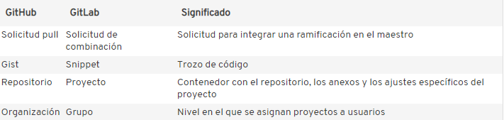
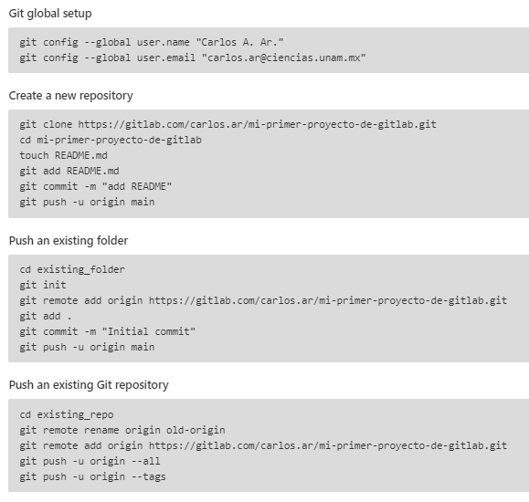

# GitLab

## ¿Qué es?

Es una plataforma de internet que tiene la finalidad de trabajar junto con Git para tener el control de archivos (preferentemente de código) con el objetivo de modificar y regresar a alguna versión previa del código.

Es útil porque con esta plataforma es más sencillo trabajar en equipo a partir de los llamados "merge request" que son el análogo a "pull request" de GitHub. Recordemos que este tipo de peticiones se hacen solo para fusionar ramas secundarias temporales con la rama principal en la línea de trabajo de Git.

Diferencias entre GitLab y GitHub:

-   GitLab permite trabajar a más de tres personas en un proyecto privado de forma gratuita, mientras que GitHub no.

-   Opción de exportación de elementos como archivo CSV por correo electrónico.

## ¿Cómo se usa?

1.  [Crea una cuenta](https://gitlab.com/users/sign_in?__cf_chl_jschl_tk__=597a77c313c397163136f33290763db3c9a6416c-1623445163-0-Aas0XwUWR2E-vcoW7sqobio1ppaiBj_YuLcTCtvKd0l-JPUrFxHgF4TJQfyeMYl3miC2rWcC7p03__FNwdmqxkoQI8s4EjvR6ZgJL_IKo56LqSiDs0O0g2VoI4QbH5Wx9WmqSc4GaiKMvKxgEW0pwkjUFI6k_tciWmDVWO82iozNl0UiNvAFsU2qoBPkJEPl0t70mvnptuByZPVzVKBzL_J4cPSXV0xCJWMBLj0izG890Aam67Lio_3ZLg1l_yiWncZV7oazkk-9v4yGJpc13y9CJOE8IaBvjMd0k43z8uz203uSXNm0pJJNKnUlrxHXW-kFLucdCmmfyRWvR-67ax9JrrcE44cD18d80Wl3gK8qoy5X3lFjm05SL3HcXeTqTpwN41DzOO7QgqDxQWl85sbX4NBdz10iieZC4DJtDJLn_sSgQ08lKtTtaTSjUs0zdT9B9iSdlakFJcD-43jbX5NuSKhBOzN-8cVrKtCa9hz7) en GitLab.

2.  Crear un proyecto.

    {width="438"}

    {width="465"}

3.  Así como en las secciones [De Git a GitHub o de GitHub a Git](https://tutorialesmg.netlify.app/tutorial-de-git-y-github#De_GitHub_a_Git), se pueden subir archivos de la máquina local al proyecto creado de GitLab o se puede clonar un proyecto de GitLab en la máquina local, para esto usamos la terminal de GitBash y los [comandos "de siempre"](https://tutorialesmg.netlify.app/tutorial-de-git-y-github#Comandos_principales).

    En cualquier caso, al crear un nuevo proyecto en GitLab, aparece por defecto una "guía" de comandos necesarios para hacer lo anteriormente mencionado:

    {width="567"}

Existe la posibilidad de invitar a colaborar en tus proyectos o otros usuarios de GitLab para un trabajo asincrónico y a distancia (que es lo que la mayoría queremos hacer en tiempos de pandemia 😅).

Una de las diferencias entre GitLab y GitHub es el nombre de la rama principal. Para GitLab, la rama principal de llama `master` y para GitHub se llama `main`. La forma de cambiar el nombre de esta rama es en la terminal de gitBash con el comando `git branch -M nombre_de_la_rama` donde "nombre_de_la_rama" puede ser main ó master.

# GitKraken

## ¿Qué es?

GitKraken es una herramienta que permite gestionar algún repositorio de git, ya sea de GitHub, Git Lab o Git de tu PC. Gestionar, entre otras cosas, se refiere a resolver conflictos del merge y las funciones usuales de git (crear ramas secundarias, add, commit, ...). Un plus con respecto a GitHub y GitLab es la linea del tiempo como un gráfico que permite entender las modificaciones que se han hecho sobre un mismo código (controlado con Git).

## ¿Cómo se usa?

1.  Instalar el programa. En la siguiente liga <https://www.gitkraken.com/>, presionar el botón amarillo.

    {width="620"}

2.  Una vez que se descargue, hay que apretar en el botón del archivo que se ve descargado. Aparecerá una ventana que te pide crear una cuenta o iniciar con alguna cuenta de GitHub, GitLab o Google. En mi caso puse GitHub.

3.  Aparecerá la siguiente pantalla. Para poder tener control desde GitKraken de algún repositorio, solo damos click en `Clone a Repo`

    {width="606"}

4.  La ventana que aparecerá será la siguiente y se buscará la [carpeta ya inicializada con Git](https://tutorialesmg.netlify.app/tutorial-de-git-y-github#Inicializar_un_repositorio) en browser, o se podrán pegar los enlaces del repositorio/proyecto de GitHub/GitLab.

    {width="598"}

Yo lo hice con [un repositorio de GitHub](https://github.com/yanelyluna/Material-Didactico-SS) que puedes consultar. En GitKraken se pueden hacer los comandos principales de Git pero de forma mucho más amigable, con botones o no con la terminal.

Muestro el resultado de la linea de tiempo donde se puede notar todos los commits hechos, las ramas secundarias creadas, entre otras cosas.

Esta herramienta en particular tiene la capacidad de ver claramente el avance de los archivos en el tiempo, si hay más ramas, si hay problemas con el merge, entre otras cosas.

{width="633"}
