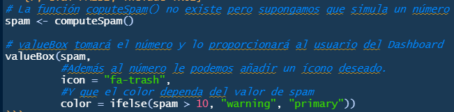

```{r setup, include=FALSE}
# Para contruir el dashboard
library(flexdashboard)
#Para hacer gráficos de ggplot2 (más moldeables)
library(ggplot2)
#Para hacer gráficas interactivas
library(plotly)
#Para hacer mapas (geográficos) interactivos
library(leaflet)
#Para hacer gráficas interactivas y en particular para cosas de series de tiempo.
library(dygraphs)
#Para hacer tablas interactivas
library(DT)
#Para poder hacer un flipbook un poco más interactivo
library(shiny)
```

Gráficas interactivas
========================================================


Column {data-width=650, .tabset .tabset-fade}
-----------------------------------------------------------------------

### Series de tiempo

```{r}
#Generamos dos series de tiempo que vienen en la paquetería "dygraph" en un objeto
lungDeaths <- cbind(mdeaths, fdeaths)
#Hacemos la gráfica interactiva
dygraph(lungDeaths) %>%
  #Con el nombre de las series cambiado
  dySeries("mdeaths", label = "Male") %>%
  #Para un gráfico más personalizado
  dySeries("fdeaths", label = "Female") %>%
  #Además de decidir si el gráfico será "apilado" (una serie sobre otra)
  dyOptions(stackedGraph = TRUE) %>%
  # Paro además con un selector de visualización de la serie en fechas particulares.
  dyRangeSelector(height = 20)

```

### con la librería

```{r}
lungDeaths <- cbind(mdeaths, fdeaths)
dygraph(lungDeaths, main = "Deaths from Lung Disease (UK)") %>%
  dySeries("mdeaths", drawPoints = TRUE, pointShape = "square", color = "blue") %>%
  dySeries("fdeaths", stepPlot = TRUE, fillGraph = TRUE, color = "red") %>%
  dyRangeSelector(height = 20)
```

### `dygraphs`

```{r}
dygraph(fdeaths, main = "No tengas miedo de descargar la librería y ver sus funcionalidades")
```


Column {data-width=350}
-----------------------------------------------------------------------

### Plotly (ggplot)

```{r}

ggplotly(
  ggplot(filter(diamonds, carat < .3), aes(carat, price, color = clarity)) + geom_point(alpha = 0.5, shape = 16) + labs(
    title = "Diamantes",
    subtitle = "Filtro de la diamonds con carat < 0.3 ",
    xlab = "Quilates",
    ylab = "Precio (dolares)"
  ) + theme_classic()
)

```

### O los plots de siempre

```{r}
plot(
  head(diamonds$color, 2000),
  head(diamonds$price, 2000),
  xlab = "color",
  ylab = "Precio",
  main = "Precio de diamantes por color"
)
```


Tablas interactivas
========================================================


Column {data-width=350}
-----------------------------------------------------------------------

### Puedes poner

```{r}
knitr::kable(head(select(mtcars, mpg, cyl, disp), 4), align = "ccc")
```

### información útil

```{r}
knitr::kable(select(mtcars, mpg, cyl, disp)[5:8, 1:3], align = "ccc")
```

### para el usuario

```{r}
knitr::kable(select(mtcars, mpg, cyl, disp)[9:12, 1:3], align = "ccc")
```


Column {data-width=650, .tabset}
-----------------------------------------------------------------------

### Que incluso se descargue

```{r}
datatable(
  mtcars, 
  rownames = FALSE,
  extensions = "Buttons",
  options = list(
    dom = "Bfrtip",
    buttons = c("copy", "csv", "excel", "pdf", "print")
  )
)
```

### Usa `DT` una buena librería

```{r}

  data <- head(mtcars, n = 50)
  DT::datatable(data, options = list(
    bPaginate = FALSE
  ))

```


Resaltar valores {data-navmenu=Menu}
========================================================


Column {data-width=500, .tabset}
-----------------------------------------------------------------------

### Muchas más posibilidades

#### Se pueden añadir menús por lo que:

- Puedes ampliar tu información tanto como desees.
- Puedes tener un orden en los temas que vas a presentar.
- Te gustará saber que hay más interactividad en tú página.

### Cajas de valores

Además tienes la opción de resaltar datos relevantes con la función `valeBox()`



Hay varios colores dependiendo del tipo de dato que se obtenga. 

### Medidores.

Además de valores en particular, podemos generar medidores que funcionan para ver información como "gasolina que queda"


Column {data-width=500}
-----------------------------------------------------------------------

### Resaltar número

```{r, eval=FALSE}
valueBox(
  42, 
  icon = 'fa-pencil',
  href="#graficas-interactivas"
)
```

### Medir el progreso

```{r}
gauge(5, min = 0, max = 10, gaugeSectors(
  success = c(0, 2), warning = c(3, 6), danger = c(7, 10)
))
```

Hacer algo "shiny" {data-navmenu=Menu}
========================================================


Primer storyboard {.storyboard}
========================================================


### Hay veces que tenemos que dar la presentación de información que permita de manera paulatina el cambio con una explicación

```{r}
leaflet() %>%
  addTiles() %>%  
  addMarkers(lng=174.768, lat=-36.852, popup="The birthplace of R")
```

***

- Es usual quer los procesos destritos para la obtención de resultados, se de en forma de `bullets`.

- Si los procesos son muy largos, puedes usar muchas viñetas o incluso puedes hacer una numeración.

### Lo cual se puede hacer a través de una "Storyboard"

```{r}
leaflet() %>%
  addTiles() %>%  
  addMarkers(lng=174.769, lat=-36.853, popup="The birthplace of R")
```


***

- A lo largo de esta `sotyboard` vamos a ver el ejemplo de un mapa que es interactivo y cambia constantemente, o al menos por cada uno de los apartados de la historia.

- Es decir, en un flexdashboard puedes generar muchas maneras de dar a conocer datos, resultados y análisis diversos con tablas, gráficas y cajas de valores. 

### Tiene la finalidad de contar una historia con el progreso que se da paso a paso

```{r}
leaflet() %>%
  addTiles() %>%  
  addMarkers(lng=174.767, lat=-36.851, popup="The birthplace of R")
```

- Ahora que tienes el poder de usar el flexdashboard, no esperes más y aprender de su gran utilidad. __PEGAR AQUÍ EL LINK__


### Como puedes ver hay la opción de dar un título

```{r}
leaflet() %>%
  addTiles() %>%  
  addMarkers(lng=174.769, lat=-36.851, popup="The birthplace of R")
```


### Así como la explicación que se llevó a cabo para obtener el resultado mostrado.

