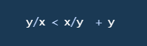
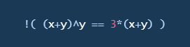
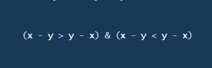

```{=html}
<style>
div {
  text-align: justify;
}
/***********************/
/*Títulos ## y autoría F6EACD*/
/***********************/
h1, h2 {
  color: #6D4101;
  padding: .4em; /*es decir el 60 por ciento del tamaño de la letra*/
  font-family: "Courier New", monospace;
  font-size: 35px;
  font-weight: bold;
  opacity: 0.95;
}
em {
  color: #8A6C0C;
  font-family: "Courier New", monospace;
  font-size: 18px;
  padding: .2em;
  opacity: 0.97;
  font-weight: bold;
}
/***********************/
/* Cuerpo */
/***********************/
body {
  font-family: Verdana, Helvetica, sans-serif;
  font-size: 16;
  background-color: #EEF5F9;
  color: #000000;
}
/***********************/
/* Títulos con ###     */
/***********************/
h3, h4, h5{
  color: #06116C;
  font-family: Verdana, Helvetica, sans-serif;
}
/*******************************************/
/* Referencias a páginas o a otro documento*/
/*******************************************/
a {
    color: #B8870F;
    text-decoration: none;
}
/**********************/
/* Chunks de exercises*/
/**********************/
.ace-tm {
    background-color: #FFFEF7;
    color: #010730;
}
/***********************/
/* tabla de contenidos */
/***********************/
.topicsList {
  padding: .5em;
}
.topicsHeader {
  color: #06116C;
  padding: .5em;
}
.topicsList #doc-metadata {
  color: #06116C;
  padding: .5em;
}
.topicsList .topic.current {
  background-color: #8A6C0C;
  color: #FFFFFF;
  font-weight: bold;
}
.topicsList .topic:hover, .topicsList .topic:active {
  background-color: #E0CD4E;
  color: #01053D;
}
/***********/
/* Botones */
/***********/
.btn {
  background-color: #000857;
  color: #EBEDFF;
}
/* cambiar de página */
.btn-default {
    color: #EBEDFF;
    background-color: #000857;
    border: none;
}
/* cambiar de página */
.btn-light {
  background-color: #000857;
  color: #EBEDFF;
}
/* run code */
.btn-primary , .btn-success, .btn-info{
  background-color: #786300;
  color: #EBEDFF;
}
/* mientras está desabilitados */
.btn:hover, .btn:active, .btn:disabled {
  background-color: #786300;
  color: #EBEDFF;
}
/**********/
/* Código */
/**********/
code {
    color: #6D4101;
    background-color:  #F7FBF9;
    font-size: 15px;
    font-weight: bold;
}
/**************************/
/* Recuadro para ejemplos */
/**************************/
.boxed {
    background: #F7FBF9;
    color: black;
    border: 3px solid #C83737;
    margin: 0px auto;
    width: 456px;
    padding: 10px;
    border-radius: 10px;
  }
.note {
    padding: 1em;
    margin: 1em 0;
    padding-left: 100px;
    background-size: 70px;
    background-repeat: no-repeat;
    background-position: 15px 15px;
    min-height: 120px;
    color: black;
    background-color: lightgrey;
    border: solid 5px #C83737;
    background-image: url("manzana.png");
  }
.note_white {
    padding: 1em;
    margin: 1em 0;
    padding-left: 100px;
    background-size: 70px;
    background-repeat: no-repeat;
    background-position: 15px 15px;
    min-height: 120px;
    color: black;
    background-color: #F7FBF9;
    border: solid 5px #C83737;
    background-image: url("manzana.png");
  }
</style>
```

```{r setup, include=FALSE}
library(learnr)
knitr::opts_chunk$set(echo = FALSE, fig.align='center')
```

```{r respuestas}
variable1 <- 2
x <- 5
y  <- 4

f1 <- "Pepe pecas"
f2 <- "pica papas"
f3 <- "Con un pico"

vector <- c(1, 2, 4, 5, 6, 8)

v <- c(7,3,5,8,9,11)

Caract_Producto <- list(Producto = "Jabón de manos", Precio = 27.4, Cantidad = 13)

Calif <- matrix(c(10,9,6,7,8,9,6,7,10,5,10,9,8,8,5,6,10,8,9,7), nrow = 4, ncol = 4, byrow = T)

rownames(Calif) <- c("Ale", "Edson", "Carlos", "Brayan")
colnames(Calif) <- c("Fis", "Quim", "Mat", "Hist")

Calif

Vuelos <- data.frame(Codigo = c("BBC21", "DCF32", "DKE23", "LKI98"), Destino = c("Los Angeles", "California", "San Franciso", "Madrid"), Precio = c(325.99, 412.87, 399.67, 720.76), Retraso = c(TRUE, FALSE, FALSE, FALSE))

nombre <- c("Miriam", "Ingrid", "Edwin", "Francisco", "Carolina")
edad <- c(24, 23, 21, 34, 16)
casado <- c(TRUE, TRUE, FALSE, FALSE, FALSE)
Df <- data.frame(Nombre = nombre, Edad = edad, Casado = casado, stringsAsFactors = FALSE)
```

```{r respuestas 2}
nombre <- c("Miriam", "Ingrid", "Edwin", "Francisco", "Carolina")
edad <- c(24, 23, 21, 34, 16)
casado <- c(TRUE, TRUE, FALSE, FALSE, FALSE)
Df <- data.frame(Nombre = nombre, Edad = edad, Casado = casado, stringsAsFactors = FALSE)

altura <- c(177, 165, 162, 178, 170)

Df$Altura <- altura
```

```{r respuestas 3}

nombre <- c("Miriam", "Ingrid", "Edwin", "Francisco", "Carolina")
edad <- c(24, 23, 21, 34, 16)
casado <- c(TRUE, TRUE, FALSE, FALSE, FALSE)
Df <- data.frame(Nombre = nombre, Edad = edad, Casado = casado, stringsAsFactors = FALSE)

altura <- c(177, 165, 162, 178, 170)

Df$Altura <- altura
peso <- c(56, 57, 60, 65, 70)
Df <- cbind(Df, peso)

```

```{r respuestas 4}
nueva_observacion1 <- data.frame(Nombre = "Armando", Edad = 36, Casado = TRUE, Altura = 180, peso = 73)
nueva_observacion2 <- data.frame(Nombre = "Ana", Edad = 23, Casado = FALSE, Altura = 165, peso = 49)

Df <- rbind(Df, nueva_observacion1, nueva_observacion2)

```

```{r respuestas 5}
nombre <- c("Miriam", "Ingrid", "Edwin", "Francisco", "Carolina")
edad <- c(24, 23, 21, 34, 16)
casado <- c(TRUE, TRUE, FALSE, FALSE, FALSE)
Df <- data.frame(Nombre = nombre, Edad = edad, Casado = casado, stringsAsFactors = FALSE)

altura <- c(177, 165, 162, 178, 170)

Df$Altura <- altura
peso <- c(56, 57, 60, 65, 70)
Df <- cbind(Df, peso)

nueva_observacion1 <- data.frame(Nombre = "Armando", Edad = 36, Casado = TRUE, Altura = 180, peso = 73)
nueva_observacion2 <- data.frame(Nombre = "Ana", Edad = 23, Casado = FALSE, Altura = 165, peso = 49)

Df <- rbind(Df, nueva_observacion1, nueva_observacion2)

nuevas_observaciones <- data.frame(Nombre = c("Carmen", "Gustavo"), Edad = c(28,42), Casado = c(TRUE, TRUE), Altura = c(167, 173), peso = c(67, 58))

Df <- rbind(Df, nuevas_observaciones)

```

```{r respuestas 6}
autores <- data.frame(surname = c("Tukey","Venables","Tierney","Ripley","McNeil"),
                      nacionalidad = c("US","Australia","US","UK","Australia"),
                      fallecio = c("si",rep("no",4)))
libros <- data.frame(nombre = c("Tukey","Venables","Tierney","Ripley","Ripley","McNeil","R Core"),
                     titulo = c("Exploratory Data Analysis", "Modern Applied Statistics",
                                "LISP-STAT", "Spatial Statistics","Stochastic Simulation",
                                "Interactive Data Analysis","An Introduction to R"),
                     otro.autor = c(NA,"Ripley",NA,NA,NA,NA,"Venables & Smith"))

precios <- c(10,20,30,40)
```


## Objetivo

Este tutorial va dirigido a las personas que no tienen noción de la programación en R y **tiene el propósito** de dar a conocer las bases para utilizar este lenguaje de programación.

R es uno de los lenguajes de programación más importantes en el ámbito del análisis estadístico y la ciencia de datos que tienen aplicaciones útiles en la coyuntura de nuestra sociedad.

## ¿Qué es R?

Es un lenguaje y entorno de programación abierto, enfocado principalmente en hacer computación estadística.

### ¿Cómo lo instalo?

A pesar de que **para** realizar los ejercicios a lo largo de **este tutorial no necesitas instalar R**, te agregamos un video para que lo puedas hacer en tu computadora sin problemas.


-   [Descarga R](https://cran.r-project.org/mirrors.html)

-   [Descarga RStudio](https://www.rstudio.com/products/rstudio/download/): un programa que facilita el uso de R.

## Tipos de datos en R {#tdr}

Para poder trabajar con datos, debemos saber qué tipos de datos de pueden manipular en R, cómo se crean y cómo operarlos.

Los tipos de datos que están definidos en el lenguaje de R son los siguientes:

-   logical/boolean: TRUE o FALSE. Este tipo de dato es generalmente utilizado para corrobaorar o descartar una afirmación "lógica".

-   numeric: es la representación de cualquier número.

-   integer: representa los números enteros ($-1, 0, 1, 2, ...$).

-   double: representa los números decimales o $\mathbb{R}$eales ($1.25, 1/3, \pi, ...$)

-   complex: representa los números complejos ($1+3i, 5i, ...$)

-   character: representa los caracteres ("2", "a", "g", "%")

-   string: arreglo de caracteres ("todos los que quieras")

```{r quiz}
question(
    text = '¿Qué tipo de dato es "$\\sqrt(2)$"?', 
    allow_retry = TRUE,
    answer("integer",message = "Presta especial atención a las comillas"),
    answer("double",message = "Las comillas deben 'decirte' algo"),
    answer("character", correct = TRUE, message = "¡Maravillos@ estudiante!"),
    correct = "¡Sí que has puesto atención!",
   
    try_again = "Te recomiendo leer de nuevo los tipos de datos",
    submit_button = "Enviar",
    try_again_button = "Inténtalo de nuevo",
    random_answer_order = TRUE
)
```

## Variables

Para poder hacer uso de los diferentes tipos de datos, estos deben ser almacenados. El nombre del objeto que almacena tales datos se llama variable.

### ¿Cómo se crea una variable?

En R es muy fácil, se hace a través de un operador de asignación (\<- , =). Del lado izquierdo del operador irá el nombre de la variable y del lado derecho el dato que almacena.

**Consideraciones:**

1.  El nombre de una variable no puede iniciar con un número.

2.  El nombre de una variable no puede tener espacios pero sí guión bajo o punto.

### Crea tu variable

Crea una variable con el nombre *variable1* y almacena el número 2.

```{r ej1, exercise = TRUE}
# Recuerda que puedes usar <- o =

```

```{r ej1-solution}
# Recuerda que puedes usar <- o =
variable1 <- 2
```

Lo que hiciste fue asignar el número 2 (objeto de tipo numeric) a una variable que se llama *variable1*.

Veamos ahora cómo saber qué tipo de objeto está contenido en una variable, cómo ver el contenido de la misma y cómo manipularla.

### Tipo de dato en una variable

R se auxilia de funciones precargadas para saber qué tipo de dato almacenan las variables:

-   `class()`

-   `typeof()`

```{r ej2, exercise = TRUE, exercise.setup="respuestas"}
# Ingresa el nombre variable1 entre paréntesis
class(___)
```

```{r ej2-solution}
# Ingresa el nombre variable1 entre paréntesis
class(variable1)
```

No es necesario que crees una variable para ver el tipo de dato. Observa los siguientes resultados:

```{r ej3, exercise = TRUE}
# Ve qué tipo de dato es sin crear una variable
class("23")

# Crea una variable y luego ve el tipo de dato
x <- 23L
typeof(x)

# Checa que sí hay más tipos de datos
class(TRUE)
```

### Imprimir contenido de una variable

La función `print()` sirve para ver lo que una variable contiene.

```{r ej4, exercise = TRUE}
# Crea una variable numérica que se llame azul e imprime su contenido

```

```{r ej4-solution}
azul <- 22.343428737

print(azul)
```

No es necesario utilizar esta función para mostrar el contenido de una variable. *R* hace esto al escribir en la consola el nombre de la variable.

```{r ej5, exercise = TRUE}
# Asigna un dato de tipo boolean a la variable dos sin usar print
dos <- ___
___
# Verifica el tipo de dato de la variable dos
__(dos)
```

```{r ej5-solution}
# Asigna un dato de tipo boolean a la variable dos sin usar print
dos <- FALSE
dos
# Verifica el tipo de dato de la variable dos
typeof(dos)
```

### Operaciones con variables

Ya que sabemos crear variables y sus tipos de datos, veamos qué se puede lograr. Utilizamos operadores que nos devuelven cierto tipo de datos:

-   Lógicos. Nos permite saber cuando algo es verdadero o falso. ¿Es 34 mayor que 35?

-   Aritméticos. Para obtener resultados numéricos con variables de este tipo de dato. 5 + 2 = ...

-   De impresión. Sirven para juntar caracteres e imprimirlos en la consola.

### Lógicas

Corre el código para verificar cuándo son verdad o no las siguientes afirmaciones:

```{r ej6, exercise = TRUE, exercise.lines = 18}
#                Operaciones lógicas
# ¿Mayor?
43 > 53 

# ¿Menor?
87 < 96

# ¿Menor o igual?
87 <= 87

# ¿Diferente?
FALSE != TRUE

# ¿Igual?
"Siete" == 7

# Negar
!(1 < 2)
```

Podemos combinar estos operadores para crear frases más amplias. Esto con ayuda de otros operadores de conjunción como *y* (&) u *o* (\|).

Completa el código según la frase escrita arriba de cada código.

```{r ej7, exercise = TRUE}
# ¿El siete es mayor al seis o menor al tres?
7 __ 6 | 7 __ 3
# Para el operador "o", basta que una de las dos condiciones se cumpla.


# ¿El tres es menor que el siete y el uno es mayor o igual que el dos?
3 < 7 & 1 >= 2
# Para el operador "y", ambas condiciones deben cumplirse.
```

### Aritméticas

Cuando nuestros tipos de datos son numéricos, podemos hacer operaciones aritméticas comunes con los síbolos comunes, es decir:

-   Suma: `+`

-   Resta: `-`

-   Multiplicación: `*`

-   División: `/`

-   Exponenciación: `^`

En el siguiente apartado de código píca el botón `Hints` y escribe lo que aparece en la imagen superior, descubre el resultado con el botón `Run Code`

```{r ej8, exercise = TRUE, exercise.setup = "respuestas"}
# Crea dos variables x, y con los valores 5 y 4 respectivamente
__ <- 5
y  <- __

# Suma
x + __

```

```{r ej8-hint-1}
# Resta

y - x
```

```{r ej8-hint-2}
# Multiplica

x*y
```

```{r ej8-hint-3}
# Divide

y/x
```

```{r ej8-hint-4}
# Exponencia

x^y
```

### Combinar operaciones

Ya que sabemos hacer operaciones lógicas y aritméticas con variables. Contesta lo siguiente:

```{r quiz1}
question(
  text = " Si x = 1, y = 2 ¿Cuál de los siguientes códigos nos devuelve un valor verdadero?",
  allow_retry = TRUE,
  answer("", correct = TRUE),
  answer(""),
  answer(""),
    correct = "¡Perfecto!",
    try_again = "Intenta de nuevo",
    submit_button = "Lo lograré",
    try_again_button = "Quiero salir bien",
    random_answer_order = TRUE
)
```

### De impresión

Si queremos agrupar caracteres, es decir, crear una frase completa teniendo diversas frases de [tipos de dato](#tdr) caracter, podemos hacerlo con ayuda de la función `paste()`.

Para ejemplificarlo veamos los siguientes ejercicios

#### Crea fraes aisladas

Asigna a las variables ya nombradas, la frase correspondientes:

```{r ej9, exercise = TRUE, exercise.setup = "respuestas"}
f1 __ "Pepe pecas"
f2 __ "Pica papas"
f3 __ "Con un pico"
```

```{r ej9-hint}
# Utiliza el operador de asignación <-
```

#### Completa el trabalenguas

La función `paste()` debe tener algo adentro, a estos objetos que le metemos, se les conocen como *parámetros* y en el caso de paste, los parámetros serán nuestras variables separadas por comas.

Otro parámetro necesario para usar `paste()` es `sep = ","` que en este caso nos permitiría completar el trabalenguas, separando cada frase por una coma y ya.

Practiquemos la teoría:

```{r ej10, exercise = TRUE, exercise.setup = "respuestas"}
#Completa el trabalenguas
paste(f1, f2, f3, sep = ", ")


# Cambia el orden del trabalenguas y separa las frases con un punto
paste(f3, __, __, sep = ___)
```

## Objetos

Ahora que las variables las sabemos manipular, así como los tipos de datos que existen en R, podemos crear objetos que agrupen más de una variable, es decir, arreglos de diversos elementos que tengan el mismo tipo de dato o no.

La lista siguiente contiene los principales objetos que puedes usar y crear en R:

-   [Vectores](#vect)

-   [Listas](#list)

-   [Matrices](#matrix)

-   [data.frame](#df) ("tablas")

En las secciones posteriores veremos qué es cada uno, cómo se crea, para qué sirve y cómo operarlos.

## Vectores {#vect}

### ¿Qué son los vectores?

Son arreglos que contienen uno o más elementos (e incluso variables) **de un mismo tipo**.

### ¿Cómo se crean?

Hay muchas formas diferentes de crear vectores, muchas de las cuales no tienen que ver con una introducción a R. Por tanto veremos solo dos que son más fáciles de entender:

1.  Usando la función `c()`.

2.  Con `:` para una secuencia de números.

En los siguientes ejercicios crearás vectores, los guardarás en variables, los imprimirás y verás qué tipo de datos contienen.

### Uso de `c()`

```{r ej10-1, exercise = TRUE}
# Escribe el elemento que tu quieras en vez de ___ y pica "Run Code"

c(1, 2, 4, 5, 6, __)
```

```{r ej11, exercise = TRUE}
# Almacena el vector anteior en una variable que se llame vector

vector <- c(1, 2, 4, 5, 6, __)
```

```{r ej12, exercise = TRUE, exercise.setup = "respuestas"}
# Imprime el vector

print(__)
```

```{r ej12-solution}
print(vector)
```

```{r ej13, exercise = TRUE, exercise.setup = "respuestas"}
# Determina el tipo de dato que se encuentra dentro del vector
___(vector)
```

Notemos que el tipo de dato es numérico (double o integer) porque todos los elementos del vector son de ese tipo. ¿Qué pasa si alguno de los elementos no es de el tipo numérico? Veamos:

```{r ej14, exercise = TRUE}
class(c(1, 3, "4", "hola", FALSE))
```

Lo anterior nos dice que a pesar de que no todos los elementos que nosotros metimos al objeto vector son de tipo caracter, la función `c()` dice: "no importa qué elementos pongas, si son de varios tipos, yo pondré uno solo y será aquel que más coincida con el resto". A esto se le llama **coerción**

De lo anterior surge algo importante: los vectores deben conformarse por elementos de un mismo tipo para que puedan ser operados de forma correcta. Si un vector es de tipo "character" aunque tenga un número, no se podrá multiplicar dicho elemento del vector.

### Uso de `:`

Si deseamos generar una sucesión (finita) de números que se separen de uno en uno, es muy útil usar los dos puntos ":".

En el siguiente ejercicio crea un vector que tenga los números del 5 al 500, guárdalo en una variable que se llame `numero`, luego imprimela y ve de qué tipo son los datos que este contiene.

```{r ej15, exercise=TRUE}

___ <- 5:___

___(numero)

typeof(___)
```

```{r ej15-solution}

numero <- 5:500

print(numero)

typeof(numero)
```

### ¿En qué se usan los vectores?

R como lenguaje de programación, se basa, principalmente, en vectores. Por lo cual, es importante saber el tipo de interacciones que se pueden usar con ellos.

Algunas de las cosas básicas que debemos saber para poder hacer uso de los vectores son:

-   Las operaciones aritméticas para vectores "de tipo" numérico se siguen respetando pero se opera elemento por elemento.

```{r ej16, exercise = TRUE}
5*c(1, 2, 3)
```

**Nota que el resultado es un vector** también.

-   Se pueden hacer operaciones entre vectores, pero deben tener el mismo número de elementos y ser del mismo tipo.

```{r ej17, exercise = TRUE}
x <- c(1, 2, 3)
y <- c(3, 2, 1)

x+y

class(x-y)

x > y
```

Podemos notar que el vector resultante de las operaciones, tiene el resultado de la operación correspondiente **entrada por entrada**.

De igual manera, podemos utilizar diferentes funciones que nos den información acerca del vector, tal como el elemento máximo, la media de todos los valores contenidos en el vector, etc.

A continuación, mostraremos algunas de las funciones que podemos utilizar con vectores, en especial, con vectores de tipo numérico.

```{r Eej18, exercise = TRUE}

v <- c(2,4,7,9,16)

# Suma de los valores en el vector
sum(v)

# Producto de los valores en el vector
prod(v)

# Maximo de los valores en el vector
max(v)

# Mínimos de los valores en el vector
min(v)

# Media de los valores en el vector
mean(v)
```

### Nombrar vectores

Otra de las cosas que debemos de considerar cuando trabajamos con vectores es saber nombrarlos; esto sirve para tener una mejor accesibilidad a los mismos. Para esto, utilizamos una función predeterminada llamada `names()`. 

Veamos cómo nombrar vectores con la función `names()` en el siguiente código.

```{r Eeje19, exercise = TRUE}
# Creamos un vector y lo asignamos a la variable temperatura con los siguientes datos:
temperatura <- c(35,23,25,17,31)
# Mostramos el vector
temperatura
# Agregamos los nombres correspondientes a cada entrada del vector
names(temperatura) <- c("Lunes", "Martes", "Miércoles", "Jueves", "Viernes")
# Verifiquemos que se hayan agregado los nombres correctamente
temperatura

```

Vemos que, efectivamente, las entradas del vector `temperatura`, ahora están asociadas con un nombre, en este caso, el día de la semana correspondiente.

Asignar nombres nos ayuda a extraer subconjuntos del vector o elementos de una manera más accesible, tal y como lo veremos en la siguiente sección.

### Extraer elementos de vectores

Extraer elementos o subconjuntos de vectores es una tarea muy intuitiva y práctica, consiste principalmente en comandos muy sencillos en los que podemos extraer cualquier valor de nuestro vector.

Principalmente, para extraer elementos o subconjutos de vectores existen dos formas:

-   Usando los índices de posición
-   Usando los nombres asociados a un vector (se tienen que asignar nombres previamente)
-   Usando valores lógicos

#### Utilizando índices de posición:

R, internamente, asigna índices de posición a objetos como vectores, listas, arreglos, matrices, data frames, etc. De esta manera, podemos indicar en qué posición se encuentra algún elemento en especifico. Por ejemplo, consideremos el siguiente vector:

```{r Eeje20, exercise = TRUE}
# Creamos y asignamos un vector en la variable v
v <- c(7,3,5,8,9,11)
# Mostramos el vector
v
```

Intuitivamente, si quisiéramos extraer solo el segundo elemento del vector(es decir, el número 3), simplemente tendríamos que indicarle al vector la posición del valor que queremos extraer(en este caso, es la segunda posición). Esto se logra de la siguiente manera:

```{r Eeje21, exercise = TRUE, exercise.setup= "respuestas"}
v[2]
```

Así, si quisiéramos extraer un elemento de un vector, solo tendríamos que ubicar la posición en la que este se encuentra.

De forma análoga a lo anterior, podríamos extraer subconjuntos de nuestro vector, solo tenemos que considerar las posiciones en donde se encuentran los valores que queremos obtener y "pasar" estas posiciones en forma de vector. Veamos un ejemplo con el vector creado `v`:

```{r Eeje21-2, exercise = TRUE, exercise.setup= "respuestas"}
v[1:3]
v[c(1,3)]
```

¿Por qué las dos líneas de código de arriba nos dan diferentes resultados?

#### Utilizando nombres asociados a los vectores

De manera análoga a los índices, aquí podemos extraer valores o subconjuntos de valores de un vector. La diferencia aquí es que en vez de utilizar las posiciones, podemos utilizar los nombres que han sido asociados al vector.

**OJO:** Si no se han asignado nombres, no podemos utilizar este proceso.

Veamos como funciona esto con el siguiente ejemplo:

```{r Eeje22, exercise = TRUE}
# Creamos y asignamos el vector de valores en la variable v
v <- c(14, 34, 56, 78, 76, 566, 23)
# Asignamos nombres 
names(v) <- paste0("v", 1:7)
# Mostramos el vector con nombres
v

# Extraemos el valor asociado al nombre "v1"
v["v1"]
# Extraemos el subconjunto de valores asociados a los nombres "v1" y "v2"
v[c("v1", "v6")]
```

#### Utilizando valores lógicos

Para extraer valores de un vector, a través de valores lógicos, basta con realizar el mismo proceso que en los caso anteriores, solo que en este caso, solo es necesario indicar valores lógicos.

Te toca a ti. ¿Puedes saber cómo va a funcionar esta selección de valores? ¿Qué pasa si utilizamos el siguiente comando `v[c[T, F]]`? ¿Por qué solo agarra estos elementos? ¿Ahora, qué pasa si utilizamos el siguiente comando `v[c(F,T)]`?

```{r Eeje23, exercise = TRUE}
# Creamos y asignamos el vector de valores en la variable v
v <- c(14, 34, 56, 78, 76, 566, 23)
# Asignamos nombres 
names(v) <- paste0("v", 1:7)
v

v[c(F, F, T, T, T, T, T)]
v[c(T, F)]
v[c(F,T)]

```

Otras formas que pueden servirnos al momento de extraer valores, son si les pasamos el comportamiento de cómo queremos que se extraigan los valores del vector.

Por ejemplo, para no extraer valores en específico, podemos utilizar los siguiente comandos:

```{r Eeeje24, exercise = TRUE}
v <- 10:19

v[-1]
v[c(-1,-10)]
```

o podemos pasar condiciones en especifico para que considere solo ciertos valores. Por ejemplo:

```{r Eeje25, exercise = TRUE}
# Asignamos y creamos un vector que tiene los valores 10, 11, 12, ..., 19
v <- 10:19
# Seleccionamos solo los valores que cumplan la condición entre corchetes
v[v <= 15]

# o
# Asignamos un vector de valores lógicos que indique el comportamiento del que queremos obtener nuestro valores
filtro <- v <= 15
# Mostramos dicho vector
filtro
# Seleccionamos conforme a los valores de filtro
v[filtro]

```


### Ejercicio

Del siguiente vector creado extrae lo siguiente:
- El primer, segundo y tercer valor del vector 
- El valor 527 y 89
- Los valores asociados a los nombres "p1" y "p5"
- Los valores menores o iguales a la media de los valores del vector


```{r Eeje24, exercise = TRUE}
# Creamos y asignamos el vector en la variable p
p <- c(334,456,43,32,527,45,89,25)
# Asigamos los nombres a cada valor del vector
names(p) <- paste0("p", 1:8)

# El primer, segundo y tercer valor del vector 


# El valor 527 y 89


# Los valores asociados a los nombres "p1" y "p5"


# Los valores menores o iguales a la media de los valores del vector


```

**Nota**: Como puedes apreciar, existen varias formas de realizar este ejercicio; siéntete cómo utilizando cualquiera de ellas. 

## Listas {#list}

### ¿ Qué es una lista?

Anteriormente, hablamos de vectores y como estos pueden almacenar datos de un mismo tipo. Las listas, por su parte, son vectores genéricos que pueden guardar cualquier clase de objetos. Por ejemplo, pueden almacenar valores, matrices, vectores, *dataframes*, otras listas, etc. De esta forma, las listas no siguen un sistema de coerción o estructura determinada.

Para ejemplificar lo anterior, creemos una lista que contenga los siguiente objetos:

-   un vector de números que represente el peso de tres personas

-   un vector de carácteres que corresponda a los nombres de cinco personas

-   un vector de valores lógicos que represente el estatus marital de las cinco personas (casado = TRUE, no casado = FALSE)

y veamos el resultado de esta operación.

Para esto, utilizamos la función `list()` y cada argumento que le "pasemos" va a ser el objeto que queramos almacenar en dicha lista.

```{r ej18, exercise = TRUE}

# Creamos la lista
list1 <- list(c(56.7,67.8,53.6),
              c("Luis", "Carlos", "Ale", "Ernesto", "Karla"),
              c(FALSE, FALSE, TRUE, FALSE, TRUE))

# Mostramos la lista
list1

```

O también podemos obtener el mismo resultado de la siguiente forma:

```{r ej19, exercise = TRUE}

# Asignamos variables 
x <- c(56.7,67.8,53.6)
y <- c("Luis", "Carlos", "Ale", "Ernesto", "Karla")
z <- c(FALSE, FALSE, TRUE)

# Creamos la lista con las variables asignadas previamente
list1 <- list(x, y, z)

# Mostramos la lista
list1

```

Notemos que el resultado anterior nos muestra los elementos de la lista a través de dobles corchetes, y en cada uno de ellos, se muestran los objetos que corresponden a los mismos. Más adelante veremos como manipular, acceder y nombrar estos elementos.

Por otro lado, si queremos saber que nuestro objeto efectivamente es una lista, existe un comando (`is.list()`) que nos ayuda a lograr esta tarea:

```{r ej20, exercise = TRUE}

x <- c(56.7,67.8,53.6)
y <- c("Luis", "Carlos", "Ale")
z <- c(FALSE, FALSE, TRUE)

list1 <- list(x, y, z)

is.list(list1)

```

### Asignación de nombres a elementos de las listas

Una manera de tener una mejor visualización de los elementos de las listas es a través de la asignación de nombres a dichos elementos. Para esto, podemos utilizar la función `names()` que nos ayuda asignar nombres a los mismos o establecer los nombres dentro de la misma función `list()`. Veamos un ejemplo para clarificar lo anterior:

Supongamos que deseamos almacenar el nombre de un producto, su precio y la cantidad de unidades del mismo en una lista. Además, queremos etiquetar dicha información de tal manera que nos sea más fácil acceder a ella. Para eso, haremos lo siguiente:

```{r ej21, exercise = TRUE}
# Creamos nuestra lista con los datos correspondientes. En nuestro caso escojamos solo un producto.
Caract_Producto <- list("Jabón de manos", 27.4, 13)

# Asignamos nombres a cada elemento de la lista
names(Caract_Producto) <- c("Producto", "Precio", "Cantidad")

# Corroboramos que efectivamente se hayan asignado los nombres
Caract_Producto

```

Vemos que efectivamente los nombres fueron asignados a cada elemento de la lista.

Otra manera de realizar esta tarea es asignando los nombres desde la creación de la lista, tal y como se muestra en el siguiente código:

```{r ej22, exercise = TRUE}
# Creamos la lista con todo y los nombres de cada elemento
Caract_Producto <- list(Producto = "Jabón de manos", Precio = 27.4, Cantidad = 13)

# Corroboramos que efectivamente se hayan asignado los nombres
Caract_Producto

```

### Acceso a elementos de las listas

Existen distintas formas para acceder a los elementos de una lista: podemos acceder a través de los índices asignados automáticamente de los elementos, los nombres asignados de los mismos (si es que los hay) o a través de valores lógicos.

Para ejemplificar esta sección, utilicemos la lista `Caract_Producto` creada en la sección anterior.

#### Índices asignados

Para acceder a través de los índices asignados automáticamente de una lista, se utilizan dobles corchetes y el número correspondiente al elemento de la lista. Por ejemplo, en la lista `Caract_Producto` el primer elemento es el nombre del producto, por lo que para obtener este elemento, se requerirá escribir `Caract_Producto[[1]]` en el código y así sucesivamente:

```{r ej23, exercise = TRUE}

Caract_Producto <- list(Producto = "Jabón de manos", Precio = 27.4, Cantidad = 13)

# Primer elemento de la lista (Producto)
Caract_Producto[[1]]

#Segundo elemento de la lista (Precio)
Caract_Producto[[2]]

#Tercer elemento de la lista (Cantidad)
Caract_Producto[[3]]

```

#### Nombres asignados

De igual forma que en el caso anterior, podemos acceder a los nombres (si es que se asignaron) de la lista. Esto se hace de la siguiente forma:

```{r ej24, exercise = TRUE, exercise.setup = "respuestas"}
# Obtenemos el objeto dentro del elemento llamado "Producto"
Caract_Producto[["Producto"]]

# Obtenemos el objeto dentro del elemento llamado "Precio"
Caract_Producto[["Precio"]]

# Obtenemos el objeto dentro del elemento llamado "Cantidad"
Caract_Producto[["Cantidad"]]
```

Otra forma de acceder a dichos elementos, a través del nombre, es utilizando el signo de peso (\$) precedido de la variable en donde se encuentra la lista, en este caso `Caract_Producto`:

```{r ej25, exercise = TRUE, exercise.setup = "respuestas"}
# Obtenemos el objeto dentro del elemento llamado "Producto"
Caract_Producto$Producto

# Obtenemos el objeto dentro del elemento llamado "Precio"
Caract_Producto$Precio

# Obtenemos el objeto dentro del elemento llamado "Cantidad"
Caract_Producto$Cantidad
```

#### Valores lógicos

Acceder a los elementos de la lista de esta manera puede ser muy conveniente, pues, tenemos la posibilidad de escoger de manera práctica los elementos que deseamos que nos muestre, tal y como se representa en el siguiente código:

```{r ej26, exercise = TRUE, exercise.setup = "respuestas"}
Caract_Producto[c(FALSE, TRUE, TRUE)]

```

Como podemos apreciar, el resultado nos muestra solo los elementos relacionados al valor lógico `TRUE` y omite aquellos relacionados al valor `FALSE`

Por último, una manera rápida de visualizar la estructura de nuestra lista es por medio de la función `str()` que nos muestra el tipo de objeto dentro de cada elemento de la misma. Un ejemplo de su uso se muestra a continuación:

```{r ej27, exercise = TRUE, exercise.setup = "respuestas"}
# Muestra la estructura de la variable asociada a la lista creada
str(Caract_Producto)
```

### Agregar nuevos elementos

Podemos agregar nuevos elementos a nuestra lista, o incluso, podemos agregar otras listas para complementar la información que ya teníamos almacenada. Para ejemplificar lo anterior, basémonos en el siguiente código:

```{r ej28, exercise = TRUE, exercise.setup = "respuestas"}
# Agregamos un nuevo elemento a la lista ya creada
Caract_Producto$Codigo <- "BBBC24"

# Comprobemos la anexión del nuevo elemento
Caract_Producto

# Creamos una lista unida con Caract_Producto
Info_adicional <- list(Fecha = "21/09/2020", Hora = "12:00", Caract_Producto = Caract_Producto)

# Verifiquemos nuestra nueva lista con información adicional
Info_adicional

```

### Ejercicio

1. Crea una lista que contenga los siguiente elementos:

- Un vector numérico que contenga las alturas `175`,`185` y `157` 
- Un vector de carácteres que contenga los nombres `"Pablo"`, `"Cassandra"` y `"Gabriel"` 
- Una lista que contenga dos vectores `1:5` y `c("A", "B")`

```{r ej29, exercise = TRUE}

```

## Matrices {#matrix}

En R, una matriz es una colección de datos del mismo tipo, configurada de manera rectangular, tal y como se muestra en la siguiente imagen:

```{r ej29-2, echo=FALSE}
head(as.matrix(cars))
```


Existen distintas formas de crear una matriz en R, cada una con diferentes características.

### Función `matrix()`

Una de las formas más prácticas de crear una matriz es a través de la función `matrix()`, la cual recibe los siguiente parámetros:

-   `data` son los datos con los que queremos crear nuestra matriz
-   `nrow` el número deseado de renglones de la matriz
-   `ncol` el número deseado de columnas de la matriz
-   `byrow` un valor lógico. Si es `FALSE` (el valor por default), la matriz es llenada por columnas, en caso contrario, la matriz es llenada por renglones
-   `dimnames` puede ser `NULL` (es decir, no le pasamos ningún valor u objeto) o una lista de tamaño dos con los nombres de los renglones y columnas respectivamente.

Veamos lo anterior en el siguiente código.

```{r ej30, exercise = TRUE}
# Matriz 2x3 llenada por columnas 
matrix(data = 1:6, nrow = 2, ncol = 3)

# Matriz 2x3 llenado por renglones
matrix(data = 1:6, nrow = 2, ncol = 3, byrow = TRUE)

```

Al igual que en lo demás objetos en R, podemos guardar las matrices en una variable para su posterior uso.

```{r ej31, exercise = TRUE}
# Matriz 2x3 llenada por columnas 
M <- matrix(data = 1:6, nrow = 2, ncol = 3)

# Mostramos la matriz
M
```

### Funciones `cbind()` y `rbind()`

Otra forma de crear matrices en R es a través de las funciones `cbind()` y `rbind()`, las cuales nos permiten crear una matriz por columnas o renglones, donde los parámetros van a ser los datos que queramos llenar en cada columna o renglón, tal y como se muestra en el siguiente código:

```{r ej32, exercise = TRUE}
# Creamos y asignamos una matriz con la función cbind()
M_porcolumnas <- cbind(1:3, 4:6, 7:9)
# Mostramos dicha matriz
M_porcolumnas

# Creamos y asignamos una matriz con la función rbind()
M_porrenglones <- rbind(1:3, 4:6, 7:9)
# Mostramos dicha matriz
M_porrenglones

```

Es recomendable que cuando utilicemos estas funciones los valores que les pasemos a cada columna o renglón sean de la misma longitud; en otro caso, se complementarán u omitirán valores, como pasa en el siguiente código:

```{r ej33, exercise = TRUE}
# Se asigna una matriz con longitud de valores de diferente tamaño
M_distintalongitud <- cbind(c(1,5,6), c(2,4,5,6))
# Se muestra el resultado
M_distintalongitud

```

Vemos que en este caso, nos arroja una advertencia de que el número de renglones (4) del resultado no es múltiplo de la longitud del vector (3) en el primer argumento, y para arreglar esto, la matriz vuelve a repetir el primer elemento del vector en el primer argumento.

Por otro lado, una de las ventajas que nos otorgan estas funciones, es que nos permite agregar más columnas o renglones a alguna matriz ya creada. Veamos el siguiente código para ejemplificar lo anterior:

```{r ej34, exercise = TRUE}
# Creamos y asignamos una matriz de las primeras 6 letras del abecedario
M <- matrix(data = LETTERS[1:6], nrow = 3)
# Mostramos la matriz
M

# Creamos y asignamos otra matriz, donde agregamos una nueva columna a la matriz M
M_mas_elementos <- cbind(M, c("g", "h", "i"))
# Mostramos la matriz
M_mas_elementos
```

### Nombrar renglones y columnas

Podemos agrear nombres en las columnas o renglones de las matrices para tener una mejor visualización de los datos. Esta tarea se puede realizar, al igual que con las listas, con las funciones `rownames()` y `colnames()` o desde la creación de nuestra matriz con la función `matrix()`.

#### Asignando nombres con las funciones `rownames()` y `colnames()`

Para asignar nombres de esta manera es necesario asignar los nombres con la correspondiente función, ya sea para columnas o renglones.

Veamos el siguiente ejemplo:

**CUIDADO** con asignar más nombres que el número de columnas o renglones de la matriz en cuestión, pues, de otra manera, la consola nos arrojará un error.

```{r ej35, exercise = TRUE}
M <- matrix(1:6, nrow = 2)
M

colnames(M) <- c("Col1", "Col2", "Col3")
rownames(M) <- c("Row1", "Row2")
M
```

#### Asignando nombres desde la creación de la matriz

Otra manera de asignar nombres a la matriz es desde su creación. No obstante, a diferencia de la forma anterior de asignar nombres, la función `matrix()` requiere que le pasemos una lista con los nombres de los renglones y columnas (en ese orden) que quisiéramos asignar. 

Veamos los anterior en el siguiente código:

```{r ej36, exercise = TRUE}
# Creemos una lista que contenga los nombres de nuestras columnas y renglones
names <- list(c("Row1", "Row2"), c("Col1", "Col2", "Col3"))

# Asignamos y creamos nuestra matriz a la variable M con los nombres de los renglones y columnas
M <- matrix(1:6, nrow = 2, dimnames = names)
# Mostramos la matriz
M

```

### Coerción en matrices

Ahora, al igual que con los vectores, existe algo que se llama la **coerción** en los datos de una matriz. Esto es que los valores de la matriz tienen que ser del mismo tipo de dato; en caso de que no lo sean, los objetos matriz tratarán de convertir los datos de tal manera que todos ellos pertenezcan a una misma clase de datos (por ejemplo, numeric, character, etc).

Tomemos el siguiente código como referencia:

```{r ej37, exercise = TRUE}
# Creamos y asignamos una matriz en una variable de letras del abecedario
M <- matrix(LETTERS[1:6], ncol = 2)
# Vemos la matriz
M

# Agregamos una columna de números
M_coercion <- cbind(M, 1:3)
# Vemos el resultado
M_coercion

```

Notemos, que a pesar de que utilizamos un vector numérico para agregar una nueva columna, el resultado final de la matriz convierte estos números a caracteres.

### Funciones asociadas a una matriz

Para el caso de matrices existen diferentes funciones que nos pueden aportar información acerca de una matriz. En el siguiente código se muestran las principales: 

```{r Eej38, exercise = TRUE}

names <- list(c("Row1", "Row2", "Row3"), c("Col1", "Col2", "Col3"))

M1 <- matrix(1:9, ncol = 3, dimnames = names)

# nos da el número de de renglones
nrow(M1)

# nos da el número de columnas
ncol(M1)

# nos regresa el número de columnas y renglones
dim(M1)

# nos regresa el nombre de los renglones
rownames(M1)

# nos regresa el nombre de las columnas
colnames(M1)

#nos regresa el nombre de renglones y columnas
dimnames(M1)

```

### Operaciones con matrices

De igual manera que con los vectores, las matrices pueden realizar operaciones con otras matrices, pero es importante recordar que la manera en que funcionan estas operaciones no siempre es la misma que como en la teoría matemática. Para realizar estas operaciones de forma "matemática" se utilizan otras funciones. 

En el siguiente código veamos las principales operaciones que podemos hacer con matrices:


```{r ej38, exercise = TRUE}

M1 <- matrix(1:9, ncol = 3)
M2 <- matrix(9:17, ncol = 3)

# SUMA
M1 + M2

# PRODUCTO
M1*M2 #OJO: Es diferente al producto de matrices

# DIVISION
M1/M2

# PRODUCTO POR UN NÚMERO
5*M1

# TRANSPUESTA DE UNA MATRIZ
t(M1)

# PRODUCTO MATRICIAL EN R
M1%*%M2


```

O también podemos realizar operaciones dentro de la matriz

```{r Eej39, exercise = TRUE}

M1 <- matrix(1:9, ncol = 3, dimnames = names) 

colSums(M1) # Suma los valores de cada columna 
rowSums(M1) # Suma los valores de cada renglón
rowMeans(M1) # Saca la media de cada renglón


```

### Extraer subconjuntos y valores de una matriz

De forma parecida que los vectores o las listas, extraer algún subconjunto o valor de una matriz es una tarea fácil e intuitiva.

Como sabemos, las matrices se comportan de manera similar a los vectores, pues una matriz puede verse como que está compuesta de estos objetos. Por lo cual, uno podría asumir que se siguen las mismas reglas que un vector al momento de extraer valores o subconjuntos de ella. La respuesta es que sí, las matrices van a seguir el mismo comportamiento en cuanto a substraer sus valores, la diferencia aquí es que vamos a considerar tanto renglones como columnas.

Para ejemplificar lo anterior, consideremos el siguiente ejemplo:

Supongamos que tenemos las calificaciones de 4 alumnos (Ale, Edson, Carlos y Brayan) de 4 materias (Física, Química, Matemáticas e Historia). Para resumir la información, decidimos guardar estos datos en una matriz, por lo que tenemos lo siguiente:

```{r Eej40, exercise = T}
Calif <- matrix(c(10,9,6,7,8,9,6,7,10,5,10,9,8,8,5,6,10,8,9,7), nrow = 4, ncol = 4, byrow = T)

rownames(Calif) <- c("Ale", "Edson", "Carlos", "Brayan")
colnames(Calif) <- c("Fis", "Quim", "Mat", "Hist")

Calif

```

Ahora, con este ejemplo podemos mostrar como extraer subconjuntos o valores de una matriz.

#### Por índices de posición

Al igual que con los vectores, podemos extraer subconjuntos o valores de una matriz utilizando los índices de la posición, solo que en este caso tendremos que considerar tanto las columnas como los renglones. Por cual, si queremos extraer una columna o renglón entero de la matriz, por ejemplo, requeriremos hacer lo siguiente:

```{r Eej41, exercise = T, exercise.setup = "respuestas"}
Calif[1,] # Primer renglón de la matriz
Calif[,1] # Primera columna de la matriz 
```

Si quisiéramos, ahora, extraer un valor o subconjunto de datos en específico, se debe considerar los siguiente: primero, ¿en qué renglón(es) de la matriz está(n) el(los) valor(es) buscado(s) (de arriba a abajo)?, segundo, ¿en qué columna(s) de la matriz está(n) el(los) valor(es) buscado(s) (de izquierda a derecha)? Con esta información, podemos extraer cualquier valor o subconjunto de datos de la matriz.

Veamos el ejemplo:

```{r  Eej42, exercise = T, exercise.setup = "respuestas"}

Calif[1,2] # Calificación de Ale en Química
Calif[3,2:3] # Calificación de Carlos en Química y Mate
Calif[2, c(1,3)] # Calificación de Edson en Física y Mate

```

#### Por nombres

De igual manera que en los vectores, también podemos substraer valores de acuerdo a los nombres asignados de la matriz. Por ejemplo:

```{r  Eej43, exercise = T, exercise.setup = "respuestas"}
Calif["Edson", c("Fis", "Hist")] # Calif de Edson en Física y Química
Calif[c("Edson", "Ale"), 1:3] # Califs de Edson y Ale en Física, Química y Mate
```

### Ejercicio

- 1. Crea una matriz que contenga los siguiente datos:

```{r table, echo=FALSE}
matrix(c(2500, 1500, 5673, 3478, 6789, 9012, 4567, 982, 3456), nrow = 3, ncol = 3, byrow = T, dimnames = list(c("Ana", "Luis", "Armando"), c("2018", "2019", "2020")))
```
Estos datos representan las ganancias totales de cada individuo en 2018, 2019 y 2020

- 2. Extrae las ganancia de Luis en el año 2018 y 2020
- 3. Extrae las ganancias de Ana y Armando de los tres años
- 4. Saca la media de ganancias de cada año

```{r  Eej44-2, exercise = T}
# Crea la matriz basándote en la tabla anterior

# Extrae las ganancia de Luis en el año 2018 y 2020

# Extrae las ganancias de Ana y Armando de los tres años

# Saca la media de ganancias de cada año

```


## Vector-Lista-Matriz

En R puedes cambiar el tipo de dato, para poder hacerlo se utiliza una función que inicia con el prefijo `as.`, esto puede ser útil para distintos casos, aquí veremos cómo pasar de vector a lista y a matriz.

Empezaremos con una variable de tipo vector, esta la transformaremos a lista.
```{r eje44, exercise = T, exercise.setup = "respuestas"}
precios <- c(10,20,30,40)
precios
lista_precios <- as.list(precios)
lista_precios
```

Podemos deshacer una lista, observemos qué sucede.
```{r eje45, exercise = T, exercise.setup = "respuestas"}
#Vemos que regresa a ser un vector
unlist(lista_precios)
```

También podemos transformar un vector a matriz.
```{r eje46, exercise = T, exercise.setup = "respuestas"}
dim(precios) <- c(2,2)
precios
```


## Data frame {#df}

### ¿Qué es un data frame?

Un data frame es una estructura de datos organizada en forma de tabla. Este objeto es de suma importancia, ya que nos permite visualizar y acceder a la información de una manera clara y estructurada.

Los data frames tienen una configuración parecida a una matriz, donde las columnas van a representar variables o categorías (de un mismo tipo de dato), mientras que los renglones representarán observaciones o conjuntos de datos asociados a cada categoría o variable. En la siguiente tabla se muestra como se ve un data frame en R.

```{r ej46-2, echo=FALSE}

head(iris)

```


En términos específicos, un data frame es una **lista** de variables con el mismo número de datos, acomodados en forma de matriz, lo que nos garantiza un mejor acceso a los mismos, ya que, al ser la intersección de estos dos objetos, podemos utilizar las propiedades de cada uno de ellos que más nos favorezcan para manejar, acceder o manipular nuestros datos.

Como consecuencia de lo anterior, un data frame, al ser una especie de lista, puede almacenar datos de diferentes tipos entre cada una de las categorías o variables, sin sacrificar, al mismo tiempo, la visualización y estructura de los mismos.

Veamos ahora cómo se crea un data frame:

Supongamos que queremos almacenar la información de los últimos cinco vuelos en un periodo determinado, considerando el código del vuelo, el destino, su precio y si tuvo retraso o no en un data frame. Para lograr lo anterior, se realiza lo siguiente:

```{r ej39, exercise = TRUE}
# Creamos y asignamos un data frame a la variable vuelos
Vuelos <- data.frame(Codigo = c("BBC21", "DCF32", "DKE23", "LKI98"), Destino = c("Los Angeles", "California", "San Franciso", "Madrid"), Precio = c(325.99, 412.87, 399.67, 720.76), Retraso = c(TRUE, FALSE, FALSE, FALSE))
# Mostramos el data frame
Vuelos
```

O también, podemos obtener el mismo resultado de la siguiente forma:

```{r ej40, exercise = TRUE}
# Creamos las variables que van a componer a nuestro data frame
Codigo <- c("BBC21", "DCF32", "DKE23", "LKI98")
Destino <-  c("Los Angeles", "California", "San Franciso", "Madrid")
Precio <-  c(325.99, 412.87, 399.67, 720.76)
Retraso <- c(TRUE, FALSE, FALSE, FALSE)

# Creamos y asiganmos el data frame con las variables antes definidas a la variable Vuelos
Vuelos <- data.frame(Codigo, Destino, Precio, Retraso)
#Mostramos el data frame
Vuelos


```

Por otro lado, los dataframes también tienen sus limitantes, pues, a diferencia de las listas, estos objetos no pueden almacenar variables con diferente longitud en los datos que contienen. Veamos lo anterior en el siguiente ejemplo:

```{r ej41, exercise = TRUE}
# Creamos y asignamos un data frame a la variable vuelos
Vuelos <- Vuelos <- data.frame(Codigo = c("BBC21", "DCF32", "DKE23", "LKI98", "Nuevo valor"), Destino = c("Los Angeles", "California", "San Franciso", "Madrid"), Precio = c(325.99, 412.87, 399.67, 720.76), Retraso = c(TRUE, FALSE, FALSE, FALSE))
```

Vemos que efectivamente no nos deja crear el data frame, ya que una de las variables contiene un dato más que todas las otras.

Al igual que con las listas, podemos ver la estructura de un data frame con la función `str()`.

En el siguiente código, checa la estructura del data frame creado previamente. **Nota:** no te preocupes en crear de nuevo el data frame `Vuelos`, este ya se encuentra cargado para que lo utilices.

```{r ej42, exercise = TRUE, exercise.setup = "respuestas"}
# Utiliza el data frame Vuelos para ver su estructura
str(______)
```

```{r ej42-solution}
str(Vuelos)
```

### Factores

Si ponemos atención en la estructura del data frame creado `Vuelos`, podemos notar que tanto las variables `Destino` como `Codigo` están como `Factor` en vez de `character`. Esto pasa, ya que la función `data.frame()`, por default, convierte a todas las variables de tipo caracter a variables de tipo `Factor`, las cuales son un tipo de variables caracter [ https://vivaelsoftwarelibre.com/factores-en-r-que-son-y-como-trabajar-con-ellos/ Veáse para más información]. Sin embargo, el tratamiento de variables como tipo `Factor` puede ocasionar algunos problemas cuando estemos trabajando con nuestro data frame, por lo cual podemos desactivar esta opción haciendo lo siguiente:

```{r ej43, exercise = TRUE}
# Creamos las variables que van a componer a nuestro data frame
Codigo <- c("BBC21", "DCF32", "DKE23", "LKI98")
Destino <-  c("Los Angeles", "California", "San Franciso", "Madrid")
Precio <-  c(325.99, 412.87, 399.67, 720.76)
Retraso <- c(TRUE, FALSE, FALSE, FALSE)

# Creamos y asiganmos el data frame con las variables antes definidas a la variable Vuelos sin factores en las variables de tipo caracter
Vuelos <- data.frame(Codigo, Destino, Precio, Retraso, stringsAsFactors = FALSE)
#Mostramos el data frame
str(Vuelos)
```

¿ Qué podemos notar de diferente entre este resultado y el anterior?

### Acceso a los elementos de un data frame

Ya que los data frames son una intersección de las matrices y las listas, estos objetos heredan las propiedades de las listas y matrices para acceder a los elementos de un data frame. De esta manera, podemos utilizar las formas en como se substraen tanto de una matriz como de una lista.

Veamos el siguiente ejemplo para clarificar lo anterior:

```{r ej44, exercise = TRUE}
# Creamos las variables con las que vamos a llenar nuestro data frame
nombre <- c("Miriam", "Ingrid", "Edwin", "Francisco", "Carolina")
edad <- c(24, 23, 21, 34, 16)
casado <- c(TRUE, TRUE, FALSE, FALSE, FALSE)

# Creamos y asignamos nuestro data frame a la variable Df con las varibles previamente definidas
Df <- data.frame(Nombre = nombre, Edad = edad, Casado = casado, stringsAsFactors = FALSE)
# Mostramos el data frame 
Df

# Regresan un data frame
Df[1]
Df["Nombre"]

```

Vemos que de esta forma los elementos substraídos son devueltos en formato de data frame. En el siguinte código se muestran cómo regresar estos valores en forma de vector:

```{r Eej44, exercise = TRUE, exercise.setup = "respuestas"}
# Regresan vectores
Df[[1]]
Df[["Nombre"]]
Df$Nombre

```

De esta manera, podemos acceder a cualquier valor o conjunto de valores de las siguientes formas:

```{r Eej44-22, exercise = TRUE, exercise.setup = "respuestas"}

Df[1,]

Df[,1]

Df[1:3 ,2]

Df[[1]][1:3]

Df[1, "Edad"]

Df[c(4,5), c(2,3)]


```

### Agregar nuevas columnas o renglones

Al igual que en las matrices, podemos agregar nuevas columnas a nuestros data frames previamente definidos, para esto se puede proceder de la siguiente manera:

```{r ej45, exercise = TRUE, exercise.setup = "respuestas"}
# Creamos la nueva variable altura que anexaremos a nuestro data frame
altura <- c(177, 165, 162, 178, 170)

# Creamos la nueva variable de nuestro data frame a través del proceso de asignación
Df$Altura <- altura

# Mostramos el data frame para verificar que efectivamente se anexo la nueva variable
Df

```

O también podemos usar la función `cbind()` 

```{r ej46, exercise = TRUE, exercise.setup = "respuestas 2"}
# Creamos otra nueva variable llamada peso que anexaremos a nuestro data frame
peso <- c(56, 57, 60, 65, 70)

# Agregamos la nueva variable en nuestro data frame
Df <- cbind(Df, peso)
# Mostramos el data frame con la nueva variable
Df

```

De igual manera, podemos agregar nuevas observaciones o renglones con la función `rbind()`; no obstante, a diferencia de de las matrices, aquí no podemos agregar las nuevas observaciones como un vector, ya que existen diferentes tipos de datos en cada categoría, por lo cual, tendríamos que crear otros data frames con las observaciones que quisiéramos anexar. Vemos el siguiente código para ejemplificar lo anterior:

```{r ej47, exercise = TRUE, exercise.setup = "respuestas 3"}
# Creamos las variables con las nuevas observaciones que queramos anexar
nueva_observacion1 <- data.frame(Nombre = "Armando", Edad = 36, Casado = TRUE, Altura = 180, peso = 73)
nueva_observacion2 <- data.frame(Nombre = "Ana", Edad = 23, Casado = FALSE, Altura = 165, peso = 49)

# Anexamos dichas varaibles a nuestro data frame original
Df <- rbind(Df, nueva_observacion1, nueva_observacion2)
# Mostramos el data frame
Df
```

O podemos agregar varias observaciones a la vez:

```{r ej48, exercise = TRUE, exercise.setup = "respuestas 4"}
# Creamos una variable que contenga el data frame con nuestras observaciones
nuevas_observaciones <- data.frame(Nombre = c("Carmen", "Gustavo"), Edad = c(28,42), Casado = c(TRUE, TRUE), Altura = c(167, 173), peso = c(67, 58))

# Anexamos estas observaciones al data frame original 
Df <- rbind(Df, nuevas_observaciones)
# Mostramos el data frame para ver que estos cambios sí se efectuaron
Df
                                  
```

### Filtrar *dataframes*

Para poder filtrar los *dataframes* se utiliza la función `subset()`, donde se debe dar el nombre de alguna variable o columna, posteriormente, la condición que esta debe cumplir. Por ejemplo, el siguiente código muestra las personas que sí están casadas.

```{r ej110, exercise = TRUE, exercise.setup = "respuestas"}
subset(Df, subset = Casado == TRUE)
```

**Ejercicio.** Completa el código para que se muestren las personas que midan más de 170 cm.

```{r ej111, exercise = TRUE, exercise.setup = "respuestas"}
subset(Df, subset = ___ ___ 170)
```

```{r ej111-solution, exercise = TRUE, exercise.setup = "respuestas"}
subset(Df, subset = Altura > 170)
```

### Ordenar *dataframes*

En ocasiones queremos ordenar alguna de nuestras variables, es por esto que existe la función `order()`.

```{r ej112, warning=FALSE, exercise = TRUE, exercise.setup = "respuestas"}
#Por default el orden es ascendente
ordenado.altura <- order(Df["Altura"])
Df[ordenado.altura,]

#Otra método y de forma descendente
ordenado.desc <- order(-Df$Altura)
Df[ordenado.desc,]
```

También podemos ordenar en más de una columna, en la función debemos darla las especificaciones para que se ordene como queramos. 
**Ejercicio.** Completa el código para que el *dataframe* ordene de forma ascendente los nombres y descendente la altura.

```{r ej113, warning=FALSE, exercise = TRUE, exercise.setup = "respuestas"}
orden_doble <- ___(Df["___"], _Df$___)

Df[___,]
```

```{r ej113-hint-1}
#Utiliza la función
order()
```

```{r ej113-hint-2}
#Ordena de forma ascendente la columna "Nombre" y descendente "Altura"
```

```{r ej113-solution, warning=FALSE, exercise = TRUE, exercise.setup = "respuestas"}
orden_doble <- order(Df["Nombre"], -Df$Altura)

Df[orden_doble,]
```


### Merging *dataframes*

Al fusionar *dataframes*, estos se comparan con respecto a alguna condición. Para poder observarlo, crearemos dos nuemos *dataframes*

```{r ej114, exercise = TRUE, exercise.setup = "respuestas", exercise.lines = 11}
autores <- data.frame(surname = c("Tukey","Venables","Tierney","Ripley","McNeil"),
                      nacionalidad = c("US","Australia","US","UK","Australia"),
                      fallecio = c("si",rep("no",4)))
libros <- data.frame(nombre = c("Tukey","Venables","Tierney","Ripley","Ripley",
                                "McNeil","R Core"),
                     titulo = c("Exploratory Data Analysis", "Modern Applied Statistics",
                                "LISP-STAT", "Spatial Statistics","Stochastic Simulation",
                                "Interactive Data Analysis","An Introduction to R"),
                     otro.autor = c(NA,"Ripley",NA,NA,NA,NA,"Venables & Smith"))
#El término `by` establece para cada dataframe, a partir de qué columna se hará el merge
merge(x = autores, y = libros, by.x = "surname",by.y = "nombre")
```
Podemos notar que "R Core" no está contenido en el *merge*, esto sucede porque no tiene valores en el *autores*.

### Dataset

Dentro de los paquetes base de **RStudio**, existen bases de datos (que son **dataframes**) de las que puedes disponer, la función para poder ver la lista de estas, es la siguiente:

```{r ej118, exercise = TRUE}
data(package = .packages(all.available = TRUE))
```

Adicionalmente a la función `str()`, existen otras funciones para poder observar y resumir tu *dataset*:

-   `View()`: Muestra los datos en una nueva ventana

-   `summary()`: Devuelve un resumen donde para cada variable muestra el mínimo, primer cuantil, mediana, media, tercer cuantil, máximo y si es el caso, valores faltantes (NA's)

-   `head()`: Devuelve las primeras seis observaciones

-   `tail()`: Devuelve las últimas seis observaciones

```{r ej119, exercise = TRUE}
summary(iris)
head(iris)
tail(iris)
```

## Control de Flujo

El control de flujo se refiere al orden en que se ejecutan las instrucciones que tenemos en el programa. Si se quisiera calcular o verificar algunos valores, se utilizan los controles de flujo.

### IF

Consiste en una expresión tipo "booleana", seguida de una o más expresiones que realizará en caso de que dicha expresión sea verdadera.

```{r ej120, exercise = TRUE}
x <- 30L
#Condición verdadera
if (is.integer(x)) {
  #La expresión que realizará
  print("X es in número entero")
}
```

### IF-ELSE

Se utiliza **else** para ejecutar una expresión en el caso de que la condición dentro del **if** sea falsa

```{r ej121, exercise = TRUE}
puntaje <- 60
if(puntaje > 80){
  print("¡Muy buen puntaje!")
}else{
  #Expresión ejecutada si la condición es falsa
  print("¡No es buen puntaje! :(")
}
```

### WHILE loop

Se ejecuta la expresión siempre y cuando la condición dentro del **while** sea verdadera.

```{r ej122, exercise = TRUE}
y <- "Esto se repite"
#El contador es i
k <- 1
while (k < 4) {
  #Mientras i sea menor que 4, se imprime y
  print(y)
  #Se incrementa en uno el contador cada vez que se realice el proceso
  k = k+1
}
```

### FOR loop

Se utiliza para iterar dentro de una lista de elementos o un rango de números.

```{r ej123, exercise = TRUE}
#Dada una lista de elementos
fruta <- c("Manzana","Naranja","Fresa","Plátano","Uva")
for (j in fruta) {
  print(j)
}

#Dado un rango de números
for (i in 1:5) {
  print(i + 1)
}
```

### Se puede realizar combinaciones

```{r ej124, exercise = TRUE, exercise.lines = 20}
#While-if incluyendo breaks, que detiene el while
x <- 0
while (x < 5) {
  print(paste("x es:", x))
  #se incrementa x en uno
  x = x + 1
  if (x==5) {
    print("x es igual a 5")
    break
  }
}
#For-if-breaks
x <- 1:5
for (val in x) {
if (val == 3){
break
}
print(val)
}
```


Hasta aquí llega nuestro primer vistazo a R, pero no te desanimes, aún quedan muchas cosas por aprender de R. Por lo que te invitamos a que sigas practicando y aprendiendo de este gran lenguaje de programación. 

Recuerda que si necesitas ayuda con alguna función o comando en específico, siempre puedes usar la función `help()` , la cual muestra la documentación correspondiente a dicha función o comando, por ejemplo, `help("matrix")`.

También, te dejamos unos links en caso de que quieras expandir tu aprendizaje ¡Suerte!

- https://youtu.be/7NLPPFU0O3w [Introducción a R - parte 1]
- https://youtu.be/uQMKuT-K4oU [Introducción a R - parte 2]
- https://www.rstudio.com/resources/books/ [Libros de la página oficial de RStudio]


