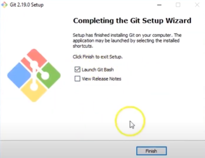
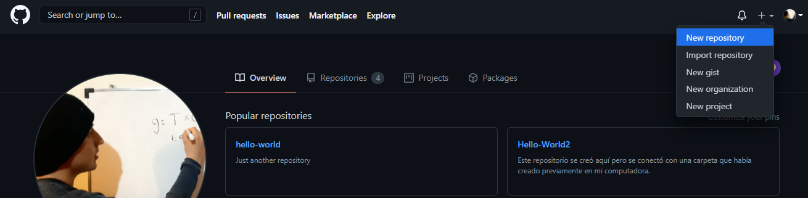

# ¿Qué es Git y para qué aprenderlo?

Es un controlador de versiones _(de código)_ esto quiere decir que se puede dar seguimiento a los cambios que se hagan en los archivos de código que pueden ser con lenguaje de R, Python, Java, entre muchos otros. Su importancia radica en que podemos rastrear todos los cambios: desde que subimos el primer código, lo modificamos-cargamos, hasta que terminamos el proyecto. Esto implica que se pueden rastrear errores por la fecha en que se “subió-cargó” el código y a hacer cambios desde alguna de las versiones anteriores. 

__El objetivo de este tutorial__ es que se aprendan las herramientas necesarias para realizar trabajo en equipo donde se use código de manera remota. 

Pensemos en una situación donde un grupo de personas desea realizar un proyecto para un análisis estadístico con R pero no se pueden reunir por cuestiones de una pandemia y tienen horarios difíciles de ajustar para _conectarse_ a trabajar a la misma hora. Las personas se podrían organizar de diversas formas como crear grupos en plataformas de Facebook, Slack, WhatsApp, etcétera, sin embargo, el manejo del archivo base _(el código de R)_ sería impráctico y muy ineficiente. Es por lo anterior que trabajar con Git y GitHub permitirá facilitar el manejo del archivo principal (o los múltiples archivos) sin necesidad de mandar distinas versiones por mensaje de texto, trabajar en el mismo horario o por turnos. Estas plataformas facilitan el desarrollo de proyectos que involucren código con orden y a gran escala.

## Instalar Git en Windows 

1. Ir a la [URL](https://git-scm.com/download/win) para iniciar la descarga de Git para Windows.
2. Una vez descargado el programa, ejecutarlo y seguir los pasos que se muestran. Cuando aparezca la ventana "Completing the Git Setup Wizard", seleccionar solo la opción "Launch Git Bash" y dar clic en finalizar.

{width='250px'}

3. Para configurar Git en tu computadora ingresamos el siguiente comando en Git Bash: 

`git config --global user.name "tu user_name"` 

y posteriormente el comando 

`git config --global user.mail tu_email@mail.com`

## Instalar Git en Mac _Eduardo_

## Conceptos básicos

- Directorio: mejor conocido como carpeta o folder, el directorio contiene los archivos de los cuales se desea tener el control de versiones.

{width='100px'}

- Terminal o linea de comandos. Es una interface de texto donde se escriben los comandos que posteriormente usaremos para tener el control de los archivos y la modificación de los mismos.

    Para poder hacer uso de la terminal basta poner el buscador de Windows `GitBash` y dar click. Entonces aparecerá la terminal donde se escribirán todos los comandos.
    
    

    

    {width='300px'}
    

    

- Línea de comandos: se compone de comandos como `git status` o `cd \Documentos`

###### cd {#cd}
- cd: permite cambiar de directorio, lo que es equivalente a un doble click para entrar en una carpeta. Por ejemplo, escribir `cd Documentos` permitirá ingresar a la carpeta llamada "Documentos". __Hint:__ si el nombre de tu carpeta es demasiado grande, basta escribir `cd`, luego las primeras dos letras del nombre de la carpeta a la cual quieres llegar y por último oprimir la tecla `tabulador`. El tabulador completa el nombre haciendo la escritura eficiente.

- clear: funciona para eliminar las líneas de código que se han escrito en la terminal hasta el momento. Esto solo es visual, no quita las instrucciones previas, solo “limpia” la terminal.

    Es importante aprender a usar la “Terminal” y sus comandos porque a partir de ellos se hace más fácil la instalación de programas o su _“lectura-corrimiento-carga”_ (run programs). Esta forma de trabajar es para tener experiencia como “desarrollador” de algún proyecto. __Nota.__ La función ctrl+c, ctrl+v no sirven para pegar o copiar en la terminal. Así que se debe hacer la selección de lo que se quiera copiar con el click derecho para copiar y así mismo para pegar.

- Editor de código: programa para desarrollar líneas de código, por ejemplo `RStudio`, `Java`, `Spyder`, `Notepad++`, `Visual Studio Code`, entre otros.

- Repositorio (repository). También se conoce repositorio de Git y es lo equivalente a un directorio, la diferencia es que se llama repositorio una vez que se inicializa en Git (ver [detalles](#IR)).

## Inicializar un repositorio {#IR}

Para incializar un repositorio localmente en una carpeta ya existente, es necesario abrir la `Terminal` y situarnos dentro de dicha carpeta _(usar cd)_. Posteriormente ingresamos el comando 
`git init`. El repositorio que creamos contiene los archivos que están dentro de la carpeta y apartir de ahora Git llevará el registro de los cambios en estos archivos.

## Comandos principales {#cp}

Los comandos que se muestran a continuación se usan con el prefijo `git` y en minúsculas. Por ejemplo: `git diff`. Tales comandos se usan en la terminal una vez que estamos en el repositorio inicializado.

{width='300px'}

### Add

Cuando se quieren agregar, borrar o modificar “archivos” (por ejemplo un `archivo.R`) en un repositorio hay que “avisar” a Git sobre esos cambios para que los agregue al historial de cambios en el código. Lo anterior se hace con la función `add` a la cual le procede el nombre del archivo que se va a añadir, por ejemplo: `git add archivo.rmd`. En caso de que se quieran añadir todas las actualizaciones de todos los archivos en el repositorio se usa el comando `git add .`

### Commit

Una vez que se añadieron los cambios, hay que confirmarlos con este comando. La confirmación se hace con un mensaje que describa los cambios hechos. Por ejemplo: 

`git commit -m "Este es el mensaje principal" -m "Aquí se puede hacer una descripción` `más detallada del cambio que se hizo al archivo correspondiente."`

### Status

Permite conocer el estado en que se encuentran los archivos que se cambiaron o borraron antes de que se añadiera (`add`) y confirmara (`commit`) el cambio. Ejemplo de esto es lo que se muestra en la imagen de comandos principales.

### Diff

El comando `git diff` nos permite comparar los cambios entre el último commit realizado y los archivos que se encuentrar en el staging area (los cambios que hemos añadido con `add` sin hacer `commit` aún).

### Log

Este comando nos muestra la lista de los commits que se han realizado en el repositorio. La lista incluye el hash de cada commit, su autor y el mensaje correspondiente. 
Aparecen ordenados del más reciente al más antiguo. Es posible que para visualizar toda la lista tengamos que usar la tecla de espacio hasta llegar al último commit, después del cual aparece `END`. Para salir de esta visualización, usamos la tecla `q`.

La siguiente imagen da una idea vizual de lo que ocurre en cada comando que aplicamos (incluyendo los que se explicarán con mayor detalle posteriormente).

{width='500px'}

# ¿Qué es GitHub y para qué sirve?

GitHub es un servicio de hosting para repositorios, el cual se puede usar de manera conjunta con Git. Nos permite conectar repositorios de manera remota, lo que facilita el trabajo colaborativo. Para trabajar con GitHub debemos contar con conexión a internet, la cual no es necesario cuando usamos solo Git. GitHub ofrece una interfaz gráfica que facilita el uso de Git para principiantes.

La importancia de esta plataforma radica en que no sólo se puede tener un control de los cambios que se hacen en el código (Git) sino que además estos pueden estar disponibles para un conjunto de personas que trabajen en el código de manera remota y asincrónica.

## Diferencias entre Git y GitHub

| Git                                                | GitHub                                             |
|----------------------------------------------------|----------------------------------------------------|
| Se puede usar sin GitHub                           | Depende de Git para poder usarse                   |
| Trabajo sin conexión a internet                    | Requiere conexión a internet                       |
| El repositorio se almacena localmente              | El repositorio se almacena en la nube              |
| Todos los comandos se introducen desde la Terminal | Pueden hacerse cambios usando la interfaz gráfica |

## Crear una cuenta

Para usar GitHub es necesario crear una cuenta en la [página de GitHub](https://github.com/) para lo que se requiere una cuenta de correo y una contraseña.

## De GitHub a Git

Una vez que hemos creado una cuenta en GitHub podemos hacer al menos dos cosas: trabajar en los archivos de un repositorio creado por otro usuario de GitHub __o__ crear nuestro propio repositorio en GitHub e invitar a nuestros colaboradores para trabajar en los archivos que ahí se encuentren.

### Crear un repositorio {#CR}

1. Entrar a tu cuenta en GitHub previamente creada.
2. Seleccionar el `+` en la esquina superior derecha.
3. Seleccionar la pestaña `New repository`.

{width='450px'}

4. Dar nombre y una breve descripción al repositorio.
5. Seleccionar el botón `Create repository`

_Nota:_ Es posible que quieras añadir un archivo de texto que contenga la descipción de lo que se ha hecho a lo largo del proyecto en el repositorio, para lo cual es necesario seleccionar el botón que dice: `create a README`. 

{width='430px'}

Este repositorio aún no está en la computadora local, por lo cual se debe "clonar" tal repositorio. En el siguiente apartado veremos cómo.

### Clonar un repositorio

Clonar un repositorio significa “traer” (a tu computadora) archivos que están en algún repositorio de GitHub _(puede o no ser tuyo)_ y no están en tu computadora. Es importante “traer” los archivos para que puedas modificarlos y este cambio se vea reflejado en GitHub. _La palabra `clonar` es distinta a “descargar” porque una vez que se usó el comando ”clone”, no es necesario hacerlo en cada ocasión como cuando se hacen descargas._ Con este comando es posible que las personas que colaboran en un proyecto (repositorio) tengan en sus computadoras los archios actualizados que se encuentran en el servidor de GitHub.

La forma de "traer" el código es usar el comando `git clone` [dentro de la carpeta](#cd) en la que se quiere guardar dicho repositorio con la terminal y posteriormente la liga de la dirección de GitHub. Para obtener la liga del repositorio de GitHub simplemente hay que seleccionar _(en nuestro repositorio de GitHub)_ la palabra `Code` y posteriormente copiar y pegar la liga que ahí aparece.

###### url {#url}

{width='400px'}

 
De lo cual, en la terminal, obtenemos lo siguiente:

{width='450px'}

Hasta este momento sabemos cómo crear un repositorio en GitHub y conectarlo con nuestra máquina local lo que nos permite trabajar en equipo con archivos de código sin necesidad de conectarnos _(como equipo de trabajo)_ en un horario particular. Los comandos para hacer las actualizaciones entre tu máquina local (Git) y el servidor (GitHub) se llaman `pull`-`push`. Tales comandos además de los [comandos principales](#cp) permiten lograr un trabajo en equipo eficiente.

## De Git a GitHub

Es posible conectar un repositorio local existente con un repositorio remoto. Primero es necesario crear un repositorio nuevo en GitHub y copiar [la URL](#url) de éste. Usando el comando `git remote add origin url` _(donde `url` es la URL del repositorio nuevo de GitHub_) en la terminal y directorio inicializado, creamos la conexión entre el repositorio local y el remoto.

{width='450px'}

### Push

Para subir los cambios realizados en el repositorio local al repositorio remoto (actualizar en GitHub los cambios que realizamos en la máquina local) es necesario usar el comando `git push` __después de__ hacer `add` y `commit`. Como un repositorio puede estar conectado con más de un repositorio remoto y tener varias [ramas](#branch), debemos especificar ambas cosas al hacer el `push`. Trabajando en el repositorio remoto `origin` y la rama `main` (default), el comando es `git push origin main`. 

### Pull

Para "jalar" los cambios que se tienen en el repositorio remoto y actualizar los archivos en nuestro repositorio local se usa el comando `git pull` (en el repositorio local dentro de la terminal).

## Trabajo Colaborativo

Hasta ahora hemos visto la manera de trabajar un repositorio en Git y/o GitHub, así como los comandos para actualizar los cambios. 

Supongamos que en un proyecto, como puede ser el desarrollo de un videojuego, hay distintas partes del código donde se requiere hacer cambios o mejoras y es necesario no modificar el funcionamiento actual del proyecto hasta tener las otras partes completamente desarrolladas e incluirlas solo cuando ya sabemos que funcionan de manera adecuada. Además, queremos que distintos miembros del equipo trabajen en diferentes partes al mismo tiempo sin alterar el trabajo de los demás. Es en este caso donde el uso de las ramas de un repositorio es indispensable.

### Branch - Ramas {#branch}

{width='350px'}

Una rama (branch) de un repositorio puede considerarse como "un universo paralelo" del proyecto, pues los cambios que se realizan en ésta no afectan el contenido de las otras ramas existentes. Tener distintas ramas en un repositorio nos permite mantener distintas versiones de un mismo proyecto. 

Al crear una rama estamos copiando todo el contenido de la rama principal (main) hasta ese momento, incluyendo el historial de los commits realizados. Sin embargo, una vez que empezamos a modificar la nueva rama, el contenido de la rama principal no se ve alterado hasta que queramos [fusionar](#Merge) las ramas.

Cada miembro del equipo puede crear una rama en el repositorio para trabajar en distintas partes sin afectar el trabajo de los demás (antes de fusionar). Por ejemplo, en el desarrollo de un videojuego, un integrante puede dedicarse a trabajar en aumentar las funciones de los lugares donde se desarrolla el juego mientras otro se dedica a trabajar en la configuración de los idiomas, etc.

#### Comandos para trabajar en ramas

- `git branch`: Muestra el listado de las ramas existentes hasta el momento, además de indicar con un asterisco la rama en la que nos encontramos. Por default siempre existe la rama principal (main/master).

- `git checkout -b nombre_de_la_rama`: Crea una rama con nombre `nombre_de_la_rama`.

- `git checkout nombre_de_la_rama`: Sirve para cambiar de rama. En este caso, nos cambiamos a la rama que se llama `nombre_de_la_rama`. Ya que estamos posicionados en la rama en la que queremos trabajar usamos los comandos vistos anteriormente (add, commit, pull, push, etc.) para registrar los cambios. Para registrar los cambios en el repositorio remoto, debemos especificar en el push la rama donde se guardarán usando el comando `git push --set-upstream origin nombre_de_la_rama`.

- `git diff rama_1..rama_2`: Muestra las diferencias entre las ramas `rama_1` y `rama_2`.

- `git branch -d nombre_de_la_rama`: Elimina la rama `nombre_de_la_rama`. Se utiliza cuando ya hemos hecho la fusión de esta rama con la rama principal y ya no la necesitamos.

### Merge - Fusión {#Merge}

Una vez que hemos trabajado en una rama y realizamos todos los cambios necesarios, podemos fusionar estos cambios con el contenido de la rama principal. Para esto usamos el comando `git merge rama_secundaria rama_principal`, el cual fusiona la rama_secundaria con la rama_principal. 

#### Conflictos al fusionar ramas

Supongamos que mientras trabajabamos en una nueva rama, el contenido de la rama principal se modificó después de haber creado la nueva rama, por lo que ésta no incluye dichos cambios.

- Un conflicto que suele surgir al fusionar ramas es cuando no se han actualizado los cambios que sufrió la rama principal en nuestra rama secundaria. Esto se puede resolver de la siguiente forma:

     1. Añadir los cambios al repositorio local (add).
     2. Confirmar dichos cambios (commit).
     3. Actualizar el contenido de la rama principal en la rama secundaria (pull origin main).
     4. Hacer la fusión (push --set-upstream origin nombre_de_la_rama).
     5. Generar un pull request para hacer la fusión entre las ramas.

# RStudio - Git - GitHub

Es posible conectar con Git y GitHub desde RStudio, lo cual tiene la ventaja de que al modificar archivos en RStudio podemos registrar los cambios en el repositorio sin la necesidad de movernos a la Terminal. Para hacer esto posible, es necesario verificar primero que Git esté instalado correctamente y R y RStudio estén actualizados (con una versión de R de 4.0 o más reciente debería funcionar correctamente). Una vez cumplidos estos requisitos, debemos verificar que Git esté conectado con RStudio en _Tools_ -> _Global options_ -> _Git/SVN_ verificando que el directorio de git.exe que se solicita sea el correcto.

## Conectar un proyecto nuevo de RStudio con Git

La forma más sencilla de comenzar a trabajar Git con RStudio es creando un nuevo proyecto desde RStudio y seleccionar la opción que se muestra:

{width='350px'}

Con esto se creará un repositorio de Git localmente en conjunto con el proyecto de R. Podemos agregar archivos ya existentes a este repositorio para comenzar a registrar los cambios con Git.

## Clonar un repositorio de GitHub desde RStudio

Podemos clonar un repositorio de GitHub a nuestra computadota directamente desde RStudio creando un nuevo proyecto y seleccionando la opción _Version control_.

{width='350px'}

Posteriormente, pegamos el [link de GitHub](#url) del repositorio que queremos clonar. 

Para realizar los comandos previamente presentados (como `add`, `commit`, `pull`, `push`) sin necesidad de usar la terminal tenemos que:

1. Abrir un proyecto de R creado con `Version Control` de Git.
2. Abrir un archivo _(.R, .rmd, etc.)_ __dentro__ del proyecto.
3. Seleccionar la pestaña de `Git`.
4. Para los comandos:
    - `add`: seleccionar la palomita.
    - `commit`: seleccionar `Commit`.
    - `push`: seleccionar la flecha verde que apunta hacia arriba.
    - `pull`: seleccionar la flecha azul que apunta hacia abajo.

{width='350px'}

