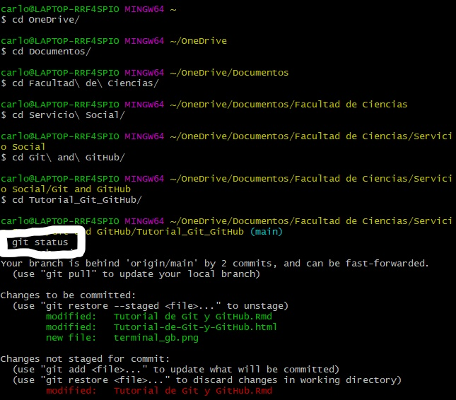

# ¿Qué es Git y para qué sirve?

Es un controlador de versiones _(de código)_ esto quiere decir que se puede dar seguimiento a los cambios que se hagan en los archivos de código que pueden ser con lenguaje de R, Python, Java, entre muchos otros. Su importancia radica en que podemos rastrear todos los cambios: desde que subimos el primer código, lo modificamos-cargamos, hasta que terminamos el proyecto. Esto implica que se pueden rastrear errores por la fecha en que se “subió-cargó” el código y a hacer cambios desde alguna de las versiones anteriores. 

__El objetivo de este tutorial__ es que se aprendan las herramientas necesarias para realizar trabajo en equipo donde se use código de manera remota. 

Pensemos en una situación donde un grupo de personas desea realizar un proyecto para un análisis estadístico con R pero no se pueden reunir por cuestiones de una pandemia y tienen horarios difíciles de ajustar para _conectarse_ a trabajar a la misma hora. Las personas se podrían organizar de diversas formas como crear grupos en plataformas de Facebook, Slack, WhatsApp, etcétera, sin embargo, el manejo del archivo base _(el código de R)_ sería impráctico y muy ineficiente. Es por lo anterior que trabajar con Git y GitHub permitirá facilitar el manejo del archivo principal (o los múltiples archivos) sin necesidad de mandar distinas versiones por mensaje de texto, trabajar en el mismo horario o por turnos. Estas plataformas facilitan el desarrollo de proyectos que involucren código con orden y a gran escala.

## Instalar Git en Windows 

1. Ir a la [URL](https://git-scm.com/download/win) para iniciar la descarga de Git para Windows.
2. Una vez descargado el programa, ejecutarlo y seguir los pasos que se muestran. Cuando aparezca la ventana "Completing the Git Setup Wizard", seleccionar solo la opción "Launch Git Bash" y dar clic en finalizar.

{width='250px'}

3. Para configurar Git en tu computadora ingresamos el siguiente comando en Git Bash: 

`git config --global user.name "tu user_name"` 

y posteriormente el comando 

`git config --global user.mail tu_email@mail.com`

## Instalar Git en Mac _Eduardo_

## Conceptos básicos

- Directorio: mejor conocido como carpeta o folder, el directorio contiene los archivos de los cuales se desea tener el control de versiones.

{width='100px'}

- Terminal o linea de comandos. Es una interface de texto donde se escriben los comandos que posteriormente usaremos para tener el control de los archivos y la modificación de los mismos.

    Para poder hacer uso de la terminal basta poner el buscador de Windows `GitBash` y dar click. Entonces aparecerá la terminal donde se escribirán todos los comandos.
    
    

    

    {width='300px'}
    

    

- Línea de comandos: se compone de comandos como `git status` o `cd \Documentos`

- cd: permite cambiar de directorio, lo que es equivalente a un doble click para entrar en una carpeta. Por ejemplo, escribir `cd Documentos` permitirá ingresar a la carpeta llamada "Documentos". __Hint:__ si el nombre de tu carpeta es demasiado grande, basta escribir `cd`, luego las primeras dos letras del nombre de la carpeta a la cual quieres llegar y por último oprimir la tecla `tabulador`. El tabulador completa el nombre haciendo la escritura eficiente.

- clear: funciona para eliminar las líneas de código que se han escrito en la terminal hasta el momento. Esto solo es visual, no quita las instrucciones previas, solo “limpia” la terminal.

    Es importante aprender a usar la “Terminal” y sus comandos porque a partir de ellos se hace más fácil la instalación de programas o su _“lectura-corrimiento-carga”_ (run programs). Esta forma de trabajar es para tener experiencia como “desarrollador” de algún proyecto. __Nota.__ La función ctrl+c, ctrl+v no sirven para pegar o copiar en la terminal. Así que se debe hacer la selección de lo que se quiera copiar con el click derecho para copiar y así mismo para pegar.

- Editor de código: programa para desarrollar líneas de código, por ejemplo `RStudio`, `Java`, `Spyder`, `Notepad++`, `Visual Studio Code`, entre otros.

- Repositorio (repository). También se conoce repositorio de Git y es lo equivalente a un directorio, la diferencia es que se llama repositorio una vez que se inicializa en Git (ver [detalles](#IR)).

## Inicializar un repositorio {#IR}

Para incializar un repositorio localmente en una carpeta ya existente, es necesario abrir la Terminal y situarnos dentro de dicha carpeta. Posteriormente ingresamos el comando 
`git init`. El repositorio que creamos contiene los archivos que están dentro de la carpeta y apartir de ahora Git llevara el registro de los cambios en estos archivos.

## Comandos principales

Los comandos que se muestran a continuación se usan con el prefijo `git` y en minúsculas. Por ejemplo: `git diff`. Tales comandos se usan en la terminal una vez que estamos en el repositorio inicializado.

{width='300px'}

### Add

Cuando se quieren agregar, borrar o modificar “archivos” (por ejemplo un `archivo.R`) en un repositorio hay que “avisar” a Git sobre esos cambios para que los agregue al historial de cambios en el código. Lo anterior se hace con la función `add` a la cual le procede el nombre del archivo que se va a añadir, por ejemplo: `git add archivo.rmd`. En caso de que se quieran añadir todas las actualizaciones de todos los archivos en el repositorio se usa el comando `git add .`

### Commit

Una vez que se añadieron los cambios, hay que confirmarlos con este comando. La confirmación se hace con un mensaje que describa los cambios hechos. Por ejemplo: 

`git commit -m "Este es el mensaje principal" -m "Aquí se puede hacer una descripción` `más detallada del cambio que se hizo al archivo correspondiente."`

### Status

Permite conocer el estado en que se encuentran los archivos que se cambiaron o borraron antes de que se añadiera y confirmara (usando commit) el cambio. Ejemplo de esto es lo que se muestra en la imagen de comandos principales.

### Diff

El comando `git diff` nos permite comparar los cambios entre el último commit realizado y los archivos que se encuentrar en el staging area (los cambios que hemos añadido con `add` sin hacer `commit` aún).

### Log

Este comando nos muestra la lista de los commits que se han realizado en el repositorio. La lista incluye el hash de cada commit, su autor y el mensaje correspondiente. 
Aparecen ordenados del más reciente al más antiguo. Es posible que para visualizar toda la lista tengamos que usar la tecla de espacio hasta llegar al último commit, después del cual aparece `END`. Para salir de esta visualización, usamos la tecla `q`.

# ¿Qué es GitHub y para qué sirve?

GitHub es un servicio de hosting repositorios, el cual se puede usar de manera conjunta con Git. Nos permite conectar repositorios de manera remota, lo que facilita el trabajo colaborativo. Para trabajar con GitHub debemos contar con conexión a internet, la cual no es necesaria cuando usamos solo Git. GitHub ofrece una interfaz gráfica que facilita el uso de Git para principiantes.

## Diferencias entre Git y GitHub

| Git                                                | GitHub                                             |
|----------------------------------------------------|----------------------------------------------------|
| Se puede usar sin GitHub                           | Depende de Git para poder usarse                   |
| Trabajo sin conexión a internet                    | Requiere conexión a internet                       |
| El repositorio se almacena localmente              | El repositorio se almacena en la nube              |
| Todos los comandos se introducen desde la Terminal | Pueden hacerse cambios usando la interfaz gráfica |

## Crear una cuenta

Para usar GitHub es necesario crear una cuenta en [página de GitHub](https://github.com/) para lo que se requiere una cuenta de correo y una contraseña.

## De GitHub a Git

Una vez que hemos creado una cuenta en GitHub podemos hacer al menos dos cosas: trabajar en los archivos de un repositorio creado por otro usuario de GitHub o crear nuestro propio repositorio en GitHub e invitar a nuestros colaboradores para trabajar en los archivos que ahí se encuentren.

### Crear un repositorio {#CR}

### Clonar un repositorio

Clonar un repositorio significa “traer” (a tu computadora) archivos que están en algún repositorio de GitHub  y no están en tu computadora. Es importante “traer” los archivos para que puedas modificarlos. La palabra no clonar es distinta “descargar” porque una vez que se usó el comando ”clone” en un archivo, no es necesario hacerlo en cada ocasión como cuando se hacen descargas. 

La forma de "traer" el código es usar la función `git clone` dentro de la terminal y posteriormente la [liga de la dirección de GitHub](#CR).

## De Git a GitHub

Es posible conectar un repositorio local existente con un repositorio remoto. Primero es necesario crear un repositorio nuevo en GitHub y copiar la URL de éste. Usando el comando `git remote add origin url` (donde `url` es la del repositorio nuevo de GitHub) creamos la conexión entre el repositorio local y el remoto.

### Push

Para subir los cambios realizados en el repositorio local al repositorio remoto es necesario usar el comando `git push` después de hacer `add` y `commit`. Como un repositorio puede estar conectado con más de un repositorio remoto y tener varias [ramas](#branch), debemos especificar ambas cosas al hacer el `push`. Trabajando en el repositorio remoto `origin` y la rama `main` (default), el comando es `git push origin main`. 

### Pull

## Trabajo Colaborativo

### Branch - Ramas {#branch}

### Merge - Fusión

# RStudio - Git - GitHub

