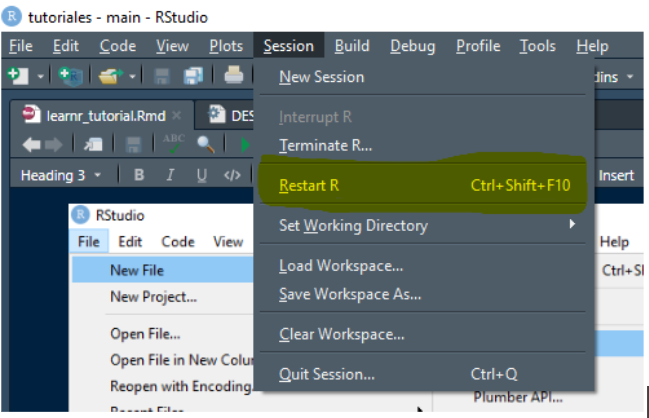
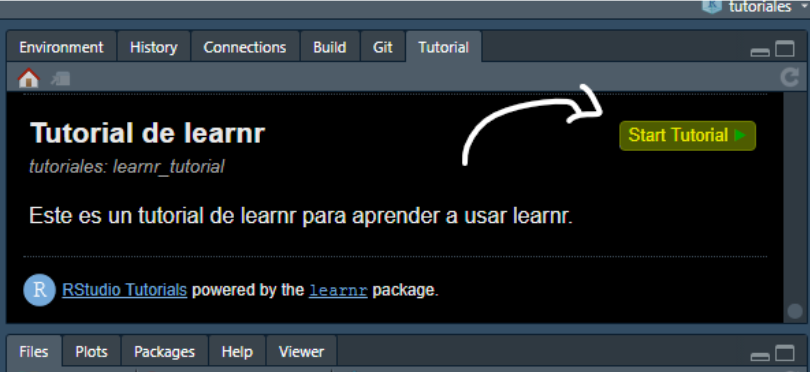

# Shiny (online)

El tutorial estaría disponible online y las personas usuarias no necesitan descargar R.

1.  Crear cuenta con de shiny <https://www.shinyapps.io/admin/#/login>

2.  Abrir en la esquina superior derecha de tu perfil (donde está para poner tu foto) Darle en el bontón de *Publish*.

3.  Ver el video: <https://www.youtube.com/watch?v=ZKWLfW4zBYs>

# Crea tu paquete de R.

-   Podemos crear un paquete de R para compartir tutoriales interactivos.
-   Una vez descargado el paquete, los usuarios pueden correr el tutorial localmente.
-   No es necesario que el paquete esté publicado en CRAN ni que contenga funciones o datos.

## Pasos a seguir:

**Crear un proyecto en R conectado a GitHub.**

1.  Crear un repositorio en GitHub. El nombre del repositorio será el nombre del paquete.
2.  Copiar la URL del repositorio.
3.  En RStudio crear un nuevo proyecto con control de versiones: `File \> New Project \> Version Control \> Git`
4.  Pegar la URL del repositorio.

**Crear el paquete.**

1.  Crear la infraestructura necesaria para un paquete usando el comando:

`usethis::create_package("<ruta al folder/nombre_del_paquete>")`

2.  Seleccionar "No" cuando pregunte si queremos sobreescribir el proyecto. Se abrirá una nueva sesión de RStudio que incluye la ventana "Build". Cerrar la primera sesión.

**Añadir un tutorial al paquete.**

1.  Crear el tutorial y abrirlo para editarlo:

`usethis::use_tutorial("nombre_del_archivo", "Nombre del tutorial que el     usuario verá", open = interactive())`

2.  Editar el archivo del tutorial como se desee.
3.  Construir, instalar y usar el tutorial del paquete. Dar click en *Install and Restart* en la ventana de *Build* o usar el comando `devtools::install()`.
4.  En la ventana de *"Tutorials"* debe aparecer el tutorial creado. Dar click en *"Start Tutorial"* o usa el comando `learnr::run_tutorial("nombre_del_archivo", "nombre_del_paquete")`.

### Opcional: Añadir dependencias

Cuando tu tutorial incluye funciones o datos de otros paquetes, podemos incluirlos dentro del paquete que contiene el tutorial. Este proceso es diferente para cuando usamos un paquete en desarrollo y un paquete publicado en CRAN.

**Usar paquetes en desarrollo.**

-   Usar el comando `usethis::use_dev_package("<paquete_externo>")`.

    Podemos confirmar que se ha incluido al paquete en la parte de Remotes abriendo el archivo DESCRIPTION de nuestro nuevo paquete.

**Usar paquetes de CRAN.**

-   Usar el comando `usethis::use_package("<paquete_en_CRAN>")`.

    Podemos confirmar que se ha incluido al paquete en la parte de Imports abriendo el archivo DESCRIPTION de nuestro nuevo paquete.

### Compartir el paquete con el tutorial

Una vez construido el paquete:

1.  Hacer commit y push en el repositorio.

2.  Los usuarios podrán descargar e instalar el paquete usando el comando `devtools::install_github("<nombre_del_usuario_de_github>/<nombre_del_paquete>")`

    Se requiere que tengan instalado el paquete learnr para poder correr el tutorial. Pueden correr el tutorial desde la ventana de "Tutorials" o usar el comando learnr::run_tutorial("nombre_del_archivo", "nombre_del_paquete")

### ¿Qué tiene que hacer un usuario para descargar y ver nuestro tutorial?

1.  Abrir RStudio

2.  Instalar `devtools`: `install.packages(“devtools”)` o `remotes`: `install.packages(“remotes”)`

3.  Si no ha instalado `learnr`, usar el comando `install.packages(“learnr”)`.

4.  En la consola escribir `remotes::install_github(“CarlosA-Ar/tutoriales")`

    Aparecerá un mensaje para el cual debe apretar la tecla enter.

5.  Reiniciar sesión.:

    {width="497"}

6.  Dar click en `Tutorial` y luego abrir el tutorial:

    {width="567"}

Los pasos 5 y 6 se pueden sustituir poniendo en la consola: `learnr::run_tutorial("tutorial_learnr", "tutoriales")`.
