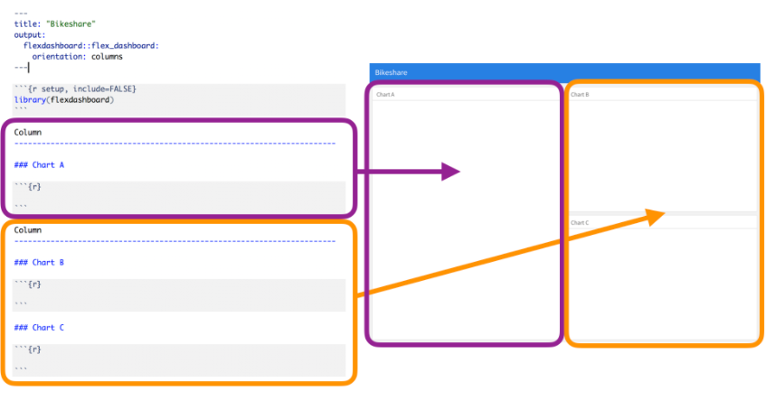
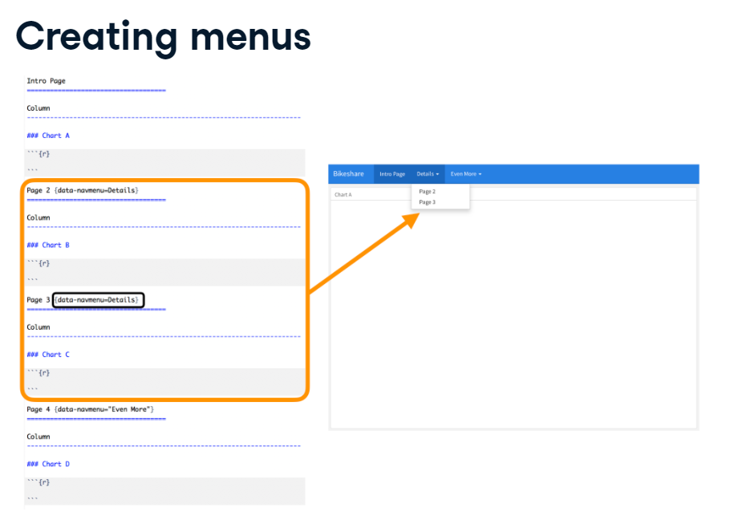
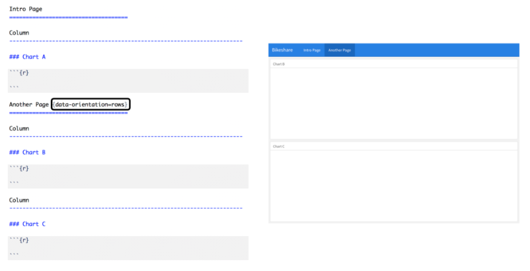
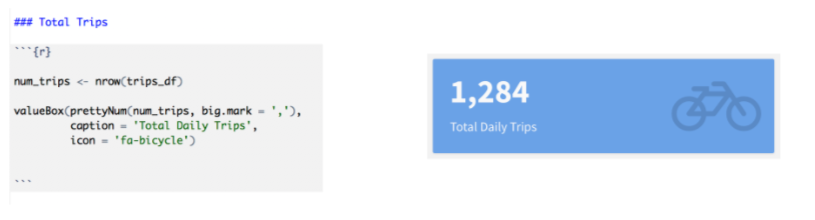
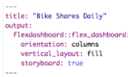
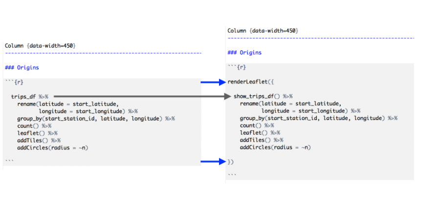

```{r settings, message=FALSE, warning=FALSE}
# Librerías
#install.packages("flexdashboard")
library(flexdashboard)
library(ggplot2)
library(plotly)
library(leaflet)

# Opciones Globales
knitr::opts_chunk$set(warning = FALSE, message = FALSE, eval = FALSE)

```

## 1. Estructura de un flexdashboard.

Un **dashboard** o tablero, es un documento donde se puede consultar iformación de direntes tipos de una manera simple, compuesto por "tablas" que pueden contener gráficos, tablas, texto y mapas.

En particular **flexdashboard** es un paquete de R que tiene el objetivo de crear un **dashboard** pero a partir de un [archivo Rmd](https://tutorialesmg.netlify.app/r-markdown) e incluso poner componentes interactivos con [shiny](https://shinys.netlify.app/).

### Crear el flexdashboard.

Para eso tenemos que:

1.  Generar un archivo Rmd

2.  Cambiar el encabezado YAML donde el `output` será: `felxdashboard::flex_dashboard`

3.  **Charts.** Agregar `chart's`. Los chart son los componentes del dashboard y tienen la finalidad de "dividir" un flex dashboard. Cada chart creado se vuelve en automático una columna, sin embargo se pueden hacer mpultiples charts en una columna, así como múltiples columnas.

4.  Para entender el punto anterior:

    

5.  Podemos ajustar el ancho de las columnas a nuestro gusto usando: `Column {data-width = lo_que_sea}` donde "lo que sea" va de 1 a 1000.

6.  Si en vez de hacer el acomodo de lo que deseamos en columnas, lo queremos en filas, simplemente agregamos una especificación en el encabezado YAML como sigue:

        output: 
          flexdashboard::flex_dashboard:
            orientation: rows

7.  Si usas la sintáxis anterior, ahora veremos lo resultados de manera horizontal y además en vez de definir el ancho, se define el alto por lo que la sintáxis siguiente: `Row {data-heigh = 456}` permitirá que la altura de la Fila sea de 456. Esto se ponría en vez del punto 5.

8.  Si no te alcanza todo en una hoja, puedes permitir que el usuario vea un tipo documento Rmd, pero eso no es lo usual. De cualquier manera, puedes hacerlo agregando en el YAML lo siguiente:

        output: 
          flexdashboard::flex_dashboard:
            orientation: columns
            vertical_layout: scroll

    Por defecto `vertical_layout: fill` lo cual significa que cada chart definido aquí se verá en una sola página ajustando el largo, por tanto si el usuario hace más grande su ventana, en esta proporción se alargarán los charts.

    Lo anterior no pasa cuando `vertical_layout: scroll`, de hecho, con este comando se está diciendo que se respete el largo de cada chart aun cuando el usuario cambie el largo de la ventana. Esta indicación es útil para que puedas crear muchos charts y el usuario pueda "ir hacia abajo" en el contenido.

9.  **Tabset.** Una mejor solución al punto 8, es agregar varios charts por cada columna . Esto se hace:

    

    El uso de estas herramientas se hace para poder presentar información secundaria e interesante que no es la primordial.

    *Los .tabset van en las columnas*

10. **Pages.** Si aún con lo anterior no te quedas convencid\@, no te preocupes, puedes agregar tantas páginas como desees, para indicar esto, necesitas al menos 16 signos de igual y en el renglón de arriba, el nombre de la página correspondiente.

    

11. **Menú de páginas.** Aún más!!! Puedes generar un menú de páginas para cada página agregando (En la página) `{data-navmenu=Nombre_del_menú}`. Esto está incrible porque te permite insertar muchas hojas en un mismo tema.

    Es importante que cada una de las hojas que quieras meter en un mismo menú tengan el mismo `Nombre_de_menú`.

    

Ahora, recuerda que existen dos tipos de "acomodos" que son por columnas o filas. Si en alguna de tus páginas tienes la intención de cambiar la orientación, puedes hacerlo:



Añadiendo el atributo `data-orientation = (rows/columns)` solo puedes elegir rows o columns.

Hasta ahora puedes tener una estructura de flexdashboard increíble.

## 2. Gráficos interactivos

### Gráficos

La ventaja de flexdashbard es la posibilidad de insertar el cógido del gráfico dentro del chunk (como en Rmd) pero no solo eso, sino que existen formas de solcionar que el gráfico se ajuste a las medidas según el usuario abra una ventana más chica o más grande.

Las opciones siguientes dentro del "encabezado" del chunk de código, permitirán ajustar las dimensiones del gráfico que se verá (en cualquiera de los `charts`).

-   `fig.width =` 10, es para ajustar el ancho del gráfico.

-   `fig.height =` 6, es para ajustar la altura del gráfico.

### Plotly

Para poder sanar los problemas de cambiar tamaños para ser más amigables con el usuario o usuaria del Dashboard, podemos usar diversas opciones que sirven para hacer interactivo el usuario con el gráfico.

Estas son algunas opciones:


La ventaja de `plotly` es que podemos hacer gráficas interactivas sin necesidad de saber más que `ggplot`.

Para hacerlo simplemente hay que hacer lo siguiente:

```{r}
#Primero definimos el gráfico con la función ggplot (recuerda que puede ser)
#un gráfico muy muy elaborado
mi_grafico_con_ggplot <- ggplot(data = data, aes(x = x, y = y)) + 
                                  geom_line()

#Posteriormente solo metemos el gráfico (o incluso todo el código) dentro de la función "ggplotly"
ggplotly(mi_grafico_de_ggplot)

```

Las ventajas de usar este paquete es que el usuario tendrá más interacción con los gráficos generados a partir de ciertos datos. (Un histograma, gráfico de barras, boxplot, serie de tiempo, funciones de probabildiad *(densidad, distribución),* trayectorias de procesos estocásticos *(caminata aleatoria, movimiento browniano, proceso de renovación, cadena de markow a tiempo continuo-discreto)* o simplemente gráficos de funciones "no aleatorias" como polinómicas, logarítmicas, exponenciales, truncadas, etc...).

Más información [aquí](https://plotly.com/r/)

### Leaflet

Análogo a Plotly, esta paquetería permite generar gráficos interactivos pero para mapas, así es, un mapa que sirve para ver por ejemplo: cómo se distribuyen geográficamente los casos de contagio en una pandemia.

En general es importante de esta librería que sepas que las entradas, son coordenadas y que tales coordenadas son útiles para "ubicar" el dato con referencia a lo que quieres.

Por ejemplo:

```{r}
#Opción 1
addMarkers(addTiles(leaflet()), lat = stations_df$latitude, stations_df$longitude)

#Opción 2: más fácil
leaflet(stations_df) %>%
  addTiles() %>%
  addMarkers()
```

Más infromación [aquí](https://rstudio.github.io/leaflet/)

## 3. Destacar datos

### Números

Para destacar los números (datos en particular) se genera primero un chun de código dentro del cual se usará (demás de los cálculos para llegar al número) la función `valueBox(valor, caption = "Descripción del número", icon = "algún ícolo representativo del número")`

Al valor se le puede añadir cosas bonitas como comas o signos de pesos y eso se logra con la función `prettyNum(valor, big.mark = ",")`, esto se convertirá en el valor que irá dentro de la función `valueBox()`.

Al final tendremos lo siguiente:



Notemos que tiene la caja un color particular. Podemos añadir a la función `valueBox()` el parámetro `color` que indique otras posibilidades. Por ejemplo "primary" *(por defecto, azul)*, "info" *(amarillo)*, "success" *(verde)*, "warning" *(naranja)* y "danger" *(rojo).*

Hay otros parámetro sinteresantes para esta función que permiten que tengas un resultado más llamativo y completo.

### Medidores (como el de la gasolina)

Se usa la función `gauge()` que explicaremos con un ejemplo

```{r}
#Para dar una medida (por ejemplo el porcentaje de riesgo  
# de la población según su edad), creamos un medidor
gauge(value = valor_del_1_al_100, # <- que contiene los datos que medirá
      min = 0, # además de un mínimo aceptado (en el "rango" de la medida)
      max = 100, # y un máximo
  #Además podemos añadir un poquito de mensajes por si lo consideramos
      sectors = gaugeSectors(
        #Por ejemplo tenemos (en este código) éxito cuando el valor está 
        # entre 90 - 100
                    success = c(90, 100),
        # Sin embargo aparecerá un mensaje de advertencia cuando el valor
        # se encuentre entre 70-89
                    warning = c(70, 89),
                    danger = c(0, 69)
      ),
  # Además que podemos decir que el valor metido se le añadirá el símbolo
  # de porcentaje
      symbol = "%"
)
```

Notemos que cuando estamos en la zona de éxito, tenemos un color verde en la barra, naranja en la de "warning" y rojo en "danger".

### Interconectar

Podemos hacer que el dashboard sea un poco más interactivo logrando que el usuario al "dar click" sobre uno de los [Números], entonces el usuario vea otra pantalla con información más detallada al respecto de ese número.

Esto se hace con los pasos siguientes:

1.  Tener al menos dos páginas dentro del dashboard. Supongamos que una se llama Page 1 y otra Page 2
2.  Tener un valor (en alguno de los charts) con la función `valueBox()`. Supongamos que el valor está en la Page 1
3.  Supongamos que en Page 2 hay más información acerca de la obtención del valor de la Page 1.
4.  Añadir a la función `valueBox()` el parámetro `href` al que en este ejemplo se le asignará "\#page-2".

El proceso anterior permitirá que cuando el usuario de click sobre el valor (que aparece en la Page 1), entonces se redirija a la Page 2 para ver más detalles. *Nota que la referencia se quitan mayúsculas y los espacios se sustituyen por guines medios.*

### Tablas

Para poder ver gráficos de manera interactiva, puede ser intersante usar la librería **`DT`** que funciona particularmente para data frames.

Esta librería permite al usuario incluso descargar la información presentada en las tablas, por lo cual sí es una librería bastante amable con el usuario del dashboard.

En el ejemplo siguiente veremos cómo se usa:

```{r}
#Esta es la librería que necesitamos para poder hacer tablas interactivas
library(DT)

#Esta es la función que, así como en plotly, permite una tabla interactiva.
datatable(
  #Esta es la información que se desea
  mi_data_frame, 
  #Este parámetro indica que no se desean los números que siempre aparecen 
  #por defecto
  rownames = FALSE,
  #El argumento etentions permite que el usuario por medio de botones 
  # (en este caso) tenga acceso a los datos que se muestran en la tabla
  extensions = "Buttons",
  #Con diversas opciones
  options = list(
    dom = "Bfrtip",
    #Que hasta pueden copiar los datos y descargarlos en estos formatos.
    buttons = c("copy", "csv", "excel", "pdf", "print")
  )
  
)
```

La otra opción aunque es menos ineractiva es el uso de la función `kable` que de la misma forma le permitirá al usuario ver los datos aunque no pueda tener interacción con los mismos.

### Texto

A diferencia de cualquier RMarkdown, en los dashboar conviene añadir texto de una manera padre y eso de hace entro de los charts pero fuera de los chunks que este contiene además de que inician con un signo \> y luego un espacio.

Es probable que el trabajo presentado sea como una historia, es decir que se presente el desarrollo de resultados a lo largo del tiempo (y además se desea todo lo que se ha planificado en el dashboard en otras páginas).

Para poder desarrollar una historia EN TODO EL DASHBOARD es necesario agregar en el encabezado YAML lo siguiente:

{width="375"}

Donde `storyboard: true` significa que se hará una tipo historia.

Para poder construir esta historia se usa lo siguiente:


Donde lo azul es el título del chart (que contienen los códigos o gráficos, mapas, etc.) y lo negro es la descripcón que se pone al lado del contenido para explicar el mismo.


Posiblemente no quiere que todo el Dashboard sea una storyboard, por lo cual podemos hacer lo siguiente:

1.  Dentro de la página que queremos que sea Storyboard podemos añadir en las especificaciones `{.storyboard}` lo cual hará que tengamos una página que sea storyboard pero el resto será como en la [1. Estructura de un flexdashboard.]

## 4. Interacción con Shiny

Los dashboards que hemos creado con flexdashboard no soy tan interactivos como una shiny app, sin embargo, podemos hacerlo casi como una shiny app. SOlo hay que cambiar el encabezado YAML:

    ---
    title: "Mi primer dashboard"
    output: 
      flexdashboard::flex_dashboard:
        orientation: columns
        vertical_layout: fill
      dowload_code: true
    runtime: shiny
    ---

Empecemos con un ejemplo:

```{r}

library(flexdashboard)
library(readr)
library(leaflet)
library(DT)
library(tidyverse)
library(lubridate)
library(plotly)

options(shiny.sanitize.errors = FALSE)

trips_df <- read_csv('http://s3.amazonaws.com/assets.datacamp.com/production/course_6961/datasets/sanfran_bikeshare_joined_oneday.csv') %>%
  mutate(duration_min = duration_sec / 60)

sf_bbox <- c(-123.0137, 37.6040, -122.3549, 37.8324)
sj_bbox <- c(-122.0457, 37.1255, -121.5891, 37.4692)

trips_df <- trips_df %>%
  mutate(city = ifelse((start_latitude >= sf_bbox[2] & start_latitude <= sf_bbox[4]) & (start_longitude >= sf_bbox[1] & start_longitude <= sf_bbox[3]), 'San Francisco', ifelse((start_latitude >= sj_bbox[2] & start_latitude <= sj_bbox[4]) & (start_longitude >= sj_bbox[1] & start_longitude <= sj_bbox[3]), 'San Jose', 'Other')))

Column {data-width=200 .sidebar}
---------------------------------------------------------------


#Esto sirve para definir una opción de botones que sean "All, San Francisco"
# o San José. 

radioButtons("origin_location", label = "Select trip origin region to display:", choices = c('All' = 'all', 'San Francisco' = 'sf', 'San Jose' = 'sj'), selected = c('all'))

#Creamos una reacción que dependa de la elección anterior en los botones

trips <- reactive({

  if(input$origin_location == 'sf') {
    trips_df <- trips_df %>% filter(city == 'San Francisco')
  } else if(input$origin_location == 'sj') {
    trips_df <- trips_df %>% filter(city == 'San Jose')
  }

  trips_df

})


Column {data-width=450}
-----------------------------------------------------------------------

### Origins


# Hacemos el render de un mapa interactivo

renderLeaflet({
  trips() %>%
    rename(latitude = start_latitude,
           longitude = start_longitude) %>%
    group_by(start_station_id, latitude, longitude) %>%
    count() %>%
    leaflet() %>%
    addTiles() %>%
    addCircles(radius = ~n)
})

Column {data-width=350}
-----------------------------------------------------------------------

### Total Trips


#Renderizamos la caja de valor que tiene el número de viajes hechos

renderValueBox({
  valueBox(prettyNum(trips() %>%
                       nrow(), big.mark = ','), 
           icon = 'fa-bicycle')
})


# valueBox(prettyNum(nrow(trips_df), big.mark = ','), icon = 'fa-bicycle')

### Trips by Start Time


# Y por úlimo agregamos un plot interactivo para ver la "distribución de los viajes"
renderPlot({trips() %>%
    mutate(hour = hour(start_date)) %>%
    group_by(hour) %>%
    summarize(`Trips Started` = n()) %>%
    ggplot(aes(x = hour, y = `Trips Started`)) +
    theme_bw() +
    ylab('Trips Started \n') +
    geom_bar(stat = 'identity') 
})


```

Puedes notar que la forma anterior es un poco más compleja pues necesita de las funciones de shiny para ejercer además que hace una sintáxis similar solo que a diferencia de shiny, flexdashboard no necesita de la definición de un server o de una UI aunque sabemos que todo se está haciendo (todo lo que corresponde hacer en el server) en la UI.



Pasos:

1.  Crear una columna que tenga el atributo `.sidebar`

    `Columna reactiva {data-widht=250 .sidebar}`

2.  Añadir inputs en tal olumna dentro de un chunk.

    `___Input`

3.  Cambiar los "outputs" en términos de los inputs usando `reactive`

4.  Renderizar "los outputs" *(gráficas, tablas, mapas, ...)* con `render___` (y el reactive que depende del input.)

Recordemos que.

-   El `input`lo mete el usuario

-   El `reactive`hace cálculos cada que cambia el input y se guarda en un objeto

-   Podemos **crear objetos** a partir de reactives, pero para mandarlos a llamar hay que usar `nombre_del_reactive()`

-   Para que los objetos se vean en la pantalla del flexdashboard primero los ponemos donde queremos que aparezcan y luego usamos `render` para que salgan.

### Poner inputs en los charts

Para poder insertar los inputs no solo en la `.sidebar` sino también en ciertos charts (donde el output solo cambie con ese input, o inputs) usamos la función `fillCol.`

Veamos la función y expliqeumosla en el ejemplo:

```{r}
fillCol(
  height = 600, # Se define la altula de la columna
  flex(
    c(NA, # Se dice que la primer entrada de esa columna (en este caso "el
          # input") no va a cambiar de sus dimensiones cuando la pantalla
          # lo haga.
      1), # Sin embargo, la segunda parte de la columna ("la salida") sí 
          # tendrá la flexibilidad total para cambiar sus dimensiones cuando
          # la pantalla lo haga.
    
  sliderInput(...cosasDeInput...), # <- se mete el input que se desea con
                                   # parámetros correspondientes
  plotOutput(    # <- Inmediatamente después tenemos que poner el Output
    "xyzPlot",   # que en este caso se llama "xyzPlot" y es un tipo Plot
    height = "100%" # Aquí añadimos que haya la posibilidad de flexibilizar
    )
  )
)

output$xyxPlot <- renderPlot({ggplot(...)}) # Y por último (dentro del mismo
                                 # chart) se renderiza el plot que se haya 
                              # creado para generar el output 
                          # Que como siempre, DEBE TENER EL MISMO NOMBRE
                        # QUE EL QUE SE PONFA EN EL ____Output
```

También podríamos desear que una misma `sidebar` se vea en cada página del flexdashboard para lo cual el inicio del mismo ponemos lo siguiente:


Nota que para hacer una `sidebar` global, es necesario poner el argumento sobre la página y no sólo sobre una columna de una página. Además tiene que estár al inicio.

```{r}
---
title: "Bike Shares Daily"
output: 
  flexdashboard::flex_dashboard:
    orientation: columns
    vertical_layout: fill
runtime: shiny
---

library(flexdashboard)
library(readr)
library(leaflet)
library(DT)
library(tidyverse)
library(lubridate)
library(plotly)

trips_df <- read_csv('https://assets.datacamp.com/production/repositories/1448/datasets/1f12031000b09ad096880bceb61f6ca2fd95e2eb/sanfran_bikeshare_joined_oneday.csv') %>%
  mutate(duration_min = duration_sec / 60)

Barra laterlal global {.sidebar}
====================


sliderInput("duration_slider", label = "Select maximum trip duration to display (in minutes):",
            min = 0, max = 120, value = 15, step = 5, dragRange = TRUE)

sliderInput("duration_bin", label = "Select # of minutes to bin trip durations:",
           min = 1, max = 15, value = 1, step = 1)

show_trips_df <- reactive({

  trips_df %>%
    filter(duration_sec <= input$duration_slider * 60)

})

Column {data-width=450}
-----------------------------------------------------------------------

### Origins


renderLeaflet({
  show_trips_df() %>%
    rename(latitude = start_latitude,
           longitude = start_longitude) %>%
    group_by(start_station_id, latitude, longitude) %>%
    count() %>%
    leaflet() %>%
    addTiles() %>%
    addCircles(radius = ~n)
})


Column {data-width=350}
-----------------------------------------------------------------------

### Total Trips


renderValueBox({
  valueBox(prettyNum(show_trips_df() %>%
                       nrow(), big.mark = ','), 
           icon = 'fa-bicycle')
})


### Trips by Start Time


renderPlot({show_trips_df() %>%
    mutate(hour = hour(start_date)) %>%
    group_by(hour) %>%
    summarize(`Trips Started` = n()) %>%
    ggplot(aes(x = hour, y = `Trips Started`)) +
    theme_bw() +
    ylab('Trips Started \n') +
    geom_bar(stat = 'identity') 
})


Duration
====================

### Trip Durations


renderPlot({show_trips_df() %>%
  mutate(`Trip Duration (min)` = duration_sec / 60) %>%
  ggplot(aes(x = `Trip Duration (min)`)) +
  theme_bw() +
  geom_histogram(binwidth = input$duration_bin) +
  ylab('# Trips')
})

```

## Referencias

-   <https://rmarkdown.rstudio.com/flexdashboard/index.html>

-   <https://learn.datacamp.com/>
