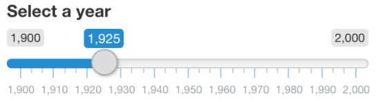

```{r, include=FALSE}
library(ggplot2)
library(shiny)
library(babynames)
library(tidyverse)
library(plotly)
library(dplyr)
library(shinyWidgets)
library(shinydashboard)
#library(d3wordcloud)
library(recipes)
library(readr)
library(leaflet)
```

# ¿Qué es una ShinnyApp?

Es una aplicación que se genera con ayuda del paquete "Shiny" de R. Estas aplicaciones, como otras, permiten que el usuario interactúe con ella (ingresando algo **inputs**) y teniendo una respuesta (**outputs**).

Hay que saber que una app solo funciona en caso de que se quiera facilitar el entendimiento de algo, mejorar el análisis de un tema o conocer los datos. Siempre se puede crear una Shiny app, pero antes de todo el show **hay que saber para qué se utilizará.**

#### Tips

-   Antes de hacer la app con Shiny, dibuja un esquema del resultado final (con todo y títulos).

-   Ten paciencia si no sale todo de un jalón. Ir poco a poco es importante.

# Crear una Shiny app

1.  Instalar shiny con `install.package("shiny")`

2.  Cargar la librería `library(shiny)`

3.  Generar los siguientes objetos:

    -   ui \<- fluidPage() *Para tener una "pantalla en blanco de HTML"*

    -   server \<- function(input, output, session){} *Para ejecutar la entrada y salida de la Shiny*

4.  Correr la app con `shinyApp(ui = ui, server = server)`

5.  **EN RESUMEN:**

<!-- -->

    {width="542"}

Ejemplo:

```{r, warning=FALSE, eval=FALSE}
library(shiny)
ui <- fluidPage("Hola, mono")
server <- function(input, output, session){}
shinyApp(ui = ui, server = server)
```

# Partes de una Shiny

## Interfás de Usuario (ui)

Es la parte con la que el usuario puede interactuar (escrita en código).

Las posibles cosas que quieras que el usuario vea en tu app son:

-   Título. Esto se hace con el comando `titlePanel("Mi título")` dentro de la función `fluidPage()`

-   Input (dónde moverle). Existen muchas opciones que se verán con detalle en [Inputs].

-   Output (el resultado de lo que le moví). Al igual que lo anterior, veremos que hay muchas posibles salidas *según tengamos interés.* Estas posibilidades se encuentran en el apartado de [Outputs]

## Servidor (server)

Es lo que se va a manipular de la interacción del usuario con la app (para que se generen los outputs requeridos). Es como "detrás del telón".

## Acomodar la Shiny

Las funciones de Layout cumplen el objetivo de ordentar las entradas o salidas de la app en las diversas posibilidades.

    sidebarLayout(
      titlePanel("Nombre de la app"),
      sidebarPanel(p("Lo que está adentro de aquí va a la izquierda")),
      mainPanel(p("lo que esté dentro de este panel irá a la derecha"))
    )

## Inputs

### Crear inputs

1.  Agregar una función de input ([Clasificación.]) en la interfás de usuario (UI).
2.  Agregar su valor en el servidor (server) con input\$x donde x es el identificador del input del paso 1.

En resumen se pueden clasificar así:

### Clasificación.

-   **texto** (`textInput`, `selectInput`)

-   **números** (`numericInput`, `sliderInput`)

-   **verdadero/falso** (`checkBoxInput`, `radioInput`)

-   **días** (`dateInput`, `dateRangeInput`)

Existen varias funciones que permiten que el usuario interactúe con la app (que el contexto shiny, se puede colocar dentro de la función `fluidPage`:

-   `textInput("identificador", "El texto previo a que ingrese el valor")`es una función que permite que el usuario (de la app) ingrese texto en un campo.

    El identificador será para que de manera interna, shiny pueda manejar el dato que el usuario ingresa. Se usa en [crear outputs].

-   `sliderInput`: para seleccionar por ejemplo un año en una línea del tiempo

    {width="284"}

        sliderInput("inputId",
                    "laber",
                     value = 1925,
                     min = 1900,
                     max = 2000)

-   `selectInput`: para seleccionar opciones de un menú de opciones

    {width="326"}

        selectInput("inputId",
                    "laber",
                    choices = c("A", "B", "C") )

-   `numericalInput`: seleccionar un número de un rango pero a partir de flechitas

    {width="356"}

-   `dateRangeInput`: permite seleccionar alguna fecha del calendario.

    {width="277"}

## Outputs

### Crear outputs {data-link="crear outputs"}

1.  Crear la salida (gráfica, tabla, texto, etc.) **en el server.**
2.  Renderiza el objeto de output usando la fucnión `render__` apropiada **en el server.**
3.  Asigna al objeto renderizado un nombre "x" **en el server** `(output$x <- ...)`
4.  Añade la salida **a la interfas de usuario** con la función `___Output` conveniente (según lo que hayas creado).

Como en los diferentes tipos de inputs para la app, también hay diferentes salidas, resultados o outputs que se pueden mostrar al usuario que interactúa (que el contexto shiny, toman el lugar de `output`dentro de `function`):

-   `textOutput("nombre del output que se creó en function")`

Las siguientes son funciones tipo render, las cuales consisten en agarrar un input y convertir los valores para tener un tipo de salida específica. Estas funciones **van dentro del server.**

-   `renderTable()`
-   `renderImage()`
-   `renderPlot()`

Según la función de render que se usó para generar el output, se pueden considerar las siguientes funciones **dentro de la interfas con el usuario (UI).**

-   `tableOutput()` o `dataTableOutput()`

-   `imageOutput()`

-   `plotOutput()`

Existen **otras funciones de render** que no son de Shiny, sino de otros paquetes como: **DT** (*para hacer tablas interactivas*), **leaflet** *(mapas interactivos)* y **plotly** *(gráficos interactivos)*.

#### Usar DT

1.  Crear una tabla interactiva con `DT::datatable()` **en el server**
2.  Renderiza la tabla con `DT::renderDT()` **en el server**
3.  Enseña la salida de la tabla con `DT::DTOutput()` **en la UI**

Estas funciones permiten conocer las diferentes formas en las que se genera un output (en `function`) que se puede mandar a llamar en la función `fluidPage.`

`renderText({  paste("Lo que ingresa el usuario:", input$identificador, "se pone en pantalla.")  })`

# Ejemplos de shiny apps

1.  Hacer una pregunta *sin respuesta*

```{r , warning=FALSE, eval=FALSE}

ui <- fluidPage(
  textInput("nombre", "Ingresa un nombre:"),
  textOutput("pregunta")
)

server <- function(input, output){
  output$pregunta <- renderText({
    paste("¿Te gustaría aprender Shiny,", input$nombre,"?")
  })
}

shinyApp(ui = ui, server = server)
```

2.  Poner un nombre y que me regrese un gráfico

```{r , eval=FALSE, message=FALSE}

ui <- fluidPage( #Lo que le aparecerá al usuario
  
  titlePanel("¿Qué tan famoso es tu nombre?"), #Título de la app

  sidebarLayout(  #Abajo del título qué hacemos
    
    sidebarPanel( #Dónde se coloca el texto
      textInput("nombre", "Ingresa tu nombre", "David")
    ),
    
    mainPanel( #Dónde se coloca el plot
      plotOutput("tendencia")
    )
  )
)

server <- function(input, output){
  
  output$tendencia <- renderPlot({ #Creamos un output que se llame tendencia
  
    data_name <- subset(babynames, name == input$nombre) #elegimos los datos
                                                        #según el input
    ggplot(data_name)+
      geom_line(aes(x = year, y = prop, color = sex))  #generamos el gráfico
                                                      #que será el output
  })
}

shinyApp(ui = ui, server = server)
```

3.  Dar opciones de respuesta a una pregunta.

```{r , eval=FALSE, message=FALSE}

ui <- fluidPage( #Lo que le aparecerá al usuario
  textInput("nombre", "Escribe tu nombre"),
  selectInput("animal", "¿Perros o gatos?", choices = c("perros", "gatos")),
  textOutput("idText"),
  textOutput("idRespuesta")
)

server <- function(input, output, session){
    output$idText <- renderText({
      paste("¿Prefieres perros o gatos,", input$nombre, "?")
    })
    output$idRespuesta <- renderText({
      paste("¡Prefiero a los,", input$animal, "!")
    })
}

shinyApp(ui = ui, server = server)
```

4.  Top 10 de nombres

```{r, eval=FALSE, message=FALSE}

ui <- fluidPage(
  titlePanel("¿Cuál nombre es más famoso?"),
  selectInput('sexo', 'Selecciona el sexo', choices = c("F", "M")),
  sliderInput("ano", "Elige el año",value = 1900, min = 1900, max = 2010),
  plotOutput('plot_top_10'),
  DT::DTOutput("table_top_10_names")
)

server <- function(input, output, session){
  output$plot_top_10 <- renderPlot({
    top_10_names <- babynames %>% 
      filter(sex == input$sexo) %>% 
      filter(year == input$ano) %>% 
      top_n(10, prop)
      ggplot(top_10_names, aes(x = name, y = prop)) +
        geom_col(fill = "#263e63")
  })
  top_10_names <- function(){
    top_10_names <- babynames %>% 
      filter(sex == input$sex) %>% 
      filter(year == input$year) %>% 
      top_n(10, prop)}
  output$table_top_10_names <- DT::renderDT({top_10_names()})
}

shinyApp(ui = ui, server = server)
```

5.  Con Tablas interactivas (**DT**)

```{r, warning=FALSE, eval=FALSE}
ui <- fluidPage(
  DT::DTOutput("babynames_table")
)

server <- function(input, output){
  output$babynames_table <- DT::renderDT({
    babynames %>%
      dplyr::sample_frac(.1)
  })
}

shinyApp(ui = ui, server = server)
```

6.  Plot Interactivo

```{r, eval=FALSE}
ui <- fluidPage(
  selectInput('name', 'Select Name', head(unique(babynames$name)), 10), 
  plotly::plotlyOutput('plot_trendy_names')
)

server <- function(input, output, session){
  plot_trends <- function(){
     babynames %>% 
      filter(name == input$name) %>% 
      ggplot(aes(x = year, y = n)) +
      geom_col()}
  
  output$plot_trendy_names <- plotly::renderPlotly({
    plot_trends()
  })
}


shinyApp(ui = ui, server = server)
```

# Personalizar la Shiny

Para poner dentro de una app varias pesatañas (con diversos histogramas, por ejemplo) y además cambiar el tema de la app.

### Tema

-   `shinythemes::themeSelector()` dentro de `fluidPage` (como un parámetro).

-   Si uno sabe qué tema quiere para su app, puede añadirlo de manera definitiva como: `theme = shinythemes::shinytheme("nombre_del_tema")` dentro de la función `fluidPage`.

    *Generalmente este parámetro se pone después del título del panel (titlePanel) y antes de SidebarLayout.*

### Añadir pestañas

Dentro de la interfás de usuario (`fluidPage -> sidebarLayout -> mainPanel`)

    ...
    mainPanel(
      
        tabsetPanel(
          tabPanel("Primer panel", plotOutput("id_output_1"))
          tabPanel("Segundo panel", plotOutput("id_output_2"))
        )
      
    )
    ...

### Ejemplos

1.  Una Shiny más bonita

```{r mis_histogramas, eval =FALSE, warning=FALSE}
set.seed(111)

ui <- fluidPage(
  titlePanel("Histogramas de diversas distribuciones"),
  theme = shinythemes::shinytheme("flatly"),
  sidebarLayout(
    sidebarPanel(sliderInput("cortes", "# Cortes", min = 0, max = 100, value = 30),
                 selectInput("n", "Tamaño de la muestra", choices = seq(0, 1000, by = 100) )
                 ),
    mainPanel(
      tabsetPanel(
        tabPanel("Normal", plotly::plotlyOutput("h_normal")),   #Pestaña 1
        tabPanel("Exponencial", plotly::plotlyOutput("h_exp")), #Pestaña 2
        tabPanel("Gamma", plotly::plotlyOutput("h_gam")),       #Pestaña 3
        tabPanel("Poisson", plotly::plotlyOutput("h_pois"))     #Pestaña 4
      )
    )
  )
)

server <- function(input, output, session){
  output$h_normal <- plotly::renderPlotly({
    ggplot(data.frame(rnorm(input$n)), aes(x = rnorm(input$n))) + geom_histogram(bins = input$cortes, fill = "orange") + theme_minimal()
  })
  
  output$h_exp <- plotly::renderPlotly({
    ggplot(data.frame(rexp(input$n, 4)), aes(x = rexp(input$n, 4))) + geom_histogram(bins = input$cortes, fill = "pink") + theme_minimal()
  })
  
  output$h_gam <- plotly::renderPlotly({
    ggplot(data.frame(rgamma(input$n, 3, 4)), aes(x = rgamma(input$n, 3, 4))) + geom_histogram(bins = input$cortes, fill = "green") + theme_minimal()
  })
  
  output$h_pois <- plotly::renderPlotly({
    ggplot(data.frame(rpois(input$n, 2)), aes(x = rpois(input$n, 2))) + geom_histogram(bins = input$cortes, fill = "yellow") + theme_minimal()
  })
}

shinyApp(ui = ui, server = server)
```

2.  Una shiny bonita

```{r, eval=FALSE, warning=FALSE}
#El UI o interfas con el usuario es "La shiny" en el sentido que es lo único que ve y toca el usuario. Por eso aquí es donde debemos hacer que se vea bonito.

ui <- fluidPage( # Lo que esté aquí se verá por el usuario
  titlePanel("Nombres más famosos de la historia"),
  sidebarLayout( # Permite dividir la pantalla en dos lados
    sidebarPanel(# Aquí irán cosas _en la izquierda_
    selectInput('name', 'Select Name',head(unique(babynames$name)), 15)),
    # El Input tipo select es lo que el usuario "elige" dentro de las opc.
    mainPanel(  # Aquí irán las cosas de la derecha 
     tabsetPanel( #Para hacer pestañas dentro del lado derecho
      #Primer pestaña
      tabPanel("Histograma",plotly::plotlyOutput('plot_trendy_names')),
      #Segunda pestaña
      tabPanel("Información",DT::DTOutput('table_trendy_names'))
     )
    )
  )
)

#Digamos que el server es para mover lo que el usuario le pique y dar 
#una salida según la entrada
server <- function(input, output, session){
    #Función auxiliar para manejar más rápido el input
      plot_trends <- function(){
         babynames %>% 
          filter(name == input$name) %>% 
          ggplot(aes(x = year, y = n)) +
          geom_col()
      }
  #Siempre aparecen los outputs$NOMBRE_OUTPUT que vienen 
      #renderizados (con algú tipo de render)
  output$plot_trendy_names <- plotly::renderPlotly({
    plot_trends()
  })
  
  #Este es el otro output
  output$table_trendy_names <- DT::renderDT({
    babynames %>% 
      filter(name == input$name)
  })
}

shinyApp(ui = ui, server = server)
```

# Reactives de Shiny

Se refiere a la forma en que la app reacciona (ante por ejemplo inputs del usuario pero dentro del código)

Hay dos tipos de reactividad en Shiny:

1.  Reactive source: input que viene del usuario por medio de la app
2.  Reactive endpoints: lo que aparece en la ventana: plot, table, etc.
3.  Reactive: conductor: dependen de uno o muchos reactive sources, adermás de que es una dependencia de uno o más reactive endpoints.


Si tenemos dos veces el mismo código, se correrá dos veces... no queremos tener código de más porque eso implica una pérdida de eficiencia. La manera de solucionar la "necesidad de" duplicar código es con las **reacciones** que permiten ejecutar una acción repetiva y encamminarla a los outputs que requieran de esta tarea:


Una **reactive expression** es como una función pero con dos diferencias principales:

1.  Es floja: solo se evalúa cuando una reactiveenpoint lo necesita.
2.  Es en caché, es decir que solo se evalúa cuando uno de los valores dentro del reactive sentenciado cambia.

### Ejemplos:

```{r, eval=FALSE}
server <- function(input, output, session) {
  rval_bmi <- reactive({
    input$weight/(input$height^2)
  })
  
  output$bmi <- renderText({
    paste("Your BMI is", round(rval_bmi(), 1))
  })
  output$bmi_range <- renderText({
      bmi_status <- cut(rval_bmi(), 
      breaks = c(0, 18.5, 24.9, 29.9, 40),
      labels = c('underweight', 'healthy', 'overweight', 'obese')
    )
    paste("You are", bmi_status)
  })
}
ui <- fluidPage(
  titlePanel('BMI Calculator'),
  sidebarLayout(
    sidebarPanel(
      numericInput('height', 'Enter your height in meters', 1.5, 1, 2),
      numericInput('weight', 'Enter your weight in Kilograms', 60, 45, 120)
    ),
    mainPanel(
      textOutput("bmi"),
      textOutput("bmi_range")
    )
  )
)

shinyApp(ui = ui, server = server)
```

Podemos hacer un reactive con otro reactive:

```{r, eval=FALSE}
server <- function(input, output, session) {
  rval_bmi <- reactive({
    input$weight/(input$height^2)
  })
  # CODE BELOW: Add a reactive expression rval_bmi_status to 
  # return health status as underweight etc. based on inputs
  rval_bmi_status <- reactive({cut(rval_bmi(), 
      breaks = c(0, 18.5, 24.9, 29.9, 40),
      labels = c('underweight', 'healthy', 'overweight', 'obese')
    )
  })
    
  output$bmi <- renderText({
    bmi <- rval_bmi()
    paste("Your BMI is", round(bmi, 1), "You are", rval_bmi_status())
  })
  output$bmi_status <- renderText({
    # MODIFY CODE BELOW: Replace right-hand-side with 
    # reactive expression rval_bmi_status
   rval_bmi_status()
  })
}
ui <- fluidPage(
  titlePanel('BMI Calculator'),
  sidebarLayout(
    sidebarPanel(
      numericInput('height', 'Enter your height in meters', 1.5, 1, 2),
      numericInput('weight', 'Enter your weight in Kilograms', 60, 45, 120)
    ),
    mainPanel(
      textOutput("bmi"),
      textOutput("bmi_status")
    )
  )
)

shinyApp(ui = ui, server = server)
```

## Observes vs Reactives

Primero definamos que uuna observe u observación es una forma de dar a conocer algo al usuario de la app pero que no es parte del progrmaa en sí mismo. Por ejemplo se puede observar una notificación después de que el usuario ingrese su nombre:

```{r, eval=FALSE}
ui <- fluidPage(
  textInput("nombre", "Por amor, escribe tu nombre")
)

server <- function(input, output, session){
  observe({
    showNotification(
      paste("Bienvenuti a la app de Shiny,", input$nombre)
    )
  })
}
shinyApp(ui = ui, server = server)
```

Por ende ya podemos deducir las diferencias.

| Acción                | Reactive Expressions |   Observes   |
|:----------------------|:--------------------:|:------------:|
| Regresar valores      |          Sí          |      No      |
| Evaluar los cambios   |     No (siempre)     | Sí (siempre) |
| Efectos "secundarios" |          No          |      Sí      |

: Diferencias entre Observes and Reactive expressions


### Demorar-Detener-Desencadenar

Notemos que hasta ahora, hacer cambios en la app, como seleccionar el año, o los cortes en un histograma, generan los cambios de manera automática lo que puede hacer lenta la forma de implementar la aplicación.

##### Detener

Si existiriera la forma de detener el proceso instantane hasta que algo más pasara... **SÍ EXISTE.** Una forma de demorar, detener o desencadenar procesos es con la ayuda de la función `isolate` que toma por entrada inputs (`input$id_input`).

    server <- function(input, output, session){
      output$saludo <- renderText({
        paste(
          isolate({input$tipo_saludo}), input$name, sep = " ," 
        )
      })
    }

Lo que implica el uso de la función isolate es: Se verán los outputs en el UI solo después de que se cambie el input que entra a la función.

En el contexto de la Shiny, dado que este aletargamiento de la ejecución del código no es parte de lo que el usuario puede controlar, se programa en el server. (ver ejemplo inmediato siguiente).

Podemos hacer diferentes formas de retrasar la visualización de resultados en la interfás con el usuario. Por ejemplo: queremos que se presente la edad de la persona solo después de que se hayan cambiado los valores: día, mes y año.

##### Demorar

Lo anterior se puede implementar con el uso de un botón. Este botón permitirá que la la persona decida ver el resultado solo cuando haya cambiato todos los parámetros que desea (y así no programar cada ejecución de forma exaustiva). Con la función `eventReactive({})`

     server <- function(input, output, session){
      rv_saludo <- eventReactive(input$muestra_saludo,{
        paste("Hola", input$name)
      })
      output$saludo <- renderText({
        rv_saludo()
      })
    }

Notemos que la diferencia es que para un botón es necesario un tipo de reacción Event (`reactiveEvent`), mientras que para desencadenar (un resultado sin que el usuario decida) se tiene que usar la fucnión `isolate.`

##### Desencadenar

Posiblemente se desee que al apretar un botón, no necesariamente se haga un cambio en la app, pero se de un aviso, es decir, desencadenar acciones a partir de un botón. Esto se hace con una forma análoga a la anterior pero con la función `observeEvent`

     server <- function(input, output, session){
      observeEvent(input$muestra_saludo,{
        showModal(modalDialog(paste("Hola", input$name)))
      })
    }

El modal funciona para dar la oportunidad al usuario de quitar el botón.

La función `observeEvent()` permite incluso hacer que el usuario descargue un archivo de tu app. Requiere de dos argumentos: el evento al que responderá y la función a la que se le llamará cuando el evento ocurra.

###### Ejemplos:

1.  Detener

```{r, eval=FALSE}
ui <- fluidPage(
  titlePanel('BMI Calculator'),
  sidebarLayout(
    sidebarPanel(
      textInput('name', 'Enter your name'),
      numericInput('height', 'Enter your height (in m)', 1.5, 1, 2, step = 0.1),
      numericInput('weight', 'Enter your weight (in Kg)', 60, 45, 120)
    ),
    mainPanel(
      textOutput("bmi")
    )
  )
)

server <- function(input, output, session) {
  rval_bmi <- reactive({
    input$weight/(input$height^2)
  })
  output$bmi <- renderText({
    bmi <- rval_bmi()
    paste("Hi", isolate({input$name}), ". Your BMI is", round(bmi, 1))
  })
}

shinyApp(ui = ui, server = server)
```

2.  Demorar: usando un botón

    ```{r, eval = FALSE}

    server <- function(input, output, session) {

      
      rval_bmi <- eventReactive(input$show_bmi, { #EL PRIMER PARÁMETRO DE 
        #eventReactive es el input con el que se accionará algo. 
        input$weight/(input$height^2)
      })
      output$bmi <- renderText({
        bmi <- rval_bmi()
        paste("Hi", input$name, ". Your BMI is", round(bmi, 1))
      })
    }

    ui <- fluidPage(
      titlePanel('BMI Calculator'),
      sidebarLayout(
        sidebarPanel(
          textInput('name', 'Enter your name'),
          numericInput('height', 'Enter height (in m)', 1.5,1,2, step = 0.1),
          numericInput('weight', 'Enter weight (in Kg)', 60, 45, 120),
          
          actionButton("show_bmi", "Show BMI") #AQUÍ SE CREA EL BOTÓN
        
        ),
        mainPanel(
          textOutput("bmi")
        )
      )
    )

    shinyApp(ui = ui, server = server)
    ```

3.  Demorar: usando dos botones (react y observe)

```{r, eval=FALSE}
bmi_help_text <- "Body Mass Index is a simple calculation using a person's height and weight. The formula is BMI = kg/m2 where kg is a person's weight in kilograms and m2 is their height in metres squared. A BMI of 25.0 or more is overweight, while the healthy range is 18.5 to 24.9."

server <- function(input, output, session) {
  # MODIFY CODE BELOW: Wrap in observeEvent() so the help text 
  # is displayed when a user clicks on the Help button.
  observeEvent(input$show_help, {
     # Display a modal dialog with bmi_help_text
     # MODIFY CODE BELOW: Uncomment code
     showModal(modalDialog(bmi_help_text))
  })
  rv_bmi <- eventReactive(input$show_bmi, {
    input$weight/(input$height^2)
  })
  output$bmi <- renderText({
    bmi <- rv_bmi()
    paste("Hi", input$name, ". Your BMI is", round(bmi, 1))
  })
}

ui <- fluidPage(
  titlePanel('BMI Calculator'),
  sidebarLayout(
    sidebarPanel(
      textInput('name', 'Enter your name'),
      numericInput('height', 'Enter your height in meters', 1.5, 1, 2),
      numericInput('weight', 'Enter your weight in Kilograms', 60, 45, 120),
      actionButton("show_bmi", "Show BMI"),
      # CODE BELOW: Add an action button named "show_help"
      actionButton("show_help", "Help")
    ),
    mainPanel(
      textOutput("bmi")
    )
  )
)

shinyApp(ui = ui, server = server)
```

```{r, eval = FALSE}
server <- function(input, output, session) {
 
  rval_height_cm <- eventReactive(input$show_height_cm, {
    input$height * 2.54
  })
  
  output$height_cm <- renderText({
    height_cm <- rval_height_cm()
    	paste("Your height in centimeters is", height_cm, "cm")
    })
}

ui <- fluidPage(
  titlePanel("Inches to Centimeters Conversion"),
  sidebarLayout(
    sidebarPanel(
      numericInput("height", "Height (in)", 60),
      actionButton("show_height_cm", "Show height in cm")
    ),
    mainPanel(
      textOutput("height_cm")
    )
  )
)

shinyApp(ui = ui, server = server)
```

# Ejemplos de apps (4)

### 1. Aliens

```{r, eval=FALSE}

#Información de los avistamientos de aliens

#NO se cuenta con la información de usa_ufo_sightings

#Así que no se correrá esta app

ui <- fluidPage(
  titlePanel("UFO Sightings"),
  sidebarPanel(
    selectInput("state", "Choose a U.S. state:", choices = unique(usa_ufo_sightings$state)),
    dateRangeInput("dates", "Choose a date range:",
      start = "1920-01-01",
      end = "1950-01-01"
    )
  ),
  mainPanel(
    tabsetPanel(
      tabPanel(
        "Plot", plotOutput("shapes")
      ),
      tabPanel(
        "Table", tableOutput("duration_table")
      )
    )
  )
)

server <- function(input, output) {
  output$shapes <- renderPlot({
    usa_ufo_sightings %>%
      filter(
        state == input$state,
        date_sighted >= input$dates[1],
        date_sighted <= input$dates[2]
      ) %>%
      ggplot(aes(shape)) +
      geom_bar() +
      labs(
        x = "Shape",
        y = "# Sighted"
      )
  })

  output$duration_table <- renderTable({
    usa_ufo_sightings %>%
      filter(
        state == input$state,
        date_sighted >= input$dates[1],
        date_sighted <= input$dates[2]
      ) %>%
      group_by(shape) %>%
      summarize(
        nb_sighted = n(),
        avg_duration_min = mean(duration_sec) / 60,
        median_duration_min = median(duration_sec) / 60,
        min_duration_min = min(duration_sec) / 60,
        max_duration_min = max(duration_sec) / 60
      )
  })
}

shinyApp(ui, server)
```

### 2. Encuesta sobre salud mental en Tecnología

```{r, eval = FALSE}
server <- function(input, output, session) {
  output$age <- renderPlot({
    # MODIFY CODE BELOW: Add validation that user selected a 3rd input
    validate(
      need(input$mental_vs_physical != "", "Be sure to select an response")
    )  
   mental_health_survey %>%
      filter(
        work_interfere == input$work_interfere,
        mental_health_consequence %in% input$mental_health_consequence,
        mental_vs_physical %in% input$mental_vs_physical
      ) %>%
      ggplot(aes(Age)) +
      geom_histogram()
  })
}

ui <- fluidPage(
  titlePanel("2014 Mental Health in Tech Survey"),
  sidebarPanel(
    sliderTextInput(
      inputId = "work_interfere",
      label = "If you have a mental health condition, do you feel that it interferes with your work?", 
      grid = TRUE,
      force_edges = TRUE,
      choices = c("Never", "Rarely", "Sometimes", "Often")
    ),
    checkboxGroupInput(
      inputId = "mental_health_consequence",
      label = "Do you think that discussing a mental health issue with your employer would have negative consequences?", 
      choices = c("Maybe", "Yes", "No"),
      selected = "Maybe"
    ),
    pickerInput(
      inputId = "mental_vs_physical",
      label = "Do you feel that your employer takes mental health as seriously as physical health?", 
      choices = c("Don't Know", "No", "Yes"),
      multiple = TRUE
    )    
  ),
  mainPanel(
    plotOutput("age")  
  )
)

shinyApp(ui, server)
```

### 3. Cocinas en el mundo y sus platillos más comidos

```{r, eval=FALSE}
recipies
ui <- fluidPage(
  titlePanel('Explore Cuisines'),
  sidebarLayout(
    sidebarPanel(
      selectInput('cuisine', 'Select Cuisine', unique(recipes$cuisine)),
      sliderInput('nb_ingredients', 'Select No. of Ingredients', 5, 100, 20),
    ),
    mainPanel(
      tabsetPanel(
        # CODE BELOW: Add `d3wordcloudOutput` named `wc_ingredients` in a `tabPanel`
        tabPanel('Word Cloud', d3wordcloud::d3wordcloudOutput('wc_ingredients', height = '400')),
        tabPanel('Plot', plotly::plotlyOutput('plot_top_ingredients')),
        tabPanel('Table', DT::DTOutput('dt_top_ingredients'))
      )
    )
  )
)
server <- function(input, output, session){
  # CODE BELOW: Render an interactive wordcloud of top distinctive ingredients 
  # and the number of recipes they get used in, using 
  # `d3wordcloud::renderD3wordcloud`, and assign it to an output named
  # `wc_ingredients`.
  output$wc_ingredients <- d3wordcloud::renderD3wordcloud({
     ingredients_df <- rval_top_ingredients()
     d3wordcloud(ingredients_df$ingredient, ingredients_df$nb_recipes, tooltip = TRUE)
  })
  rval_top_ingredients <- reactive({
    recipes_enriched %>% 
      filter(cuisine == input$cuisine) %>% 
      arrange(desc(tf_idf)) %>% 
      head(input$nb_ingredients) %>% 
      mutate(ingredient = forcats::fct_reorder(ingredient, tf_idf))
  })
  output$plot_top_ingredients <- plotly::renderPlotly({
    rval_top_ingredients() %>%
      ggplot(aes(x = ingredient, y = tf_idf)) +
      geom_col() +
      coord_flip()
  })
  output$dt_top_ingredients <- DT::renderDT({
    recipes %>% 
      filter(cuisine == input$cuisine) %>% 
      count(ingredient, name = 'nb_recipes') %>% 
      arrange(desc(nb_recipes)) %>% 
      head(input$nb_ingredients)
  })
}
shinyApp(ui = ui, server= server)
```

### 4. Disparos en EU

```{r, eval=FALSE}
ui <- bootstrapPage(
  theme = shinythemes::shinytheme('simplex'),
  leaflet::leafletOutput('map', width = '100%', height = '100%'),
  absolutePanel(top = 10, right = 10, id = 'controls',
    sliderInput('nb_fatalities', 'Minimum Fatalities', 1, 40, 10),
    dateRangeInput(
      'date_range', 'Select Date', "2010-01-01", "2019-12-01"
    ),
    # CODE BELOW: Add an action button named show_about
    actionButton("show_about", "About")
  ),
  tags$style(type = "text/css", "
    html, body {width:100%;height:100%}     
    #controls{background-color:white;padding:20px;}
  ")
)
server <- function(input, output, session) {
  # CODE BELOW: Use observeEvent to display a modal dialog
  # with the help text stored in text_about.
observeEvent(input$show_about, {
    showModal(modalDialog("This data was compiled by Mother Jones, nonprofit founded in 1976. Originally covering cases from 1982-2012, this database has since been expanded numerous times to remain current.", title = 'About'))
})
  
  
  output$map <- leaflet::renderLeaflet({
    mass_shootings %>% 
      filter(
        date > input$date_range[1],
        date < input$date_range[2],
        fatalities >= input$nb_fatalities
      ) %>% 
      leaflet() %>% 
      setView( -98.58, 39.82, zoom = 5) %>% 
      addTiles() %>% 
      addCircleMarkers(
        popup = ~ summary, radius = ~ sqrt(fatalities)*3,
        fillColor = 'red', color = 'red', weight = 1
      )
  })
}

shinyApp(ui, server)
```

## Añadir mensajes de error.


### ¿Cómo conocer todos los posibles inputs?

Con la función`shinyWidgetsGallery()` que permite ver todos los inputs posibles así como el código necesario para su implementación.
