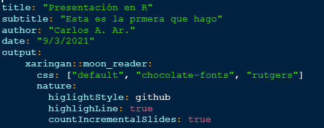

<style>
  #TOC {
    color: #724401;
    font-family: Spectral;
    font-size: 16px;
    background-color: #FBECD1;
    border-color: #958303;
  }
  h1.title {
    color: #6D4101;
    background-color: #FDFBEF;
    opacity: 0.9;
    font-family: Spectral;
    font-size: 50px;
  }
  h4.author {
    color: #012A6D;
    background-color: #FDFBEF;
    font-family: Spectral;
    font-size: 30px;
  }
  h4.date {
    color: #7299D9;
    background-color: #FDFBEF;
    font-family: Spectral;
  }
  body {
    color: #08142A;
    font-family: Spectral;
    background-color: #FDFBEF;
  }
  pre {
    color: #08142A;
    background-color: #FEF9D7;
  }
</style>

<div style="text-align: justify">
<div/>

```{r, include = FALSE}
library(xaringan)
```

__Objetivo:__ crear una presentación en RStudio con código además de añadir LO DE FLIPBOOKR.

## Crear una presentación en Xaringan

1. Instalar la libraría xaringan `install.package("xaringan")` y cargar la librería `library(xaringan)`.

2. Crear un proyecto de R para que las imágenes y demás archivos se queden en la carpeta que se crea en automático en la creación del proyecto.

3. Dentro del proyecto crear un archivo de RMarkdown y cambiar el encabezado YAML:

<div>
<p style = 'text-align:center;'>
{width='250px'}
</p>
</div>

  La diferencia con este encabezado y el de un Rmd es el output, mientras que en Rmd el `output` es `html_document` o `pdf_document`, para compartir una presentación de xaringan es necesario usar `xaringan::moon_reader` lo que implica una forma particular de presentación.
    
  Notemos que existen algunas especificaciones extra como el estilo de la presentación que se pones en el parámetro `css`. ára poder identificar los diferentes estilos posibles en las presentaciones de sharingan usamos el siguiente comando:
    
```{r}
names(xaringan:::list_css())
```
     
  En general el parámetro `css` describe las características de personalización de la presentació.
     
  Por otro lado 
     
      `nature:`
          `higlightStyle: github`
          `highlighLine: true`
          `countIncrementalSlides: true`
    
  hace referencia a la forma en que queremos que aparezcan las líneas de código dentro de la presentación. Por ejemplo, `highlighLine: true` implica que se hará un subrayado para los códigos que aparezcan en la presentación. Mientras que `countIncrementalSlides: true` permitirá que las diapositivas se enumeren.
    
4. Cargar las librerías a ocupar en un chunk de R. 

5. Escribir tres guiones medios __---__ cada que se requiera una nueva diapositiva. Al inicio de cada diapositiva debe existir un título el cual se pone como la [sintáxis de Rmd](https://dreamy-beaver-cd6aad.netlify.app/r-markdown#Editar_texto).

## Personalizar la presentación

- En cada diapositica es posible hacer que esta tenga imágenes, lo cual se logra con sintáxis de Rmd o de HTML. Aquí pongo el ejemplo de HTML.

      <div>
      <p style = 'text-align:center;'>
      {width='250px'}
      </p>
      </div>

En este caso la imagen se llama xaringan_yaml y tiene extensión png. Esta imagen debe ser previamente guardada en la carpeta del RProject donde se está trabajando, de esta manera no será necesario escribir el `path` del directorio.

- Si se desea dividir una diapositiva en dos columnas se usa la sintáxis siguiente:

      .pull-left[
      Hola, este es el lado izquierdo
      ]
      
      .pull-right[
      Hola, este es el lado derechairo
      ]

Donde el contenido de la izquierda irá entre los corchetes así como el de la derecha.

- Para hacer referencias a páginas o insertar código con sus múltiples opciones de aparición en la presentación, basta con usar la [sintáxis de Rmd](https://dreamy-beaver-cd6aad.netlify.app/r-markdown).

Para más información sobre la personalización de Xaringan consulta [Xaringan Presentations](https://bookdown.org/yihui/rmarkdown/xaringan.html)

## Flipbookr


