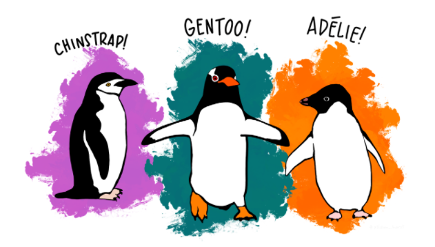
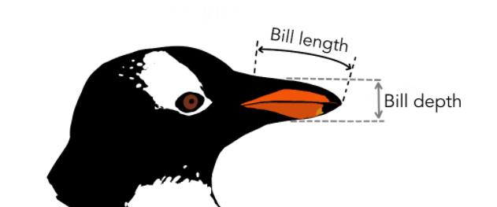

```{r, include = F}
# This is the recommended set up for flipbooks
# you might think about setting cache to TRUE as you gain practice --- building flipbooks from scratch can be time consuming
knitr::opts_chunk$set(fig.width = 6, message = FALSE, warning = FALSE, comment = "", cache = F)
library(flipbookr)
library(tidyverse)
library(palmerpenguins)
```

# ¿Qué es un flipbook?

- Es una forma de presentar información de manera paulatina.

--

- Los datos así presentados pueden:

--

  - Genearar ideas de información más eficiente _que al ver una consola de código_.
  
--
  
  - Dar a entender los cambios que se reflejan con el código, ya sea:
  
--
    1. Manejo de datos.
    
     2. Visualización de datos.
    
      3. Análisis de datos.

--

  - Salvar a tu audiencia de un desmayo por aburrimiento.

--

.center[`Un paso a la vez.`]

---

# ¿Qué es `flipbookr`?

- Un paquete  de R que sirve para hacer un flipbook.

- La maravillosa herramineta que permite convertir...

--

.pull-left[

Esto


]

--

.pull-right[
En esto

]

---
class: middle, center

# Comentatrios de las creadoras de flipbookr


`flipbookr` se actualiza para mejorar su funcionalidad

--

Puedes contribur en su construcción en el repositorioo de Eva: https://github.com/EvaMaeRey/flipbookr!  

---

# Crea tu flipbook 

--

### Prerequisitos

--

  - Tener ganas de compartir datos y su _"Transformación"_ de manera accesible.

--

  - [Crear una presentación de Xaringan](https://tutorialesmg.netlify.app/xaringan-y-flipbookr)

--

  - Enseñar de manera incremental la creación de gráficas o cambio en los datos. 

--

### Extra

- Puedes hacer un solo chunk de código y a partir de una función se logra _partir_ en secciones para presentar la evolución de un proceso.

- Recomiendo que el chunk de código donde se encuentra lo que quieres presentar tenga en su encabezado el comando `include = F`, es para que no se vea toda la información de código. _Más detalles [aquí](https://tutorialesmg.netlify.app/r-markdown#Opciones_de_C%C3%B3digo_Chunk)_ 

---

# Ahora sí

--

1. Usa el comando `remotes::install_github("EvaMaeRey/flipbookr")`

--

2. Mandar a llamar la librería en el chunk inicial `library(flipbookr)`

--

3. Usar la función `chunk_reveal()` para entender las distintas formas de dar a conocer el código de algún chunk.

  _La función no se usa dentro del chunk, sino FUERA del chunk_. Usa el formato 'r chunk_reveal()'

--

4. Dar formato de diseño con la función anterior.

--

5. ¡Disfruta el resultado!

---

class: middle, inverse, center

# Ejemplo. Pinguinos

Para demostrar cómo funciona flipbookr, usaremos datos sobre pinguinos.

---

# Ejemplo a trabajar

.pull-left[Con el propósito de entender mejor la forma de crear un flipbook con R, usaré la información vertida sobre los pinguinos. Puedes aprender más de [los datos](https://allisonhorst.github.io/palmerpenguins/).

```{r, eval=FALSE}
#Instalar el paquete con los datos
remotes::install_github("allisonhorst/palmerpenguins")
#Mandar a llamar los datos
library(palmerpenguins)
```
]

--

.pull-right[#### Demos un vistazo a la información.

```{r, warning=FALSE}
str(penguins)
```
]

---

.pull-left[
```{r}
head(penguins_raw)
```
]

--

.pull-right[

Ambos conjuntos de datos contienen datos de 344 pingüinos, sin smbargo el primero tiene menos variables que el segundo. 

Hay 3 especies diferentes de pingüinos en este conjunto de datos, recopilados en 3 islas del archipiélago de Palmer, en la Antártida.
]

---

class: middle, center

<div>
<p style = 'text-align:center;'>
{width='550px'}
</p>
</div>

---
.pull-left[
```{r, pinguinos, echo=FALSE, eval=TRUE}
penguins %>% 
  ggplot() + 
    aes(x = bill_length_mm) + 
    aes(y = bill_depth_mm) + 
    aes(group = species) + 
  geom_point(size = 3, alpha = 0.8) + #BREAK
    aes(color = species) + 
    aes(shape = species) + #BREAK3
  geom_smooth(method = "lm", se = FALSE) + 
    aes(color = species) + 
  theme_minimal() + #BREAK
  scale_color_manual(values = c("#A92508", "#F7721B", "#FFDC17")) + #BREAK2
  labs(title = "Dimensiones del pico de los Pinguinos", 
       subtitle = "Profundidad y largo del pico para los pinguinos Adelie, Chinstrap y Gentoo en Palmer Station LTER", 
       x = "Longitud (mm)", 
       y = "Profundidad (mm)", #BREAK4
       color = "Especie de pinguino", 
       shape = "Especie de pinguino") + #BREAK
  theme( legend.position = c(0.85, 0.15), 
         legend.background = element_rect(fill = "white", color = NA), 
         plot.title.position = "plot", 
         plot.caption = element_text(hjust = 0, face = "italic"), 
         plot.caption.position = "plot") #BREAK
```
]

--

.pull-right[
.center[Con este gráfico y otros estaremos trabajando los flipbooks. ]
]

---


`r chunk_reveal(chunk_name = "pinguinos", break_type="auto", widths = c(32, 32), title = "# Flipbook muestra")`

---

# La función importante `chunk_reveal()` 

.pull-left[La función `chunk_reveal()` sirve para hacer los chunks de código legibles por partes de tal forma que el entendimiento del código sea correcto. En la presentación de Xaringan se vería:

```markdown
``r "r chunk_reveal(chunk_name = \"cars\", break_type = \"user\")"``
``` ]

.pull-right[Existen muchas formas de mostrar en modo "flipbook" tu código, lo cual veremos a continuación con los...]

---

# Parámetros

```markdown
``r "r chunk_reveal(chunk_name = \"cars\", break_type = \"user\")"``
``` 
--

Los siguientes parámetros son fundamentales para entender la función:

--

- **chunk_name** se le asigna el nombre del chunk de código, del ejemplo "cars". Para asignar el nombre a un chunk de código, solo es necesario escribirlo al lado de la  letra r:

<div>
<p style = 'text-align:center;'>
{width='250px'}
</p>
</div>

--

- **break_type** indica qué linea del código del chunk se revelará y en qué momento. Por defecto el parámetro tiene la asignación "auto". Es decir, sino especificas su valor, entonces el valor por defecto será "auto".

--

- **display_type** indica si se desea que "se vea" en la presentación el codigo, el resultado del código o ambos. Por defecto `display_type`="both". 

--

- **left_assign** Cuando left_assign = TRUE, el primer objeto creado se imprime al final del chunk de código.

---

class: middle, center

## Veremos en esta presentación las diferentes formas de usar estos parámetros así como sus resultados.

<div>
<p style = 'text-align:center;'>
{width='350px'}
</p>
</div>


---

class: middle, inverse, center

# break_type

--

Este parámetro de la función `chunk_reveal()` ayuda a distinguir cuándo aparece el código _o resultado_ del que queremos hacer un flipbook

---

# `break_type`

.pull-left[Las opciones de este parámetro son:

- auto

- user

- non_seq

- rotate

- n (algún número natural)

Recordemos que este parámetro permite que quien crea el flipbook decida cuál parte del código desea que aparezca primero, depués, etc.
]

--

.pull-right[
Veremos con los datos de los pinguinos cómo funcionan estas opciones. 
```{r, code = knitr::knit_code$get("pinguinos"), eval = FALSE, echo = TRUE}
```
]

---

## `break_type = "auto"`

El valor "auto" del parámetro `break_type` se da por defecto sino se especifica otra opción. La forma en que `chunk_reveal()` decide cómo mostrar las partes del código es por orden de aparición de los paréntesis o pipes (%>%).

<!-- display the user input code as a refresher -->
```{r, code = knitr::knit_code$get("pinguinos"), eval = FALSE, echo = TRUE}
```

---

`r chunk_reveal(chunk_name = "pinguinos", break_type="auto", widths = c(32, 32), title = "### break_type = auto ")`

---

## `break_type = "user"`, con #BREAK

.pull-left[
Tú puedes decidir cómo quieres que aparezcan las partes del código, esto se hace con la opción "user" y #BREAK.

En donde aparezca #BREAK se detendrá la aparición del código _(se observan los resultados del código hasta el BREAK)_. Si hay más de un #BREAK, entonces el código aparecerá en ese orden. ]

--

.pull-right[
```{r, code = knitr::knit_code$get("pinguinos"), eval = FALSE, echo = TRUE}
```
]

---

`r chunk_reveal("pinguinos", break_type = "user", title = "### break_type = user ")`

---

## `break_type = "non_seq"`, con #BREAK2, #BREAK3

.pull-left[
Es parecido a la opción anterior pero es necesario el uso de números después del #BREAK. 

El número indica el momento en que aparecerá y se ejecutará esa línea de código.

Primero aparecerá todo __lo que no__ tenga #BREAK _N_ y luego aparecerá la línea donde _N = 2_, luego _N = 3_ y así en lo sucesivo.
]

--

.pull-right[
```{r, code = knitr::knit_code$get("pinguinos"), eval = FALSE, echo = TRUE}
```
]

---

`r chunk_reveal("pinguinos", break_type = "non_seq", title = "### break_type = non_seq ")`

---

## `break_type = "rotate"`

.pull-left[Si queremos dar "varias opciones" a la audiencia sobre las formas en que pueden tratar su código, usamos este tipo de aparición con la palabra __#ROTATE__ posterior a la línea de código que deseamos de esa forma presentar.

Dado que en el chunk de código aparecerán las opciones de la misma idea de codficación, éste no se desea evaluar pues aparecería un error. Para solucionar esto, usamos `echo = FALSE`.]

```{r my_rotate, eval=FALSE, echo=FALSE}
ggplot(data = penguins) +
       aes(x = flipper_length_mm) +
  geom_histogram(aes(fill = species),
                 alpha = 0.5,
                 position = "identity") +
  theme_minimal() +
  labs(x = "Flipper length (mm)",
       y = "Frequency",
       title = "Penguin flipper lengths") + 
  scale_fill_manual(values = c("darkorange","purple","cyan4")) + #ROTATE
  scale_fill_manual(values = c("#09A901","#337D2F","#67F11D")) + #ROTATE
  scale_fill_manual(values = c("#F11D94","#6A3401","#F3F185")) #ROTATE
```

--

.pull-right[
```{r, code = knitr::knit_code$get("my_rotate"), eval = FALSE, echo = TRUE}
```
]

---

`r chunk_reveal("my_rotate", break_type = "rotate", widths = c(50,50), title = "### break_type = rotate")`

---

## Posibles combinaciones

.pull-left[
Si deseas que aparezca el código paulatinamente y además se cambie una sección particular del código, solo es necesario añadir el parámetro `omit` dentro de la función `chunk_reveal()` con el valor "#ROTATE".

1. Escribimos __r chunk_reveal("omit", omit = "#ROTATE", break_type = "auto")__ en la "diapositiva" donde queremos que aparezca la combinación.

2. En la diapositiva posterior escribimos __r chunk_reveal("omit", omit = "#ROTATE", break_type = "auto")__ para que se de la "rotación".
]

--

.pull-right[
```{r, code = knitr::knit_code$get("omit"), eval = FALSE, echo = TRUE}
```
]

---
```{r omit, include=FALSE}
ggplot(data = penguins) +
       aes(x = flipper_length_mm) +
  geom_histogram(aes(fill = species),
                 alpha = 0.5,
                 position = "identity") +
  scale_fill_manual(values = c("#FF7400","#944300","#341800")) + #OMIT
  scale_fill_manual(values = c("darkorange","purple","cyan4")) + #ROTATE
  scale_fill_manual(values = c("#09A901","#337D2F","#67F11D")) + #ROTATE
  scale_fill_manual(values = c("#F11D94","#6A3401","#F3F185")) + #ROTATE
  theme_minimal() +
  labs(x = "Flipper length (mm)") +
  labs(y = "Frequency") +
  labs(title = "Penguin flipper lengths") 
```

`r chunk_reveal("omit", omit = "#ROTATE", break_type = "auto", title = "### Combinaciones rotate-incremental", widths = c(50,50))`

---

`r chunk_reveal("omit", omit = "#OMIT", break_type = "rotate", title = "### Combinaciones rotate-incremental", widths = c(50,50))`

---

## `break_type = n`

.pull-left[
Si tenemos una muestra aleatoria de la cual queremos hacer un mismo análisis entonces es conveniente usar `break_type = n`. Esto nos permitirá enseñar la forma en que cambia el gráfico asociado al código con cada muestra diferente __hasta n clicks__.

Si n = 1 entonces tendremos el código simple y su resultado.
]

--

.pull-right[
```{r, code = knitr::knit_code$get("cars"), eval = FALSE, echo = TRUE}
```
]

```{r cars, include=FALSE, eval=FALSE}
proceso_markov_TPH <- function(){
  #Trayectoria X
  X <- NULL
  #Pasos a simular: M
  #El tiempo de permanencia en cada estado (por cada salto)
  Tn <- c()
  #El estado donde inicia la trayectoria
  X[1] <-
    sample(c(1, 2, 3, 4, 5, 6), 1, replace = TRUE, prob = vec_pi)
  Tn[1] <- rexp(1, lambdas[X[1]])
  
  i=1
  while(T) {
    i <- i+1
    #Dado que tenemos un estado inicial X[1], elegimos otro estado
    #a partir de la matriz de probabilidades de transición Pij
    X[i] <-
      sample(c(1, 2, 3, 4, 5, 6), 1, replace = T , prob = P[X[i - 1], ])
    
    #Una vez definido el estado al que "saltará" la cadena, definimos el
    #tiempo de permanencia en el mismo con las "lambdas" correspondientes
    if (X[i] == 1) {
      Tn[i] <- rexp(1, lambdas[1])
    } else if (X[i] == 2) {
      Tn[i] <- rexp(1, lambdas[2])
    } else if (X[i] == 3) {
      Tn[i] <- rexp(1, lambdas[3])
    } else if (X[i] == 4) {
      Tn[i] <- rexp(1, lambdas[4])
    } else if (X[i] == 5) {
      Tn[i] <- rexp(1, lambdas[5])
    } else{
      break
    }
  }
  #Creamos la trayectoria que inicie en cero (en cuando al tiempo) y posteriormente haga los
  #"saltos" en cada tiempo acumulado de los saltos que van hasta el momento.
  trayectoria <-
    data.frame(
      x = c(0, cumsum(Tn)),
      y = X,
      xend = c(cumsum(Tn), sum(Tn) + .5),
      yend = X
    )
  
  grafica <-
    ggplot(trayectoria, aes(
      x = x,
      y = y,
      xend = xend,
      yend = yend
    )) + geom_segment(color = 'orange', lwd = 1.3) + ggtitle("Trayectoria de la cadena de Markov asociada a una v.a. Tipo Fase") +
    geom_point(color = 'red') +
    xlab("Tiempo") +
    ylab("Estados") + theme(
      panel.background = element_rect(fill = "white"),
      strip.background
      = element_rect(fill = "black")
    )
  grafica <- grafica + geom_segment(
    x = sum(Tn),
    xend = (sum(Tn) + .5),
    y = 6,
    yend = 6,
    color = "violet",
    lwd = 1.4
  )+geom_point(x = sum(Tn),y = 6, color = 'purple')
  return(list(grafica, sum(Tn)))
}
```


---

```{r, include=FALSE}
t_matriz <- matrix(c(-2, 1, 1, 0, 0
                     ,0,-4, 1, 0, 2
                     ,1, 1,-5, 1, 0
                     ,1, 0, 0,-3, 0
                     ,0, 0, 1, 1,-3),nrow=5,byrow=T)

vec_pi<-c(1/5, 1/5, 1/5, 1/5, 1/5, 0)

lambdas <- -diag(t_matriz)

t <- -t_matriz %*% t(matrix(c(1, 1, 1, 1, 1), nrow = 1))
Q <- cbind(t_matriz, t)
Q <- rbind(Q, rep(0, 6))
P <- matrix(nrow = 6, ncol = 6)
for (j in 1:6) {
  for (i in 1:6) {
    if (i == j) {
      P[i, j] <- 0
    } else if (i != j & Q[i, i] != 0) {
      P[i, j] <- -Q[i, j] / Q[i, i]
    } else{
      P[i, j] <- 0
    }
  }
}
P[6, 6] <- 1

proceso_markov_TPH <- function(){
  #Trayectoria X
  X <- NULL
  #Pasos a simular: M
  #El tiempo de permanencia en cada estado (por cada salto)
  Tn <- c()
  #El estado donde inicia la trayectoria
  X[1] <-
    sample(c(1, 2, 3, 4, 5, 6), 1, replace = TRUE, prob = vec_pi)
  Tn[1] <- rexp(1, lambdas[X[1]])
  
  i=1
  while(T) {
    i <- i+1
    #Dado que tenemos un estado inicial X[1], elegimos otro estado
    #a partir de la matriz de probabilidades de transición Pij
    X[i] <-
      sample(c(1, 2, 3, 4, 5, 6), 1, replace = T , prob = P[X[i - 1], ])
    
    #Una vez definido el estado al que "saltará" la cadena, definimos el
    #tiempo de permanencia en el mismo con las "lambdas" correspondientes
    if (X[i] == 1) {
      Tn[i] <- rexp(1, lambdas[1])
    } else if (X[i] == 2) {
      Tn[i] <- rexp(1, lambdas[2])
    } else if (X[i] == 3) {
      Tn[i] <- rexp(1, lambdas[3])
    } else if (X[i] == 4) {
      Tn[i] <- rexp(1, lambdas[4])
    } else if (X[i] == 5) {
      Tn[i] <- rexp(1, lambdas[5])
    } else{
      break
    }
  }
  #Creamos la trayectoria que inicie en cero (en cuando al tiempo) y posteriormente haga los
  #"saltos" en cada tiempo acumulado de los saltos que van hasta el momento.
  trayectoria <-
    data.frame(
      x = c(0, cumsum(Tn)),
      y = X,
      xend = c(cumsum(Tn), sum(Tn) + .5),
      yend = X
    )
  
  grafica <-
    ggplot(trayectoria, aes(
      x = x,
      y = y,
      xend = xend,
      yend = yend
    )) + geom_segment(color = 'orange', lwd = 1.3) + ggtitle("Trayectoria de la cadena de Markov asociada a una v.a. Tipo Fase") +
    geom_point(color = 'red') +
    xlab("Tiempo") +
    ylab("Estados") + theme(
      panel.background = element_rect(fill = "white"),
      strip.background
      = element_rect(fill = "black")
    )
  grafica <- grafica + geom_segment(
    x = sum(Tn),
    xend = (sum(Tn) + .5),
    y = 6,
    yend = 6,
    color = "violet",
    lwd = 1.4
  )+geom_point(x = sum(Tn),y = 6, color = 'purple')
  return(grafica)
}
```

`r chunk_reveal("cadena_markov", break_type = 7, title =  "### break_type = 7", widths = c(50,50))`

```{r cadena_markov}
proceso_markov_TPH()
```

---

## break_type = "replace" 

.pull-left[Si queremos que los valores dentro del chunk de código sean remplazados varias veces para mostrar algo, entonces esta opción del break_type puede interesar.

1. Añadir el argumento `replace = "lo_que_quieres_remplazar"`

2. Poner además `replacements = lo_que_irá_en_vez_de_lo_que_quieres_remplazar`

__Nota:__ Puedes hacer tantos remplazos como quieras. Al i-ésimo remplazo le pondremos `replacei = "lo_que_quieres_remplazar_por_i-ésima_vez"` donde $i>1$.]

--

.pull_right[
```{r, code = knitr::knit_code$get("palettes"), eval = FALSE, echo = TRUE}
```
]

---

`r chunk_reveal("pinguinos", break_type = "replace", replacements = c("cadetblue", "darkolivegreen", "firebrick2", "firebrick"), replace = "#A92508",title =  "### break_type = replace", widths = c(50,50))`

---
class: middle, inverse, center

# display_type

--

Este parámetro de la función `chunk_reveal()` ayuda a distinguir qué queremos que aparezca del flipbook. (Código, resultados, explicaciones,...)

---

# `display_type`

.pull-left[
Otro de los parámetros de la función `chunk_reveal()` es  `display_type` al cual se le pueden asignar también diversas opciones:

Puede ser un vector de a lo más 3 entradas que sean alguna(s) de las siguientes:

- "code"
- "output"
- "func"
- "output_lag"
- "code_lag"
]

--

.pull-right[Por defecto `display_type = c("code", "output")` que permite la forma normal del flipbook, es decir, el código y su resultado de manera progresiva y simultánea.

Además de las opciones anteriores, "md" también se puede usar pero requiere que le agregues otro parámetro a la función `chunk_reveal()` que se llama `md` y sirve para que selecciones lo que aparecerá en cada __click__ en la presentación.]

--

<div>
<p style = 'text-align:center;'>

¡Veamos las opciones y sus resultados (outputs)!

</p>
</div>

---

## `display_type = "output"`

Al usar esta opción como valor del parámetro `display_type`, solo se mostrará el resultado del código chunk de manera progresiva. 

_El break_type usado es el que está por defecto, es decir, "auto"_

---

`r chunk_reveal("pinguinos", display_type = "output", title = "Sólo el resultado se muestra")`

---

## `display_type = "code"`

Análogo a la opción "output", la opción "code" permitirá que solo se visualize la transición del código.

---

`r chunk_reveal("pinguinos", display_type = "code", title = "Sólo el código se muestra")`

---

## `display_type = c("output", "code")`

.pull-left[Si queremos cambiar la posición entre código y su resultado, simplemente intercambiamos las entradas de los vectores. 
]

--

.pull-left[Recoremos que por defecto, la entrada del parámetro `display_type` permite que del lado izquierdo se vea el código y del derecho el resultado que se da a partir de ese código.
]

---

`r chunk_reveal("pinguinos", break_type = "auto", display_type = c("output", "code"), title = "Invertimos el orden de la salida del flipbook", widths = c(50, 50))`

---

## `display_type = c("code", "output", "output_lag")`

### Agreguemos otra entrada al vector

.pull-left[Con esta opción podemos lograr que:

- Se vea el código.
- Se vea la salida que el código está ejecutando.
- Se vea la salida previa de ejecución del código.

Es decir, que aparecerán tres columnas de resultados.

La utilidad de esta opción es de la comparación que se puede dar de los resultados.
]

--

.pull-right[
Como tenemos tres columnas de resultados, queremos que aparezcan con cierto ancho cada una, lo cual se hace con el parámetro `widths` el cual es un vector de tres entradas cada una de las cuales es un número que representa el ancho de las columnas.
]

---

`r chunk_reveal("pinguinos", break_type = "auto", display_type = c("code", "output", "output_lag"), widths = c(20,20,5), title = "### Retraso de un resultado")`

---

## `display_type = c("code", "output", "output_target")`

.pull-left[Posiblemente deseamos que aparezca en cada momento el resultado al que aspiramos llegar. Esto se obtiene con __"output_target"__.
]

--

.pull-right[La ventaja del uso de esta entrada del vector asignado a `display_type` es que permites hacer un spoiler del resultado a la vez que muestras la forma en que se va construyendo el mismo paso a paso.
]

---

`r chunk_reveal("pinguinos", display_type = c("code", "output", "output_target"), widths = c(20, 20, 5), title = "### Ver a lo que queremos llegar")`

---

## `display_type = c("code", "output","output_start")`

.pull-left[La diferencia entre esta salida y las anteriores es la entrada tres del vector asignado al parámetro `display_type`.

Cuando se usa __"output_start"__, queremos que ahora aparezca en todo momento el resultado inicial del código.
]

--

.pull-right[El uso puede ser en decir: hemos iniciado aquí pero ahora construiremos algo muy diferente
]

---

`r chunk_reveal("hello", break_type = "auto", display_type = c("code", "output", "output_start"), widths = c(20, 20, 5), title = "### Vemos dónde iniciamos")`

```{r hello, include = F}
ggplot(data = penguins) +
       aes(x = flipper_length_mm) +
  geom_histogram(aes(fill = species),
                 alpha = 0.5,
                 position = "identity") +
  theme_minimal() +
  labs(x = "Flipper length (mm)",
       y = "Frequency",
       title = "Penguin flipper lengths") + 
  scale_fill_manual(values = c("darkorange","purple","cyan4"))
```

---

## `display_type = c("md", "code"), md = c("hi", "by")`
.pull-left[
### Este es el momento...
.. donde podemos incluir texto en los flipbooks. Esto es importante porque posiblmente queremos hacer una breve descripción de lo que pasa en el código o en los resultados.

Para poder "meter texto":

1. Agregamos "md" al vector asignado a `display_type`
2. Agregamos otro parámetro a la función `chunk_reveal()` que se llame md.
3. Asignamos al parámetro `md` el vector de caracteres que queremos que aparezcan en cada __click__.]

--

.pull-right[Lo que puede ser complicado es ver cuántos son los elementos que conformarán al vector `md`. Esto dependerá del `break_type` que utilices.

Dentro de los caracteres que aparecerán, se pueden agregar también fórmulas con sintáxis de $\mathbb{^LaTe_X}$.

Es muy útil si se desea explicar código.]

---

`r chunk_reveal("pinguinos", md = c("## Elegir la base","## Llamar al ggplot","## Elegir el eje x","## Elegir el eje y","## Elegir la agrupación por especies", "## Poner el geométrico de puntos","## Diferenciar los puntos por especie en color","## Cambiar forma según la especie","## Ajustar una curva con modelos lineales","## .","## Cambiar el tema de la gráfica","## Cambiar los colores por grupo","## Añadir los títulos, subtítulos y nombres de los ejes","## Acomodar las dimensiones y posición de los títulos"), display_type = c("md", "code"))`

---

## `display_type = c("md", "md2")`

Si queremos en vez de código, una secuencia de caracteres, por ejemplo, fórmula | explicación, esta opción es muy útil. 

--

Como en la explicación anterior se requiere:

- Un vector "de caracteres o fórmulas" asignado al argumento `md` en la función `chunk_reveal()`

- Un vector "de caracteres o fórmulas" asignado al argumento `md2` en la función `chunk_reveal()`

- `display_type = c("md", "md2")` en el argumento de la función `chunk_reveal()`

--

__Nota:__ el número de entradas entre los vectores `md` y `md2` debe coincidir.

---

`r chunk_reveal(md = c("# Fórmula 1", "# Fórmula 2", "### ¿Cuál crees que es mejor?"), md2 = c("## $$\\frac{X_1+X_2+...+X_n}{n}$$", "## $$\\frac{1}{n} \\sum_{i=1}^{n}X_i$$", "Son lo mismo, la media muestral."), display_type = c("md", "md2"))`

---

## `display_type = "func"`

.pull-left[Si queremos usar una función y conocer los parámetros para conformarla (pero al mismo tiempo dar a conocer lo que nos devuelve) solo usamos el __"func"__ (y el argumento "output").

Se puede usar con pipelines lo cual quiere decir una "composición" de funciones sobre un argumento.]

--

.pull-right[Recuerda que `display_type` puede tener un vector de tres entradas, así que en el siguiente ejemplo podremos ver el flipbook de `display_type = c("func", "code", "output")`

Es decir que veremos de qué trata la función que se usa, el código correspondiente en el chunk y el resultado del código. 
]

---

`r chunk_reveal("rnorm", display_type = c("func", "code", "output"), widths = c(32, 32, 33))`

```{r rnorm, include=F}
rnorm(50) %>% 
  sd() %>% 
  length()
```

---

# Extra extra!

--

.pull-right[
1. Para añadir un título al flipbook, simplemente es necesario que escribas dentro de la función  `chunk_reveal()` el parámetro `title = "## Mi primer título`

2. Posiblemente tengas interés en cambiar la forma en que se desarrolla tu flipbook, es decir que a lo mejor quieres que...
]

--

.pull-left[
.. se vea el código encima del resultado.

Esto es posible y está en desarrollo aún, pero se logra con agregar el parámetro `float` dentro de la función `chunk_reveal()` con las opciones "top" o "bottom"
]

---

`r chunk_reveal("pinguinos", title = "### Experimenta otras formas de visualizar el flipbook", float = "bottom")`

---
class: middle, inverse, center

# left_type

--

Este parámetro de la función `chunk_reveal()` ayuda a decidir cómo "leer" el código dento del chunk.

---

# Assignment

.pull-left[Para crear objetos en R es compún usar `<-` pero igual se puede usar `->` o incluso `=`. 

El objetivo de usar `left_assign = TRUE` es darle "prioridad" al objeto de asignación. Esto se nota en que aparece siempre el objeto creado durante el flipbook creado. 
]

--

.pull-right[
La utilidad es que podremos conocer el desarrollo de un objeto de manera paulatina y además ver el resultado final. Y posteriormente modificar ese objeto.

Además sino se usa `left_assign = TRUE` __(que es lo que sucede por defecto)__ entonces no se podrá hacer este tipo de asignación (`->`).
]

---

`r chunk_reveal("pinguinos1", break_type = "auto", display_type = c("code", "output"), left_assign = TRUE)`

```{r pinguinos1, include = FALSE}
pinguinos1 <- penguins %>% 
  ggplot() + 
    aes(x = bill_length_mm) + 
    aes(y = bill_depth_mm) + 
    aes(group = species) + 
  geom_point(size = 3, alpha = 0.8) + #BREAK
    aes(color = species) + 
    aes(shape = species) + #BREAK3
  geom_smooth(method = "lm", se = FALSE) + 
    aes(color = species) + 
  theme_minimal() + #BREAK
  scale_color_manual(values = c("#A92508", "#F7721B", "#FFDC17")) + #BREAK2
  labs(title = "Dimensiones del pico de los Pinguinos", 
       subtitle = "Profundidad y largo del pico para los pinguinos Adelie, Chinstrap y Gentoo en Palmer Station LTER", 
       x = "Longitud (mm)", 
       y = "Profundidad (mm)", #BREAK4
       color = "Especie de pinguino", 
       shape = "Especie de pinguino") + #BREAK
  theme( legend.position = c(0.85, 0.15), 
         legend.background = element_rect(fill = "white", color = NA), 
         plot.title.position = "plot", 
         plot.caption = element_text(hjust = 0, face = "italic"), 
         plot.caption.position = "plot") #BREAK
```

---

class: middle, inverse, center

# Más allá de gráficas y datos

--

Podemos hacer flipbooks de cualquier cosa.

---
 
# Operaciones aritméticas

.pull-left[Hacer operaciones aritméticas de forma paulatina tambipen es posible pero... como sabes, debe seguirse la jerarquía de operaciones y no solo por orden de aparición en el chunk de código.
]

--

.pull-right[
.center[

]
]

---

`r chunk_reveal("arith")`

```{r arith, include = FALSE}
(4 + 5) / # Hay que tener cuidado
  6 *     # porque el orden de las operaciones 
  7 -     # considera
  3 *     # el orden jerárquico
  12      # de Matemáticas

matrix(1:4, ncol = 1) %*%
  matrix(1:4, nrow = 1)

matrix(1:4, ncol = 4) %*%
  matrix(1:4, nrow = 4)
```

---
class: middle, inverse, center

# Hacer flipbook's DE TEXTO

--

## `text_reveal`

--

### Es LA FUNCIÓN que sirve para ello

--

Dale click de nuevo

--

Conócela

--

La entrada es un conjunto de caracteres, y el parámetro `sep` permitirá que la función sepa CUANDO se harán los "cortes" de la cadena de caracteres. 

---

`r text_reveal("Este texto se está separando-con un guion medio y-es para que veas que puedes hacer-Un súper flipbook", sep = "-")`

---

```{r, echo = F}
"A veces es mejor ir paso a paso para entender mejor todo.   Los Flipbooks presentan código paso a paso y de la mano con los resultados del mismo.   Aprovecha presentar tu código de forma ordenada." -> philosophy
```


`r text_reveal(text = philosophy, sep = "   ")`

---
class: middle, inverse, center

# Listo

--

## Ahora conoces lo básico para crear tus propios flipbook's

--

### Más información

--

[Aquí](https://evamaerey.github.io/little_flipbooks_library/about/what_the_flipbook)

---

```{css, eval = TRUE, echo = FALSE}
.remark-code{line-height: 1.5; font-size: 80%}

@media print {
  .has-continuation {
    display: block;
  }
}

code.r.hljs.remark-code{
  position: relative;
  overflow-x: hidden;
}


code.r.hljs.remark-code:hover{
  overflow-x:visible;
  width: 500px;
  border-style: solid;
}

```