```{r setup, include=FALSE}
#Librerías a usar
library(learnr)
library(gradethis)
library(ggplot2)
library(palmerpenguins)
library(DiagrammeR)
#Modificaciónes para los chunks
knitr::opts_chunk$set(echo = FALSE)
#Modificaciones en el tutorial
```

```{=html}
<style>
div {
  text-align: justify;
}
/***********************/
/*Títulos ## y autoría F6EACD*/
/***********************/
h1, h2 {
  color: #6D4101;
  padding: .4em; /*es decir el 60 por ciento del tamaño de la letra*/
  font-family: "Courier New", monospace;
  font-size: 35px;
  font-weight: bold;
  opacity: 0.95;
}
em {
  color: #8A6C0C;
  font-family: "Courier New", monospace;
  font-size: 18px;
  padding: .2em;
  opacity: 0.97;
  font-weight: bold;
}
/***********************/
/* Cuerpo */
/***********************/
body {
  font-family: Verdana, Helvetica, sans-serif;
  font-size: 16;
  background-color: #EEF5F9;
  color: #000000;
}
/***********************/
/* Títulos con ###     */
/***********************/
h3, h4, h5{
  color: #06116C;
  font-family: Verdana, Helvetica, sans-serif;
}
/*******************************************/
/* Referencias a páginas o a otro documento*/
/*******************************************/
a {
    color: #B8870F;
    text-decoration: none;
}
/**********************/
/* Chunks de exercises*/
/**********************/
.ace-tm {
    background-color: #FFFEF7;
    color: #010730;
}
/***********************/
/* tabla de contenidos */
/***********************/
.topicsList {
  padding: .5em;
}
.topicsHeader {
  color: #06116C;
  padding: .5em;
}
.topicsList #doc-metadata {
  color: #06116C;
  padding: .5em;
}
.topicsList .topic.current {
  background-color: #8A6C0C;
  color: #FFFFFF;
  font-weight: bold;
}
.topicsList .topic:hover, .topicsList .topic:active {
  background-color: #E0CD4E;
  color: #01053D;
}
/***********/
/* Botones */
/***********/
.btn {
  background-color: #000857;
  color: #EBEDFF;
}
/* cambiar de página */
.btn-default {
    color: #EBEDFF;
    background-color: #000857;
    border: none;
}
/* cambiar de página */
.btn-light {
  background-color: #000857;
  color: #EBEDFF;
}
/* run code */
.btn-primary , .btn-success, .btn-info{
  background-color: #786300;
  color: #EBEDFF;
}
/* mientras está desabilitados */
.btn:hover, .btn:active, .btn:disabled {
  background-color: #786300;
  color: #EBEDFF;
}
/**********/
/* Código */
/**********/
code {
    color: #6D4101;
    background-color:  #F7FBF9;
    font-size: 15px;
    font-weight: bold;
}
/**************************/
/* Recuadro para ejemplos */
/**************************/
.boxed {
    background: #F7FBF9;
    color: black;
    border: 3px solid #C83737;
    margin: 0px auto;
    width: 456px;
    padding: 10px;
    border-radius: 10px;
  }
.note {
    padding: 1em;
    margin: 1em 0;
    padding-left: 100px;
    background-size: 70px;
    background-repeat: no-repeat;
    background-position: 15px 15px;
    min-height: 120px;
    color: black;
    background-color: lightgrey;
    border: solid 5px #C83737;
    background-image: url("manzana.png");
  }
.note_white {
    padding: 1em;
    margin: 1em 0;
    padding-left: 100px;
    background-size: 70px;
    background-repeat: no-repeat;
    background-position: 15px 15px;
    min-height: 120px;
    color: black;
    background-color: #F7FBF9;
    border: solid 5px #C83737;
    background-image: url("manzana.png");
  }
</style>
```
## Introducción

### Objetivo de este tutorial

El objetivo de este tutorial es que aprendas a generar tu propio tutorial (😜) interactivo en R usando la paquetería `learnr`. Esta paquetería consta de funciones que permiten modificar un [archivo .Rmd](https://tutorialesmg.netlify.app/r-markdown) para incluir cuestionarios, ejercicios de código entre otras cosas.

### Esquema de este tutorial

```{r, echo=FALSE, eval = FALSE}
DiagrammeR("
graph LR;
  A[learnr] --> B[Imágenes y Videos];
  A --> D[Cuestionarios];
  A --> C[Ejercicios de código];
  A --> E[Diseño del tutorial];
  C --> F[Opciones de Código];
  C --> H[solution y hints];
  C --> Q[Calificar ejercicios de código];
  F --> I[exercise.cap];
  F --> J[exercise.completion];
  F --> K[exercise.setup];
  D --> L[quiz];
  D --> M[question];
  D --> N[answer];
  E --> O[CSS];
  E --> P[theme];
  Q --> R[gradethis];
  
  style A fill:#EAE38F, stroke:#A59800;  
  
  style B fill:#FCF3CF, stroke:#F0B27A; 
  style C fill:#73C6B6, stroke:#138D75;
  style D fill:#C39BD3, stroke:#A569BD;  
  style E fill:#AED6F1, stroke:#5499C7;
  
  style F fill:#A9DFBF, stroke:#82E0AA;  
  style H fill:#A9DFBF, stroke:#82E0AA; 
  style Q fill:#A9DFBF, stroke:#82E0AA; 
  
  style L fill:#E8DAEF, stroke:#D2B4DE;  
  style M fill:#E8DAEF, stroke:#D2B4DE;
  style N fill:#E8DAEF, stroke:#D2B4DE;  
  
  style O fill:#EBF5FB, stroke:#7FB3D5;
  style P fill:#EBF5FB, stroke:#7FB3D5;
  
  style I fill:#D0ECE7, stroke:#73C6B6;  
  style J fill:#D0ECE7, stroke:#73C6B6;
  style K fill:#D0ECE7, stroke:#73C6B6;
  style R fill:#D0ECE7, stroke:#73C6B6;")
```

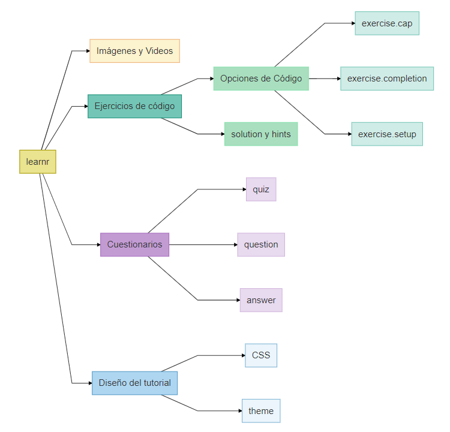

### Primeros pasos


```{r cuestionario1}
quiz(
  question(
    text = "¿Qué paquetería se requiere para crear un tutorial interactivo en RStudio?",
    allow_retry=TRUE,
    answer("xaringan",message = "Esta paquetería sirve para crear presentaciones en R."),
    answer("flipbookr",message = "Esta paquetería sirve para mostrar código incremental."),
    answer("learnr", correct = TRUE, message = "¡Correcto!"),
    correct = "¡Felicidades, vas al camino del éxito!",
    try_again = "Tú puedes mejorar",
    submit_button = "Confirmar",
    try_again_button = "Intenta de nuevo"
  ),
  question(
    text = "¿Qué necesitas para crear un tutorial interactivo?",
    allow_retry=TRUE,
    answer("Determinar los objetivos del tutorial",correct=TRUE),
    answer("La paquetería learnr",correct=TRUE),
    answer("Saber matemáticas"),
    correct = "¡Felicidades!",
    try_again = "Tú puedes mejorar",
    submit_button = "Confirmar",
    try_again_button = "Intenta de nuevo"
  ),
  caption = "Cuestionario"
)

```

## Crear un tutorial interactivo

### Instalar y cargar `learnr`

Usa este comando `install.packages("learnr")` en tu consola de R/RStudio para instalar el paquete `learnr`.

Como ejercicio, ingresa el comando para cargar la paquetería dentro del archivo de tu tutorial.

```{r ej1, exercise=TRUE,exercise.cap="Cargar learnr"}

```

```{r ej1-solution}
library(learnr)
```

```{r ej1-check}
gradethis::grade_this_code(correct = "Excelente", incorrect = "Usa la función library")
```

### Crear un tutorial

**Opción 1: Para crear el tutorial desde cero**

1.  Crear un nuevo Rmarkdown:

    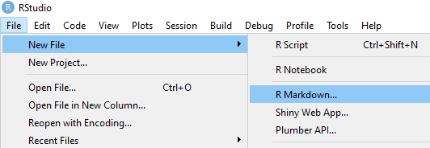{width="489"}

2.  Seleccionar la plantilla de **Interactive tutorial**

    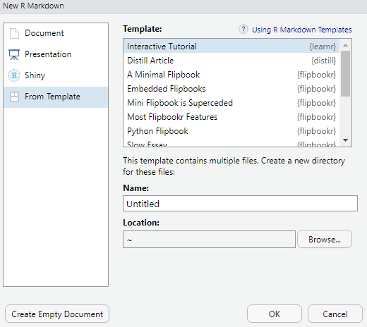{width="473"}

**Opción 2: Modificar un .Rmd ya existente**

1.  En un archivo Rmarkdown modificar el [YAML](https://tutorialesmg.netlify.app/r-markdown) header para incluir el output que se muestra:

<!-- -->

    ---
    title: "Tutorial"
    output: 
      learnr::tutorial:
        theme: flatly
        highlight: tango
    runtime: shiny_prerendered
    description: "Esto es un tutorial de learnr para aprender a usar learnr."
    ---

## Ejercicios de código {data-allow-skip="FALSE"}

**¿Te gustaría que los estudiantes puedan aplicar lo que se enseña en tu tutorial sin la necesidad de abrir otro archivo o la consola de R?** En esta sección aprenderemos a crear ejercicios de código, los cuales permiten ejecutar código de R dentro del tutorial.

### ¿Cómo crear un ejercicio de código?

1.  Crear un chunk de código R. En RStudio podemos usar el atajo `CTRL + ALT + I`.

2.  Añadir la opción `exercise=TRUE` en el chunk para convertirlo en un ejercicio.

Ejemplo:

Código

```{r eval=FALSE,echo=TRUE}
'''{r ejercicio, exercise=TRUE}
#Aquí puedes ingresar código de R y ejecutarlo.
'''
```

Resultado

```{r ejercicio0, exercise=TRUE}
#Aquí puedes ingresar código de R y ejecutarlo.
```

### ¿Cómo modificar un ejercicio de código?

Para modificar un ejercicio de código usamos las opciones del chunk del ejercicio, las cuales no se muestran en el tutorial (y en general no se muestran en los .Rmd).

    ```{r nombre_del_chunk, diversas_opciones_que_mostraremos}
    # Tu código
    ```

Ejemplo:

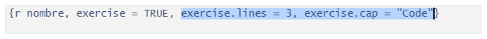

Veamos qué es posible hacer con los ejercicios de código usando las opciones de la siguiente tabla:

+---------------------------------------------------------------------+------------------------+--------------------------------------------------------------------------------------------+--------------------------------------------------------------+
| ¿Quieres...                                                         | Usa la opción:         | ¿Qué valores toma la opción?                                                               | Resultado                                                    |
+=====================================================================+:=======================+:===========================================================================================+==============================================================+
| cambiar el número de lineas que aparecen en el ejercicio?           | `exercise.lines = n`   | n puede ser: 1, 2, 3, .... Es el número de filas de código que se muestren en el tutorial. | 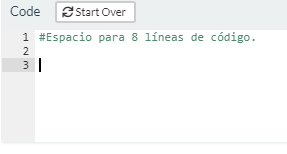{width="281"}                         |
+---------------------------------------------------------------------+------------------------+--------------------------------------------------------------------------------------------+--------------------------------------------------------------+
| modificar el título del ejercicio?                                  | `exercise.cap`         | Una cadena de caracteres. Por default, `exercise.cap = "Code"`                             | 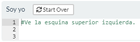{width="281"}                         |
+---------------------------------------------------------------------+------------------------+--------------------------------------------------------------------------------------------+--------------------------------------------------------------+
| preevaluar el código del ejercicio?                                 | `exercise.eval`        | Un boleano. Por default es `FALSE`.                                                        | 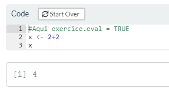{width="281"}                         |
+---------------------------------------------------------------------+------------------------+--------------------------------------------------------------------------------------------+--------------------------------------------------------------+
| evitar que el código ingresado tome demasiado tiempo en ejecutarse? | `exercise.timelimit`   | Un entero. Representa el tiempo límite de ejecución del código en segundos.                | 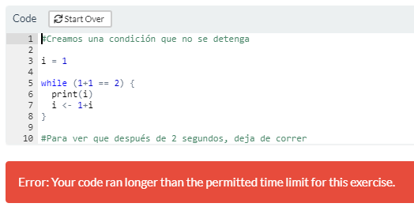{width="281"}                         |
|                                                                     |                        |                                                                                            |                                                              |
|                                                                     |                        | **No significa** que el usuario tenga ese tiempo para completar el código.                 |                                                              |
+---------------------------------------------------------------------+------------------------+--------------------------------------------------------------------------------------------+--------------------------------------------------------------+
| brindar o quitar ayuda al estudiante?                               | `exercise.completion`  | Un boleano. Por default es `TRUE`.                                                         | 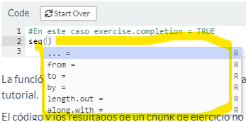{width="281"}                         |
+---------------------------------------------------------------------+------------------------+--------------------------------------------------------------------------------------------+--------------------------------------------------------------+
| prevenir al estudiante sobre errores de codificación?               | `exercise.diagnostics` | Un boleano. Por default es `TRUE`.                                                         | Ve ejemplo en la sección: **¿Cómo puedo ayudar al usuario?** |
+---------------------------------------------------------------------+------------------------+--------------------------------------------------------------------------------------------+--------------------------------------------------------------+
| permitir que se reinicie el ejercicio?                              | `exercise.startover`   | Un boleano. Por default es `TRUE`.                                                         | 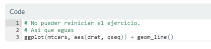{width="281"}                        |
+---------------------------------------------------------------------+------------------------+--------------------------------------------------------------------------------------------+--------------------------------------------------------------+

El uso de estas opciones depende del propósito del tutorial, pero es posible que se requiera la misma opción para todos los ejercicios. **¿Existe alguna forma de fijar opciones para todos los chunks de ejercicio a la vez?**

**¡Sí!** con la función `tutorial_options()` podemos ahorrar tiempo al fijar dichas opciones. Esta configuración global puede especificarse en un chunk con nombre `setup` al inicio del tutorial. También es recomendable cargar todas las librerías que se requieran para el tutorial en dicho chunk.

**¿Cómo funciona un chunk de ejercicio?** Cada chunk de ejercicio tiene su propio ambiente en R, por lo que los objetos creados en un ejercicio no estarán disponibles para cualquier otro chunk.

Una forma permitir que dichos objetos estén disponibles fuera del ejercicio en el que se crean es usando la opción `exercise.setup="nombre-chunk-a-usar"`en el chunk de ejercicio en el que queremos usar el resultado previo. Podemos ir formando una cadena de resultados a usar de esta forma.

**Ejemplo.**

    {r respuesta}
    grafica_pinguinos <- ggplot(data = penguins) +
           aes(x = flipper_length_mm) +
      geom_histogram(aes(fill = species),
                     alpha = 0.5,
                     position = "identity") 
                     
                    
    1.

    {r ejercicio7, exercise=TRUE, message=FALSE,warning=FALSE}
    grafica_pinguinos <- ggplot(data = ______) +
           aes(x = flipper_length_mm) +
      geom_histogram(aes(fill = species),
                     alpha = 0.5,
                     position = "identity") +
      labs(x = "Flipper length (mm)",
           y = "Frequency",
           title = "Penguin flipper lengths") + 
      scale_fill_manual(values = c("darkorange","purple","cyan4"))
      
      grafica_pinguinos
      
    2. 

    {r ejercicio7_2, exercise=TRUE, exercise.setup="respuesta"}
    grafica_pinguinos + _____

1.  Completa el siguiente código para generar una gráfica con los datos del data.frame `penguins`

```{r respuesta}
grafica_pinguinos <- ggplot(data = penguins) +
  aes(x = flipper_length_mm) + 
  geom_histogram(aes(fill = species), alpha = 0.5, position = "identity") 
```

```{r ejercicio7, exercise=TRUE, message=FALSE,warning=FALSE}
grafica_pinguinos <- ggplot(data = ____) +
    aes(x = flipper_length_mm) +
    geom_histogram(aes(fill = species),
                     alpha = 0.5,
                     position = "identity") 
grafica_pinguinos
```

<!-- -->

2.  Agrega el tema `minimal` al gráfico anterior.

```{r ejercicio7_2, exercise=TRUE, exercise.setup="respuesta",message=FALSE,warning=FALSE}
grafica_pinguinos + _____

```

```{r ejercicio7_2-solution}
grafica_pinguinos  + theme_minimal()

```

*Notemos que la segunda parte del ejercicio va ligada a un chunk que contiene la respuesta correcta y no al chunk de la parte 1 del ejercicio (que contiene la respuesta del usuario).* 😢

### Ejercicios con hints y soluciones {#syh}

Si algún ejercicio de tu tutorial requiere una muy buena comprensión del código o consideras que tiene un nivel alto de dificultad, **puedes incluir hints para los estudiantes (sujerencias/orientación sobre cómo resolver el ejercicio).** Además puedes **incluir el código de la solución para que los estudiantes puedan identificar la forma correcta de resolver el ejercicio.**

Para lograr esto usamos el sufijo `-hint` en el nombre del chunk que contiene el hint o mostrar el código de la solución añadiendo `-solution` al nombre del chunk que contiene la solución.

Por ejemplo, para proporcionar código que de una pista para resolver el ejercicio que tiene nombre de chunk `ejercicio1`, escribimos la pista en un chunk que tenga nombre `ejercicio1-hint`. De manera similar, para proporcionar el código de la solución de este ejercicio lo escribimos en un chunk con nombre `ejercicio1-solution`.

Código:

    Este es el código del chunk del ejercicio:

      '''{r ejercicio1, exercise=TRUE}
      #Aquí va el ejercicio:
      
      # Cambia al color de los puntos a rosa
      ggplot(mtcars, aes(x=mpg,y=cyl)) +
        geom_point()
      '''
    Este es el código del chunk del hint:

      '''{r ejercicio1-hint}
      #Aquí va el hint para el ejercicio 1
      
      # Usa el parámetro color dentro de geom_point()
      '''

Resultado:

```{r ejercicio1, exercise=TRUE}
# Cambia al color de los puntos a rosa
ggplot(mtcars, aes(x=mpg,y=cyl)) +
  geom_point()
```

```{r ejercicio1-hint}
#Usa el parámetro color dentro de geom_point()
```

Código:

    Este es el código del chunk del ejercicio:

      '''{r ejercicio2, exercise=TRUE}
      #Aquí va el ejercicio:
      
      # Cambia al color de los puntos a verde
      ggplot(mtcars, aes(x=mpg,y=cyl)) +
        geom_point()
      '''
    Este es el código del chunk de la solución:

      '''{r ejercicio2-solution}
      #Aquí va la solución del ejercicio 1
      
      ggplot(mtcars, aes(x=mpg,y=cyl)) +
        geom_point(color = "green")
      '''

Resultado:

```{r ejercicio2, exercise=TRUE}
# Cambia al color de los puntos a verde
ggplot(mtcars, aes(x=mpg,y=cyl)) +
  geom_point()
```

```{r ejercicio2-solution}
ggplot(mtcars, aes(x=mpg,y=cyl)) +
  geom_point(color= "green")
```

Al proporcionar hints y también la solución en un ejercicio, ésta aparecerá dentro del apartado de las hints y se mostrará al final.

Código:

    Este es el código del chunk del ejercicio:

      '''{r ejercicio3, exercise=TRUE}
      #Aquí va el ejercicio:
      
      # Cambia al color de los puntos a verde
      ggplot(mtcars, aes(x=mpg,y=cyl)) +
        geom_point()
      '''

    Este es el código del chunk del hint:

      '''{r ejercicio3-hint}
      #Aquí va el hint
      
      # Usa el parámetro color dentro de geom_point()
      '''
    Este es el código del chunk de la solución:

      '''{r ejercicio3-solution}
      #Aquí va la solución del ejercicio 1
      
      ggplot(mtcars, aes(x=mpg,y=cyl)) +
        geom_point(color = "green")
      '''

Resultado:

```{r ejercicio3, exercise=TRUE, highlight=TRUE}
# Cambia al color de los puntos a verde
ggplot(mtcars, aes(x=mpg,y=cyl)) +
  geom_point()
```

```{r ejercicio3-hint}
# Usa el parámetro color dentro de geom_point()
```

```{r ejercicio3-solution}
ggplot(mtcars, aes(x=mpg,y=cyl)) +
  geom_point(color= "green")
```

### ¿Cómo puedo ayudar al usuario? *(completar código y aviso de fallas)*

Por defecto, en cada ejercicio de código se tiene que`exercise.completion = TRUE` lo cual hace que mientras el usuario escribe una función de R (por ejemplo `mean)`, se muestren los parámetros que requiere esa función (por ejemplo `x = , na.rm =` ).

Ejemplo: Cuando `exercise.completion = FALSE`.

```{r ejercicio5, exercise = TRUE, exercise.completion = FALSE, exercise.cap = "Sin ayuda para completar"}
#Intenta volver a llenar los argumentos de la función seq para NO ver en marcha
# exercise.completion (pues pusimos exercise.completion = FALSE)
x <- seq(0,10,2)
```

Por otro lado `exercise.diagnostics = TRUE` sirve para avisar al usuario cuando cometa un error en el código, por ejemplo `function(` es un error de codificación porque falta un paréntesis, si se escribe `exercise.diagnostics = FALSE` no se le dará aviso al usuario que es un error.

-   `exercise.diagnostics = TRUE`

    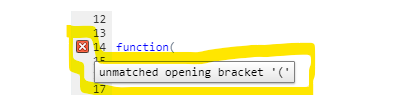

-   `exercise.diagnostics = FALSE`

    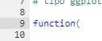

Ejemplo: Cuando `exercise.diagnostics = FALSE`.

```{r ejercicio6, exercise = TRUE, exercise.diagnostics = FALSE, exercise.cap = "Sin diagnóstico"}
# Observa que no aparece del lado izquerdo alguna advertencia de los siguientes errores:
function(
  
mean(
```

### Examen sorpresa 🤨

```{r cuestionario9}
quiz(
  question("¿Qué opción del chunk se usa para que aparezca el botón de `Start over` en cada ejercicio?",
           answer("`exercise.diagnostics`",message="Esta opción es para advertirte sobre los errores de código en el editor."),
           answer("`exercise.start-over`",correct=TRUE),
           answer("`exercise.cap`",message="Esta opción te permite cambiar el título del ejercicio."),
           allow_retry=TRUE,
           correct = "¡Sí que has puesto atención!",
           try_again = "Vuelve a leer la sección anterior",
           submit_button = "Yo sé que sé",
           try_again_button = "Inténtalo de nuevo "),
  question("La opción `exercise.timelimit` sirve para limitar el tiempo que tiene el usuario para responder.",
           answer("Verdadero"),
           answer("Falso", correct=TRUE),
           allow_retry=TRUE,
           correct = "¡Sí que has puesto atención!",
           try_again = "",
           submit_button = "Yo sé que sé",
           try_again_button = "Inténtalo de nuevo")
)

```

## Cuestionarios

Si el tema de tutorial requiere reforzar conceptos o relaciones (en lugar de cómo hacer el código) puedes lograrlo incluyendo preguntas (o cuestionarios) de opción múltiple sobre el tema.

### Preguntas

Para crear una pregunta de opción múltiple usa la siguiente estructura:

**Código**

```{r,echo=TRUE,eval=FALSE}
{r quiz}
quiz(
  question("Aquí escribes la pregunta",
    allow_retry = TRUE, #Que lo vuelva a intentar
    answer("Opción 1"),
    answer("Opción 2"),
    answer("Opción correcta", correct = TRUE)
  ),
  question("Pueses incluir mensajes para cada opción y más de una opción correcta.",
    allow_retry = TRUE,
    answer("Una opción correcta", correct = TRUE,message = "Mensaje adicional"),
    answer("Una opción incorrecta", message = "Mensaje adicional"),
    answer("Otra opción incorrecta"),
    answer("Otra opción correcta", correct = TRUE)
  )
)
```

**Resultado**

```{r cuestionario6}
quiz(
  question(text = "Aquí escribes la pregunta",
    allow_retry = TRUE,
    answer("Opción 1"),
    answer("Opción 2"),
    answer("Opción correcta", correct = TRUE)
  ),
  question("Pueses incluir mensajes para cada opción y más de una opción correcta.",
    allow_retry = TRUE,
    answer("Una opción correcta", correct = TRUE,message = "Mensaje adicional"),
    answer("Una opción incorrecta", message = "Mensaje adicional"),
    answer("Otra opción incorrecta"),
    answer("Otra opción correcta", correct = TRUE)),
  caption = "Ejemplo"
)
```

### Parámetros de `question`

**Lo básico:**

-   `text = "¿Esta es la pregunta?"` El parámeto `text` contiene una cadena de caracteres o **strings** (es decir texto dentro de "comillas").

-   `answer("Esta es la respuesta correcta", correct = TRUE, message = "Aquí le dices al usuario algo bonito por haber acertado ;)")`

    -   La función answer es un parámetro de question y contiene a su vez los siguentes parámetros:

        -   `text` parámetro de caracteres que definen una posible respuesta a la pregunta

        -   `correct` un parámetro boolean(o), es decir, TRUE o FALSE. Por defecto, `correct = FALSE` lo cual indica que esa posible respuesta NO ES correcta.

        -   `message` parámetro de caracteres para dar un mensaje adicional al usuario sobre la opción de respuesta que eligió.

-   **¿Quieres permitir que el usuario vuelva a intentar responder?**

    Puedes hacerlo con `allow_retry` que recibe un boleano. Por defecto (es decir, sino se especifica el valor del parámetro) `allow_retry = FALSE` lo cual implica que NO habrá posibilidad de que el usuario intente contestar de nuevo (si es que contestó incorrectamente).

-   **¿Quieres personalizar el mensaje que aparece al contestar correcta o incorrectamente?**

    Usa `correct = "Este mensaje saldrá cuando aciertes en tu respuesta"` .

    `incorrect = "Este mensaje saldrá cuando NO aciertes en tu respuesta"`, **solo aparecerá si** `allow_retry = FALSE`

    `try_again = "Este mensaje saldrá cuando NO aciertes en tu respuesta y tengas la opción de intentarlo de nuevo"`

    **¿Cómo cambiar los botones?**

-   `submit_button = "Mensaje que tiene el botón para confirmar tu respuesta"`, por defecto `submit_button = "Submit Answer"`

-   `try_again_button = "Mensaje que tiene el botón para hacer otro intento"` (siempre y cuando te equivoques), por defecto`try_again_button = "Try Again"`

-   `random_answer_order = TRUE` es un parámetro que permite cambiar el orden de las opciones de respuesta cada que vuleves a realizar el tutorial. **Es decir dar click en `Start over`**

    Ejemplo:

```{r cuestionario7, echo = TRUE}
  question(
    text = "¿Cuál parámetro sirve para cambiar el mensaje del botón para intentar de nuevo?",
    allow_retry=TRUE,
    answer("incorrect",message = "No sabes. Este sirve para dar un mensaje cuando te equivocas"),
    answer("submit_button",message = "No sabes. Aquí cambias de mesnaje de confirmación"),
    answer("try_again_button", correct = TRUE, message = "¡Maravillos@ estudiante!"),
    correct = "¡Sí que has puesto atención!",
    try_again = "Vuelve a leer la sección de parámetros",
    submit_button = "Yo sé que sé",
    try_again_button = "Acuérdate de mí",
    random_answer_order = TRUE
  )
```

Si queremos hacer múltiples preguntas usamos la función `quiz` que tenga por parámetros las diferentes `quiestion`s.

```{r cuestionario8, echo=TRUE}
quiz( 
  question(
    text = "¿Cuáles son los parámetros de answer?",
    answer("text",correct = TRUE),
    answer("correct",correct = TRUE),
    answer("message", correct = TRUE), 
    correct = "¡Muy bien!",
    submit_button = "Yo sé que sé", 
    allow_retry = TRUE,
    try_again_button = "Intenta de nuevo",
    try_again = "A lo mejor no leiste bien la pregunta"
    ),
  question(
    text = "¿Qué función se usa para armar un cuestionario?",
    allow_retry=TRUE,
    answer("quiz", correct = TRUE, message = "Vas por buen camino"),
    answer("questions",message = "Esta función no existe en learnr"),
    answer("quizes", message = "Esta función no existe en learnr"), 
    correct = "Sigue adelante",
    try_again = "Intenta de nuevo",
    submit_button = "Yo sé que sé",
    try_again_button = "Date otra oportunidad"
  ),
caption = "¿Aprendiste?"
)
```

### Para incluir símbolos matemáticos en las preguntas:

Para poder hacer uso de fórmulas dentro de las preguntas, solo ponemos las fórmulas entre signos de pesos (\$) en sintáxis de $\mathbb{L_aT_ex}$ y dos backslash `\\`, por ejempo:

```{r quiz4, echo=TRUE}
question(
  
  text = "¿A qué distribución corresponde la siguiente función de densidad? $f(x) = \\frac{e^{\\frac{-(x-\\mu)^2}{2\\sigma^2}}}{\\sqrt{2\\pi\\sigma^2}}$",
  
  answer("Gaussiana", correct = TRUE),
  answer("Normal", correct = TRUE), 
  
  
#Este parámetro permite al usuario que aun cuando seleccione una respuesta correcta de muchas, ésta se evaluará como correcta (a diferencia de "checkbox" en la que hay que marcar todas las respuestas correctas para que se evalúe como correcta).
  type = "radio", 
  correct = "¡¿Eres Gauss!?",
  submit_button = "Confía en tí"
)
```

## Incluir elementos externos

**¿Qué otros elementos se pueden incluir para hacer más llamativo mi tutorial?**

### Imágenes

Como en cualquier tipo de archivo .Rmd puedes incluir imágenes. Sin embargo, en este caso debe crearse una carpeta dentro del directorio del tutorial con el nombre **images** y guardar en esta las imágenes a incluir y referenciarlas a dicha carpeta. Por ejemplo:

``

También se pueden incluir imágenes (y gifs) de internet:

``

{style="figure-align: center"}

### Videos

Se usa la misma sintáxis que para incluir una imagen de internet pero ahora escribimos el link al video. Solo pueden incluirse links a videos de YouTube o vimeo.

Lo atractivo de esta característica es que el video se reproducirá dentro del mismo archivo del tutorial (no te redirige a otra página).

### Links

Si deseas añadir material de consulta que se encuentra en internet, puedes incluir referencias dentro del tutorial que te lleven a dichas páginas web.

`[Texto de la referencia](https://link-a-la-pagina-de-referencia)`

```{r cuestionario2}
question(text="¿Cuál de los siguientes comandos sirve para añadir un video dentro del tutorial?",
         answer("``"),
         answer("`",correct=TRUE),
         answer("`https://link-al-video`"),
         allow_retry=TRUE,
         correct = "¡Muy bien!",
        try_again = "Te estás confundiendo",
        submit_button = "Confirmar",
        try_again_button = "Intentalo de nuevo")
```

## Diseño del tutorial

**¿Cómo cambiar la apariencia de mi tutorial?**

### Temas

De manera simple, podemos hacer que el tutorial se vea con diferente estilo poniendo en el encabezado YAML `theme: "default"`, donde default se puede cambiar por alguno de los temas predeterminados, siguientes:

|              |              |               |
|:------------:|:------------:|:-------------:|
| `"default"`  | `"readable"` |   `"paper"`   |
| `"cerulean"` | `"spacelab"` | `"sandstone"` |
| `"journal"`  |  `"united"`  |  `"simplex"`  |
|  `"flatly"`  |  `"cosmo"`   |   `"yeti"`    |
|  `"darkly"`  |  `"lumen"`   |               |

```{r cuestionario3}
question(
  text = "¿Cuál es la forma correcta de cambiar el tema del tutorial a `flatly`?",
  allow_retry = TRUE,
  answer("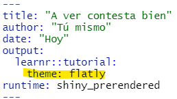", correct = TRUE),
  answer(""),
  answer("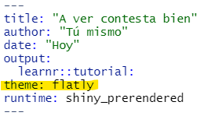"),
    correct = "¡Perfecto!",
    try_again = "Intenta de nuevo",
    submit_button = "Lo lograré",
    try_again_button = "Quiero salir bien",
    random_answer_order = TRUE
)
```

### Avance progresivo

Es posible que algún tema del tutorial sea muy extenso y revelar todo el contenido a la vez no sea lo ideal. **¿Cómo podemos ir mostrando el contenido de un tema por partes?**

Para mostrar los subtópicos del tutorial (aquellos que tienen \#\#\#) uno a la vez dando click al botón **Continue** para avanzar, tenemos dos opciones:

-   Aplicarlo a todo el documento activando la opción `progressive: true` en el encabezado YAML.

        ---
        title: "Hello, Tutorial!"
        output: 
          learnr::tutorial:
            progressive: true
        runtime: shiny_prerendered
        --- 

-   Aplicarlo solo a algunos subtópicos agregando `{data-progressive=TRUE}` adelante de cada encabezado de tema (con \#\# ) que queremos revelar de manera progresiva.

        ## Tema {data-progressive=TRUE}

```{r cuestionario4}
question(
  text = "`data-progressive=TRUE` sirve para revelar el contenido de los subtitulos poco a poco...",
  allow_retry = TRUE,
  answer("En todo el documento"),
  answer("En algún tema del documento", correct = TRUE),
  answer("En todos los temas subsecuentes a esta especificación"),
    correct = "¡Perfecto!",
    try_again = "Intenta de nuevo",
    submit_button = "Lo lograré",
    try_again_button = "Quiero salir bien"
)
```

Una vez activada la opción `progressive` no podremos avanzar en el tutorial sin contestar los ejercicios de cada sección. Para permitir el avance sin contestar los ejercicios, podemos agregar `allow_skip: true` en el encabezado YAML.

    ---
    title: "Hello, Tutorial!"
    output: 
      learnr::tutorial:
        progressive: true
        allow_skip: true
    runtime: shiny_prerendered
    --- 

Para solo permitir avanzar en algunas secciones y no en otras sin contestar, podemos especificar`{data-allow-skip=TRUE}` o `{data-allow-skip=FALSE}` en cada tema.

```{r cuestionario5}
question(
  text = "¿Con qué comando se permite al usuario avanzar en el tutorial sin haber contestado los ejercicios? (en todo el documento)",
  allow_retry = TRUE,
  answer("data-allow-skip=TRUE"),
  answer("allow_skip: false"),
  answer("allow_skip: true", correct = TRUE),
    correct = "¡Perfecto!",
    try_again = "Intenta de nuevo",
    submit_button = "Lo lograré",
    try_again_button = "Quiero salir bien"
)
```

### Otro formato del tutorial

**¿Es posible incluir ejercicios en otros tipos de documentos que no sean un tutorial (`learnr::tutorial`)?**

¡Sí! Por ejemplo, durante la presentación de un tema en clase, usando una presentación tipo [`slidy`](https://garrettgman.github.io/rmarkdown/slidy_presentation_format.html). Para esto, se debe incluir `runtime: shiny_prerendered` en el encabezado YAML del documento de la presentación:

    # title: "Habits"
    # author: John Doe
    # date: March 22, 2005
    # output: slidy_presentation
    # runtime: shiny_prerendered

Antes de incluir un chunk de ejercicio en la presentación solo cargamos la paquetería `learnr`.

## ¿Una última pregunta?

```{r cuestionario10}
question("¿Usarás `learnr` después de revisar este tutorial?",
         type="radio",
         answer("¡Por supuesto!", correct=TRUE),
         answer("¡Claro que sí!", correct=TRUE),
         correct="",
         submit_button="Ya es lo último")

```

## Algo extra: Calificar código

**¿Es posible dar retroalimentación más personal en los ejercicios de código?**

¡Sí! Si deseas que los usuarios tengan retroalimentación cuando cometan algún error en los ejercicios de código (en términos del objetivo de aprendizaje en el ejercicio), puedes implementarlo con lo que veremos en esta sección.

### Instalar `gradethis`

La paquetería que usaremos para este fin se llama `gradethis` y te sugerimos hacer lo siguiente para tenerla instalada en tu computadora:

1.  Si ya instalaste `learnr` con el comando `install.packages("learnr")` entonces utiliza `remove.packages("learnr")` para desinstalarlo.

    Sea afirmativo o no lo anterior, haz lo siguiente:

2.  Usa el comando `remotes::install_github("rstudio/learnr")` para tener la versión en desarrollo de `learnr`.

3.  Usa el comando `remotes::install_github("rstudio-education/gradethis", force = TRUE)` para instalar `gradethis`.

4.  Cargar la paquetería con el comando `library(gradethis)` después de cargar `learnr`, ambas dentro del chunk inicial (que se puede llamar setup).

### Esquema

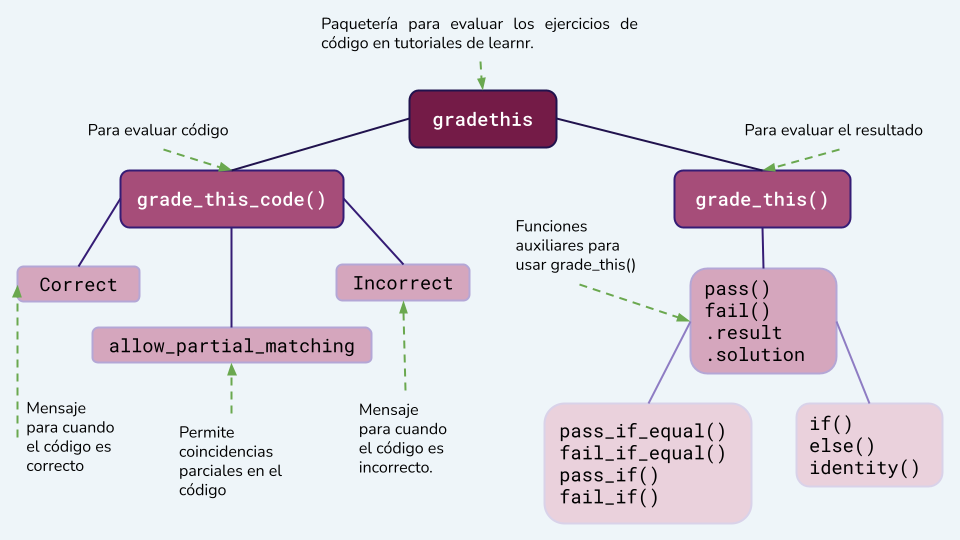{width="692"}

Existen dos formas principales para evaluar el ejercicio de código:

1.  Evaluar el código.

    En la paquetería `gradethis` esto se puede hacer con la función `grade_this_code()`. Esta función reemplaza a la función `grade_code()` ( que se menciona [en la documentación de](https://rstudio.github.io/learnr/exercises.html#Exercise_Checking)`learnr`).

2.  Evaluar el resultado que se deriva del código.

    Con la función `grade_this()` se puede personalizar el criterio de evaluación con respecto al resultado. **Por ejemplo**: si el resultado es mayor al esperado, se puede implementar unmensaje que diga "el resultado correcto es menor al obtenido" .

    Esta función, como en el punto anterior, reemplaza a `grade_result()`.

### grade_this_code()

**Ejemplo:**

Implementemos un ejercicio donde el usuario tenga que sumar 2+2 (= 🐟) en el que se evaluará que el código sea `2+2`.

1.  Crear el chunk de ejercicio.

2.  Crear el chunk solution.

    ```{r gejercicio-solution, exercise.reveal_solution = FALSE}
    2+2
    ```

3.  Crear el chunk check:

    El chunk de ejercicio se llama `gejericicio`, por lo que el nombre del chunk check debe ser `gejercicio-check`.

    Dentro del chunk siguiente se usará la función `grade_this_code()`.

        '''{r gejercicio-check}

        grade_this_code()

        '''

    ```{r gejercicio-check}
    gradethis::grade_this_code()
    ```

Resultado:

```{r gejercicio, exercise = TRUE, exercise.cap = "Suma"}
# Suma dos más dos

```

-   Nota que no importa si pones espacios en el código o pones el código en otras líneas (diferentes a las del chunk solution).

-   Nota que se añade un botón que se llama `Submit answer` para que el código sea evaluado.

-   Intenta escribir `3+1` , `2*2`, `4*1,` ... y nota que esa no es la respuesta correcta aun cuando el resultado sea el mismo (4).

### Parámetros

Se pueden modificar los mensajes que aparecen cuando se comete un error o un acierto con los parámetros de `grade_this_code()`:

-   `correct` recibe una cadena de caracteres la cual aparece cuando el código del usuario y el código de la solución coinciden.

    Por ejemplo `correct = "Haz hecho la suma que deseo"`

-   `incorrect` recibe una cadena de caracteres la cual aparece cuando el código del usuario y el código de la solución NO coinciden.

    Por ejemplo `incorrect = "Intenta sumar dos números iguales y que el resultado sea 4"`

-   `allow_partial_matching` puede ser `TRUE` o `FALSE`. Por defecto es `FALSE` y cuando `allow_partial_matching = TRUE` entonces se permite que aparezcan mensajes que indican dónde no coincide el código con la solución.

**Ejemplo** del ejemplo anterior tenemos:

    '''{r gejercicio-check}

    grade_this_code(correct = "Muy bien", 
                    incorrect = "Intenta sumar dos números iguales y que el resultado sea 4", 
                    allow_partial_matching = TRUE)

    '''

```{r gejercicio1, exercise = TRUE, exercise.cap = "Suma"}
# Suma dos más dos

```

```{r gejercicio1-solution, exercise.revela_solution=FALSE}
2+2
```

```{r gejercicio1-check}
grade_this_code(correct = "Muy bien", 
                incorrect = "Intenta sumar dos números iguales y que el resultado sea 4", 
                allow_partial_matching = TRUE)
```

### ¿Te quedó duda?

```{r gcuestionario}
quiz(
  question("Si el chunk del ejercicio se llama 'ejercicio', ¿En qué chunk debe ir la función `grade_this_code()`?",
    allow_retry = TRUE,
    answer("ejercicio-solution", message = "No, aquí debe ir el código esperado"),
    answer("ejercicio-check", correct = TRUE),
    answer("ejercicio-cechk", message = "Revisa la escritura"),
    correct = "¡Sí que has puesto atención!",
    try_again = "Vuelve a leer la sección anterior",
    submit_button = "Yo sé que sé",
    try_again_button = "Inténtalo de nuevo "
  ),
  
  question("¿Qué parámetro permite al usuario saber en qué parte del código se pudo haber equivocado?", 
    answer("allow_retry"),
    answer("allow_partial_matching", correct = TRUE),
    answer("incorrect"),
    allow_retry = TRUE,
    correct = "¡Sí que has puesto atención!",
    try_again = "Vuelve a leer la sección anterior",
    submit_button = "Yo sé que sé",
    try_again_button = "Inténtalo de nuevo "
  ),
  
  question("¿Para que sirve el parámetro correct?",
    answer("Para permitir que el usuario tenga correcto lo que haga siempre"),
    answer("Para dar a conocer al usuario un mensjae cuando el su código coincide con el de la solución", correct = TRUE),
    answer("Para estar felices"),
    allow_retry = TRUE,
    correct = "¡Sí que has puesto atención!",
    try_again = "Vuelve a leer la sección anterior",
    submit_button = "Yo sé que sé",
    try_again_button = "Inténtalo de nuevo "
  ), 
  caption = "Pongamos a prueba lo que haz aprendido"
)
```

### grade_this()

**Ejemplo:**

Implementemos un ejercicio donde el usuario tenga que obtener el resultado de sumar 2+2 (= 🐟) y se evaluará que dicho resultado sea `4`.

1.  Crear el chunk de ejercicio.

2.  Crear el chunk solution.

    ```{r gtejercicio-solution, exercise.reveal_solution = FALSE}
    2+2
    ```

3.  Crear el chunk check:

    El chunk de ejercicio se llama `gtejericicio`, por lo que el nombre del chunk check debe ser `gtejercicio-check`.

    En el chunk siguiente se usará la función `grade_this()`. Dentro de esta función se debe definir la lógica que se usa para evaluar el ejercicio. En el ejemplo se muestra una forma de comparar el resultado del usuario (`.result`) con el resultado correcto (`.solution`) y si son iguales se marca como correcto el ejercicio.

    Esta es solo una forma de varias que se pueden implementar para evaluar el ejercicio, las cuales veremos más a detalle en la sección siguiente.

        '''{r gtejercicio-check}

        grade_this(
          if(.result == .solution){
            pass("Muy bien")
          } else{
            fail("El resultado debe ser igual a 2+2")
          }
        )

        '''

    ```{r gtejercicio-check}
    gradethis::grade_this(
      if(.result == .solution){
        pass("Muy bien")
      } else{
        fail("El resultado debe ser igual a 2+2")
      }
    )
    ```

Resultado:

```{r gtejercicio, exercise = TRUE, exercise.cap = "Suma"}
# Obten el resultado de sumar dos más dos

```

-   Notemos que no importa si el resultado correcto (`4`) se obtiene de otra forma diferente (`3+1`, `4*1`, `4+0`) a la propuesta. Mientras sea `4` el ejercicio se marca como correcto.

### Funciones para definir la lógica de evaluación

Dentro de `gradethis` existen funciones que se puede usar en `grade_this()` para ayudar a definir la forma de evaluar los ejercicios de código.

**Funciones necesarias**

+-------------+----------------------------------------------------------------------------------------------------+
| Función     | Descripción                                                                                        |
+=============+====================================================================================================+
| `pass()`    | En esta función se escribe el mensaje que aparecerá cuando se marque como correcto el ejercicio.   |
+-------------+----------------------------------------------------------------------------------------------------+
| `fail()`    | En esta función se escribe el mensaje que aparecerá cuando se marque como incorrecto el ejercicio. |
+-------------+----------------------------------------------------------------------------------------------------+
| `.result`   | Hace referencia al resultado que se obtiene con el código del usuario.                             |
+-------------+----------------------------------------------------------------------------------------------------+
| `.solution` | Hace referencia al resultado correcto que se obtiene con el código del chunk `solution`.           |
+-------------+----------------------------------------------------------------------------------------------------+

**Funciones auxiliares para evaluar**

+-------------------+---------------------------------------------------------------------------------------------------------------------------------------------------------------------------------------------------------------------+
| Función           | Descripción                                                                                                                                                                                                         |
+===================+=====================================================================================================================================================================================================================+
| `pass_if()`       | En el parámetro `cond` se recibe la condición que debe cumplir .`result` para que el ejercicio sea correcto y en el parámetro `message` se escribe el mensaje que aparecerá cuando la condición anterior se cumpla. |
+-------------------+---------------------------------------------------------------------------------------------------------------------------------------------------------------------------------------------------------------------+
| `fail_if()`       | En el parámetro `cond` se recibe la condición con la cual se evaluará como incorrecto el ejercicio y el parámetro `message` recibe el mensaje que aparecerá cuando dicha condición se cumpla.                       |
+-------------------+---------------------------------------------------------------------------------------------------------------------------------------------------------------------------------------------------------------------+
| `pass_if_equal()` | Compara los parámetros `y` y `x` y evalua el ejercicio como correcto cuando estos son iguales, devolviendo el mensaje que se le pase con el parámetro `message`. Por default `y` es `.solution` y `x` es `.result`. |
+-------------------+---------------------------------------------------------------------------------------------------------------------------------------------------------------------------------------------------------------------+
| `fail_if_equal()` | Compara los parámetros `y` y `x` y evalua el ejercicio como incorrecto cuando estos son iguales, devolviendo el mensaje que se le pase en el parámetro `message`. Por default `y` es `.solution` y x es `.result`.  |
+-------------------+---------------------------------------------------------------------------------------------------------------------------------------------------------------------------------------------------------------------+

**Ejemplo**:

En el ejercicio `gt_ejercicio` se pide obtener cuántas observaciones de la tabla `penguins` tienen el valor `Torgensen` en el atributo `island`.

    '''{r gt_ejercicio-check}
    grade_this({
        # Se evalua automáticamente como correcto si .result es igual a .solution
        pass_if_equal(message="¡Muy bien!")
        
        # Se evalua como incorrecto cuando el número que se especificó no es el         #  correcto y se muestra un mensaje personalizado.
        fail_if_equal(sum(penguins$island=="Biscoe"), message = "No son las observaciones de la isla correcta.")
        fail_if_equal(sum(penguins$island=="Dream"), message = "No son las observaciones de la isla correcta.")
        
        # Se muestra el mensaje automático de retroalimentación cuando existe           #  cualquier otro error en el código.
        fail()
      })
    '''

Resultado:

```{r gt_ejercicio, exercise=TRUE, exercise.cap = "pass_if_, fail_if"}
# Usando los datos de la tabla penguins, ¿cuántos pingüinos provienen de la isla Torgersen?

```

```{r gt_ejercicio-solution}
sum(penguins$island=="Torgersen")
```

```{r gt_ejercicio-check}
grade_this({
    # Se evalua automáticamente como correcto si .result es igual a .solution
    pass_if_equal(message="¡Muy bien!")
    
    # Se evalua como incorrecto cuando el número que se especificó no es el         #  correcto y se muestra un mensaje personalizado.
    fail_if_equal(sum(penguins$island=="Biscoe"), message = "No son las
                  observaciones de la isla correcta.")
    fail_if_equal(sum(penguins$island=="Dream"), message = "No son las 
                  observaciones de la isla correcta.")
    
    # Se muestra el mensaje automático de retroalimentación cuando existe           #  cualquier otro error en el código.
    fail()
  })
```

-   Intenta escribiendo `sum(penguins$island=="Biscoe")` o `168` para ver el mensaje.

También se puede definir una lógica para evaluar usando claúsulas `if()` y `else()` como en el primer ejemplo de esta sección y usar `pass()` y `fail()` para indicar cuándo se evalua como correcto y cuándo como incorrecto.


**Ejemplo**:

*Código del chunk-check*

```{r echo=TRUE,eval=FALSE, message=FALSE,warning=FALSE}
grade_this({
  # ¿El resultado es un objeto data.frame?
  if (!inherits(.result, "data.frame")) {
    fail("Tu resultado debe ser un data.frame")
  }

  # Ahora que sabemos que .result es un data.frame veremos si tiene la especie correcta...
  if (.result$species[1] != "Gentoo") {
    fail("Las observaciones deben ser de la especie Gentoo.")
  }

  # ...ahora comprobamos que la isla sea la correcta
  if (.result$island != "Biscoe") {
    fail("Las observaciones deben ser de la isla Biscoe.")
  }
  
  # ...comprobamos que el número de observaciones es el que debe ser
  if (nrow(.result) != 124) {
    fail("La tabla debe tener 124 observaciones.")
  }
  # ahora que revisamos las condiciones anteriores mostramos el mensaje de que el resultado es correcto
  pass(message="Ahora ya sabes filtrar datos de una tabla.")
})
```

```{r ejercicio_if-check, echo=TRUE,message=FALSE,warning=FALSE}
grade_this({
  # ¿El resultado es un objeto data.frame?
  if (!inherits(.result, "data.frame")) {
    fail("Tu resultado debe ser un data.frame")
  }

  # Ahora que sabemos que .result es un data.frame veremos si tiene la especie correcta...
  if (.result$species[1] != "Gentoo") {
    fail("Las observaciones deben ser de la especie Gentoo.")
  }

  # ...ahora comprobamos que la isla sea la correcta
  if (.result$island != "Biscoe") {
    fail("Las observaciones deben ser de la isla Biscoe.")
  }
  
  # ...comprobamos que el número de observaciones es el que debe ser
  if (nrow(.result) != 124) {
    fail("La tabla debe tener 124 observaciones.")
  }
  # all of the above checks have passed now.
  pass(message="Ahora ya sabes filtrar datos de una tabla.")
})

```

*Resultado*

```{r ejercicio_if, exercise=TRUE, exercise.cap="if - else", exercise.lines=5, message=FALSE,warning=FALSE}
# Crea una tabla que contenga solo los pingüinos de la especie Gentoo 
#  y la isla Biscoe usando el data.frame penguins.
library(dplyr)
penguins %>% filter(species=="  ", island=="  ")

```

Intenta sustituir la respuesta anterior por:

-   `penguins %>% filter(species=="Adelie", island=="Dream")`

-   `head(penguins %>% filter(species=="Gentoo", island=="Biscoe"))`

-   `matrix(NA,3,2)`

## Un paso más allá: Un diseño personalizado

### CSS

Si quieres un diseño distinto (y propio) a los temas predeterminados puedes crear un archivo o sección CSS para el tutorial.

Para ello considera el siguiente esquema que ayudará a entender la sintáxis que veremos más adelante:

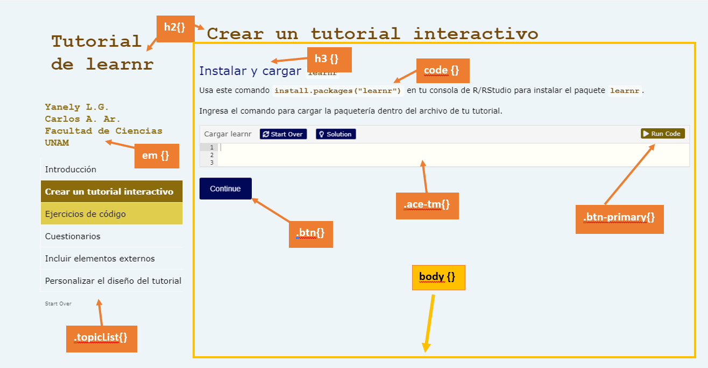{width="694"}

CSS significa Cascading Style Sheets y es un lenguaje de hojas de estilo en cascada que separa los elementos del tutorial para que puedas modificarlos.

Los comandos principales para hacer estos cambios son:

-   `color` color de la letra

-   `font-family` tipo de letra

-   `font-size` tamaño de la letra

-   `background-color` color de fondo

Un ejemplo para cambiar el body (ver imagen) es el siguiente:

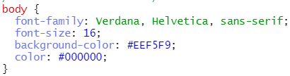

Nota que el color lo pusimos en formato [hexadecimal](https://htmlcolorcodes.com/es/).

**Ejercicio.** Completa el siguiente código para cambiar el tipo de letra del nombre de los autores (Arial, Verdana, Helvetica [o la que se pueda](https://www.w3schools.com/css/css_font.asp)).

```{r ej2, exercise = TRUE, exercise.cap = "Mi primer CSS"}
__ {
  color: #8A6C0C;
  font-family: ______;
  font-size: 18px;
}

#Como esta no es sintáxis de R, habrá un error al dar click en "Run Code"
```

Estas especificaones se pueden realizar en un archivo CSS o al inicio del tutorial.

Si lo pones al inicio del tutorial (no en un chunk de código) necesitarás un esquema como este:

    <style>

        h2 {
          color: #6D4101;
          font-size: 35px;
        }
        body {
          font-family: Verdana, Helvetica, sans-serif;
          font-size: 16;
          background-color: #EEF5F9;
          color: #000000;
        }
        
    </style>

Que se pone después del encabezado YAML.
