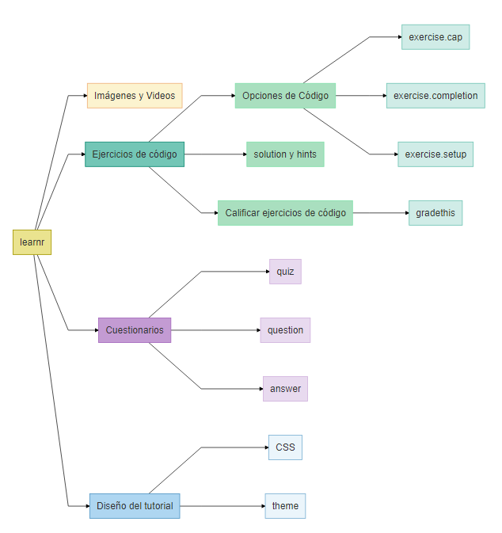
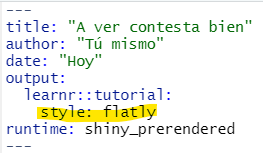

```{r setup, include=FALSE}
#Librerías a usar
library(learnr)
library(checkr)
library(ggplot2)
library(palmerpenguins)
library(DiagrammeR)
#Modificaciónes para los chunks
knitr::opts_chunk$set(echo = FALSE)
#Modificaciones en el tutorial
```

```{=html}
<style>
div {
  text-align: justify;
}
/***********************/
/*Títulos ## y autoría F6EACD*/
/***********************/
h1, h2 {
  color: #6D4101;
  padding: .4em; /*es decir el 60 por ciento del tamaño de la letra*/
  font-family: "Courier New", monospace;
  font-size: 35px;
  font-weight: bold;
  opacity: 0.95;
}
em {
  color: #8A6C0C;
  font-family: "Courier New", monospace;
  font-size: 18px;
  padding: .2em;
  opacity: 0.97;
  font-weight: bold;
}
/***********************/
/* Cuerpo */
/***********************/
body {
  font-family: Verdana, Helvetica, sans-serif;
  font-size: 16;
  background-color: #EEF5F9;
  color: #000000;
}
/***********************/
/* Títulos con ###     */
/***********************/
h3, h4, h5{
  color: #06116C;
  font-family: Verdana, Helvetica, sans-serif;
}
/*******************************************/
/* Referencias a páginas o a otro documento*/
/*******************************************/
a {
    color: #B8870F;
    text-decoration: none;
}
/**********************/
/* Chunks de exercises*/
/**********************/
.ace-tm {
    background-color: #FFFEF7;
    color: #010730;
}
/***********************/
/* tabla de contenidos */
/***********************/
.topicsList {
  padding: .5em;
}
.topicsHeader {
  color: #06116C;
  padding: .5em;
}
.topicsList #doc-metadata {
  color: #06116C;
  padding: .5em;
}
.topicsList .topic.current {
  background-color: #8A6C0C;
  color: #FFFFFF;
  font-weight: bold;
}
.topicsList .topic:hover, .topicsList .topic:active {
  background-color: #E0CD4E;
  color: #01053D;
}
/***********/
/* Botones */
/***********/
.btn {
  background-color: #000857;
  color: #EBEDFF;
}
/* cambiar de página */
.btn-default {
    color: #EBEDFF;
    background-color: #000857;
    border: none;
}
/* cambiar de página */
.btn-light {
  background-color: #000857;
  color: #EBEDFF;
}
/* run code */
.btn-primary , .btn-success, .btn-info{
  background-color: #786300;
  color: #EBEDFF;
}
/* mientras está desabilitados */
.btn:hover, .btn:active, .btn:disabled {
  background-color: #786300;
  color: #EBEDFF;
}
/**********/
/* Código */
/**********/
code {
    color: #6D4101;
    background-color:  #F7FBF9;
    font-size: 15px;
    font-weight: bold;
}
/**************************/
/* Recuadro para ejemplos */
/**************************/
.boxed {
    background: #F7FBF9;
    color: black;
    border: 3px solid #C83737;
    margin: 0px auto;
    width: 456px;
    padding: 10px;
    border-radius: 10px;
  }
.note {
    padding: 1em;
    margin: 1em 0;
    padding-left: 100px;
    background-size: 70px;
    background-repeat: no-repeat;
    background-position: 15px 15px;
    min-height: 120px;
    color: black;
    background-color: lightgrey;
    border: solid 5px #C83737;
    background-image: url("manzana.png");
  }
.note_white {
    padding: 1em;
    margin: 1em 0;
    padding-left: 100px;
    background-size: 70px;
    background-repeat: no-repeat;
    background-position: 15px 15px;
    min-height: 120px;
    color: black;
    background-color: #F7FBF9;
    border: solid 5px #C83737;
    background-image: url("manzana.png");
  }
</style>
```
## Introducción

### Objetivo de este tutorial

El objetivo de este tutorial es que aprendas a generar tu propio tutorial (😜) interactivo en R usando la paquetería `learnr`. Esta paquetería consta de funciones que permiten modificar un [archivo .Rmd](https://tutorialesmg.netlify.app/r-markdown) para incluir cuestionarios, ejercicios de código entre otras cosas.

### Esquema de este tutorial

```{r, echo=FALSE, eval = FALSE}
DiagrammeR("
graph LR;
  A[learnr] --> B[Imágenes y Videos];
  A --> D[Cuestionarios];
  A --> C[Ejercicios de código];
  A --> E[Diseño del tutorial];
  C --> F[Opciones de Código];
  C --> H[solution y hints];
  F --> I[exercise.cap];
  F --> J[exercise.completion];
  F --> K[exercise.setup];
  D --> L[quiz];
  D --> M[question];
  D --> N[answer];
  E --> O[CSS];
  E --> P[theme];
  style A fill:#EAE38F, stroke:#A59800;  
  
  style B fill:#FCF3CF, stroke:#F0B27A; 
  style C fill:#73C6B6, stroke:#138D75;
  style D fill:#C39BD3, stroke:#A569BD;  
  style E fill:#AED6F1, stroke:#5499C7;
  
  style F fill:#A9DFBF, stroke:#82E0AA;  
  style H fill:#A9DFBF, stroke:#82E0AA; 
  
  style L fill:#E8DAEF, stroke:#D2B4DE;  
  style M fill:#E8DAEF, stroke:#D2B4DE;
  style N fill:#E8DAEF, stroke:#D2B4DE;  
  
  style O fill:#EBF5FB, stroke:#7FB3D5;
  style P fill:#EBF5FB, stroke:#7FB3D5;
  
  style I fill:#D0ECE7, stroke:#73C6B6;  
  style J fill:#D0ECE7, stroke:#73C6B6;
  style K fill:#D0ECE7, stroke:#73C6B6;
")
```



### Primeros pasos


```{r cuestionario1}
quiz(
  question(
    text = "¿Qué paquetería se requiere para crear un tutorial interactivo en RStudio?",
    allow_retry=TRUE,
    answer("xaringan",message = "Esta paquetería sirve para crear presentaciones en R."),
    answer("flipbookr",message = "Esta paquetería sirve para mostrar código incremental."),
    answer("learnr", correct = TRUE, message = "¡Correcto!"),
    correct = "¡Felicidades, vas al camino del éxito!",
    try_again = "Tú puedes mejorar",
    submit_button = "Confirmar",
    try_again_button = "Intenta de nuevo"
  ),
  question(
    text = "¿Qué necesitas para crear un tutorial interactivo?",
    allow_retry=TRUE,
    answer("Determinar los objetivos del tutorial",correct=TRUE),
    answer("La paquetería learnr",correct=TRUE),
    answer("Saber matemáticas"),
    correct = "¡Felicidades!",
    try_again = "Tú puedes mejorar",
    submit_button = "Confirmar",
    try_again_button = "Intenta de nuevo"
  ),
  caption = "Cuestionario"
)

```

## Crear un tutorial interactivo

### Instalar y cargar `learnr`

Usa este comando `install.packages("learnr")` en tu consola de R/RStudio para instalar el paquete `learnr`.

Ingresa el comando para cargar la paquetería dentro del archivo de tu tutorial.

```{r ej1, exercise=TRUE,exercise.cap="Cargar learnr"}

```

```{r ej1-solution}
library(learnr)
```

### Crear un tutorial

**Opción 1**:

1.  Crear un nuevo Rmarkdown:

    {width="489"}

2.  Seleccionar la plantilla de **Interactive tutorial**

    {width="473"}

**Opción 2:**

1.  En un archivo Rmarkdown modificar el [YAML](https://tutorialesmg.netlify.app/r-markdown) header para incluir el output que se muestra:

<!-- -->

    ---
    title: "Tutorial"
    output: 
      learnr::tutorial:
        theme: flatly
        highlight: tango
    runtime: shiny_prerendered
    description: "Esto es un tutorial de learnr para aprender a usar learnr."
    ---

## Ejercicios de código

### Ejercicios de código

Para hacer interactivo el tutorial se pueden incluir secciones en las que el usuario proporcione código a ejecutar. La opción `exercise=TRUE` en un chunk permite convertirlo en un ejercicio.

```{r eval=FALSE,echo=TRUE}
{r ejercicio, exercise=TRUE}
#Aquí puedes ingresar código de R y ejecutarlo.
```

### Opciones del chunk

Las opciones de código chunk no se muestran en el tutorial (y en general no se muestran en los Rmd).

    ```{r nombre_del_chunk, diversas_opciones_que_mostraremos}
    # Tu código
    ```

Ejemplo:


Veamos para qué sirven estas opciones en la siguiente tabla:

+------------------------+------------------------------------------------------------------------------------------------------------------------------+-------------------------------------------------+
| Opción                 | Descripción                                                                                                                  | Resultado                                       |
+:=======================+:=============================================================================================================================+=================================================+
| `exercise.lines = n`   | n puede ser: 1, 2, 3, .... Y ese número será el número de filas de código que se muestren en el tutorial.                    | {width="203"}            |
+------------------------+------------------------------------------------------------------------------------------------------------------------------+-------------------------------------------------+
| `exercise.cap`         | Título del ejercicio que aparecerá en la esquina superior izquierda. Por default, `exercise.cap = "Code"`                    | {width="201"}            |
+------------------------+------------------------------------------------------------------------------------------------------------------------------+-------------------------------------------------+
| `exercise.eval`        | Por defecto es `FALSE` lo que implica que el código proporcionado no se evalúa sino hasta que el usuario quiera.             | {width="201"}            |
+------------------------+------------------------------------------------------------------------------------------------------------------------------+-------------------------------------------------+
| `exercise.timelimit`   | Tiempo límite de ejecución del código en segundos. (Si el código tarda en ejecutar más del tiempo límite, aparece un error). | {width="208"}            |
|                        |                                                                                                                              |                                                 |
|                        | **No significa** que el usuario tenga ese tiempo para completar el código.                                                   |                                                 |
+------------------------+------------------------------------------------------------------------------------------------------------------------------+-------------------------------------------------+
| `exercise.completion`  | Es `TRUE` por defecto y permite que el usuario vea los posibles parámetros que requiere una función.                         | {width="208"}            |
+------------------------+------------------------------------------------------------------------------------------------------------------------------+-------------------------------------------------+
| `exercise.diagnostics` | Es `TRUE` por defecto y permite que el usuario vea los posibles errores que comete al escribir código.                       | Ve ejemplo en la sección: **Ayudar al usuario** |
|                        |                                                                                                                              |                                                 |
|                        | ***Poner referencias dentro del tutorial no funciona***                                                                      |                                                 |
+------------------------+------------------------------------------------------------------------------------------------------------------------------+-------------------------------------------------+
| `exercise.startover`   | Por defecto es `TRUE`. Indica si queremos que aparezca un botón que permita reiniciar el ejercicio.                          | {width="258"}           |
+------------------------+------------------------------------------------------------------------------------------------------------------------------+-------------------------------------------------+

La función `tutorial_options()` puede usarse para especificar las opciones del chunk para todas los chunks del tutorial. Esta configuración global puede especificarse en un chunk con nombre `setup` al inicio del tutorial. Es recomendable cargar todas las librerías que se requieran para el tutorial en dicho chunk.

El código y los resultados de un chunk de ejercicio no estarán disponible para los demás chunks a menos que se especifíque, Una forma de hacer esto es usando la opción `exercise.setup="nombre-chunk-a-usar"`en el chunk de ejercicio en el que queremos usar el resultado previo. Podemos ir formando una cadena de resultados a usar de esta forma.

**Ejemplo.**

    {r respuesta}
    grafica_pinguinos <- ggplot(data = penguins) +
           aes(x = flipper_length_mm) +
      geom_histogram(aes(fill = species),
                     alpha = 0.5,
                     position = "identity") 
                     
                    
    1.

    {r ejercicio7, exercise=TRUE, message=FALSE,warning=FALSE}
    grafica_pinguinos <- ggplot(data = ______) +
           aes(x = flipper_length_mm) +
      geom_histogram(aes(fill = species),
                     alpha = 0.5,
                     position = "identity") +
      labs(x = "Flipper length (mm)",
           y = "Frequency",
           title = "Penguin flipper lengths") + 
      scale_fill_manual(values = c("darkorange","purple","cyan4"))
      
      grafica_pinguinos
      
    2. 

    {r ejercicio7_2, exercise=TRUE, exercise.setup="respuesta"}
    grafica_pinguinos + _____

1.  Completa el siguiente código para generar una gráfica con los datos del data.frame `penguins`

    ```{r respuesta}
    grafica_pinguinos <- ggplot(data = penguins) +
           aes(x = flipper_length_mm) +
      geom_histogram(aes(fill = species),
                     alpha = 0.5,
                     position = "identity") 
    ```

    ```{r ejercicio7, exercise=TRUE, message=FALSE,warning=FALSE}
    grafica_pinguinos <- ggplot(data = ____) +
           aes(x = flipper_length_mm) +
      geom_histogram(aes(fill = species),
                     alpha = 0.5,
                     position = "identity") 
    grafica_pinguinos
    ```

<!-- -->

2.  Agrega el tema `minimal` al gráfico anterior.

    ```{r ejercicio7_2, exercise=TRUE, exercise.setup="respuesta",message=FALSE,warning=FALSE}
    grafica_pinguinos + _____

    ```

```{r ejercicio7_2-solution}
grafica_pinguinos  + theme_minimal()

```

*Notemos que la segunda parte del ejercicio va ligada a un chunk que contiene la respuesta correcta y no al chunk de la parte 1 del ejercicio (que contiene la respuesta del usuario).* 😢

### Ejercicios con hints y soluciones {#syh}

Podemos dar hints a un ejercicio usando el sufijo `-hint` en el nombre del chunk que contiene el hint o mostrar el código de la solución añadiendo `-solution` al nombre del chunk que contiene la solución.

Por ejemplo, para proporcionar código que de una pista para resolver el ejercicio que tiene nombre de chunk `ejercicio1`, escribimos la pista en un chunk que tenga nombre `ejercicio1-hint`. De manera similar, para proporcionar el código de la solución de este ejercicio lo escribimos en un chunk con nombre `ejercicio1-solution`.

    '''{r ejercicio1, exercise=TRUE}
    #Aquí va el ejercicio:

    # Cambia al color de los puntos a rosa
    ggplot(mtcars, aes(x=mpg,y=cyl)) +
      geom_point()
    '''

    '''{r ejercicio1-hint}
    #Aquí va el hint para el ejercicio 1

    # Usa el parámetro color dentro de geom_point()
    '''

```{r ejercicio1, exercise=TRUE}
# Cambia al color de los puntos a rosa
ggplot(mtcars, aes(x=mpg,y=cyl)) +
  geom_point()
```

```{r ejercicio1-hint}
#Usa el parámetro color dentro de geom_point()
```

    '''{r ejercicio2, exercise=TRUE}
    #Aquí va el ejercicio:

    # Cambia al color de los puntos a verde
    ggplot(mtcars, aes(x=mpg,y=cyl)) +
      geom_point()
    '''

    '''{r ejercicio2-solution}
    #Aquí va la solución del ejercicio 1

    ggplot(mtcars, aes(x=mpg,y=cyl)) +
      geom_point(color = "green")
    '''

```{r ejercicio2, exercise=TRUE}
# Cambia al color de los puntos a verde
ggplot(mtcars, aes(x=mpg,y=cyl)) +
  geom_point()
```

```{r ejercicio2-solution}
ggplot(mtcars, aes(x=mpg,y=cyl)) +
  geom_point(color= "green")
```

Al proporcionar hints y también la solución en un ejercicio, ésta aparecerá dentro del apartado de las hints y se mostrará al final.

    '''{r ejercicio3, exercise=TRUE}
    #Aquí va el ejercicio:

    # Cambia al color de los puntos a verde
    ggplot(mtcars, aes(x=mpg,y=cyl)) +
      geom_point()
    '''

    '''{r ejercicio3-hint}
    #Aquí va el hint

    # Usa el parámetro color dentro de geom_point()
    '''

    '''{r ejercicio3-solution}
    #Aquí va la solución del ejercicio 1

    ggplot(mtcars, aes(x=mpg,y=cyl)) +
      geom_point(color = "green")
    '''

```{r ejercicio3, exercise=TRUE, highlight=TRUE}
# Cambia al color de los puntos a verde
ggplot(mtcars, aes(x=mpg,y=cyl)) +
  geom_point()
```

```{r ejercicio3-hint}
# Usa el parámetro color dentro de geom_point()
```

```{r ejercicio3-solution}
ggplot(mtcars, aes(x=mpg,y=cyl)) +
  geom_point(color= "green")
```

### Reiniciar un ejercicio

Esto se hace con la opción `exercise.star-over` en el chunk de código (por defecto es TRUE). El siguiente ejercicio NO se puede reiniciar (es decir `exercise.star-over = FALSE`)

    '''{r ejercicio4, exercise = TRUE, exercise.startover = FALSE}

    # Define un vector con los números pares del 0 al 10
    # Ejemplo: c(0,,,,)

    '''

```{r ejercicio4, exercise = TRUE, exercise.startover = FALSE}
#Define un vector con los números pares del 0 al 10
# Ejemplo: c(0,,,,)
```

### Ayudar al usuario *(completar código y aviso de fallas)*

Por defecto, en cada ejercicio de código se tiene que`exercise.completion = TRUE` lo cual hace que mientras el usuario escribe una función de R (por ejemplo `mean)`, se muestren los parámetros que requiere esa función (por ejemplo `x = , na.rm =` ).

```{r ejercicio5, exercise = TRUE, exercise.completion = FALSE, exercise.cap = "Sin ayuda para completar"}
#Intenta volver a llenar los argumentos de la función seq para NO ver en marcha exercise.completion (pues pusimos exercise.completion = FALSE)
x <- seq(0,10,2)
```

Por otro lado `exercise.diagnostics = TRUE` para avisar al usuario cuando cometa un error en el código, por ejemplo `function(` es un error de codificación porque falta un paréntesis, si se escribe `exercise.diagnostics = FALSE` no se le dará aviso al usuario que es un error.

-   `exercise.diagnostics = TRUE`

    

-   `exercise.diagnostics = FALSE`

    

```{r ejercicio6, exercise = TRUE, exercise.diagnostics = FALSE, exercise.cap = "Sin diagnóstico"}
# Observa que no aparece del lado izquerdo alguna advertencia de los siguientes errores:
function(
  
mean(
```

### Examen sorpresa 🤨

```{r cuestionario9}
quiz(
  question("¿Qué opción del chunk se usa para que aparezca el botón de `Start over` en cada ejercicio?",
           answer("`exercise.diagnostics`",message="Esta opción es para advertirte sobre los errores de código en el editor."),
           answer("`exercise.start-over`",correct=TRUE),
           answer("`exercise.cap`",message="Esta opción te permite cambiar el título del ejercicio."),
           allow_retry=TRUE,
           correct = "¡Sí que has puesto atención!",
           try_again = "Vuelve a leer la sección anterior",
           submit_button = "Yo sé que sé",
           try_again_button = "Inténtalo de nuevo "),
  question("La opción `exercise.timelimit` sirve para limitar el tiempo que tiene el usuario para responder.",
           answer("Verdadero"),
           answer("Falso", correct=TRUE),
           allow_retry=TRUE,
           correct = "¡Sí que has puesto atención!",
           try_again = "",
           submit_button = "Yo sé que sé",
           try_again_button = "Inténtalo de nuevo")
)

```

## Cuestionarios

### Preguntas

Además de los ejercicios de código, puedes incluir preguntas de opción múltiple con la siguiente estructura:

**Código**

```{r,echo=TRUE,eval=FALSE}
{r quiz}
quiz(
  question("Aquí escribes la pregunta",
    allow_retry = TRUE, #Que lo vuelva a intentar
    answer("Opción 1"),
    answer("Opción 2"),
    answer("Opción correcta", correct = TRUE)
  ),
  question("Pueses incluir mensajes para cada opción y más de una opción correcta.",
    allow_retry = TRUE,
    answer("Una opción correcta", correct = TRUE,message = "Mensaje adicional"),
    answer("Una opción incorrecta", message = "Mensaje adicional"),
    answer("Otra opción incorrecta"),
    answer("Otra opción correcta", correct = TRUE)
  )
)
```

**Resultado**

```{r cuestionario6}
quiz(
  question(text = "Aquí escribes la pregunta",
    allow_retry = TRUE,
    answer("Opción 1"),
    answer("Opción 2"),
    answer("Opción correcta", correct = TRUE)
  ),
  question("Pueses incluir mensajes para cada opción y más de una opción correcta.",
    allow_retry = TRUE,
    answer("Una opción correcta", correct = TRUE,message = "Mensaje adicional"),
    answer("Una opción incorrecta", message = "Mensaje adicional"),
    answer("Otra opción incorrecta"),
    answer("Otra opción correcta", correct = TRUE)),
  caption = "Ejemplo"
)
```

### Parámetros de `question`

-   `text = "¿Esta es la pregunta?"` El parámeto `text` contiene una cadena de caracteres o **strings** (es decir texto dentro de "comillas").

-   `answer("Esta es la respuesta correcta", correct = TRUE, message = "Aquí le dices al usuario algo bonito por haber acertado ;)")`

    -   La función answer es un parámetro de question y contiene a su vez los siguentes parámetros:

        -   `text` parámetro de caracteres que definen una posible respuesta a la pregunta

        -   `correct` un parámetro boolean(o), es decir, TRUE o FALSE. Por defecto, `correct = FALSE` lo cual indica que esa posible respuesta NO ES correcta.

        -   `message` parámetro de caracteres para dar un mensaje adicional al usuario sobre la opción de respuesta que eligió.

-   `allow_retry` parámetro boolean(o), es decri `allow_retry = FALSE` o `allow_retry = TRUE`. Por defecto (es decir, sino se especifica el valor del parámetro) `allow_retry = FALSE` lo cual implica que NO habrá posibilidad de que el usuario intente contestar de nuevo (si es que contestó incorrectamente).

-   `correct = "Este mensaje saldrá cuando aciertes en tu respuesta"`

-   `incorrect = "Este mensaje saldrá cuando NO aciertes en tu respuesta"`, **solo aparecerá si** `allow_retry = FALSE`

    `try_again = "Este mensaje saldrá cuando NO aciertes en tu respuesta y tengas la opción de intentarlo de nuevo"`

-   `submit_button = "Mensaje que tiene el botón para confirmar tu respuesta"`, por defecto `submit_button = "Submit Answer"`

-   `try_again_button = "Mensaje que tiene el botón para hacer otro intento"` (siempre y cuando te equivoques), por defecto`try_again_button = "Try Again"`

-   `random_answer_order = TRUE` es un parámetro que permite cambiar el orden de las opciones de respuesta cada que vuleves a realizar el tutorial. **Es decir dar click en `Start over`**

```{r cuestionario7, echo = TRUE}
  question(
    text = "¿Cuál parámetro sirve para cambiar el mensaje del botón para intentar de nuevo?",
    allow_retry=TRUE,
    answer("incorrect",message = "No sabes. Este sirve para dar un mensaje cuando te equivocas"),
    answer("submit_button",message = "No sabes. Aquí cambias de mesnaje de confirmación"),
    answer("try_again_button", correct = TRUE, message = "¡Maravillos@ estudiante!"),
    correct = "¡Sí que has puesto atención!",
    try_again = "Vuelve a leer la sección de parámetros",
    submit_button = "Yo sé que sé",
    try_again_button = "Acuérdate de mí",
    random_answer_order = TRUE
  )
```

Si queremos hacer múltiples preguntas usamos la función `quiz` que tenga por parámetros las diferentes `quiestion`s.

```{r cuestionario8, echo=TRUE}
quiz( 
  question(
    text = "¿Cuáles son los parámetros de answer?",
    answer("text",correct = TRUE),
    answer("correct",correct = TRUE),
    answer("message", correct = TRUE), 
    correct = "¡Muy bien!",
    submit_button = "Yo sé que sé", 
    allow_retry = TRUE,
    try_again_button = "Intenta de nuevo",
    try_again = "A lo mejor no leiste bien la pregunta"
    ),
  question(
    text = "¿Qué función se usa para armar un cuestionario?",
    allow_retry=TRUE,
    answer("quiz", correct = TRUE, message = "Vas por buen camino"),
    answer("questions",message = "Esta función no existe en learnr"),
    answer("quizes", message = "Esta función no existe en learnr"), 
    correct = "Sigue adelante",
    try_again = "Intenta de nuevo",
    submit_button = "Yo sé que sé",
    try_again_button = "Date otra oportunidad"
  ),
caption = "¿Aprendiste?"
)
```

### Símbolos matemáticos en las preguntas.

Para poder hacer uso de fórmulas dentro de las preguntas, solo ponemos las fórmulas entre signos de pesos (\$) en sintáxis de $\mathbb{L_aT_ex}$ y dos backslash `\\`, por ejempo:

```{r quiz4, echo=TRUE}
question(
  
  text = "¿A qué distribución corresponde la siguiente función de densidad? $f(x) = \\frac{e^{\\frac{-(x-\\mu)^2}{2\\sigma^2}}}{\\sqrt{2\\pi\\sigma^2}}$",
  
  answer("Gaussiana", correct = TRUE),
  answer("Normal", correct = TRUE), 
  
  
#Este parámetro permite al usuario que aun cuando seleccione una respuesta correcta de muchas, ésta se evaluará como correcta (a diferencia de "checkbox" en la que hay que marcar todas las respuestas correctas para que se evalúe como correcta).
  type = "radio", 
  correct = "¡¿Eres Gauss!?",
  submit_button = "Confía en tí"
)
```

## Incluir elementos externos

### Imágenes

Debe crearse una carpeta dentro del directorio del tutorial con el nombre **images** y guardar en esta las imágenes a incluir y referenciarlas a dicha carpeta. Por ejemplo:

``

También se pueden incluir imágenes (gifs) de internet:

``

{style="figure-align: center"}

### Videos

Se usa la misma sintáxis que para incluir una imagen de internet pero ahora escribimos el link al video. Solo pueden incluirse links a videos de YouTube o vimeo.

El video se reproducirá dentro del mismo archivo del tutorial (no te redirige a otra página).

### Links

Si deseas añadir material de consulta que se encuentra en internet, puedes incluir referencias dentro del tutorial que te lleven a dichas páginas web.

`[Texto de la referencia](https://link-a-la-pagina-de-referencia)`

```{r cuestionario2}
question(text="¿Cuál de los siguientes comandos sirve para añadir un video dentro del tutorial?",
         answer("``"),
         answer("`",correct=TRUE),
         answer("`https://link-al-video`"),
         allow_retry=TRUE,
         correct = "¡Muy bien!",
        try_again = "Te estás confundiendo",
        submit_button = "Confirmar",
        try_again_button = "Intentalo de nuevo")
```

## Diseño del tutorial

### Temas

De manera simple, podemos hacer que el tutorial se vea con estilo personal poniendo en el encabezado YAML `theme: "default"`, donde default se puede cambiar por alguno de los temas predetirminados, siguientes:

|              |              |               |
|:------------:|:------------:|:-------------:|
| `"default"`  | `"readable"` |   `"paper"`   |
| `"cerulean"` | `"spacelab"` | `"sandstone"` |
| `"journal"`  |  `"united"`  |  `"simplex"`  |
|  `"flatly"`  |  `"cosmo"`   |   `"yeti"`    |
|  `"darkly"`  |  `"lumen"`   |               |

```{r cuestionario3}
question(
  text = "¿Cuál es la forma correcta de cambiar el tema del tutorial a `flatly`?",
  allow_retry = TRUE,
  answer("", correct = TRUE),
  answer(""),
  answer(""),
    correct = "¡Perfecto!",
    try_again = "Intenta de nuevo",
    submit_button = "Lo lograré",
    try_again_button = "Quiero salir bien",
    random_answer_order = TRUE
)
```

### CSS

Si quieres un diseño distinto (y propio) a los temas predeterminados (de la sección anterior) puedes crear un archivo o sección CSS para el tutorial.

Para ello considera el siguiente esquema que ayudará a entender la sintáxis que veremos más adelante:

{width="694"}

CSS significa Cascading Style Sheets y es un lenguaje de hojas de estilo en cascada que separa los elementos del tutorial para que puedas modificarlos.

Los comandos principales para hacer estos cambios son:

-   `color` color de la letra

-   `font-family` tipo de letra

-   `font-size` tamaño de la letra

-   `background-color` color de fondo

Un ejemplo para cambiar el body (ver imagen) es el siguiente:


Nota que el color lo pusimos en formato [hexadecimal](https://htmlcolorcodes.com/es/).

**Ejercicio.** Completa el siguiente código para cambiar el tipo de letra del nombre de los autores (Arial, Verdana, Helvetica [o la que se pueda](https://www.w3schools.com/css/css_font.asp)).

```{r ej2, exercise = TRUE, exercise.cap = "Mi primer CSS"}
__ {
  color: #8A6C0C;
  font-family: ______;
  font-size: 18px;
}

#Como esta no es sintáxis de R, habrá un error al dar click en "Run Code"
```

Estas especificaones se pueden realizar en un archivo CSS o al inicio del tutorial.

Si lo pones al inicio del tutorial (no en un chunk de código) necesitarás un esquema como este:

    <style>

        h2 {
          color: #6D4101;
          font-size: 35px;
        }
        body {
          font-family: Verdana, Helvetica, sans-serif;
          font-size: 16;
          background-color: #EEF5F9;
          color: #000000;
        }
        
    </style>

Que se pone después del encabezado YAML.

### Avance progresivo

Para mostrar los subtópicos del tutorial (aquellos que tienen \#\#\#) uno a la vez dando click al botón **Continue** para avanzar, tenemos dos opciones:

-   Aplicarlo a todo el documento activando la opción `progressive: true` en el encabezado YAML.

        ---
        title: "Hello, Tutorial!"
        output: 
          learnr::tutorial:
            progressive: true
        runtime: shiny_prerendered
        --- 

-   Aplicarlo solo a algunos subtópicos agregando `{data-progressive=TRUE}` adelante de cada encabezado de tema (con \#\# ) que queremos revelar de manera progresiva.

        ## Tema {data-progressive=TRUE}

```{r cuestionario4}
question(
  text = "`data-progressive=TRUE` sirve para revelar el contenido de los subtitulos poco a poco...",
  allow_retry = TRUE,
  answer("En todo el documento"),
  answer("En algún tema del documento", correct = TRUE),
  answer("En todos los temas subsecuentes a esta especificación"),
    correct = "¡Perfecto!",
    try_again = "Intenta de nuevo",
    submit_button = "Lo lograré",
    try_again_button = "Quiero salir bien"
)
```

Una vez activada la opción `progressive` no podremos avanzar en el tutorial sin contestar los ejercicios de cada sección. Para permitir el avance sin contestar los ejercicios, podemos agregar `allow_skip: true` en el encabezado YAML.

    ---
    title: "Hello, Tutorial!"
    output: 
      learnr::tutorial:
        progressive: true
        allow_skip: true
    runtime: shiny_prerendered
    --- 

Para solo permitir avanzar en algunas secciones y no en otras sin contestar, podemos especificar`{data-allow-skip=TRUE}` o `{data-allow-skip=FALSE}` en cada tema.

```{r cuestionario5}
question(
  text = "¿Con qué comando se permite al usuario avanzar en el tutorial sin haber contestado los ejercicios? (en todo el documento)",
  allow_retry = TRUE,
  answer("data-allow-skip=TRUE"),
  answer("allow_skip: false"),
  answer("allow_skip: true", correct = TRUE),
    correct = "¡Perfecto!",
    try_again = "Intenta de nuevo",
    submit_button = "Lo lograré",
    try_again_button = "Quiero salir bien"
)
```

### Otro formato del tutorial

Es posible incluir ejercicios en otros tipos de documentos además de un tutorial (`learnr::tutorial`) como dentro de una presentación tipo `slidy`. Para esto, se debe incluir `runtime: shiny_prerendered` en el encabezado YAML:

    # title: "Habits"
    # author: John Doe
    # date: March 22, 2005
    # output: slidy_presentation
    # runtime: shiny_prerendered

Antes de incluir un chunk de ejercicio en la presentación solo cargamos la paquetería `learnr`.

## ¿Una última pregunta?

```{r cuestionario10}
question("¿Usarás `learnr` después de revisar este tutorial?",
         type="radio",
         answer("¡Por supuesto!", correct=TRUE),
         answer("¡Claro que sí!", correct=TRUE),
         correct="",
         submit_button="Ya es lo último")

```
