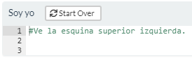

+-----------------------------+---------------------------------------------------------------------------------------------------------------------------------------------+-------------------------------------------------+
| Opción                      | Descripción                                                                                                                                 | Resultado                                       |
+:============================+:============================================================================================================================================+=================================================+
| `exercise.lines = n`        | n puede ser: 1, 2, 3, .... Y ese número será el número de filas de código que se muestren en el tutorial.                                   | {width="203"}            |
+-----------------------------+---------------------------------------------------------------------------------------------------------------------------------------------+-------------------------------------------------+
| `exercise.cap`              | Título del ejercicio que aparecerá en la esquina superior izquierda. Por default, `exercise.cap = "Code"`                                   | {width="201"}            |
+-----------------------------+---------------------------------------------------------------------------------------------------------------------------------------------+-------------------------------------------------+
| `exercise.eval`             | Por defecto es `FALSE` lo que implica que el código proporcionado no se evalúa sino hasta que el usuario quiera.                            | {width="201"}            |
+-----------------------------+---------------------------------------------------------------------------------------------------------------------------------------------+-------------------------------------------------+
| `exercise.timelimit`        | Tiempo límite de ejecución del código en segundos. (Si el código tarda en ejecutar más del tiempo límite, aparece un error).                | {width="208"}            |
|                             |                                                                                                                                             |                                                 |
|                             | **No significa** que el usuario tenga ese tiempo para completar el código.                                                                  |                                                 |
+-----------------------------+---------------------------------------------------------------------------------------------------------------------------------------------+-------------------------------------------------+
| `exercise.checker`          | NO SABEMOS QUÉ ONDA                                                                                                                         |                                                 |
|                             |                                                                                                                                             |                                                 |
| `exercise.error.check.code` | El paquete `gradethis` no se puede instalar en nuestra versión de RStudio.                                                                  |                                                 |
+-----------------------------+---------------------------------------------------------------------------------------------------------------------------------------------+-------------------------------------------------+
| `exercise.completion`       | Es `TRUE` por defecto y permite que el usuario vea los posibles parámetros que requiere una función.                                        | {width="208"}            |
+-----------------------------+---------------------------------------------------------------------------------------------------------------------------------------------+-------------------------------------------------+
| `exercise.diagnostics`      | Es `TRUE` por defecto y permite que el usuario vea los posibles errores que comete al escribir código.                                      | Ve ejemplo en la sección: **Ayudar al usuario** |
|                             |                                                                                                                                             |                                                 |
|                             | ***Poner referencias dentro del tutorial no funciona***                                                                                     |                                                 |
+-----------------------------+---------------------------------------------------------------------------------------------------------------------------------------------+-------------------------------------------------+
| `exercise.startover`        | Por defecto es `TRUE`. Indica si queremos que aparezca un botón que permita reiniciar el ejercicio.                                         | {width="258"}           |
+-----------------------------+---------------------------------------------------------------------------------------------------------------------------------------------+-------------------------------------------------+
| `exercise.warn_invisible`   | NO SABEMOS cómo se usa ni para qué sirve.                                                                                                   |                                                 |
+-----------------------------+---------------------------------------------------------------------------------------------------------------------------------------------+-------------------------------------------------+
| `exercise.reveal_solution`  | Por defecto es `TRUE` lo cual implica que si se tiene una solución, ésta podrá verse reflejada (ver los ejercicios con hints y soluciones). | **NO SIRVE**                                    |
|                             |                                                                                                                                             |                                                 |
|                             | A lo mejor necesitas la solución para **calificar** pero no quieres que el usuario la vea.                                                  |                                                 |
+-----------------------------+---------------------------------------------------------------------------------------------------------------------------------------------+-------------------------------------------------+

### Calificar NO SABEMOS

```{r}
custom_checker <- function(label, user_code, solution_code, envir_result, evaluate_result, last_value) {
  # this is a code check
  if (is.null(envir_result)) {
    if (is_bad_code(user_code, solution_code)) {
      return(list(message = "I wasn't expecting that code", correct = FALSE))
    }
    return(list(message = "Nice code!", correct = TRUE))
  }
  # this is a fully evaluated chunk check
  if (is_bad_result(last_value, solution_code)) {
    return(list(message = "I wasn't expecting that result", correct = FALSE))
  }
  list(message = "Great job!", correct = TRUE, location = "append")
}
#tutorial_options(exercise.checker = custom_checker)
```

```{r muestra, exercise = TRUE, exercise.checker = custom_checker}
# Agrega el 30 dentro de sqrt
sqrt()
```

```{r muestra-solution, exercise.reveal_solution = FALSE}
# Agrega el 30 dentro de sqrt
sqrt(30)
```

```{r muestra-check}
# Agrega el 30 dentro de sqrt
sqrt(30)
```

## 
